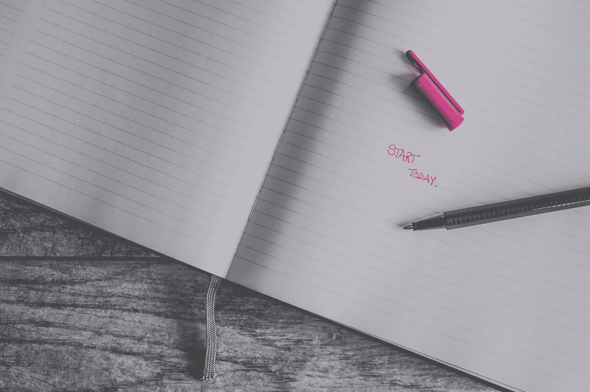

# 一旦你停止思考，每个人都是作家

> 原文：<https://medium.datadriveninvestor.com/everyone-is-a-writer-once-you-stop-thinking-about-it-dc88c283e009?source=collection_archive---------37----------------------->

## 我会告诉你怎么做

Photo by [Jessica Lewis](https://unsplash.com/@thepaintedsquare?utm_source=medium&utm_medium=referral) on [Unsplash](https://unsplash.com?utm_source=medium&utm_medium=referral)

写作是一种很好的交流工具。我们都是作家，虽然可能不太明显，但我们都是作家，我会告诉你怎么做。

你今天发短信了吗？社交媒体上写的任何东西。事实是我们都是作家，但我们觉得自己不够好，因为我们不知道如何写那些所谓的作家到处发表的长篇文章和散文；我们觉得我们没什么好说的。所以我们不把自己贴上作家的标签。

但是，假设你被放在一个群聊中，有一个有趣的话题正在进行，每个人都在发送迷因，说各种各样的话。感觉对话永远不会结束。你在发短信，人们在回复，这感觉棒极了。

在那种情况下，你为什么没有停下来说你不会写任何东西，因为你不是一个好作家？答案是因为你当时很兴奋，没有想到这些。

你只是想表达你的意思，而不用担心自己是否是最好的作家。

这是你写博客时应该有的心态。不要想太多，试着把你的意思表达清楚。反复做，你的句子会变得更简洁，更好读。

感谢您的阅读

[**在这里加入我的简讯**](https://mailchi.mp/91ab170a8236/tochukwu)