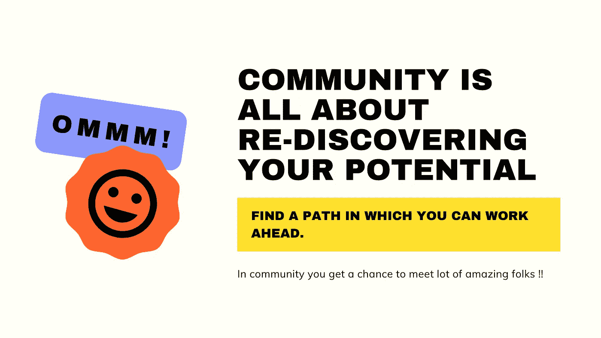

# 技术世界关于社区服务的一切|什么是社区？

> 原文：<https://medium.datadriveninvestor.com/everything-about-community-service-in-technical-world-what-community-is-31328c02954f?source=collection_archive---------17----------------------->

读者你好！

很高兴看到您回来阅读本系列的第六篇文章，标题是“[我们探索，您学习](https://twitter.com/dhruvtrehan45/status/1308142729004638208)”。

WE EXPLORE & YOU LEARN

> 声明:这篇文章是基于我和我的团队所做的研究。这无意伤害任何人的感情。它完全基于我们对所做研究工作的个人理解。欢迎任何建设性的批评。

太好了，现在让我们从这篇文章开始。

这篇文章肯定会对那些想要成为任何社区的一部分的人很有帮助。然而，并不是每个社区都能提供帮助，能够满足参与者的需求。经常发生的是，某个社区扼杀了对某项活动的渴望。从网络论坛到学习小组；从脸书集团到 Whatsapp 集团；从线下聚会到大会，找到一个社区并不是一件难事。然而，一个聪明人的工作是对这些社区中的每一个进行分类和筛选。根据名字、人数加入每个小组并不总是最明智的选择。因此，在进入任何社区之前，对事物及其功能有一个清晰的想法总是一个很好的工具。

此外，如果你是大学生，你的大学也会有一些很棒的社区，如:常春藤科技社区，威克科技社区学院等。

一个社区是一个丰富你关于某件事、活动、物质和非物质需求的知识的好地方。众所周知，人类形成集群不仅是因为他们是群居动物，也是因为他们在生物圈中更高的位置，这显然是随着进化而来的。随着时间的流动，兴趣很快变成了爱好，然后变成了必需品。当今时代，世界上的爱好比什么都多。然而，社区不仅仅局限于爱好，还包括任何对任何人都有利和有趣的事情。

# 社区

尤其是社区，是一群志趣相投的人，他们探索学习惊人的东西的可信度，并与其他人分享惊人的学习经验，这些人以前可能没有经历过或可能对特定的活动或想法产生新的兴趣。当你进入一个社区时，你会想办法展示你的技能，让志同道合的人或者更有经验的人来提供这些技能，这些人可能在那个特定的领域非常专业。

What community is?

对社区感兴趣的人的第一个大问题是，“什么是社区？”。从社会的角度来看，这个问题的答案应该是“任何第二或第三志愿团体，它们是为了在个人利益的基础上产生一种团结的感觉，而个人利益也是团体的共同利益”。从社交角度来看，答案是“任何一个允许人们因为整体上喜欢某样东西而进行社交和见面的群体”；从经济的角度来看，“任何为国家和国际货币流增加经济流量的团体，都是由于思想和产品的共享，基于对共同事业的亲和力的机会。”最后，任何社区都可以从智力的角度来定义，如“任何一群在某个主题上分享不同想法的人，他们在成员和新加入的成员中引起兴趣或提高兴趣，以增加对事实、假设推理、机会和资源的兴趣。”

在当今时代，社区在某种程度上也是一个“市场”。这不仅是一次聚集，集体的，而且是一股物质和非物质的资源流；如果加以利用，对个人和个人周围的环境都是非常有益的。

Community in college life is a blessing

假设一个对投资和市场知之甚少的菜鸟投资者进入了这样一个投资社区。随着时间的推移，他逐渐学会了理解市场的技巧。很快，他也和一些他喜欢的人交朋友，这些人反过来分享他们的知识和资源。比方说，在一年的时间里，这个菜鸟学到了很多投资知识，现在几乎成了一个“风险承担者”。他不仅开始涉足深水领域，还知道竞争的激烈程度。

在建立一个社区之前，你应该学会“如何在沉迷于一个社区的同时保持生产力？”如果你想变得高效，那就看看这些高效人士的高质量习惯。

 [## 如何在家高效工作:高效工作者的 58 个习惯

### 读者你好！这篇关于如何在家高效工作的文章主要是写给那些有高…

www.drillitdown.com](https://www.drillitdown.com/how-to-be-productive-at-home/) 

# 如何建立一个社区？

这是你第一次建社区吗？不要烦恼。

到目前为止，您必须对社区及其组件的运作有所了解。理解任何社区的机制都不是很难，但最难的部分是抓住趋势，或者简而言之，理解吸引更多成员的因素，增加你在某个领域的知识。一切都归结于你的想法或产品的积累和分配。要建立任何社区，第一步是参与到社区中。在早期，有俱乐部，论坛，空间遍布城市，城镇，村庄等等。社区的第一批设施是议会、会议室、证券交易所。很快，这些公司变成了成熟的企业集团、公司和创意公司；它们不仅巨大，而且有影响力。任何大规模的社区都会影响一个国家及其政府，反过来也会影响其他全球社区。在当前时代，参考早期的社区形式，可以被视为现代，社区在其在线形式中具有全新的定义。随着高速互联网的出现和超过 50%的世界覆盖率，人们可以相互联系。真正改变了整个社区观念的是社交媒体。随着各种社交媒体平台从其爆炸性的矿井中蓬勃发展起来，这又是基于想法的社区的产物，使得任何类型的社区都非常容易找到和访问。你可以在脸书上找到基本的社区，在那里人们谈论和交换关于地球上任何事情和任何可以想到的事情的信息。

如果你想创建一个新的社区，把你的想法带到 twitter 上。Twitter 又是一个非常受欢迎的传播想法的平台。这个平台也使用“散列标签”作为传播任何东西的工具。“哈希标签”一旦被很多人接受，就会变得流行起来。这当然是你在建立一个新社区时可以采取的一个万无一失的立场。就像 twitter 一样，有一个非常专业的“供求”平台，叫做 LinkedIn。现在，LinkedIn 将你的需求与想为同一事业工作的相似的人联系起来。有时，它作为一个经理来雇佣新人，同时它也能让你得到那些支持和加入你的事业的志愿成员。

下面是一个简单的步骤列表，解释你如何参与或创建自己的社区。

# 参与或创建社区的步骤

*   创建任何社交媒体账户。LinkedIn 或 Twitter 账户可以极大地推动你的事业，并在短时间内吸引志同道合的人。
*   通过这些平台与利基相关的人建立联系
*   向他们展示你学习和为社会做贡献的兴趣
*   询问他们可以让你联系的社区
*   探索微软、谷歌、亚马逊和其他公司的社区项目
*   随着时间的推移，你会建立起强大的关系网，为你赢得一些版税

当你对自己的关系有把握时，建立自己的社区并帮助他人，提升他们的水平并与他们一起工作[学习、探索新事物](https://www.drillitdown.com/things-to-do-in-quarantine-with-kids/)。这就是你们如何一起发展学习链的方法。

# 即兴社区管理的方法

既然你已经建立了一个以改变为愿景的社区，那么在开始的时候会很麻烦。经过一段时间后，你会注意到你的社区的事情正在减少；您没有收到任何反馈；对你的社区的自愿捐助者的放纵已经减少；新成员的数量很快就减少了。人们不想承认你的社区；他们不想学习或分享他们的经验、知识来源，也不想从你的社区提供的知识和资源中学到任何东西。心灰意冷的你会关闭这个社区，很可能会中断它，只会让你不满意。

HOW TO WORK EFFECTIVELY IN COMMUNITY?

为了避免这样的问题，你可以使用一些有效的技巧来管理你的社区:

*   在线建立你的社区。
*   任何具有强大社会影响力的社区总是值得称赞的。
*   你的视野应该像水晶一样清晰
*   请专业人士通过主持会议来做志愿者
*   分享你遇到的每一个好机会，为你的社区增加价值
*   让成员们分享他们自己对事物和原因的看法和想法。
*   努力成为一个社区英雄，努力与每个人一起工作
*   当你的社区被很多人认可后，给那些想学习的学生提供一个平台，并与社区的其他人分享他们的想法。

现在，你可能会对这个特别的想法感到困惑，“为什么我要在一个社区投入这么多时间？”同样的事情也发生在任何一个全新社区的创业者身上。但坚持改善社区，不要放弃你的事业，并努力实现它。

# 参与任何社区的好处

参与一个社区有无数的好处。

*   任何社区都会让你认识世界各地的人
*   社区让你有机会与你所敬仰的专业人士交流
*   社区帮助你发展非常愉快的谈话技巧
*   当你要开始任何新的计划时，社区会帮助你获得援助

Community is meant to support each other

*   社区为你提供了与世界各地的人发展友谊以及正式和非正式关系的空间
*   社区帮助你炫耀你的资源，以吸引更多的成员和贡献者。
*   社区为你提供了一个编辑优势，在你在资源、“散列标签”和社区使用的许多其他形式和工具方面犯下任何错误之前，它可以充当审查员。
*   社区帮助你聚集了一个充满热情的参与者和成员团队，他们将乐于参加会议、交易会和黑客马拉松等活动和竞赛

# 社区项目一可以是一部分

这里有一些初露头角的爱好者可以加入的社区项目。这当然不是最长的列表，但对初学者来说绝对是好的。初学者可以加入这些社区，从总体上学习很多东西。根据你的特殊需要加入进来，和志同道合的人一起体验另一个世界。

*   [微软学生学习大使](https://studentambassadors.microsoft.com/en-us)
*   [开发商学生俱乐部](https://developers.google.com/community/dscv)
*   [AWS 教育学生大使](https://aws.amazon.com/education/awseducate/student-ambassador-program/)
*   [Alexa 学生影响力](https://developer.amazon.com/en-IN/alexa/alexa-student-influencer)
*   [英特尔高等教育计划](https://www.intel.in/content/www/in/en/education/highered/higher-ed-overview.html)
*   [一加学生大使项目](https://www.oneplus.in/campus)
*   [Paytm 学生影响力计划](https://paytm.com/offer/student-ambassador-program/)

如果你知道更多，请联系我: [Dhruv Trehan](https://twitter.com/dhruvtrehan45)

# 结论

因此，一个社区就是任何一群头脑中有着共同思想，但对它有着不同观点的人。使用正确的工具和平台，你可以为你的事业获得大量的支持和光明。成为任何社区的一部分都会很有帮助。在一个社区中，每个成员都随时准备支持和帮助你。如果您有任何疑问，请不要犹豫，向[support@drillitdown.com](mailto:support@drillitdown.com)提出或在本文下方评论。我们将尽力回答您的问题，并尽快回复您。

# 请通过 [Dhruv Trehan](https://twitter.com/dhruvtrehan45) 与我联系

**列表中以前文章的链接:**

第一条:“[如果你想创业，你应该问自己的 9 个问题”](https://link.medium.com/wnfYAHOtbab)

第二条:[“如何发展谈判技巧的 5 个建议？”](https://link.medium.com/jywj4loc89)

第三条:[“如何借助模因预测自己的心态？”](https://medium.com/datadriveninvestor/how-to-predict-your-mindset-with-the-help-of-memes-31ebeb1dc432)

第四篇:[“为什么印度的创业公司会失败(第一部分)？”](https://medium.com/swlh/why-indian-startups-fail-part-1-588183cb5cd6)

第五篇:[“为什么印度创业失败(最后一部分)？”](https://medium.com/datadriveninvestor/we-aim-for-a-startup-but-never-for-a-solution-why-indian-startups-fail-last-part-48d69af1b52b)