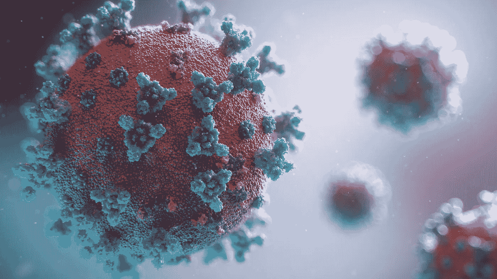
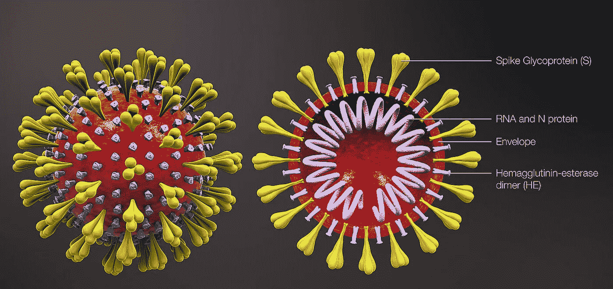
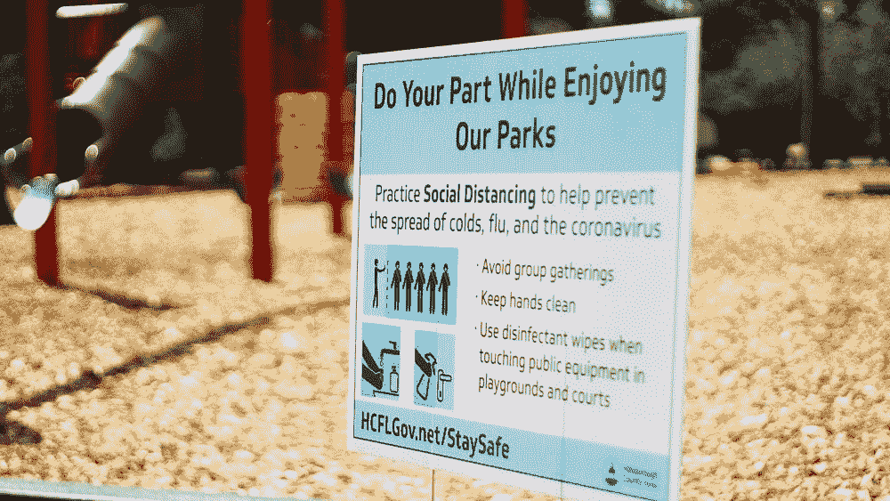

# 5 分钟内了解冠状病毒的一切

> 原文：<https://medium.datadriveninvestor.com/everything-about-the-coronavirus-in-5-minutes-99cc1551fa37?source=collection_archive---------16----------------------->

## 了解它是如何传播的，背后的科学，以及潜在的解决方案。

[A visualization of the coronavirus.](https://www.fusionanimation.co.uk/clinical-areas/infectious-disease/covid-19/)

> 我出生在中国武汉，但我现在住在加拿大。和其他人一样，我通过阅读新闻了解了大部分正在发生的事情。当我的祖母开始哭泣时，她告诉我，她最好的朋友在感染新冠肺炎病毒后的第一个症状出现的十天内去世了，这真的打击了我，这些是真实的，正常的，无辜的正在死去的人。医院没有足够的床位，她的儿子没能及时让她住院。
> 
> [*——*加拿大蒙特利尔麦吉尔大学查尔斯·c·y·徐](https://www.nature.com/articles/d41586-020-00478-7)

这只是受冠状病毒影响的数百万人的故事之一，进一步强调了我们的现实情况。然而，这种病毒到底是什么？它是如何工作的？使用本指南来消除误解，了解新冠肺炎的真实情况。

# 冠状病毒是什么？

[A diagram of the coronavirus.](https://asm.org/Articles/2020/January/2019-Novel-Coronavirus-2019-nCoV-Update-Uncoating)

冠状病毒由包裹在膜中的 RNA 组成。很像一个皇冠，它被尖刺所环绕，实际上这也是这种病毒名字的由来。

这些刺状物由三种蛋白质缠绕在一起组成，表面含有糖分。这些糖充当病毒的伪装，使它们看起来与正常的人类细胞非常相似。这使得免疫系统更难检测到病毒。

 [## 冠状病毒；惊慌失措；字里行间的 z |数据驱动的投资者

### 围绕冠状病毒的话题；更准确地说，新冠肺炎几乎占据了整个新闻预报的头条…

www.datadriveninvestor.com](https://www.datadriveninvestor.com/2020/03/23/coronavirus-a-to-panic-z-between-the-lines/) 

当病毒想要附着到细胞的受体上时，它首先打开所有三种蛋白质。然后这些蛋白质充当了这把锁的钥匙，让病毒进入并感染细胞。

# 它是如何传播的？为什么传染性这么强？

它主要在彼此靠近的人之间传播，一般在相距 **6 英尺**左右。当感染者咳嗽或打喷嚏时，可能会产生**呼吸道飞沫**。这些飞沫会感染附近的其他人或被吸入肺部。

# 为什么这么难治愈？

有几个不同的原因。首先，这仅仅是因为它是一种非常新的病毒。我们人类以前从未遇到过，所以一旦病毒进入身体，我们没有预先存在的防御。

新的药物和疗法也需要很长时间才能被批准和测试，以确保它们既安全又有效。据估计，冠状病毒疫苗可能至少需要一年(T3)才能在 T2 发布。由于这一时间差距，当开始寻找治疗方法时，已经太晚了。

# 科学家取得了哪些进展？

Yes, the cure is more than hand sanitizer and masks!

然而，科学家们仍在努力寻找解决方案。他们开始绘制 T4 病毒的基因组图，这让他们了解了病毒如何适应不同的人。世界卫生组织(世卫组织)最近也推出了四种最有希望的冠状病毒治疗方法。它们主要包括已经被批准用于其他疾病的**转用药物**，在对抗 SARS 和 MERS 的动物研究中表现良好的**未批准药物**，或者减缓或杀死病毒的药物，但可能会使卫生保健工作者处于**高感染风险**。

## 1.瑞德西韦

这是一种最初用于对抗埃博拉病毒的药物。然而，研究人员在分离的细胞中进行测试后发现，Remdesivir 能够充分对抗冠状病毒。

也有证据表明这是一种潜在的治疗方法。当华盛顿的一个年轻人病情恶化时，给了他 Remdesivir。随后，第二天他的病情立即好转。加利福尼亚州的一名患者在接受这种药物治疗后也康复了。虽然仍然需要临床试验，但它绝对有治愈的潜力。

## 2.氯喹和羟氯喹

这两种是治疗疟疾的药物。氯喹已经使用了 70 多年，被科学家认为是相对安全的。

然而，对于羟氯喹，有人担心这种药物可能弊大于利。众所周知，羟氯喹有许多副作用，最终可能会损害心脏。没有足够的数据，真的很难说。

不仅如此，检测结果也**模棱两可**。例如，报告治疗了 100 多名患者的中国研究人员声称它有好处，但数据尚未公布。来自中国的进一步研究很难发现，所以仍然不清楚这种药物实际上有多有效。

## 3.洛匹那韦和利托那韦

这种名为 **Kaletra** 的药物在美国被用于治疗**艾滋病感染**。

不幸的是，没有多少证据支持这种药物的有效性。在中国，科学家给 199 名患者服用两片洛匹那韦和利托那韦，每天两次，进行标准治疗，另一组只进行标准治疗。最终，没有显著的差异被报道。虽然他们认为这可能是由于治疗进行得太晚而无法真正帮助他们，但没有太多的信息支持这一观点。

## 4.洛匹那韦、利托那韦和干扰素-β

这与最后一种治疗类似，除了添加了干扰素-β，这种分子有助于调节炎症，并被证明对对抗 **MERS** 有效。

目前，这三种药物的组合正在沙特阿拉伯进行测试。然而，就像氯喹和羟氯喹一样，它可能会导致**更严重的组织损伤**，而不是帮助病人，这取决于何时给药。

# 我如何保护自己？

A sign in Florida enforcing social distancing.

两个字。社交距离。

**社交距离**指的是与他人保持**至少 6 英尺**的距离，并且很少或没有身体接触，以帮助控制病毒。这可能包括在家而不是在办公室工作，取消大型会议等。如果你遇到某人，一定要避免手接触，如握手、拥抱等。，取而代之的是用一个简单的波凑合。

# 关键要点

*   冠状病毒只是包裹在膜中的 RNA。它被覆盖在刺状物上，帮助它伪装成正常的身体细胞，并允许病毒感染细胞。
*   这种病毒的新奇让每个人都感到不安，这也是它如此难以控制和治愈的部分原因。
*   科学家们关注的主要有四种不同的药物，但其中许多药物缺乏足够的数据，还不能确定它们是否能彻底治愈。
*   尽量减少身体接触，利用社交距离来防止病毒传播。

*巨大感谢* [*桑吉娜·韦兰基*](https://medium.com/u/e3bfb373795?source=post_page-----99cc1551fa37--------------------------------)*[*艾米莉·德尼*](https://medium.com/u/92e6de8816ae?source=post_page-----99cc1551fa37--------------------------------)*[*米拉·舒克拉*](https://medium.com/u/ea95c5d9cc32?source=post_page-----99cc1551fa37--------------------------------)*[*罗山·阿杜苏米利*](https://medium.com/u/4b91022e00a0?source=post_page-----99cc1551fa37--------------------------------)*[*泰勒·森松*](https://medium.com/u/c9822acbab75?source=post_page-----99cc1551fa37--------------------------------) *感谢阅读，并保持安全！*****