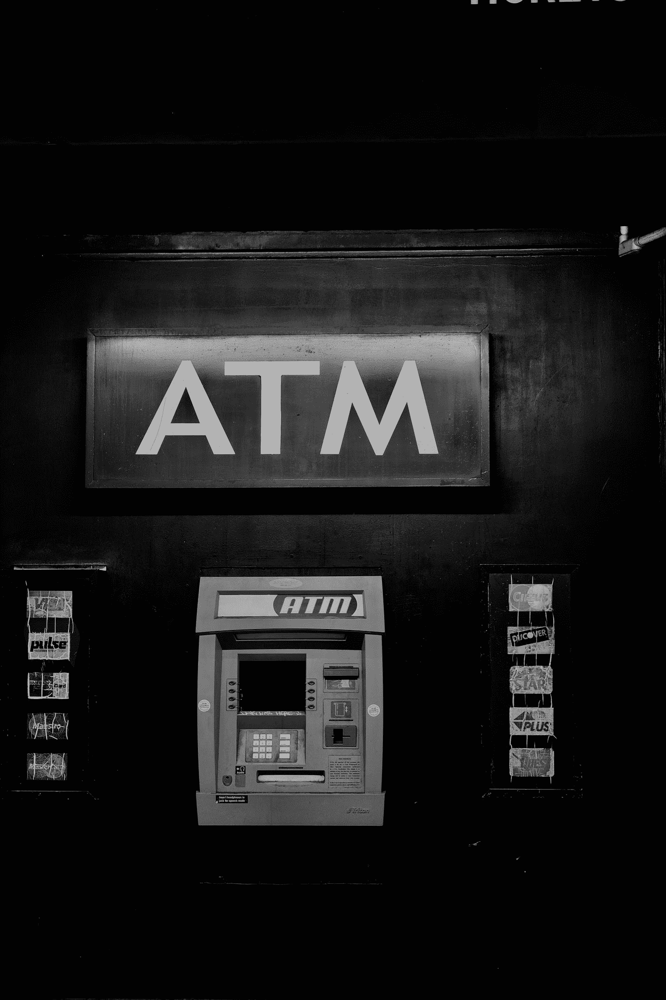
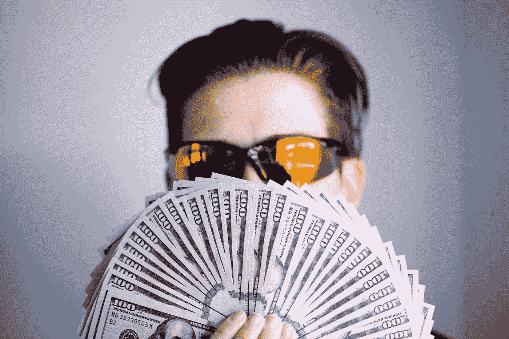

# 2020 年和 2021 年最佳分红股票

> 原文：<https://medium.datadriveninvestor.com/everything-you-need-to-know-about-top-dividend-stocks-a060ddcea53f?source=collection_archive---------7----------------------->

Photo by [Johny vino](https://unsplash.com/@johnyvino?utm_source=medium&utm_medium=referral) on [Unsplash](https://unsplash.com?utm_source=medium&utm_medium=referral)

啊，分红股票。

我的爱恨情仇。

你的分红股票只会给你带来两件事。是睡得好还是睡不着。没有中间环节。

以一个好的价格找到好的分红股票就像淘金一样困难。但是一旦你找到它，无论你在哪里，它都能为你创造财富。

但首先，你要付出找到一个好的分红股票和获得一个好的进场价格的代价。否则，你将为市场付出更大的代价。

你永远不希望遇到以不好的价格进入好的股票或者以好的价格进入坏的股票的问题。因为有可能你获得的股息甚至不足以弥补你的资本损失。所以要有耐心，因为那些问题会回来咬你！

# 什么是分红股票？

从本质上来说，[股息股](https://www.investopedia.com/dividend-stocks-4689744)是定期支付股息的公司。它们通常是历史悠久的公司，有向股东返还收益的记录。

T2 公司从他们的大部分利润中给股东分红。因此，能够做到这一点的公司主要是能够持续产生现金的稳定的大公司。

从另一个角度来看，如果一家公司持续盈利，它应该显示在他们的股息支付上，因为如果他们不持续盈利，他们就没有能力支付给股东。

相比之下，派息公司被认为已经达到了最大的潜在增长。因为他们的股票价值长期停滞不前。这就导致了一种推论，即股息的存在只是为了吸引投资者购买他们的股票。

所以，如果你的银行账户上有几千美元的额外存款，并且你想让这个数字稳步增长，分红股票可以帮你做到这一点！

# 你需要的一切

在这份名单上，有支付蹩脚股息的好公司，也有支付高额股息的蹩脚公司。有许多不同的方式赚钱的这两种类型的公司，所以这完全取决于你。

进场价格是如果我买股票的话，我希望进入的价位。这一点至关重要，因为在熊市期间，获得一个好的进场价格更容易管理。

每股股利是一年中每股股利的总额。

## [$IBM(国际商业机器公司)](https://finance.yahoo.com/quote/IBM?p=IBM&.tsrc=fin-srch)

入门价格:110 美元

每股股息:6.52 美元

股息收益率:5.9%

这里的每个人都知道 IBM，对吗？他们是一家大型科技公司，业务遍及全球。他们制造硬件、软件、基于云的服务和认知计算。

**优点:**

他们的股票已经交易超过 35 年了！最重要的是，它们的市值也高达 1000 亿美元。所以可以肯定地说，他们知道自己在做什么。

IBM 也在技术领域开展业务。我非常强调这一点，因为只要人类努力改善他们的生活，技术将永远是相关的。所以这家公司的板块或多或少是有保障的，关注点在于 IBM 能不能跟上他们的竞争对手。

**缺点:**

也就是说，IBM 一直在低调运营。没有重大的头条新闻或突破性的产品。有了这个名声，我们就可以和任何指数收益说再见了。

举例来说，IBM 目前的股价和 20 年前差不多。这意味着该股没有太大的增长潜力，只能产生最低限度的资本收益。

> **其他同类股票**:
> 
> $STX(希捷科技)，$T(美国电话电报公司)

## [$IEP(伊坎企业)](https://finance.yahoo.com/quote/IEP?p=IEP&.tsrc=fin-srch)

入门价格:45 美元

每股股息:8 美元

股息收益率:17%

这份名单上最多样化的公司之一。他们是一家集团公司，投资领域包括汽车零部件、能源、金属、铁路车辆、赌场、食品包装、房地产和家居时尚。这家公司的所有者不是别人，正是卡尔·伊坎，他拥有这家公司 95%的股份。

 [## 收盘，但没有雪茄-股票市场目标在停滞的 COVID 救济中创新高|数据驱动…

### 专家聊天程序:一个协作市场，在这里人们可以和能够解决他们问题的专家聊天。是……

www.datadriveninvestor.com](https://www.datadriveninvestor.com/2020/08/18/close-but-no-cigar-stock-market-targets-record-highs-amidst-stalled-covid-relief/) 

**优点:**

我的意思是，看看股息支付！17%!如果你在这支股票上有 10000 美元，一年后你会有额外的 1700 美元！这是一大笔红利。没有多少股票能提供这么高的股息。

请注意，卡尔·伊坎本身也是一名投资者，因此他知道如何维持股价，让公司继续运营。

**缺点:**

当然，高派息是有代价的。我不相信这家公司有光明的未来。主要是因为卡尔·伊坎的投资组合并不令人印象深刻，因为他持有赫兹 3.42 亿美元的股份，赫兹今年早些时候因新冠肺炎而破产。

我会说，这只股票是你能做的风险较高的投资之一。然而，如果你不担心这家公司的前景，它真的可以为你创造一些现金！

## [$ET(能量转移)](https://finance.yahoo.com/quote/ET?p=ET&.tsrc=fin-srch)

入门价格:5 美元

每股股息:1.22 美元

股息率:24.4%

顾名思义，这家公司提供与能源相关的服务。他们向各种类型的公司出售天然气，并经营天然气集输管道。基本上所有与能源有关的东西。

**优点:**

这家公司给你更多的股息，而不是$IEP！此外，他们也是该行业中最大的公司之一，拥有美国最多样化的能源资产组合。

**缺点:**

不幸的是，这家公司在不久的将来可能会有大麻烦。他们的债务已经上升到可能需要几年才能收回的数额。

此外，查看他们的图表，似乎该股自 2017 年以来一直处于持续下跌趋势。试图抄底可能并不总是奏效，购买便宜的股票可能会让你感觉像和鲨鱼一起游泳。

当我查看能源板块的其他股票时，有一个明显的下跌趋势。因此，尽管这些股票可能支付最高的每股股息，但你必须意识到多年的长期下降趋势。

> **其他类似股票:**
> 
> DHT (DHT 控股公司)、$ front LTD(前线有限公司)、$NNA (Navios 海事收购公司)、$AM(安特罗中游公司)、$EURN(欧洲导航公司)

## [$GECC(大榆树资本公司)](https://finance.yahoo.com/quote/GECC?p=GECC&.tsrc=fin-srch)

入门价格:2.85 美元

每股股息:0.996 美元

股息率:34.9%

大榆树资本公司是一家在特定市场进行股权投资的资产管理公司。

**优点:**

与竞争对手相比，这家公司没有什么突出之处，除了股息收益率高得离谱。

**缺点:**

当一家公司以这种比率派息时，你不得不开始质疑这是否好得令人难以置信，以及他们的业务是否真的为这种派息产生了足够的现金流。

在我看来，他们不是。他们可能希望在内部人士抛售股票时，用高股息收益率的承诺吸引不知情的投资者购买他们的股票。这可能解释了为什么这只股票自首次公开募股以来一直在下跌，并且接近历史最低点。请对此半信半疑，因为我只是推测，没有证据。

此外，由于其商业模式只针对某个市场进行投资，有时风险可能会非常高。一项错误的投资可能会对公司当年的净收入造成巨大损失。这将引起连锁反应，长期股东将抛售股票，股价将进一步下跌。

> **其他类似股票:**
> 
> $OXLC(牛津巷资本公司)

## [$VIG(先锋红利增值指数基金 ETF 份额)](https://finance.yahoo.com/quote/VIG?p=VIG&.tsrc=fin-srch)

入门价格:95 美元

每股股息:2.23 美元

股息率:2.3%

请注意，$VIG 不是一只股票，它是一只指数基金，跟踪连续 10 年或更长时间提高股息收益率的公司。这些公司包括微软、沃尔玛、宝洁、维萨公司和华特·迪士尼。总共有 212 家大型成熟公司加入该指数基金。

**优点:**

这是一只指数基金，所以你真的不必担心任何一家公司没有卖出他们的产品或者投资失败。因为如果这些公司中的任何一家未能保持他们的数字，它将被踢出这个指数基金。

简而言之，只要有持续盈利并提供递增股息的好公司，你就没什么好担心的。同理，由于这种特定 ETF 的性质，你的分红也会随着时间的推移而增加。

**缺点:**

股息收益率肯定会受到冲击。因为可能有一些相对较小的好公司，所以他们支付的股息可能较少。因此，当这些数字被平均后，可能会导致较低的股息收益率。

由于事实上有 212 家公司，这意味着即使一家公司做得很好，并接管了各自的市场，股息收益率不会成倍增长。从根本上说，投资 ETF 可以归结为平均化的利弊。

> **其他类似 ETF**:
> 
> $SDY (SPDR S&P 红利 ETF)，$DHS (WisdomTree 美国高红利基金)

Photo by [Shane](https://unsplash.com/@theyshane?utm_source=medium&utm_medium=referral) on [Unsplash](https://unsplash.com?utm_source=medium&utm_medium=referral)

到目前为止，你可能已经注意到股息收益率越高，股票就越糟糕。所以关键是要根据自己的性格找到这两者的平衡点。

没有你应该投资的“完美的”股息股票或 ETF。一些人投资其中几个可能会更好，而另一些人专注于其中一个会更有安全感。因此，你必须自己做判断，找出什么对你自己最好。

最后，要知道世界上没有一家公司“有义务”向投资者支付任何股息。即使公司是世界上最大的公司，它们也有权利和权力在任何时候停止派息。

祝你投资好运！

*嘿，既然你在这里，为什么不加入我的* [***邮件列表***](https://marcuschan.ck.page/76504d9d12)**来看看你收件箱里偶尔出现的精彩故事，或者考虑成为会员***来阅读我所有的故事！☺***

## **访问专家视图— [订阅 DDI 英特尔](https://datadriveninvestor.com/ddi-intel)**