# 创建 SaaS 前需要了解的一切

> 原文：<https://medium.datadriveninvestor.com/everything-you-need-to-know-before-creating-a-saas-2ff60452b534?source=collection_archive---------7----------------------->

即使你不知道 SaaS 作为一个软件开发模型的细节，你肯定每天都在与这样的服务打交道。Dropbox、Google G Suite、Windows Azure、sales force——这些工具都是软件即服务最著名的例子。较小的软件，如 Buffer 和 Hubspot，也属于这一类。

SaaS 市场一直在不停地增长，而且预计这种发展还将继续。据 Technavio 报道，2023 年，这个市场将价值 600 亿美元。以 9%的增长率，它是发展最快的新兴技术领域之一。

# SaaS 的商业模式是什么？

软件即服务是一个通过网络浏览器使用并存储在云存储上的平台。用户不必将工具安装到本地设备上；相反，他们需要创建个人账户并支付月费。

因为 SaaS 是在云中计算的[，所以它是独立于设备的。只要有互联网连接，用户就可以从任何笔记本电脑或智能手机访问您的解决方案。随着远程工作和多任务处理趋势的增长，SaaS 的商业模式非常适合。](https://jelvix.com/blog/cloud-service-models)

# SaaS 的商业模式是如何运作的？

SaaS 公司依赖第三方云供应商提供存储空间和计算能力。像 Google Cloud 和 AWS 这样的服务被用来将 SaaS web 应用程序部署到服务器上。公司不必购买自己的服务器或在用户的本地网络上托管应用程序，而是依靠多个国际服务器。

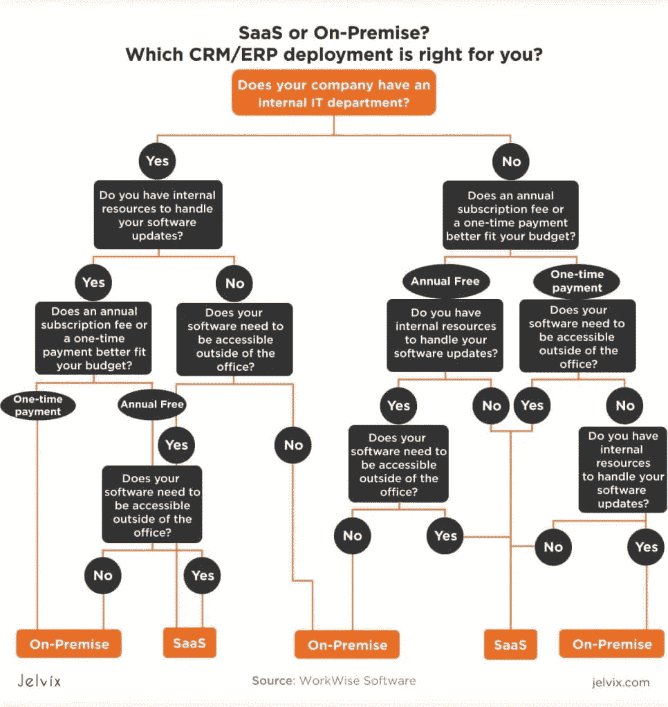

关于 SaaS，需要记住的一件重要事情是，这种分散的计算方法有助于提高速度和安全性。没有任何一个存储设备会成为网络罪犯攻击目标。即使一台服务器遇到断电或延迟问题，地球另一端的服务器可能也不会有问题。

现在剩下的就是回顾用户如何与 SaaS 互动——让我们看看主要的过程和货币化。

*   **用户通过浏览器**访问 SaaS。如果该网站有移动版本，它也可以使用智能手机。
*   用户创建一个帐户，该帐户将连接到软件服务，存储进度和个人信息。只要访问者记住登录名和密码，他们就可以从任何设备进入网站。
*   **用户将其计划升级为高级或完全计划**。许多网站提供免费程序或试用版，让访问者有机会尝试这些功能。试用期结束后，用户可以决定是否要升级。
*   **订阅费每月支付**。想想[网飞](https://www.netflix.com/)——用户不为每一条内容付费。该服务定期提取月付款。

# SaaS 的优势

SaaS 模式如此成功的原因是它们为企业主和用户提供了许多引人注目的好处。对于客户来说，SaaS 提供了比[本地应用](https://en.wikipedia.org/wiki/On-premises_software)更高的便利性和独立性。最重要的是，花几十美元购买订阅比花几百美元购买软件要便宜。

企业主有理由更喜欢 SaaS，而不是传统的内部部署应用。

**稳定的收入**

构建软件即服务的主要优势是你有机会获得长期收益。对于 SaaS 来说，拥有成千上万的定期付费用户已经足以维持一个相当大的团队，并确保稳定的利润。使用内部软件，1000 次购买只能在短期内满足您的需求。

SaaS 是长期投资的一个定义。如果公司吸引了专门的用户，他们将会为订阅付费几个月，甚至几年。

**高客户保持率**

SaaS 鼓励用户和企业主建立长期关系。该团队希望提高访问者的忠诚度，防止他们取消订阅。用户也没有“完成”他们的评估过程。每个访问者都在不断地检查这个平台是否仍然物有所值。

购买本地软件已经是板上钉钉的事情，而注册 SaaS 则是一个持续的对话。如果你知道如何回应用户的期望并及时发布新的更新，你就创建了一个专门的社区。他们中的许多人可以成为你的产品倡导者，并传播这些话。

**一致的业务流程**

SaaS 允许你随时创建和发布新的更新。您可以在短时间内部署多个产品迭代，大多数用户都不会有问题。另一方面，内部升级是一件令人头疼的事情——更新可能太大，而且用户往往持怀疑态度。通常情况下，你无法改进自己的工具，因为用户拒绝安装新版本。

[SaaS](https://jelvix.com/blog/how-to-create-a-saas-business) 让您自由决定产品的质量和定位。你可以升级功能，改变界面，引入新的特性和优势，并随时改变。当你能控制网络时，向你的用户交付更好的产品就容易多了——有了云计算，你就能做到。

# 不同类型的 SaaS 商业模式

你可能没有意识到这一点，但是在你和 SaaS 打交道的过程中，很可能你使用了不同类型的 SaaS 而没有注意到它们的区别。尽管所有 SaaS 都遵循相同的基本原则，但他们在销售线索转化和定价方面往往有着根本不同的愿景。我们回顾了主要类型的 SaaS 的基础上，他们的客户获取策略和货币化算法。

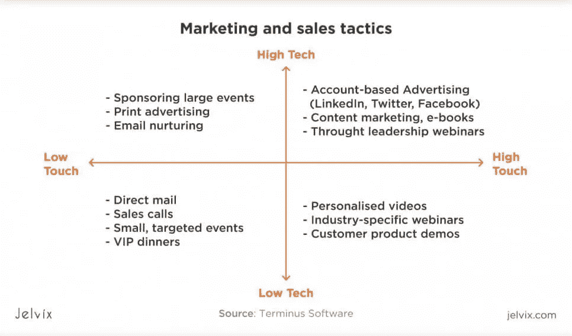

# 两种主要类型:低接触和高接触 SaaS

如果你关注所有的软件即服务，你会发现它们面向不同类型的客户。像 AWS 这样的一些 [SaaS 瞄准整个企业和公司，而另一些则专注于吸引单个用户。例如，网飞不把你看作一个有生意的公司老板，而是一个希望看到新鲜内容的人。](https://docs.aws.amazon.com/marketplace/latest/userguide/software-as-a-service-based-products-saas.html)

**这些区别导致了两种主要 SaaS 的形成:**

*   **高接触 SaaS**——企业级软件即服务，旨在将其优势传达给其他公司和企业。这种 SaaS 以 B2B 方式运行，通常具有较高的订阅价格，同时提供丰富的功能和高计算能力。
*   低接触 SaaS——以人为本的企业，视用户为有个人需求的个体。这样的 SaaS 功能更窄，占据的生态位更小。他们的目标不是提供一套运营公司或创造产品的工具，而是为了一个精确的结果。

高接触 SaaS 专注于提供“鱼竿”，让企业所有必要的工具，以创造结果。低接触 SaaS 为用户提供“鱼”——有形和清晰的结果。

**营销方式**

低接触 SaaS 依靠[广告](https://jelvix.com/blog/augmented-reality-ads)、社交媒体营销和清晰的沟通。一个很好的例子是[语法上的](https://www.grammarly.com)。它在 Youtube 上的广告瞄准了用户的个人问题和关注点——一个正在给老板写电子邮件的员工，一个正在写论文的学生，或者一个小企业主。所有这些人都将出于个人目的使用 Grammarly，而不是为了实现企业级操作。

高接触 SaaS 优先考虑交易质量，而不是用户数量。这里的一笔交易可以跨越数千美元，团队非常投入地追求每一个客户。通常，高接触 SaaS 的优先事项是准备一个全面的知识中心，投资一个专业的 24/7 可用的支持团队，并在会议和研讨会上发起个人联系。这些平台努力在他们的目标领域出名，通常需要专家的推荐。

# SaaS 的货币化战略

软件即服务的定价模式在很大程度上取决于目标受众、用户需求和公司的优先级。它们经常结合在一起，这使得很难挑出一个特定的策略。在分析了几十个大大小小的 SaaS 后，我们区分了以下几种商业模式。

**每用户模型**

这是高接触 SaaS 为团队和公司量身定制解决方案的标准模式。越多的用户可以使用他们的工具，订阅的价格就越高。这样的系统被 [Shopify](https://www.shopify.com/) 使用。团队订阅是一种高级计划，费用是原始版本的几倍。使用这个程序的用户越多，它就越贵。

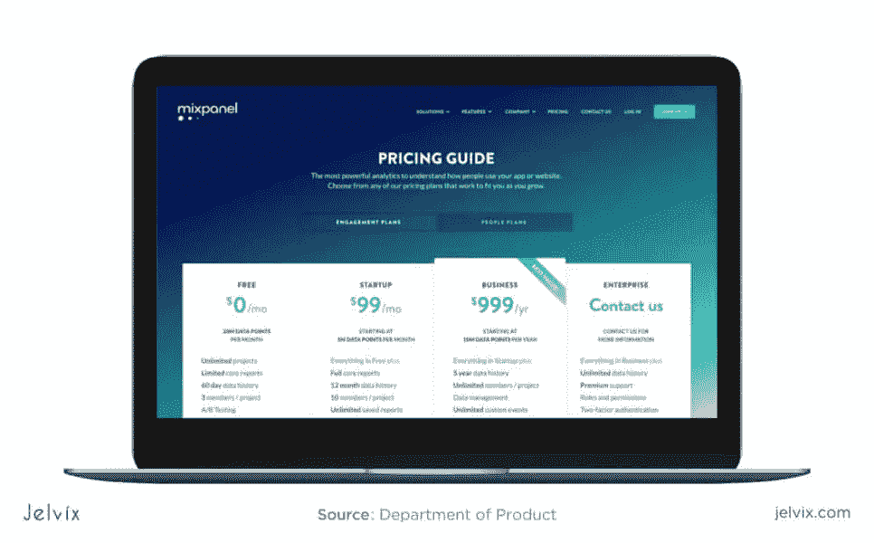

**功能定价**

这是 SaaS 最常见的货币化策略。对于高级订阅，用户可以访问特定的服务。每个计划都允许访问给定数量的功能。可能性越多，计划的成本就越高。

该定价系统由 UI/UX 设计工具 [InVision](https://www.invisionapp.com/plans) 使用。免费计划允许使用一个原型。starter pack 将限制提高到三个项目，而最终团队试验提供了无限数量的原型工作的可能性。

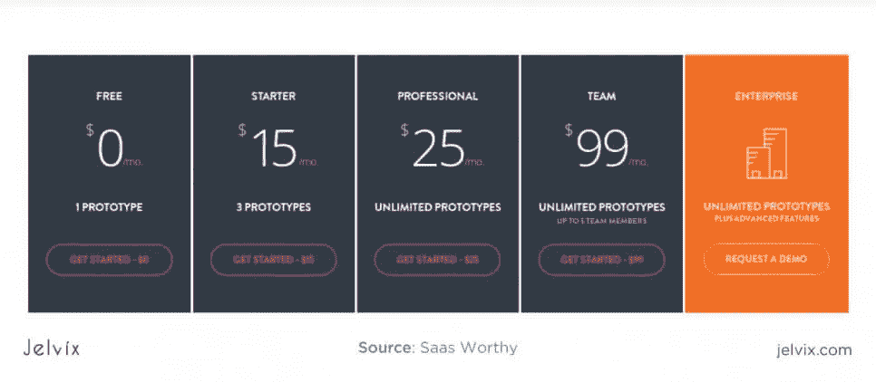

**免费增值模式**

免费增值模式通常与其他定价模式相结合，如按用户或按功能定价。用户可以先试用产品的免费版本，如果愿意，也可以将产品升级到高级版本。有时，试用期有时间限制，但通常，免费计划可以互换使用。

这是英语拼写检查软件 Grammarly 采用的策略。免费版可以使用任意长的时间，并向用户传达其主要目的。高级版提供了额外的功能，如检查书写质量，清晰度，语调等。

**按使用付费**

这是高级 SaaS 和基础架构即服务的经典模型。AWS、Google Cloud、IBM 只对用户使用的服务器空间收费。定价方案是根据使用的计算能力和每秒的请求数计算的。

这样的商业模式降低了用户的准入门槛。他们得到保证，公司不会向他们收取超过其服务价值的费用。通过这种方式，用户是独立的——他们可以暂停使用软件，并随时返回服务。因此，按使用付费的定价模式传达了更高的用户保留率。

**基于活跃用户的定价**

当 SaaS 针对整个团队时，逻辑问题出现了:企业所有者应该为很少登录该软件的用户付费吗？为了解决这些问题，一些公司使用按使用付费和按用户付费相结合的模式。企业主只需要为积极使用该软件的会员付费。如果团队成员停止使用该工具，将不会向该帐户收费。

这种模式的缺点是更难衡量和预测。决定用户是否活跃，建立活动的度量标准需要深入的分析和与软件用户的直接对话。这个模型的误差幅度可能高得令人难以置信。

# SaaS 商业模式成熟的阶段

我们已经讨论了实施 SaaS 作为商业模式的主要商业方面，这归结为建立你的利基，目标受众和定价模式。下一步是分析项目的技术方面。

让我们描绘出 [SaaS 发展](https://jelvix.com/blog/how-to-create-a-saas-business)和支持的旅程，为每个阶段设定期望。

**一级—广义**

该应用程序与内部部署软件非常相似。该服务提供标准功能，通常对于每次使用都是一样的。用户体验与社交工具提供的体验没有什么不同。提供商无法从发布实时更新和个性化功能的能力中获益。

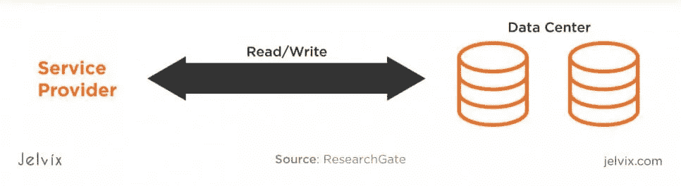

SaaS 开发第一阶段的目标是构建一个具有基本功能的简单工具，同时牢记 SaaS 的商业模式。然而，用户仍然无法体验到使用软件即服务的所有主要优势。

**二级:配置**

在此阶段，供应商为每个用户托管一个唯一版本的 SaaS。每个瞬间都是为特定用户配置的。供应商提供深入的个性化设置，允许客户添加新功能(下载集成)、定义首选项或接收实时更新。在这个阶段，供应商和用户已经从在线更新和实时改进中受益匪浅。SaaS 工具变得比内部部署服务更加复杂。

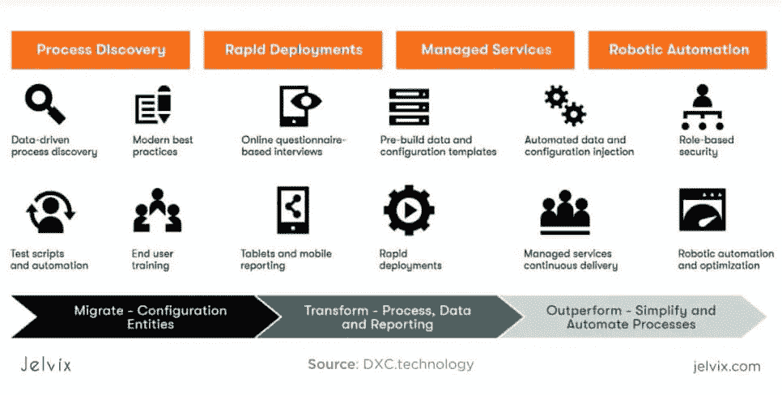

如果您要将内部工具转变为 SaaS，请考虑使用个性化和定制功能。通常，开发人员会重新设计功能和界面，并确保它适应每个用户的不同实例。个性化是 SaaS 的一大优势，你需要充分利用它。

 [## 多平台 SaaS 应用的 2020 年发展选择|数据驱动的投资者

### 我目前正在为公司做一个新项目。该项目包括一个移动应用程序，由一个…

www.datadriveninvestor.com](https://www.datadriveninvestor.com/2020/07/13/2020-development-choices-for-multi-platform-saas-application/) 

**第三级:降低成本**

SaaS 供应商可以通过为每个个性化功能集分配元数据来更好地处理实例。每个用户的数据都受到安全策略和算法的保护，确保信息不会混淆。元标记允许快速识别所需的实例，并降低服务器开销。

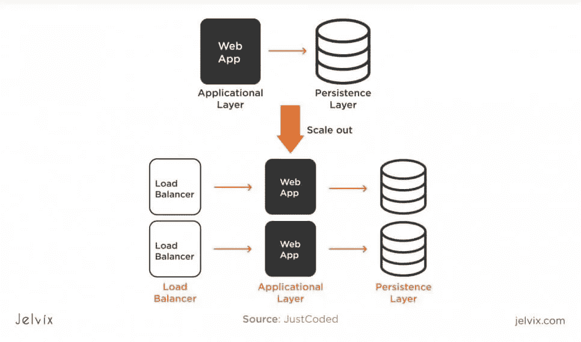

**第 4 级—可扩展性**

如果在之前的阶段，软件即服务需要独立处理所有实例，从而降低性能，那么在这个级别上，供应商将重新将案例存储在一起。然而，这并不是回到第一阶段——此时，信息已经用负责向特定用户提供特定功能的个性化元标签进行了定义。

通过这种方式，SaaS 可以轻松处理数千甚至数百万用户，同时企业所有者可以减少使用的服务数量，并快速推出新产品集成。将数据存储在负载平衡组中可以提高性能，而元标记可以确保用户体验不会变差。

**哪种成熟度最好？**

在共享和保护数据之间选择平衡是很棘手的。在开始开发之前，请确定您想要个性化的功能以及为此需要的信息。它将帮助您决定哪些实例应该单独处理，以及在什么情况下一个组负载就足够了。

idea 的目标是第 4 级，但有些 SaaS 不需要同样高的个性化水平。但是，您可以根据您的功能和资源改变共享数据和单独数据的数量。

# SaaS 商业模式的 4 个例子

一旦你看到现实生活中的例子的主要原则，理解 SaaS 并不困难。我们回顾了最受欢迎的软件即服务解决方案——这样您就可以看到它们在哪个领域工作，它们属于什么类型，以及团队选择了哪些开发和盈利策略。

## 购物化

Shopify 是一个软件即服务商业模式如何与其他类型相结合的例子。Shopify 允许其客户创建一个订阅解决方案，这是一个 SaaS，以及商业解决方案，典型的电子商务业务。现在，让我们停在 Shopify 的 SaaS 元素上，因为这是我们最感兴趣的。

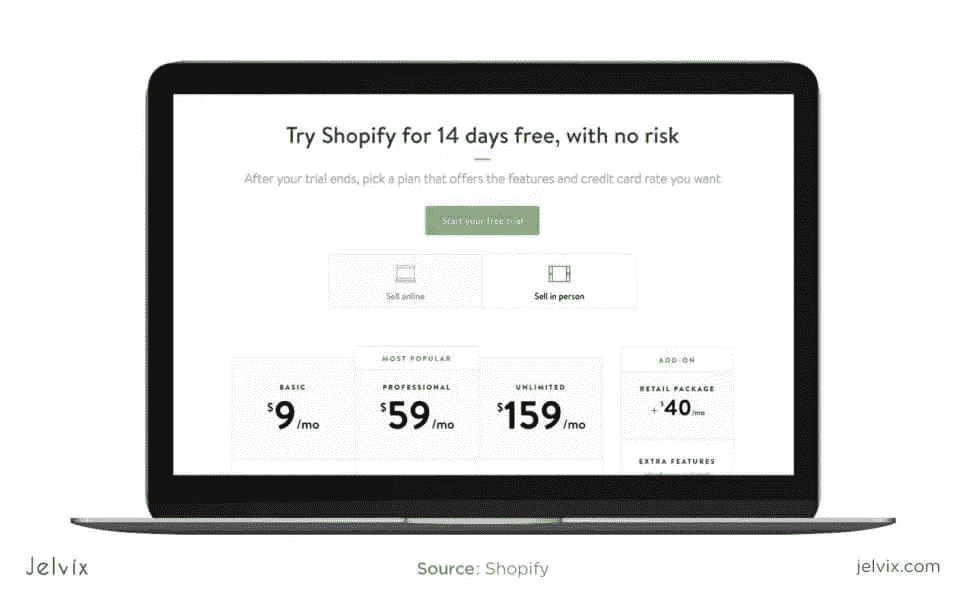

*   Shopify 提供五种订阅计划，从每月 9 美元的低价计划开始。最高层每月高达 2000 美元，这是一个基于企业的计划。因此，Shopify 结合了低接触和高接触模式，同时面向个人和企业。
*   附加功能:Shopify 允许开发者访问网站托管、分析、报告、文件存储。
*   集成:Shopify 作为一种服务，以其灵活性吸引用户。该解决方案可以集成到现成的电子商务网站中。

## 轮毂点

HubSpot 是一家营销公司，为网络分析、社交媒体营销、内容管理、客户支持和 SEO 开发复杂的软件。该软件可以独立使用，也可以与其他工具集成使用，如 [NetSuite](https://www.netsuite.com/portal/home.shtml) 、 [Salesforce](https://www.salesforce.org/) 、 [Microsoft Dynamics](https://dynamics.microsoft.com/en-us/crm/what-is-crm/) 等。

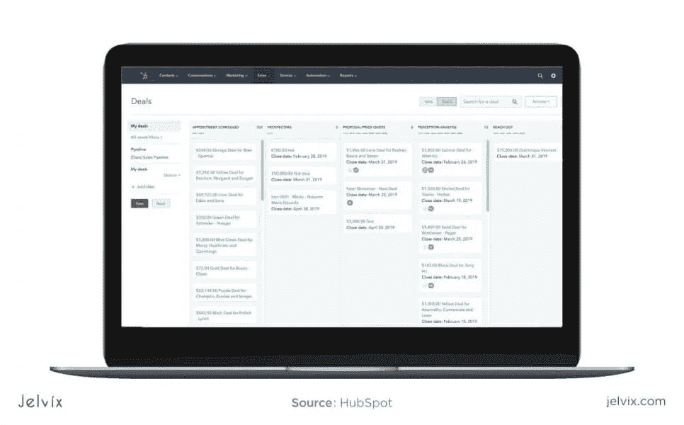

HubSpot 扩展为营销和内容管理的教育资源。他们的博客是利基市场的领先资源之一，这是高接触 SaaS 公司的常见策略。此外，需要注意的是，HubSpot 就像许多 SaaS 工具一样，有许多可以独立使用或集成使用的微服务。

HubSpot 是一家优秀的 SaaS 公司，它优先开发多种产品，而不是将所有资源投入单一平台。通过这种方式，公司可以涉足各种领域，如营销、管理、内容创作、SEO 等。

## MailChimp

MailChimp 是一家电子邮件自动化公司，允许撰写电子邮件和准备营销活动。该软件使用[免费增值定价模式](https://www.investopedia.com/terms/f/freemium.asp)——免费版本允许创建 12 000 封电子邮件和管理 2 000 名订户的时事通讯。

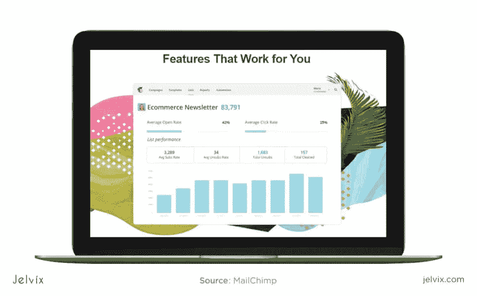

该服务可在网络浏览器和移动应用程序上使用。web 和移动应用程序都允许管理订户、创建电子邮件活动和跟踪您的活动。与 Shopify 类似，MailChimp 专注于通过集成创建附加功能。核心功能很简单，但用户可以通过安装附加组件来访问新功能。

## 松弛的

Slack 通常被称为世界上发展最快的 SaaS 公司。短短几年，公司市值达到 10 亿美元。“软件即服务”的成功取决于对市场空间的研究和对目标受众的识别。Slack 专注于一个狭窄的利基市场——他们将开发人员、设计师和自由职业者定义为他们的主要目标受众。

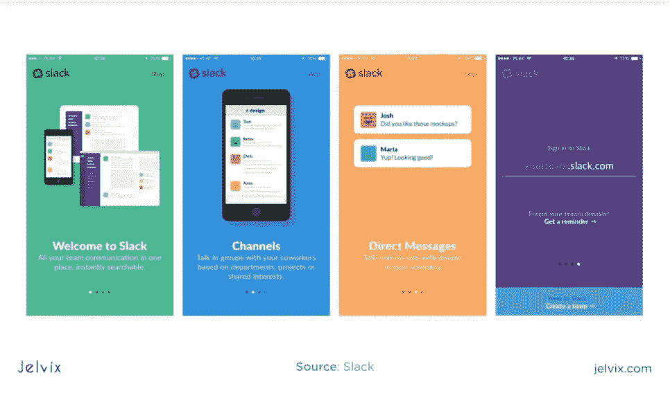

Slack 成功的另一个因素是它的定价模式。Slack 采用免费增值的方式，让用户在决定升级之前体验软件。个人计划是免费的，但是团队计划是付费的(按用户付费的方式)。

# 如何开发 SaaS？

这是 SaaS 开发的清单，从研究阶段到最终执行。让我们回顾一下每个步骤，并强调每个步骤的关键要求。

## 找到合适的位置

SaaS 发展的第一步是确定你在 SaaS 的位置。软件即服务最常见的领域是 [CRM](https://en.wikipedia.org/wiki/Customer_relationship_management) 、项目管理、软件基础设施、开发、测试、通信和数字营销。然而，其他领域也可以变成 SaaS——尽管其中大多数与营销和技术有关。

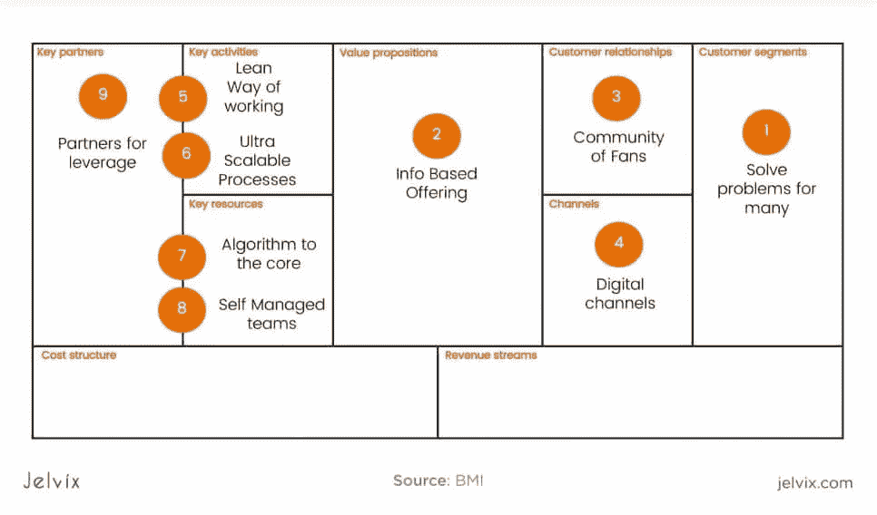

## 定义你的定位、市场、竞争对手

在你确定了你想从事的领域后，分析现有的 SaaS，并像我们看待 Shopify、HubSpot、Slack 和其他公司一样解释它们。关注他们的[品牌](https://jelvix.com/blog/a-few-words-about-brand-management)，定价模式，功能和营销策略。

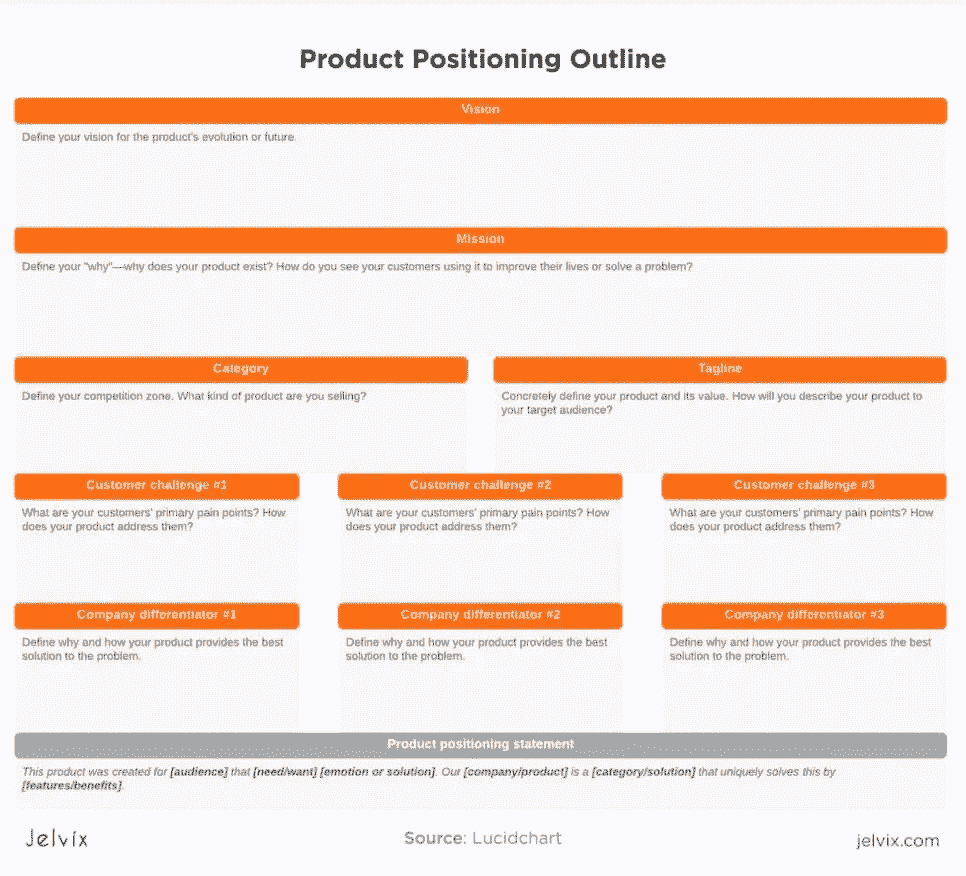

## 识别技术堆栈

大多数 SaaS 使用 web tech stack，因为其功能和界面是通过 web 浏览器访问的。通常，这包括前端的 JavaScript 和后端的 Java、Python、Go 或 PHP。一些团队更喜欢使用 Ruby on Rails，因为它速度快，效率高。

然而，一些 SaaS 主要作为桌面工具提供，其中一些甚至可以直接安装到设备上。最常见的例子有 [Adobe](https://www.adobe.com/creativecloud.html) 、[微软 Office](https://www.microsoft.com/) 和 [Slack](https://slack.com/) 。如果您的产品经常安装在桌面上，您可以考虑使用桌面技术堆栈:C#、C++等。

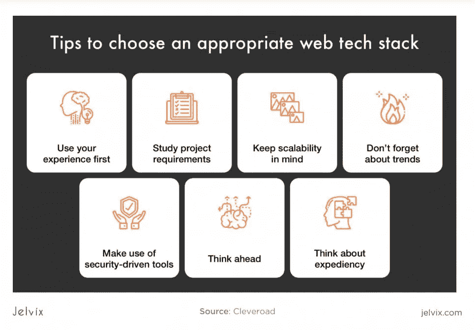

如果你的 SaaS 需要大量的数据处理，可以考虑使用[Python](https://jelvix.com/blog/red-or-blue-pill-neo-ruby-vs-python-which-will-you-choose-for-your-backend)——一种机器学习和大数据的常用语言。

## 选择定价策略

你需要定义你的[盈利模式](https://jelvix.com/blog/monetize-it-if-you-can-5-ways-to-get-a-revenue-from-an-app)——你可以选择描述的模式之一，或者选择混合模式。此外，考虑要实现什么样的支付系统和集成(你可以探索现成的解决方案，如 [Paypal](https://www.paypal.com/fr/home) 、 [Stripe](https://stripe.com/) 等)。

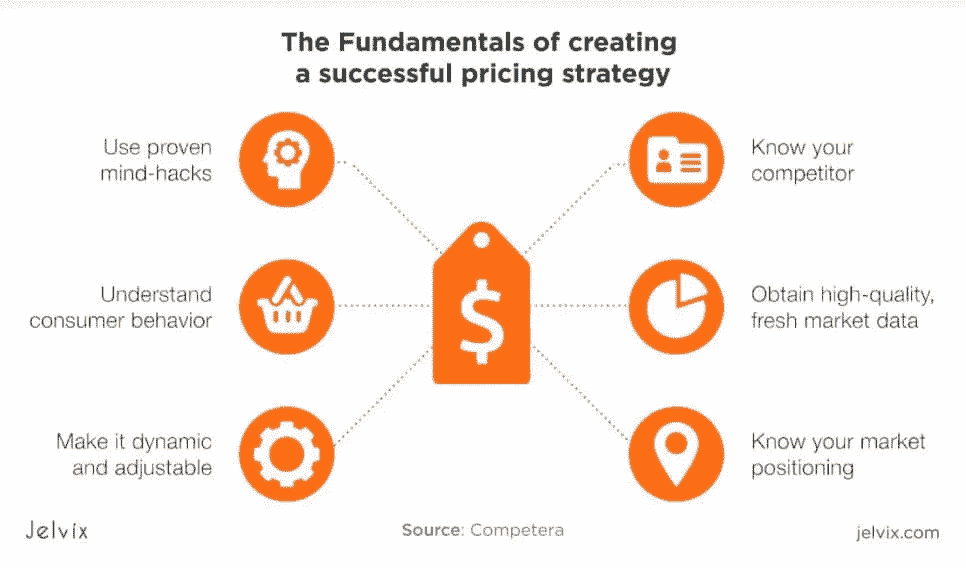

## 组建一个 SaaS 开发团队

SaaS 是一个长期项目，需要您的技术团队在构建、测试和维护软件即服务方面拥有丰富的经验。SaaS 架构需要严格的安全性、部署实践和主动数据处理。该团队必须精通集成附加工具，将工具连接到第三方 API，并使产品适应不同的平台(web、桌面、移动)。

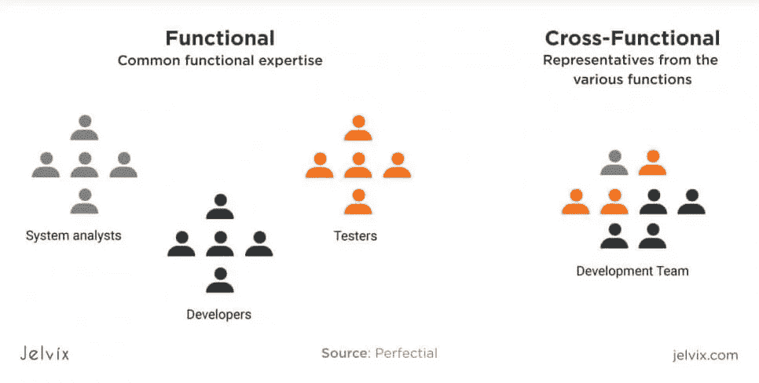

因此，必备技能包括:

*   跨平台开发:移动、桌面、web、跨浏览器开发；
*   数据安全(加密和理解法规)；
*   数据处理和存储:SaaS 应快速处理用户请求并提供快速性能；
*   软件测试和维护:开发人员需要与 QA 和维护团队合作，因为 SaaS 在变化，引入新功能问题的风险是持续的。
*   文档。确保团队知道如何交流他们的开发和测试实践——全面的文档有助于避免技术债务并快速消除 bug。

## 发布产品

为了将一个现成的产品推向市场，你需要创建一个发布策略。软件即服务业务模型基于个性化，涉及许多客户支持、成功管理和服务团队。为了提供个性化服务，你需要有一个及时帮助用户并为他们提供现成内容的计划。

在将您的 SaaS 推向市场之前，这里有一份您应该考虑的活动清单。

*   算出你想发布多少次新版本的产品。如果你的变更过于频繁，你的利益相关者会认为这是产品缺乏稳定性，用户可能无法习惯产品的界面和功能。另一方面，太少的更新会让你容易受到安全问题的影响，落后于市场趋势。
*   **指定一个特定的日期**:当团队知道你每周、每两周或每月发布一次时，他们可以计划他们的工作量。
*   **做预览**:你的团队和 beta 测试用户应该是第一批在所有观众看到之前测试新版本的人。
*   **与所有相关团队一起发布计划**。您的设计师、测试人员和开发人员应该就发布的日期和频率进行沟通并表达他们的观点。

将 SaaS 推向市场是建立在团队合作的基础上的——你需要倾听利益相关者、用户、开发人员、测试人员和设计人员的意见。确保在发布产品之前，您已经准备好了所有的营销材料和教学内容。你需要有一个营销和内容营销战略，这将有助于你的 SaaS 达到其用户。

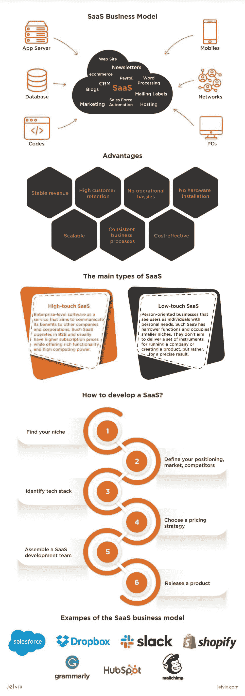

# 结论

建立 SaaS 是最便宜的创业方式之一。你需要专业的开发和测试团队，强大的概念，良好的营销策略。如果你能构思出正确的产品，执行它的功能和界面，并确保它到达潜在用户手中，你可以在几个月内创建一个成功的公司。

一切从服务开始。如果你的提议做得很好，涵盖了用户需求，并且没有技术问题，你就能找到你的定位。因此，如果你心中有一个 SaaS 的想法，你可以[向我们](https://jelvix.com/contact-us)概述——我们的开发团队将评估这个概念，建议最佳的技术组合，并估计项目的成本。在我们帮助您勾画出一个想法之后，开发是我们的责任—产品所有者可以专注于监督过程和运营他们的业务。

【https://jelvix.com】最初发表于**。**

***访问专家视图—** [**订阅 DDI 英特尔**](https://datadriveninvestor.com/ddi-intel)*