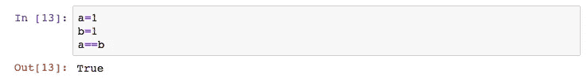
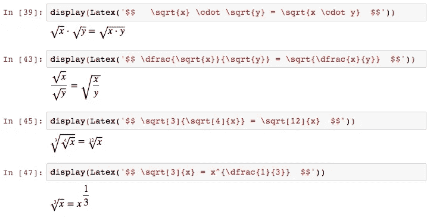

# 你需要知道的关于数学和 Python 的一切。第一部分

> 原文：<https://medium.datadriveninvestor.com/everything-you-need-to-know-on-mathematics-and-python-part-1-fe3c7ae50eeb?source=collection_archive---------9----------------------->

关于算术、代数、三角学、微积分和线性代数的综合指南，带有用 LaTeX 和 Python 编写的示例。

## 我们将使用的库

您应该将以下语句复制到 Python 代码的第一个单元格中，以便在程序中包含一些额外的功能。

Calling our libraries.

From the ‘math’ library import the ‘sqrt’ (square root) function.

随着我们的继续，将会有更多的导入库。我们使用上面打印的 LaTeX 代码。

# 算术

四种主要的算术运算符是加法(+)、减法(-)、乘法(*)和除法(/)。除以另一个数后的余数叫做模。在 Python 中，我们使用模(%)运算符。

 [## 2019 年最值得学习的编码语言|数据驱动的投资者

### 在我读大学的那几年，我跳过了很多次夜游去学习 Java，希望有一天它能帮助我在…

www.datadriveninvestor.com](https://www.datadriveninvestor.com/2019/02/21/best-coding-languages-to-learn-in-2019/) 

运算顺序是取幂开根，乘除，加减法。记住运算顺序的一个好的助记法是 *PEMDAS* (美国)，意思是圆括号、指数、乘除法、加减法。以上都叫做‘算术运算符’。

Examples of basic arithmetic.

## 更大的共同点

我们可以使用' math '库的' gcd()'函数来寻找两个整数的最大公分母。

## Python 中的变量

在程序设计中，变量是计算机内存中的一个位置，它有一个特定的内存地址，用来存储特定的数据。让我们想象计算机内存中的一个盒子，它保存了一个特定的值，存储在一个特定的位置。在 Python 中，我们不需要担心指定进入变量的数据类型，也不需要担心它的地址(不像 C 语言)。

Python 中最流行的变量类型有:整数、字符串、列表、元组、字典、布尔和浮点。

Declaring variables in Python.

## Python 中的 For 循环

当我们需要将一段代码重复固定次数时，就会用到“for”循环。语法如下..

A basic use of a for loop.

## 乘法表

下面是一个使用 Python，Numpy 和 LaTeX 的基本乘法表。

A basic multiplication table.

## Python 中的注释

在 Python 中，我们可以通过使用标签(#)符号来纠正语言解释器不会考虑的“东西”。在那一行和 hashtag(#)符号之后，Python 解释器将忽略所有文本。在 windows 上，我们可以使用 *CTRL + /* 作为快捷键，在 Mac 上 *CMD + /* 。这也将在您选择的所有行中放置一个标签(#)符号。

Comment examples.

## 比较和相等

这里一个重要的区别是 Python 中的等号，它不是等号(=)，而是双等号(==)。单个等号(=)称为赋值操作符，我们用它将值传递给变量。等号(==)运算符是比较而不是数学中的等号。

Assign to variable ‘a’ the number 1, assign to variable ‘b’ the number 1 and check if they are equal. Answer ‘True’

对于不等式，我们可以用大于号(>)和小于号( =)和小于等于(<=) are also in use. All the above are called ‘comparison operators’.

Comparisons can also be accomplished by using the ‘logical operators’. Those are the ‘and’, ‘or’, and ‘not’ words. The ‘and’ word compares if both statements are ‘True’. The ‘or’ word checks if one of the two statements is ‘True’, and the ‘not’ word compares when the first statement is not equal the second.

The ‘and’, ‘or’, and ‘not’ logical operators.

## Rounding Numbers

The simplest way to round numbers in Python is to call the ‘round( )’ function, and pass the number and the number of decimals.

If the decimal that we’ve specified is greater than 5, then we round up.

## Absolute Value

The absolute value of a number is the distance of the number to the zero on the number line. In Python, we can calculate the absolute value by using the ‘abs( )’ value.

Absolute value of x is equal with plus-minus x.

The function ‘abs( )’ calculates the absolute value of -4.

Rules of absolute value include..

Rules on absolute value.

# Pre-Algebra

## Exponents

Exponents are grouping together continuous multiplications in the same fashion as multiplication is grouping together continuous additions. We can write the following expression 3+3+3+3+3 as 3 x 5 (3*5 in Python). In the same fashion we can write 3 * 3 * 3 * 3 * 3 as 3**5\. For exponents (also known as powers), we use the double-asterisk(**) operator. An example would be..

3 in the power of 5 equal to 243.

Some rules of exponents, which I’ve coded in LaTeX, and been displayed inside Python, through a Jupyter notebook, are the following:

The exponent rules printed in LaTeX inside Python that runs through a Jupyter notebook.

## Roots

With the square root is the number that when multiplied by itself gives us the number in the square root. Or else, it answers the question, which number when raised to the power of two (x squared) gives us the number in the square root. In Python, we calculate the square root by using the ‘sqrt( )’ function.

The ‘sqrt( )’ function.

A cubic root answers the question, which number when raised to the power of three gives us the power inside the cubic root. In Python’s NumPy library there is a function that is named ‘cbrt( )’ which calculates the cubic root of a number.

Numpy’s ‘cbrt( )’ function.

Here are some rules of roots..

Some rules of ’n’ roots.

# Algebra

The Persian Al-Khwarizmi wrote, around 820 CE, a book with title ‘the compendious book on calculation by completion and balancing’. This was the beginning of algebra, a field of mathematics that underlies all the others.

## One Variable, Linear Equations

For simple equations we can use the ‘solve( )’ function from the sympy library of Python.

Here we import the sympy library into our code, and we set the calling name of the library to ‘sym’.

Here we set ‘x’ to be a mathematical symbol.

We assign the above equation into the ‘expr’ variable.

Finally, we call the ‘solve( )’ function, and we pass the ‘expr’ variable inside to solve it.

## Equations with More than One Variables

Inside the ‘solve( )’ function of sympy we can first pass the variable containing the equation we try to solve and with a comma(,) and then the parameter that we want to solve for.

We introduce a second mathematical variable called ‘y’ and we solve for both x and y.

## Distributive Property and Expansion of Algebraic Expressions

The distributive property allows us to conjunct and disjunct algebraic expressions.

We set each term in a different variable, and then we use sym.expand to expand them.

Before expansion and after.

## Popular Identities in Mathematics

Below we can see the most popular identities in math written in LaTex.

The most popular identities.

*……未完待续*