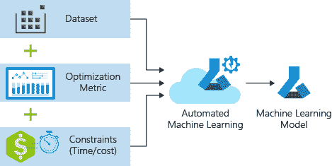
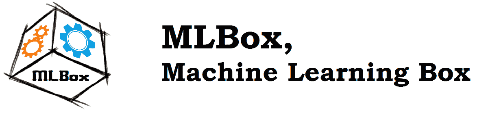
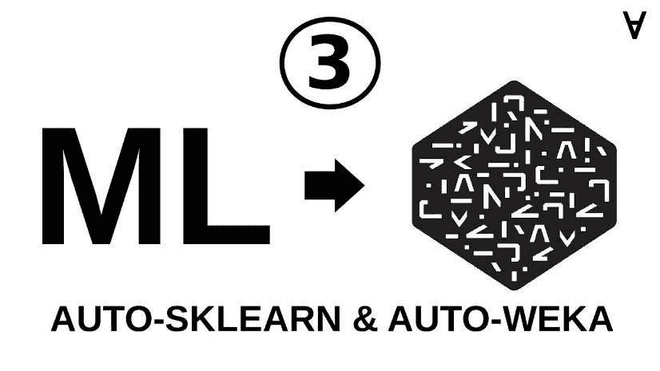
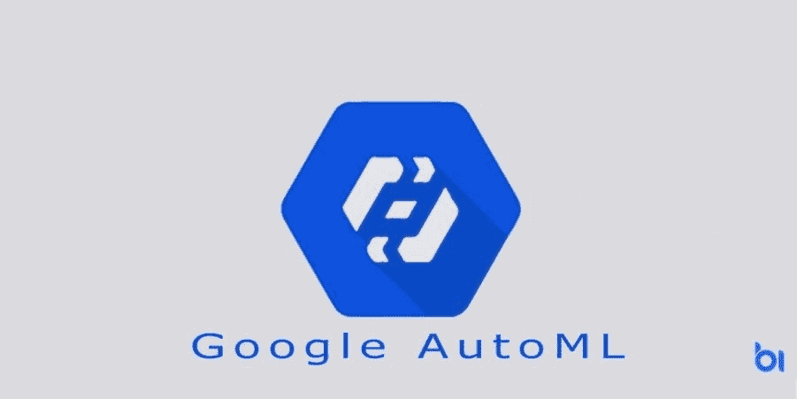
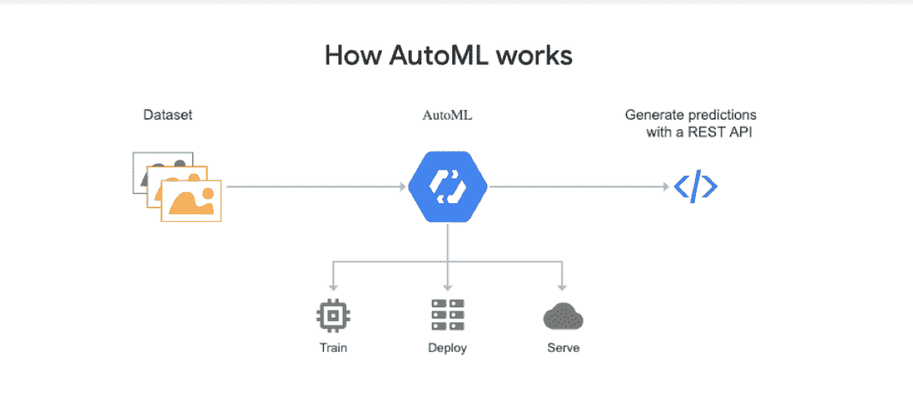

# 你想知道的关于自动化机器学习管道的一切

> 原文：<https://medium.datadriveninvestor.com/everything-you-want-to-know-about-automated-machine-learning-pipeline-df9e44612ff?source=collection_archive---------1----------------------->

近几十年来，人工智能(AI)和机器学习(ML)等技术已经在各种商业领域获得了广泛应用。特别是机器学习已经改变了医疗保健、金融服务和零售服务等商业领域。

机器学习技术不再只是技术极客的专利，现在也为商业用户所理解和使用。然而，这项技术的未来发展继续依赖于熟练的 ML 工人和数据科学专家的可用性。由于目前缺乏熟练的 ML 专业人员，大多数企业既没有预算也没有资源来投资于精通这些技术的训练有素的团队。

 [## 不管准备好了没有，革命就在我们面前|数据驱动的投资者

### “对于技术如何影响我们的生活和重塑经济，我们必须形成全面的全球共识……

www.datadriveninvestor.com](https://www.datadriveninvestor.com/2019/02/12/ready-or-not-the-revolution-is-upon-us/) 

答案在于自动化机器学习流水线技术的出现，也称为 AutoML 流水线。

通过这篇文章，我们将评估定制的 AutoML 管道解决方案的商业价值，以及如何为任何企业构建这项技术。

# 什么是 AutoML 管道？

AutoML pipeline 是 automated machine learning pipeline 的缩写，是将机器学习技术应用于现实世界商业问题的自动化过程。换句话说，它自动化了从获取数据集(从不同的数据源)到为业务开发定制的机器学习模型的整个流程。

AutoML 技术如何让企业受益？从真正的意义上来说，这种解决方案甚至允许对不了解底层技术的非技术用户使用机器学习。

在“传统”的机器学习模型中，在包括数据摄取、数据预处理和预测模型在内的多个阶段都需要人工干预和专业知识。另一方面，使用 AutoML，除了数据收集和预测之外的每个步骤都可以自动化，从而为任何业务客户创建定制的 AutoML 管道。

接下来，创建定制的自动化机器学习管道的需求是什么？商业企业对机器学习模型不断增长的需求正在推动用户友好的 ML 系统的开发，任何商业用户都可以使用这些系统。

通过其自动化，定制的 AutoML 管道可以提供以下好处:

*   通过自动化任何重复性的 ML 相关任务来提高数据专家的工作效率，并帮助他们专注于其他问题。
*   减少 ML 模型中主要由手动步骤引起的人为错误。
*   让所有用户都可以使用机器学习，从而促进去中心化的过程。

在下一节中，我们将讨论 AutoML(或 AutoML 工具)中的一些流行框架，它们支持生产机器学习流水线。

# AutoML 管道—框架和流程

自动化机器学习管道工具或框架可用于自动化完整(或部分)ML 管道。下面是一些正在使用的比较流行的框架:

## MLBox

使用 Python 库构建的 [MLBox](https://mlbox.readthedocs.io/en/latest/) 是一个 AutoML 工具，可以自动化 ML 相关的任务，如数据预处理、优化(用于交叉验证 ML 模型)和进行预测。它的一些主要功能包括使用深度学习的最新预测模型，超参数的优化，以及更快的数据预处理和清理。

# 自动 Sklearn

Auto-Sklearn 集成在 Python 中的 [scikit-learn](https://scikit-learn.org/stable/) 机器学习包之上，是一个自动化版本，可以将任何 ML 用户从选择正确的 ML 算法和调整超参数等任务中解放出来。Auto-Sklearn 适用于中小型数据集，可以使用贝叶斯搜索创建和优化机器学习管道。

## 云汽车

由谷歌推出的 [Cloud AutoML](https://cloud.google.com/automl/) 是一套机器学习相关产品，面向对 ML 模型了解有限的开发者或用户。凭借非常用户友好的 GUI，Cloud AutoML 使用神经架构搜索和转移学习等内置功能，根据最新数据设计和部署 ML 模型。

# 评估 AutoML 流水线架构

AutoML 流水线架构可以利用自动 ML 算法，该算法可以用一组用于自动调整 ML 模型的算法来代替 ML 工程师。例如，Cloud AutoML 使用神经架构搜索(NAS)算法，可以加速任何深度学习应用程序的开发，而无需评估许多架构。

AutoKeras 就是这样一个 ML 框架和库，它以 NAS 和超参数优化为特色，用于实现自动化机器学习流水线架构。通过超参数优化和自动化算法，该架构提供的方法可以为新任务自动执行耗时的手动超参数调整过程。

最后，我们将看看 AutoML 管道在业务运营中的优势和用例。

# AutoML Pipeline —业务优势和使用案例

在 AutoML pipeline 的许多用例中，日本流行的在线购物应用程序 Mercari 使用谷歌 AutoML 工具进行图像分类。通过上传照片的用户界面，该购物应用程序可以利用其定制的 AutoML pipeline 技术识别和推荐超过 12 个主要品牌的品牌名称。他们定制的 ML 模型成功识别了超过 50，000 张图像(准确率为 91.3%)。

AutoML 技术的未来也在推动实体零售店期待机器学习来利用他们庞大的客户数据。自动化物流为零售业带来了丰富的商业利益，包括:

*   根据当前客户数据和采购季节进行更好的销售预测。自动化 ML 使零售品牌能够识别和储存有需求的产品，同时确保产品对消费者的可用性。

准确的预测还可以减少未使用的库存成本和不必要的促销浪费。

*   通过定制的 ML 算法，根据客户以前的购买和将来的购买改进客户个性化。对于实体零售店来说，这意味着线下和线上技术的融合。

自动化机器学习技术的出现对数据科学家和其他分析师的工作有何影响？这会让他们变得多余吗？

AutoML 承诺通过自动化 ML 模型和算法的开发来提高数据科学家或[机器学习](https://www.countants.com/blogs/leveraging-machine-learning-in-text-to-speech-tools-and-applications/?utm_medium=social&utm_source=Medium&utm_campaign=traffic)专家的生产力。开发新的 ML 模型和算法是他们功能的一小部分。因此，自动化解放了数据科学家，使他们能够专注于通过机器学习解决方案来解决与业务相关的问题。

自动化机器学习的未来增长是由每个技术用户都可以访问它的趋势驱动的。借助 AutoML，数据科学家可以加速机器学习在业务流程中的“主流化”,以实现最大的业务效益。

因此，AutoML 被称为机器学习技术的未来。

# 结论

通过自动化[机器学习](https://www.countants.com/blogs/how-machine-learning-can-enable-anomaly-detection/)任务，如管道创建和超参数调整，AutoML 使数据科学家能够提高他们的生产力，实现他们的真正潜力。通过这篇文章，我们评估了一些流行的 AutoML 框架和工具。

凭借其在人工智能和机器学习等深度学习技术方面的专业知识和行业经验，Countants 为其客户提供了商业成功和增长的正确技术平台。通过其定制的解决方案，这家分析公司使数据洞察力和商业智能更容易为任何行业领域的任何企业用户所用。

你想探索机器学习如何改变你的商业运作吗？[今天就联系我们](https://www.countants.com/contact-us/?utm_medium=social&utm_source=Medium&utm_campaign=traffic)咨询您的业务问题，我们很乐意与您联系。