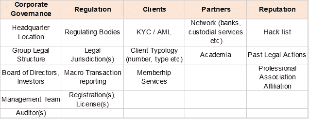
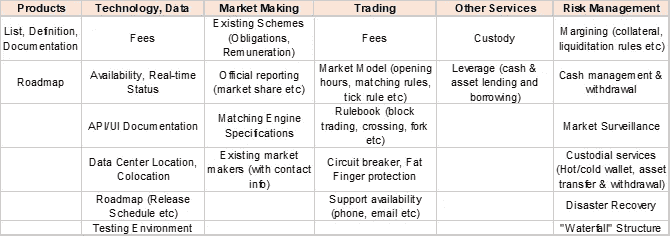

# 你一直想问你的密码交易所的一切

> 原文：<https://medium.datadriveninvestor.com/everything-youve-always-wanted-to-ask-your-crypto-exchange-154abe1aefd7?source=collection_archive---------4----------------------->

AbsoluteVision on Unsplash

也就是如何在不受监管的密码交易世界中航行

曾经在投资银行工作过的人都知道监管是一件大事，尤其是在 2008 年之后。相比之下，数字资产领域基本上不受监管。

监管到底是什么，它为什么会存在？可以说，全世界的监管者只有一个目标:保护投资者，无论大小。投资者需要保护什么？为了简单起见，让我们将其抽象为最简单的概念:“信息不对称”。金融市场处理信息，将信息吸收到价格中，以获得产品或服务的“公平价格”。信息不对称是指交易的一方比另一方知道得更多(或理解得更好)，因此在交易过程中形成的价格是有偏差的，导致财富从知识较少的人向知识较多的人转移。

> 对于那些试图相信白痴应该失去他们的衬衫的人，让我提供以下建议:你总是别人的白痴。

我们所说的信息或知识有些具体。两个投资者可能在他们的*信念*上不同，认为特定的情况将会发生(例如 XYZ 的股票价格将会上涨)，因此将会承担不同的风险。好吧。但是，如果一个交易员向散户投资者出售一种复杂的产品，最确定的是，前者*对相关风险有更好的理解*，而且可能不会完全坦白。这就是监管想要解决的不对称问题。

 [## 为什么参与正确的加密交换至关重要|数据驱动型投资者

### 到目前为止，与黄金和美元相比，加密货币，尤其是比特币，已经显示出巨大的增长

www.datadriveninvestor.com](https://www.datadriveninvestor.com/2020/07/16/why-engaging-with-right-crypto-exchange-matters/) 

回到上述财富转移，人们可能会争论这种转移的“公平性”——这可能是也可能不是监管者的任务的一部分。然而，毫无疑问的是，经济中的全球资源配置也将有所偏差，导致低效和次优的发展(或对不老练的投资者来说不可接受的风险)。难怪监管者的第一个武器是透明度，表现为披露义务。毕竟，确保每个人都在同一页上的最好方法是迫使更有知识的一方分享信息。这正是过去 10 年在传统市场领域发生的事情。信息披露任重道远:从交易员必须向客户披露利润率，到金融机构必须披露员工薪酬。

如果我们转向基本上不受监管的数字生态系统，我们当然应该问同样的问题:如果监管在传统市场中有作用，特别是围绕透明度这一主题，我们难道不应该为了最大数量投资者的利益而采用同样的标准吗？据推测，这些人会感到更好的保护，并会增加他们的活动。此外，这种安全感可能会说服“旁观者”加入进来。

> 许多人认为监管扼杀创新。但是透明度会扼杀创新吗？

我承认，在我看来，透明度，无论是自愿的还是强制的，都是“公平有序”市场的基本组成部分，所以我当然希望我们能看到更多的透明度。事实上，我们还不如马上开始寻找它。

如果你是一家投资银行的交易员，试图成为一家新交易所的成员，你将面临来自各方面的一连串问题:管理、风险和合规，甚至税务和会计。你问过你的密码交易所同样的问题吗？如果这些在常规交易中是合法的，为什么在任何市场中都不合法呢？那么交易者想要获得什么样的信息，也就是说，问你的密码交易所(或任何其他中介机构)什么样的问题是明智的？

我们来区分交易和非交易。下表给出了*非详尽的*非交易相关信息列表:

这一切都与常识性的好奇心有关:我在和谁打交道？我面临什么样的经济利益，我有权得到什么样的法律保护(如果有的话)？交易所是否有黑客等声誉问题的历史？管理团队的资质如何，他们面临着怎样的治理？

这里并不是要详细说明所有项目，而是要让大家了解在你建立新的业务关系之前，监管机构希望你承担的“披露”义务的范围。顺便说一下交易所也想知道他们在和谁交易，这就是 KYC 调查的重点。你/我们回答问题才公平。

有一项可能会令人惊讶:“学术界”。好吧，信不信由你，它影响深远。许多金融市场的[丑闻](https://www.economist.com/finance-and-economics/1998/01/15/collusion-in-the-stockmarket)(和其他地方的)已经从独立研究人员的工作中暴露出来。全球交易所定期向学术界提供机密交易数据，以促进应用金融研究。顺便提一下，这些数据也提供给国家监管机构。

从传统的交易所能轻易获得大量的信息吗？当然，它可能不会 100%出现在他们的网站上(例如这里的[或者这里的](https://www.lseg.com/)或者[这里的](https://www.deutsche-boerse.com/dbg-en/)，但是它对客户和合格的潜在客户是可用的。它是否可用于密码交换？不，差远了。应该是吗？在没有法律义务的情况下，这是任何人的决定。然而，有人可能会说，披露对建立信任大有帮助。

下一章，交易。毫无疑问，一个人需要对一家交易所了如指掌，才能进行精明的交易。像以前一样，下面是在交易前你可能想知道的*的一些事情的非详尽列表:*

总而言之，我们正在触及交易所的核心。该表中很少有单元格与交换机能够向其客户提供的服务质量不高度相关。你可能会认为其中一些桶是专业人士专用的，这确实是绝对正确的。话又说回来，如果专业交易员顺利地完成了尽职调查，那么*所有的*市场参与者都将体验到更高质量的服务。

从传统的交易所能轻易获得大量的信息吗？当然，它可能不会 100%出现在他们的[网站](https://www.eurexchange.com/exchange-en/)上，但它对客户和合格的潜在客户是可用的。它是否可用于密码交换？不，差远了。应该是吗？因为它直接关系到处理命令、执行和风险的方式，所以毫无疑问，它应该是及时、准确和详尽的。

密码交易所已经存在了吗？不尽然，尽管有些人确实比其他人表现出更多的善意。这些人将获得投资者流动性的最大份额。

**访问专家视图—** [**订阅 DDI 英特尔**](https://datadriveninvestor.com/ddi-intel)