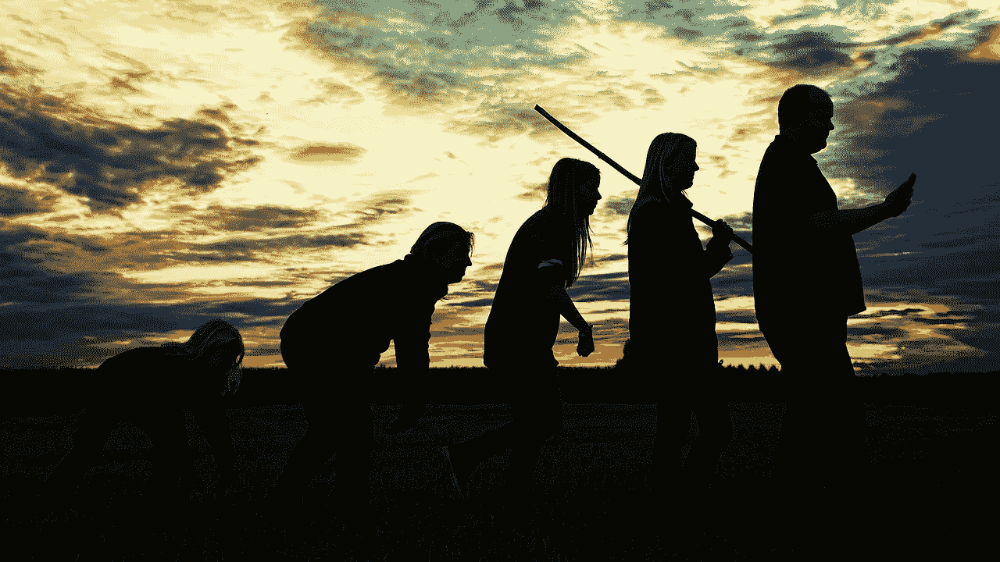
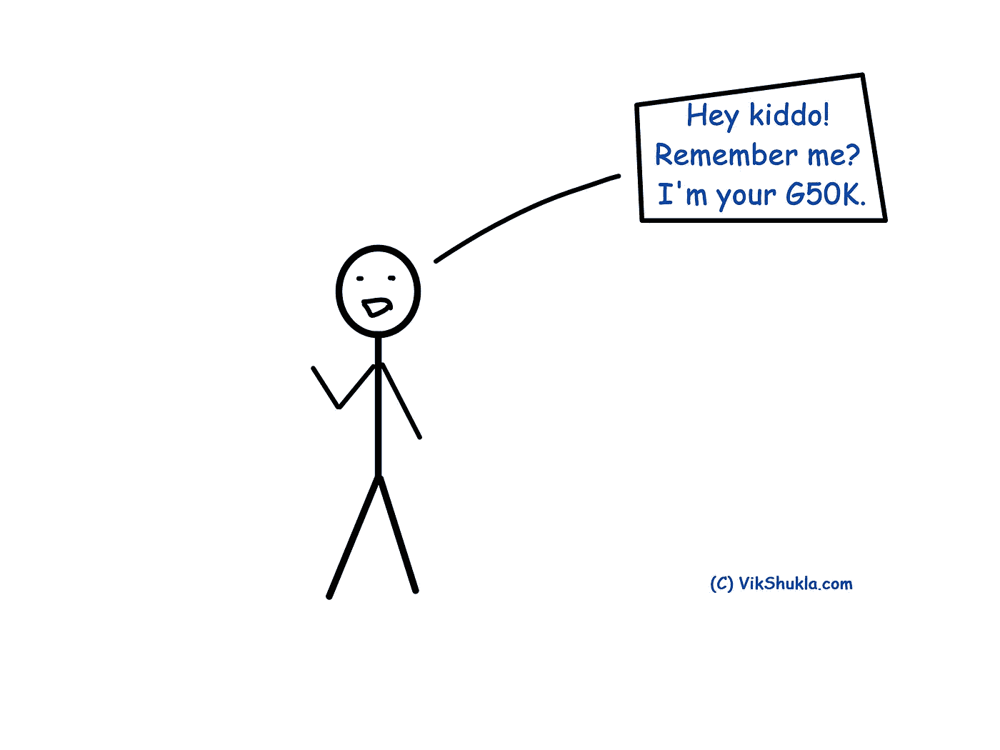
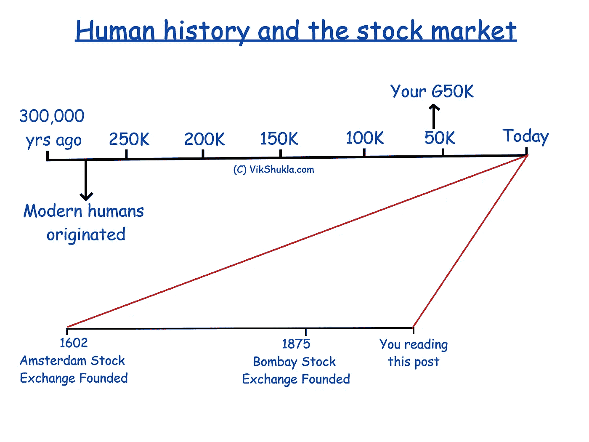
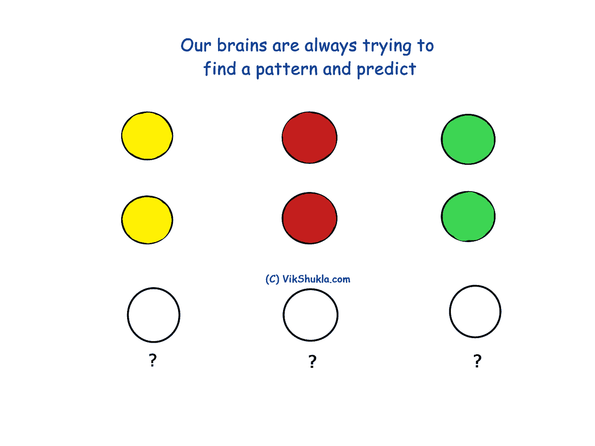
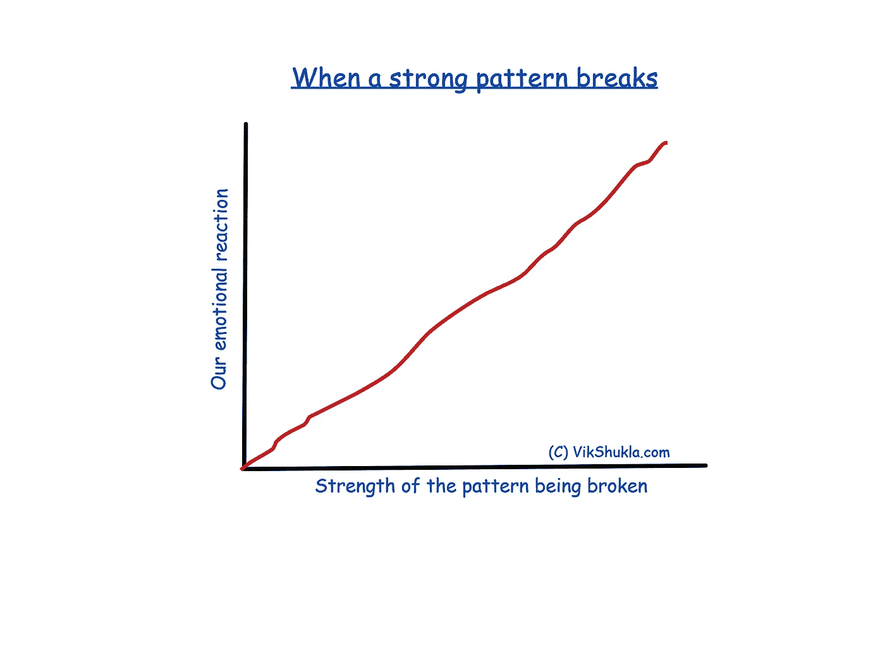

# 进化、情绪和股票市场:如何不成为自己最大的敌人

> 原文：<https://medium.datadriveninvestor.com/evolution-emotions-and-the-stock-market-how-not-to-be-your-own-worst-enemy-84e125d89147?source=collection_archive---------10----------------------->

## 我们是人类，不是会走路会说话的计算器。

Image source: jplenio / Pixabay

这是你五万年前的祖父。你不知道他的名字。为了方便起见，我们就叫他 G50K 吧。

他的部落刚刚学会使用语言进行交流。

他仍然是一个狩猎采集者。他生活在一个游牧群体中。他整天都在试图躲避食肉动物。在夏天、冬天和下雨的时候，他不得不寻找栖身之所。

他不得不每天寻找食物，否则他将不得不饿着肚子睡觉。

人类历史的大部分时间都是如此。

现代人类进化于 20 万到 30 万年前。相比之下，世界上最古老的证券交易所——阿姆斯特丹证券交易所——成立于 1602 年。

我们的大脑进化了几十万年来执行生存所必需的任务。从人类历史的角度来看，股票市场的产生只有 17.28 秒。

# 你的 G50K 的大脑不是为股市而生的

进化不会因为没有为股市定制我们的大脑而感到遗憾。在人类历史的大部分时间里，生存是最重要的事情。还是比 Nifty 50 和纳斯达克 100 重要。

我们生来就想逃避给我们带来痛苦的事情。我们想要更多给我们安全感和愉悦感的东西。它帮助我们的祖先在生活的挑战中生存下来。

进化心理学家 Leda Cosmides & John Tooby [写道](https://www.cep.ucsb.edu/primer.html)“我们现代人的头骨拥有石器时代的思维。”他们进一步写道:

> 一代又一代，1000 万年来，自然选择慢慢塑造了人类的大脑，有利于擅长解决我们狩猎采集祖先日常问题的回路——如寻找配偶、狩猎动物、采集植物食物、与朋友谈判、抵御侵略、养育子女、选择良好栖息地等问题。那些电路设计得更好来解决这些问题的人留下了更多的孩子，而我们是他们的后代。

我们的大脑并不特别适合投资。让我们看看帮助我们祖先生存下来的情绪和行为是如何在我们的投资旅程中造成巨大破坏的。

## **预警系统**

我们的大脑里有一个杏仁状的东西。一个在左侧，另一个在右侧。它叫做杏仁核。

这就像一个警告系统，意味着它在我们的行为和情绪中扮演着重要的角色。它让我们能够感受到恐惧和愤怒等情绪，并感知他人的类似情绪。

我妻子害怕蜥蜴。有一次我们和家人坐在一个房间里，我妻子的妹妹向她扔了一只用小麦面粉做的蜥蜴。

当蜥蜴还在空中时，我妻子从沙发上跳起来，尖叫着跑出房间！甚至在她意识到那是一只小麦面粉做的假蜥蜴之前，她就撞上了一堵墙。

她的杏仁核立即开始活动，使她逃离。它没有等她理性的大脑去理解上下文，去验证那是真的还是假的蜥蜴。

我们会在投资中看到类似的战斗或逃跑反应。当新闻频道大肆报道这场危机，而你周围的每个人都在谈论自公元前 9 世纪以来最严重的大萧条时，我们的杏仁核甚至会在我们的理性大脑获得清晰图像之前就开始活动。

在一项研究中，研究人员发现，我们越频繁地暴露在股票市场中赔钱的刺激下，我们的杏仁核就变得越活跃。

在[的一项独立研究](http://people.hss.caltech.edu/~steve/files/breiter.pdf)中，哈佛研究人员发现，即使是对失去的预期也会让我们的杏仁核异常活跃。

杏仁核引发的强烈情绪反应并不总是坏事。当我们想到用我们的钱去冒大风险时，它也会发挥作用。它在某种程度上让我们免受严重威胁。

 [## 收盘，但没有雪茄-股票市场目标在停滞的 COVID 救济中创新高|数据驱动…

### 专家聊天程序:一个协作市场，在这里人们可以和能够解决他们问题的专家聊天。是……

www.datadriveninvestor.com](https://www.datadriveninvestor.com/2020/08/18/close-but-no-cigar-stock-market-targets-record-highs-amidst-stalled-covid-relief/) 

## **假警报**

当你的 G50K 看到一头猎豹向他跑来，他会跑得比乌塞恩博尔特还快，或者爬上一棵树来保命。

过了一会儿，他意识到这只是一只无害的动物，而不是一只饥饿的猎豹。虚惊一场。他会从树上下来，平静地走向目的地。他没有失去任何东西。

如果他低估了风险，结果发现那是一只真正的猎豹，他就会成为野兽的一顿丰盛大餐。所以，他的大脑必须格外小心潜在的危险。

快进到今天。

2020 年 3 月，由于新冠肺炎疫情事件，全球股市暴跌超过 30%。金融色情网络专家 101%确定我们正处于自 1929 年大萧条以来最大的经济危机中。

感觉像是一头猎豹在追我们。我们不得不在市场跌到零之前卖掉我们的股票逃跑。

随着时间一天一天地过去，我们意识到经济正在慢慢开放，市场正在复苏，监管机构每天都在印刷大量钞票，以尽量减少危机的影响。

但如果我们在 2020 年 3 月的底部恐慌抛售，我们会损失大量资金。我们将屏幕上的损失转换成银行账户上的货币损失。

虚惊一场并没有让你的 G50K 损失什么。但这可能会花掉你一大笔钱。

## **短期和长期**

财务顾问、资产经理和其他专家总是告诉投资者，“忽略短期波动，关注长期回报。”

这个建议是有价值的，合乎逻辑的，合理的。复利确实是世界上最强大的力量之一。

但是它忽略了人类的情感。我们充满了恐惧、贪婪、焦虑、嫉妒、自我等等。导致我们打破任何规则。

我们已经发展到关注短期目标。所以，我们很难有长远的眼光。

当你的 G50K 感到饥饿的时候，他想马上吃一顿饭…即使是很少的一顿饭。任何人告诉他:“忽略短期，着眼于长期”，他都不会听。

我们想要短期的满足，即使它比我们长期所能得到的要少。

这有助于解释为什么大多数投资者喜欢记录短期收益，而不是持续投资几十年。

## 我们也是理性的

如果杏仁核总是引起恐惧、愤怒和其他强烈的情绪，我们可能永远无法平静地生活。

进化赋予了我们大脑中的前额皮质。它存储各种事件的记忆，用作未来决策的数据。它帮助我们做出理性、平衡的判断。

前额皮质调节大脑的执行功能，如[、决策](http://vikshukla.com/causes-of-bad-decision-making-and-how-to-get-better/)、社会行为和个性表达。它确保我们不会总是感情用事。

## **渴望预测**

分析师总是预测未来是有原因的，尽管他们知道投掷飞镖的黑猩猩比他们有更好的记录。

这是因为我们渴望预测。我们想知道将会发生什么。

看下图。我故意把最下面一行的圆圈留为空白。但是你的大脑会自动尝试寻找一种模式，并可能预测空白的圆圈应该用黄色、红色和绿色填充……顺序与前两行相同。

这是因为我们的大脑已经进化到可以预测。如果你的 G50K 停止预测下一顿饭在哪里，他会饿死。

他必须学会识别模式并做出预测。几十万年来，我们一直在发现模式并预测未来的事件。它无意识地发生在我们身上，就像心跳一样。

当你的财务顾问告诉你，“不要试图预测市场，”他试图在 3 秒钟内撤销进化 30 万年来完成的事情！

## 破损的图案

想象一下:你在车里，被堵在交通信号灯前。你正盯着红灯。你的大脑无意识地开始想象灯从红色变成黄色，然后变成绿色。

现在灯已经变黄了，你已经启动了你的车。但不是绿色，而是不知从哪里冒出来的紫光，警察示意你再等一分钟。

紫光的意外出现会让你的挫败感增加 10 倍。这不是你已经习惯的模式。

如果一种强烈的模式被打破，我们的情绪反应也会变得强烈。

一只连续 2-3 个季度超过普遍预期的股票，仅仅通过公布下一次收益公告的日期就能让人兴奋不已。我们开始预测它将再次打破共识。

但当结果低于预期时，我们的大脑会做出强烈反应，促使我们卖出股票。当公司每股收益低于预期几美分时，他们的市值就会损失几十亿美元。

进化生物学家发现，一个模式重复的时间越长，我们对它的信念就越强。当模式被打破时，我们的反应越强烈。

# 我们不能不受情绪的影响

不管别人告诉你什么，当涉及到钱的时候，我们 99.99%的人都不能免疫我们的情绪。

假设你不在另外的 0.01%。0.01%的人是像沃伦·巴菲特和查理·芒格这样的人，他们在学校里记住了 37962 个心理模型。

对大多数投资者来说，具有挑战性的是在跌宕起伏中坚持这个过程，同时处理我们的 G50K 赋予我们的情感大脑。

阅读或告诉某人，“这场危机只是短期的，你应该关注长期的复合效应。”

当你的投资组合在危机中下跌了 40%，你的公司正在裁员，你的女儿即将开始大学生活时，*没有抓狂是完全不同的事情。*

你*会在某种程度上抓狂。*

我们想变得理性和有逻辑。我们说服自己我们是。但我们没有。

我们希望相信情绪和行为只会影响其他投资者，而不会影响我们。我们忘记了我们也是不完美的，情绪化的生物。

# 如何不成为自己最大的敌人

我们的情感大脑还没有进化到能赶上股市的水平。进化是一件缓慢的事情。但总是根据情绪行事是你能对自己的投资组合做的最可怕的事情。

## 尽量减少大脑恐慌的机会

合作基金的合伙人、《金钱心理学》一书的作者摩根·豪斯尔喜欢保存大量现金，以便随时取用。鉴于低利率，持有过多现金对许多投资者来说可能听起来不理性。但这对他很有效。

为什么像摩根这么聪明的人会这么做？他曾多次表示，额外的现金让他精神平静。这最小化了他在市场崩溃时恐慌并在底部抛售股票投资的[风险。](http://vikshukla.com/panic-selling/)

如果我们让我们的投资几十年不间断地复利，我们会得到最好的回报。而[恐慌性抛售](http://vikshukla.com/panic-selling/)就在复利开始显示其魔力之前杀死了它。

如果生活出现意外，额外的现金可以最大限度地降低出售股权以满足意外支出的风险。将我们投资组合的一部分配置到相对安全的资产，如债券和黄金，也能给我们带来精神上的平静。

根据一项研究，[称，“除了原始收入、投资或债务之外，拥有随时可用的现金来源对生活满意度具有独特的重要性。”](https://pubmed.ncbi.nlm.nih.gov/27064287/)

## 将良好行为作为你的默认选项

我们继续为我们不常使用的各种会员或订阅付费是有原因的。即使我们知道应该取消，我们也不会取消。

这不是不负责任或懒惰的问题。这是因为取消它们需要我们深思熟虑的行动和精力。

由于现状偏见，我们在心理上倾向于选择阻力最小的道路。我们不想走出自己的舒适区去做出改变，除非改变变得绝对必要。

如果我们把良好的行为作为默认选项，我们就在让现状偏见对我们有利，而不是对我们不利。

即使当你的情绪告诉你做出一个糟糕的决定，你也必须花时间走出舒适区去采取行动，这一事实减少了你做出一些不理智行为的机会。

它特别有用，因为它消除了我们的大脑识别模式和进行预测的需要。它防止你对短期趋势和时尚反应过度。

每月自动投资指数基金。如果你想建立一个应急基金，建立一个单独的银行账户，流动资金，或任何其他地方，你可以很容易地访问它的自动付款。

如果你买股票，制定一个规则，在每月或每周的特定日期特定时间买入。准备一份“何时出售”清单，贴在你的电脑旁边，这样你就可以在交易的时候看到它。

创建一个清单并把它放在抽屉里是行不通的。相信我。

为了最大限度地减少做出非理性行为的可能性，当你试图采取行动时，你必须盯着清单，然后让前额皮质给你一些理智。

让你的投资自动化，让你自己难以撤销。怎么会？

## 增加一些积极的摩擦

我们不能改变杏仁核的工作方式。所以，我们必须限制它接触刺激它的东西。

我们知道，我们越频繁地查看股票行情的涨跌，我们就越容易采取行动。增加阻止有害行为的摩擦。

每隔几个小时卸载你用来查看股票行情的应用程序。卸载共同基金应用程序，阻止自己随心所欲地采取行动。停止观看商业电视频道。

告诉你的朋友或配偶，你一个月检查投资组合的次数不会超过一两次。请他们追究你的责任。

让动用应急储蓄或出售投资变得稍微困难一点。

## 记录你的投资决策

我发现在日记中写下我的投资论文可以很好地抵御我的情绪波动。

当你的杏仁核告诉你点击*卖出*按钮时，你可以拿起你的日记来提醒自己当初为什么投资一家公司。也看看你的“何时卖出”清单，看看你是否有至少一个卖出的好理由。

日记不仅仅是对抗你情绪的工具。多年来，它也帮助你了解你的思维过程，并作为一名投资者不断发展。

## 挠痒痒

我们时不时会有一种想去挠的痒感。也许你想“投资”比特币，或者你已经发现了一只可能成为“下一个亚马逊”的微型股票。

你不想变得非常有纪律性和无趣。你仍然需要一个发泄情绪的出口。

因此，创建一个单独的“挠痒痒”账户，分配不超过 10%的投资组合。记住，你随时都可能失去这一切。用它来投资比特币，追逐下一只最火的股票，或者赌一把未来的走势。但不超过投资组合的 10%。

去挠痒痒吧！

天啊。太多的废话。我现在需要停下来。

结束。

–Vik

## 接下来阅读:

[**为什么中产阶级的人一辈子都是中产阶级……你能做些什么**](http://vikshukla.com/why-middle-class-people-stay-middle-class-all-their-life/)

我想你不是百万富翁。我也不是。所以我们在这里——两个中产阶级的人在讨论为什么中产阶级的人永远不会变得富有。

[**恐慌性抛售:是什么导致投资者恐慌，你能做些什么**](http://vikshukla.com/panic-selling/)

“那么，你想让我做什么？”“没什么。有时候什么都不是最难做的事。”

[**投资中的风险、回报和遗憾:找到平衡点**](http://vikshukla.com/risk-reward-and-regrets-in-investing/)

没有人能确定未来。我们充其量是在处理赔率和概率，它们不会总是对我们有利。我们无法完全避免风险和遗憾。

*本文原载于*[*VikShukla.com*](http://vikshukla.com/evolution-emotions-stock-market-investing/)

**访问专家视图—** [**订阅 DDI 英特尔**](https://datadriveninvestor.com/ddi-intel)