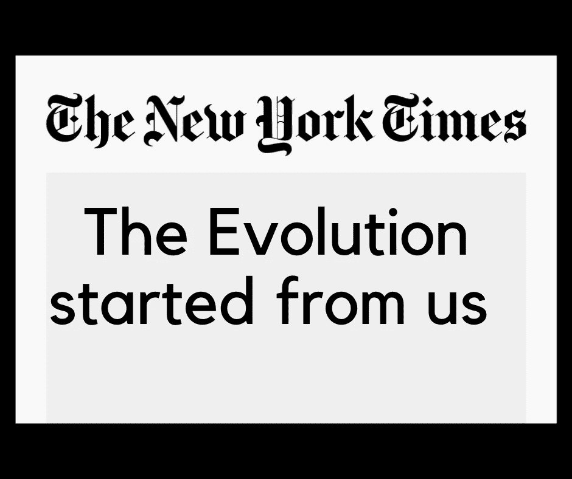

# 广告的演变

> 原文：<https://medium.datadriveninvestor.com/evolution-of-advertising-c2d1ff2f893c?source=collection_archive---------9----------------------->

从 30 页报纸到 3 秒钟的 Instagram 故事

Credits — Sachin Mishra on Canva

广告是最常见的提高品牌认知度和产生潜在客户的技术，这种方式从它流行的那一天起就一直在发展，人们开始实践它。

## 免责声明——这是一篇信息丰富的帖子，所以如果你正在寻找一个爱情故事，请按退格键。

## 报纸和杂志

广告从一开始就提供了结果，无论是在报纸上还是电视上，它们都是传统的点击诱饵，用醒目的标题和图形吸引读者。

## 收音机

最讨厌的事情之一是当人们在收音机里欣赏浪漫的数字时的广告。会有带音乐的刺激性广告。

这是广播广告，一种在当地人中推广产品的流行方式，这些广告是针对地理位置的。

早上的广播节目广告收入很高，因为人们在开车去办公室的路上打开它，它们就很受欢迎。

## 电视

单句广告令人难忘。我们想了想还是会怀旧。

这些广告能够给观众留下长久的印象。最大的赢家是那些长期留在市场上的人。

广告是每个电视频道在 TRP(电视收视率)竞赛中的原因，因为 TRP 较高的频道过去对广告收费较高。

如果有一个板球比赛发布频道将收取更高的费用，如果一个频道表现不好，它将获得很少的广告。

## 招牌—

它们是一种常青的广告风格。我们周围有印刷电路板，现在已经变成了 LED 电路板。

# 数字广告

数字，正如这个词所描述的那样，将整个世界带入你的手机和笔记本电脑。

更早的人有时间，连看广告都不痛苦，人们习惯于享受那些运行时间为 1 分钟的广告。但是在这个世界上，人类没有时间和耐心，所以广告需要快速吸引注意力，在更短的时间内创造更多的印象。

## 脸谱网

最大的社交媒体平台，开始在故事部分以及新闻提要、视频和横幅广告中发布广告。

## 照片墙

脸书在 2012 年接管了 Instagram，从那时起他们就携手合作，后来在 Stories 中显示赞助广告，他们确保广告持续时间非常短，并有一个链接，合适的客户可以通过手指点击来连接。

## 油管（国外视频网站）

他们开始时只有一个广告和一个跳过广告的选项，但当 AdSense 意识到它的真正潜力时，他们增加了多个广告的运行，在一些广告中没有跳过选项，只是为了获得观众的全部注意力。

## 博客

博客上的广告是博客的主要收入来源之一。让他们保持写更多东西的动力也是非常重要和必要的。

Credits Pexels

像 Adsense 和 Media net 这样的平台已经通过原生广告、不会使网站负担过重的横幅广告在广告领域提供了巨大的推动力。

注意——如果你想要一个关于 AdSense 资格标准的教程，查看下面的视频。

Criteria of AdSense Approval

## Watsapp 广告(即将推出)

Whatsapp 很快就会推出广告，我们对此不太满意，因为该平台非常用户友好。

Whatsapp 上的广告将与 Instagram 的故事类似，我们只能希望它不会影响用户体验。

Sachin Mishra on Canva

# 关于作者

嗨！！！我是 Sachin，一个旅游和美食博主，如果你喜欢阅读它们，在这里见我。

如果你不喜欢阅读关于旅游和食物的书籍，不用担心，我的媒体故事已经准备好激励你了。
保持动力，保持微笑:)