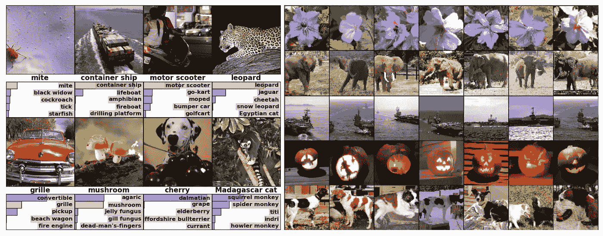
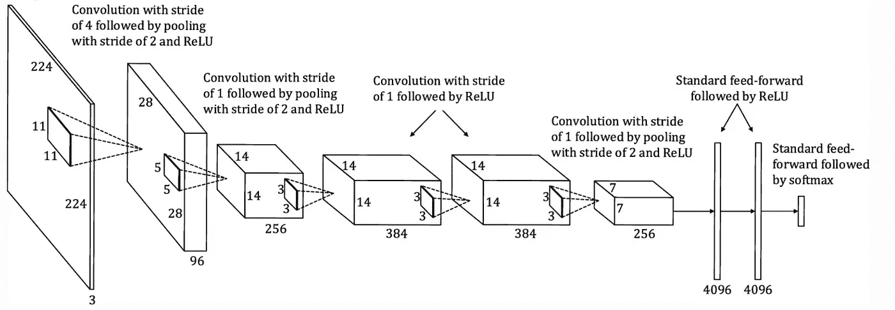
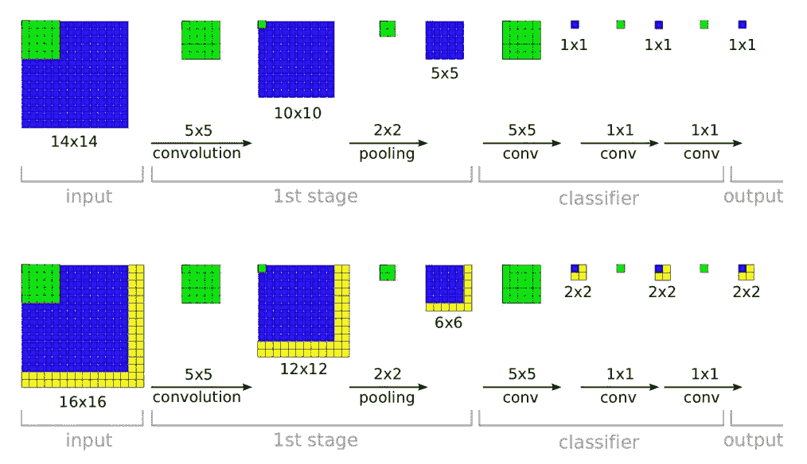
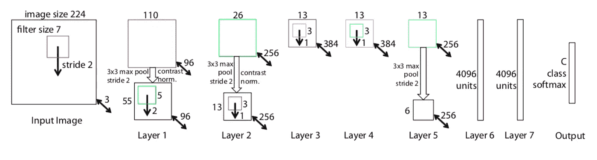
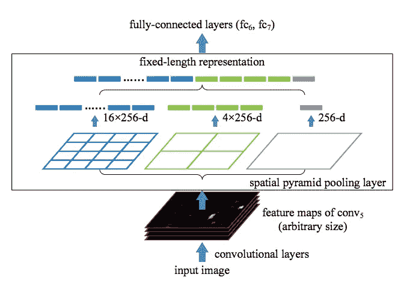
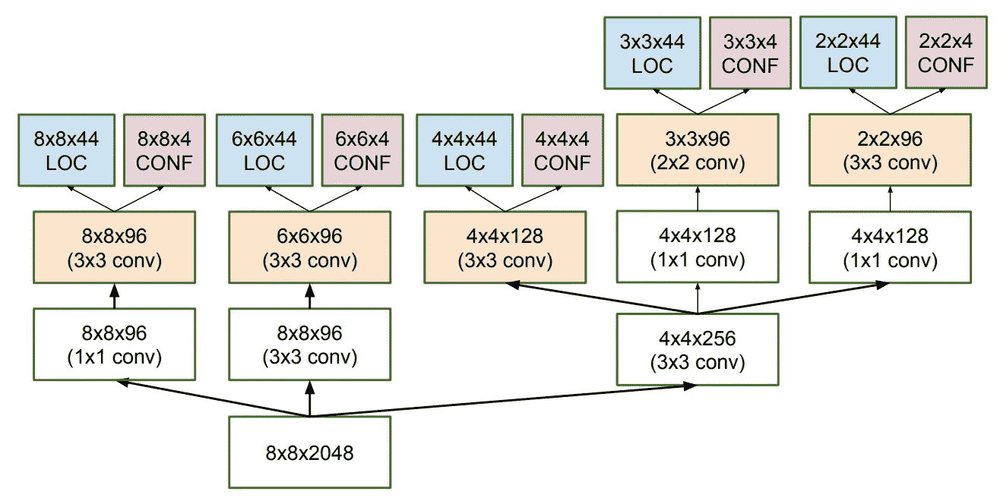

# 物体识别算法的发展 I

> 原文：<https://medium.datadriveninvestor.com/evolution-of-object-recognition-algorithms-i-5803c7be0691?source=collection_archive---------9----------------------->

> 让我们深入了解最先进的自动驾驶汽车背后的技术

Object Recognition using Alexnet [1]

对象识别是用于在图像或视频序列中寻找和识别对象的技术。人们可能会想，识别物体有什么迷人之处——“哦，这是一项如此平凡的任务”，但让我告诉你，这项任务对我们来说越简单，机器就越难破译。因此，我们致力于研究使机器更人性化的技术——视觉、语音、语言和运动技能。现在，在这个由两部分组成的系列中，我将带您经历物体识别的进化之旅，这是计算机视觉中一个受欢迎的领域。

## Alexnet

简短的对象识别历史始于 2012 年，当时 Krizhevsky 等人[1]训练了一个深度卷积神经网络，将 ImageNet LSVRC-2010 竞赛中的图像分类为 1000 个不同的类别。他们合并了 ReLU、dropouts 和 GPU 实现。目标识别由附加的 SVM 模型执行。该模型在纯监督学习方面取得了破纪录的结果。

Outline of Alexnet [7]

## RCNN

大约在同一时间，Girshich 等人[2]提出了 RCNN，声称通过自下而上的区域提议、监督预训练和特定领域微调来定位和分割对象是其性能提升的秘密。

 [## 论机器人权利:机器人可以被奴役吗？数据驱动的投资者

### 人们可以随心所欲地对待他们的机器人吗？一个人可以对他们的机器人“暴力”吗？机器人应该是…

www.datadriveninvestor.com](https://www.datadriveninvestor.com/2020/02/13/on-robot-rights-can-robots-be-enslaved/) 

## 吃得过多

OverFeat [3]实施了一种多尺度滑动窗口方法，可以有效地执行分类、定位和检测任务。该模型有一些可以弥补的缺陷，首先，定位任务不是通过在整个网络中反向传播来执行的，其次，它利用了 l2 损耗，而不是 IOU 标准优化。

Outline of OverFeat [3]

## ZFNet

在 2013 年，ZFNet [4]赢得了 ILSVRC。他们的模型通过为 AlexNet 模型使用 7x7 内核来实现信息保留。图像的 224×224 裁剪(具有 3 个彩色平面)被呈现为输入。

The architecture of the 8-layer ZFNet model. [4]

该架构与 96 个不同的第一层滤波器(红色)进行卷积，每个滤波器的大小为 7×7，在 x 和 y 方向上使用 2 的步长。然后，得到的特征图:(I)通过校正的线性函数，(ii)合并(在 3×3 区域内的最大值，使用步长 2)以及(iii)跨特征图进行对比度归一化，以给出 96 个不同的 55×55 元素特征图。在层 2、3、4、5 中重复类似的操作。最后两层是完全连接的，以向量形式(6 6 256 = 9216 维)将来自顶部卷积层的特征作为输入。最后一层是 C-way softmax 函数，C 是类的数量。所有过滤器和特征地图都是方形的。

## SPPNets

引入空间金字塔池[5]是为了解决固定大小输入图像的问题。SSP-net 的优点是它能够生成固定长度的表示，而不管图像的大小/比例。由于任意子图像池，它比具有相似准确度分数的 R-CNN 相对更快。

A network structure with a spatial pyramid pooling layer. Here, 256 is the filter number of the conv5 layer, and conv5 is the last convolutional layer [5]

## 多框

以前的不可知提议生成方法的缺点是它没有提议排序系统或者提议排序系统非常弱，这对运行时间有不利影响。这导致了 MSC-multi box[6]的发展，它提供了基于学习的建议方法，可以与硬设计的方法有效地配对，并提供体面的质量-运行时权衡。

An illustration of the multi-scale convolutional prediction of the locations and confidences for MultiBox [6]

这就结束了我们关于物体识别算法发展的第一章。更详细的了解，你可以参考下面参考文献列表中的论文，也可以直接通过 [Medium](https://medium.com/@asthanameghna01) 或 [Twitter](http://www.twitter.com/meghnaasthana) 联系我。在接下来的一周，我将深入研究下一代算法，如 VGGNet、ResNet 和 YOLO，敬请关注！

[1] Krizhevsky，a .，Sutskever，I .和 Hinton，G.E .，2012。基于深度卷积神经网络的图像网分类。神经信息处理系统进展(第 1097-1105 页)。

[2] Girshick，r .，Donahue，j .，Darrell，t .和 Malik，j .，用于精确对象检测和语义分割的丰富特征层次。arXiv 2014。arXiv 预印本 arXiv:1311.2524。

[3]塞尔马内，p .，艾根，d .，张，x .，马蒂厄，m .，弗格斯，r .和勒村，y .，2013 年。Overfeat:使用卷积网络的综合识别、定位和检测。arXiv 预印本 arXiv:1312.6229。

[4]泽勒医学博士和弗格斯研究中心，2014 年 9 月。可视化和理解卷积网络。在欧洲计算机视觉会议上(第 818-833 页)。斯普林格，查姆。

[5]何，王，张，徐，任，孙，2015 .用于视觉识别的深度卷积网络中的空间金字塔池。IEEE 模式分析和机器智能汇刊，37(9)，第 1904-1916 页。

[6]塞格迪，c .，里德，s .，埃汉，d .，安盖洛夫，d .和约菲，s .，2014 年。可扩展的高质量对象检测。arXiv 预印本 arXiv:1412.1441。

[7]哈希米，硕士，2019。在输入卷积神经网络之前放大较小的图像:零填充与插值。*大数据杂志*， *6* (1)，第 98 页