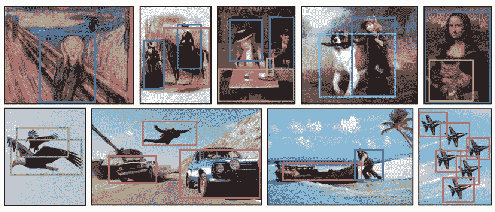
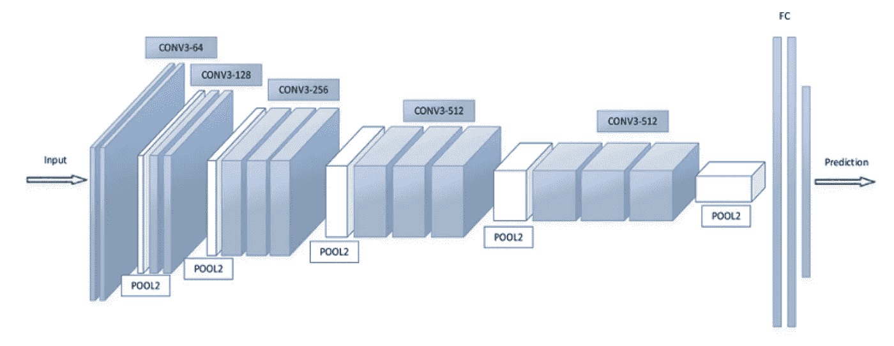
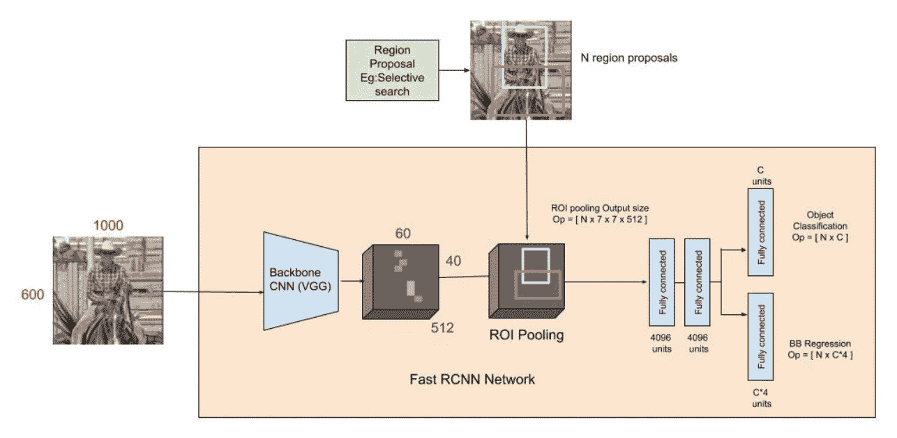
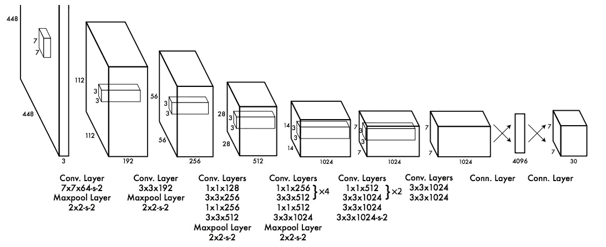
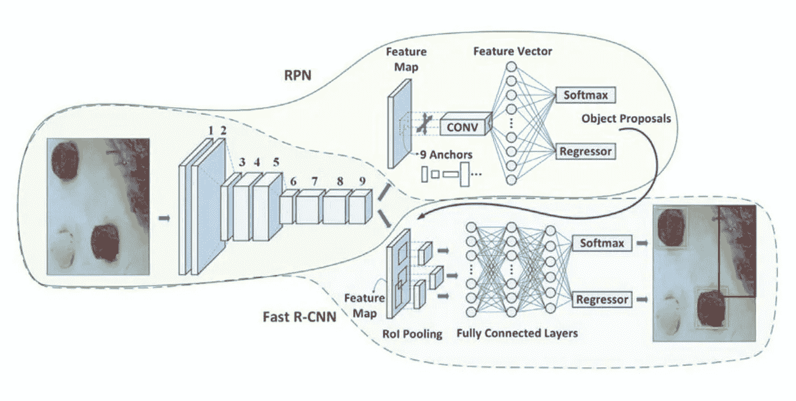
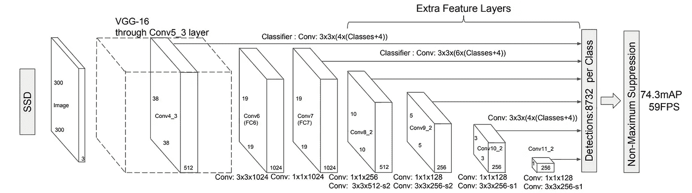

# 物体识别算法的发展 2

> 原文：<https://medium.datadriveninvestor.com/evolution-of-object-recognition-algorithms-ii-bd35a6e0d329?source=collection_archive---------10----------------------->

> 让我们深入了解最先进的自动驾驶汽车和安全监控背后的技术。

Object Recognition Algorithm results [4]

在对象识别算法发展的上一期中，我们深入研究了一些初步技术，如 Alexnet、RCNN 等。虽然这些算法是该领域的先驱，但它们有许多缺点。这些已经在到目前为止仍然相关的后期架构中进行了处理。在我们演进之旅的第二阶段，我们将关注这些在 2014 年后发布的增强架构。

## VGGNet

2015 年，VGGNet [1]提供了一个非常深的网络架构，具有小型(3 x 3)卷积滤波器和高达 19 层的层。与他们先前的定位和分类任务相比，这些被证明表现得更好。

Outline of VGG16 [9]

## 概念网

基于赫比原理和多尺度处理直觉的精心设计导致了 InceptionNet [2]的建立，它在保持计算开销不变的同时，对网络的深度和宽度进行了实验。最有效的架构由初始模块栈组成，而不是多个并行卷积和最大池层。

## 快速 RCNN

鉴于 R-CNN 和 SPPNet 培训费用高、速度慢、由多级管道组成的缺点，需要一种补救办法。快速 R-CNN [3]是建立在以前的作品 R-CNN 的对象分类。它结合了非常深的 VGG16 网络，提供的结果分别比 R-CNN 和 SPPnet 快 9 倍和 3 倍。

Outline of Fast RCNN architecture [10]

## YOLO

YOLO [4](你只看一次)的方法是基于多盒区域建议，它被认为是一个回归问题，空间分离的边界盒与相关的类概率。该架构速度很快，实时处理速度为每秒 45 帧。该模型唯一的缺点是定位错误的发生率较高，然而，它优于 R-CNN。

Outline of YOLO architecture [4]

## 雷斯内特

深度残差学习，ResNet [5]提供了一个重新设计层的框架，包括参考输入层的残差函数。与先前未引用的函数相比，该方法被证明更容易优化。ResNet ensemble 在 2015 年在 ILSVRC 上取得了 3.57%的误差，击败了人类的平均表现(5-10%)。

## 更快的 RCNN

与 SPPNet 和利用启发式区域建议的快速 R-CNN [3]相比，更快的 R-CNN [6]为其架构引入了区域建议网络(RPN)。此外，它还结合了“注意力”机制，专门将网络导向正确的区域以找到对象。

Constituents of Faster RCNN [11]

## （同 solid-statedisk）固态（磁）盘

单次多盒检测器 SSD [7]通过完全消除额外的物体提议步骤，将相对简单的方法应用于先前的模型，从而使其速度更快。这是通过将输出空间离散化为默认框来实现的，网络为这些默认框生成每个对象类别的预测分数。这种方法的主要好处是对不同大小、比例和长宽比的图像获得更快、更准确的结果。

Outline of SSD architecture [7]

## 屏蔽 RCNN

2018 年开发的 Mask R-CNN [8]通过扩展更快的 R-CNN [6]的工作，以最小的小开销实现加法对象掩蔽分支，以简单灵活的框架完成了多个对象识别任务。它已经被证明对于像估计人的姿态这样的任务是有用的。

Image Segmentation from Mask RCNN algorithm [8]

这就结束了我们关于物体识别算法发展的系列文章。更详细的了解，你可以参考下面参考文献列表中的论文，也可以直接通过 [Medium](https://medium.com/@asthanameghna01) 或 [Twitter](http://www.twitter.com/meghnaasthana) 联系我。如果你已经到达这里，谢谢你支持我的工作。我很想听到你的建议，所以请不要犹豫，通过我的两个平台联系我。

 [## 将定义 2020 年就业前景的五大数据科学和机器学习趋势|数据驱动…

### 数据科学和 ML 是 2019 年最受关注的趋势之一，毫无疑问，它们将继续发展…

www.datadriveninvestor.com](https://www.datadriveninvestor.com/2020/02/19/five-data-science-and-machine-learning-trends-that-will-define-job-prospects-in-2020/) 

[1] Simonyan，k .和 Zisserman，a .，2014 年。用于大规模图像识别的非常深的卷积网络。arXiv 预印本 arXiv:1409.1556

[2] Szegedy，c .，Liu，w .，Jia，y .，Sermanet，p .，Reed，s .，Anguelov，d .，Erhan，d .，Vanhoucke，v .和 Rabinovich，a .，2015 年。用回旋越走越深。IEEE 计算机视觉和模式识别会议论文集(第 1-9 页)。

[3]吉希克，河，2015 年。快速 r-cnn。IEEE 计算机视觉国际会议论文集(第 1440-1448 页)。

[4]雷德蒙，j .，迪夫瓦拉，s .，吉尔希克和法尔哈迪，a .，2016 年。你只看一次:统一的，实时的物体检测。IEEE 计算机视觉和模式识别会议论文集(第 779-788 页)。

[5]何，王，张，徐，任，孙，2016 .用于图像识别的深度残差学习。IEEE 计算机视觉和模式识别会议论文集(第 770-778 页)。

[6]任，s，何，k，吉希克，r 和孙，j，2015 年。更快的 r-cnn:用区域建议网络实现实时目标检测。神经信息处理系统进展(第 91-99 页)。

[7]刘，w，安盖洛夫，d，尔汗，d，塞格迪，c，里德，s，傅，C.Y 和伯格，A.C，2016，10 月。Ssd:单次多盒探测器。在欧洲计算机视觉会议上(第 21-37 页)。斯普林格，查姆。

[8]何，k .，格基奥萨里，g .，多拉尔，p .和吉尔希克，r .，2017 年。屏蔽 r-cnn。IEEE 计算机视觉国际会议论文集(第 2961–2969 页)。

[9]Kaggle.com。(2020). *CNN 架构:VGG，ResNet，Inception + TL* 。[在线]可在:[https://www . ka ggle . com/Shiva MB/CNN-architectures-vgg-resnet-inception-TL/notebook](https://www.kaggle.com/shivamb/cnn-architectures-vgg-resnet-inception-tl/notebook)[2020 年 3 月 6 日访问]。

[10]中等。(2020).*快速 R-CNN 进行物体检测*。[在线]可从以下网址获取:[https://towards data science . com/fast-r-CNN-for-object-detection-a-technical-summary-a0ff 94 fa a022](https://towardsdatascience.com/fast-r-cnn-for-object-detection-a-technical-summary-a0ff94faa022)【2020 年 3 月 6 日获取】。

[11]中等。(2020).*更快的 RCNN 物体检测*。[在线]可从以下网址获取:[https://towards data science . com/faster-rcnn-object-detection-f 865 e 5 ed 7 fc 4](https://towardsdatascience.com/faster-rcnn-object-detection-f865e5ed7fc4)【2020 年 3 月 6 日获取】。