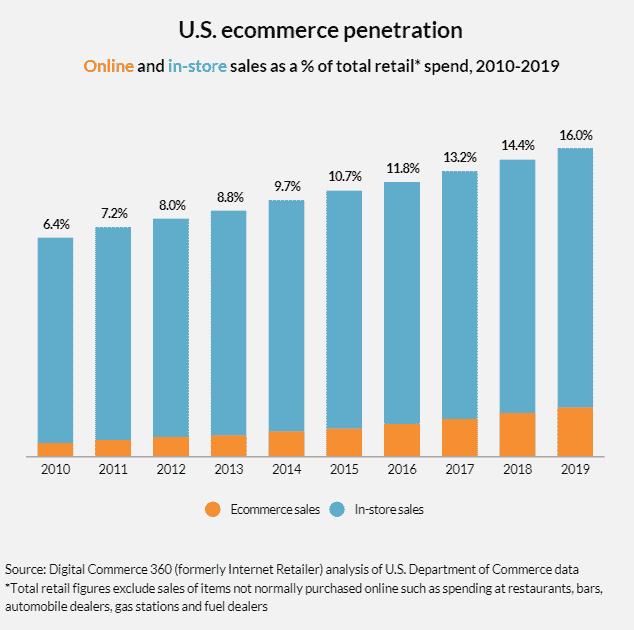

# “支付”的发展将支撑下一代企业

> 原文：<https://medium.datadriveninvestor.com/evolution-of-payments-will-bolster-next-generation-businesses-f670ff793f80?source=collection_archive---------13----------------------->

人类一直处于发展的旅程中。当我们出生在几千年的发明和改进中时，我们很容易把周围的事情视为理所当然——好像它们一直存在一样。我们很少考虑到我们走到今天这一步所经历的变化。

举个例子，语言的创造以及它如何在人类历史上开辟了一条新的道路。它如何导致交流、合作、社区和组织。从那里，人们组织了一套学说，并提出了讲故事，这是创造宗教和许多结构性支柱如法律的先驱。然后出现了艺术和书面语言，允许记录故事/信息，从而第一次实现了信息的标准化传播。然后是印刷术，然后是广播电视，然后是电脑和互联网，然后是手机…..你明白了！

同样，我们今天生活中的许多其他事物都可以追溯到永远改变了历史进程的起源和里程碑……工具、科学发现，应有尽有。我想在这篇文章中强调的一点是，商业的起源和“经济”概念的前身，这一点我们几乎从未想过。**钱。**

# **钱**

我们忘记了曾经有人必须发明一种转移价值的方法。这种机制必须反映出某人对社会的贡献(也许是食物，或者是他们制造的工具)，并且可以换成另一种有价值的物品或服务。最初有几种货币存在，比如盐、贝壳，最明显的是黄金。正是这个标准第一次在商业中提供了“流动性”,因此也是经济的第一个概念。当然，今天我们最熟悉的(也许除此之外什么都不知道)商业是使用国家控制的法定货币。以至于我们称之为“货币”，好像法定货币之外的其他形式不会落入那个桶里。

 [## 2020 年最佳短期投资选择精选资源|数据驱动型投资者

### 投资是增加你净财富的一个好方法。如果你通过遵循一个严格的…

www.datadriveninvestor.com](https://www.datadriveninvestor.com/2020/03/28/handpicked-resources-for-the-best-short-term-investment-options-of-2020/) 

但是有一件相关的事情人们更少关注，那就是用来促进金钱的*运动*的技术。一个明显的例子是硬币。罗马帝国时期使用银币，因为它们(相对)容易储存和携带，稀缺，难以复制等。

为了给经济增长提供更多的机会，第一批银行被引入并由国家控制。他们想出了一种会计形式(复式记账)来记录谁拥有什么，谁欠谁，还剩多少硬币，还有多少硬币要收。后来，基本上被称为“IOU”的东西被创造出来，这导致了更复杂的借贷、银行、金融系统、纸币等形式。

几千年来，银行发生了巨大的变化，围绕融资和支付的金融产品也随之发展。第一次引入了“支票”,这样人们就不必总是携带大量现金……自动取款机的出现是为了人们可以随时取用存在银行里的钱。突然间，这些先进的形式提供了一个销售点系统，这使得各种各样的商业如餐馆和商店以及医疗服务按需提供成为可能。

因此，不仅仅是“货币”本身，还有围绕如何兑换货币的创新，都开启了新的可能性和经济繁荣。

# **现代**

今天，世界上很大一部分地区享受着电子支付方式。信用卡和借记卡不仅消除了对现金的需求，还允许我们以借贷的形式消费，允许我们获得奖励，允许我们跟踪我们的消费，允许我们对欺诈活动的指控提出异议。当电视出现时，它催生了家庭购物和电视购物帝国。它也是“信用评分”系统的基础——一种评估提供贷款的信誉和风险的新方法。我不知道如何准确地量化消费者支出加速或经济扩张有多少是由于信用卡的出现，但我保证这是很多。如果有人有这方面的数据，请分享。

Pets.com 被认为是互联网泡沫的典型代表，批评者指出，现在还“为时过早”，因为当时互联网太笨重，没有得到足够广泛的采用，并且有“不安全”的名声没错，但它遗漏了一个关键点，那就是缺乏可靠、便捷的结账体验。曾经有一段时间，网上购物是如此的笨重，以至于你需要打电话给你的银行，并与代表交谈，以促进各种交易。可怕的客户体验。

Stripe 和 PayPal 的出现彻底改变了电子商务。亚马逊显然是电子商务的首页，但 Stripe 可以说对该行业的发展有着更大的影响，因为它创建了一个网站和应用插件，可以即时连接到信用卡和银行系统。这是一个简单却改变游戏规则的发明，为在线销售的爆炸性增长奠定了基础。你可能会说，如果条纹存在，那么 Pets.com 可能会幸存下来。

今天，任何人都可以在网上创业。事实上，一些最知名的品牌，如 Warby Parker 和 Bonobos，都是从数字原生开始的。全球 Ubers 和 AirBnBs 的整个“零工经济”也依赖于这些支付轨道。最重要的是，我们不能忘记在线支付如何让订阅模式变得容易，这是这个国家每个千禧一代都熟悉的。来自各种零售订阅箱，如 Blue 围裙、FabFitFun、Birchbox、Stickfix 等。到 Spotify、网飞、Youtube 等数字流媒体服务，订阅模式让这些业务成为可能。没有支付方面的创新，这些业务就无法存在或发展。

# **未来**

那么，货币流动的下一步是什么？这些创新将如何改变消费者行为和商业决策？

尽管今天的互联网很棒，但最大的疏忽之一是缺乏核心支付层。它是为传输信息和数据而优化的，但不是为钱。这就是为什么电子邮件在几十年前就存在了，并且可以立即工作，但在线支付需要更长的时间来开发，而且仍然相对缓慢/昂贵——我们必须为传统银行系统构建应用层和 API 来促进这些交易。

相比之下，这是一个具有内在“资金转移协议”的互联网的样子。首先，它甚至允许那些没有银行账户的人通过互联网进行交易。商家不需要依赖使用信用卡或银行电汇或 Venmo 的人，而是可以直接将资金存入他们的数字钱包。这个支付层的无权限和不可变的性质将保证资金被接收，并且不会被退回。这将使尼日利亚人从瑞士购买产品变得极其容易，而不必接触任何菲亚特或任何银行。

**但更有趣的是对数字原生产品的微支付** *。*以我们消费电视等直播内容的方式为例。我们向康卡斯特(Comcast)或 Spectrum 等提供商支付内容交付费用，但内容本身是由广告付费的。你的注意力和未来在消费产品上的花费是导演和制片人创造这些艺术作品的原因。*这不仅给这些内容的集中发行商(电视网络)带来了很大的权力，也给与这些网络有关系的工作室带来了很大的权力。*用户生成的内容很难面向大众。

然后出现了 YouTube、Twitch、Vine 和抖音，它们都允许观众直接消费用户生成的内容，但在这种模式下，分发平台仍然依赖广告来提供服务。消费者放弃了他们的个人数据，允许分销商利用这些数据并从中获利，而内容创作者只看到其中的一小部分价值。另外，不得不观看广告(尤其是在视频中间)是一种可怕的用户体验，但我们没有任何其他选择。

**相反，如果我们有办法为内容微支付，无论是世界上的任何人，无论在世界上的任何地方，直接支付给创作者，并让他/她实现 99%的价值，而不需要分销商提成，会怎么样？**这就像 YouTube 是一个没有成本的非营利组织。这就是像 [LivePeer](https://livepeer.org/) 这样的项目试图实现的目标。除了提供一个基于市场原则的广播网络，其中提供商赚取代币，用户按使用付费，内容创建者也可以通过代币直接由消费者支付。在处理零头时，这种微观经济学水平根本无法由现有的支付基础设施(如信用卡和 paypal)轻松支持。

这并不是说广告不能存在。有一些模式，像 [Vevue](https://www.vevue.com/) ，用户可以选择观看广告，并为他们的关注付费。这样，需要推销产品的商家仍然可以利用广告渠道，同时仍然给消费者一个选择。这基本上是 Youtube 付费订阅相对于带广告观看的一个更动态、更高效的版本。

除了支持新的业务类型，这还具有更广泛的意义。因为内容创作者不需要依赖广告商来获得收入，所以没有动力去创作纯粹是点击诱饵或最大化以获得最高指标的内容。小费功能可以确保消费者可以用他们更喜欢的内容来奖励那些人，并直接奖励内容创作者，而不是同时奖励广告商或平台运营商。

或者，以[氦](https://www.helium.com/)为例。他们是一家无线提供商，但对于像物联网设备这样的小型机器来说，其无线需求与手机或电脑等设备完全不同，因此需要自己不同的无线网络。他们利用地图上所有人部署的热点来提供这种覆盖。购买这些热点来运行它并提供覆盖的人受到激励这样做，因为他们可以为他们的贡献获得“氦令牌”。为了让物联网设备通过网络访问和发送数据，他们必须用氦令牌支付，他们需要从氦令牌所有者那里购买氦令牌。**通过 API 和算法以及机器对机器通信发生的这些微交易的规模可以是几分之一美分，一次数百万笔交易。这种水平的吞吐量和微交易在使用当前的支付方式如信用卡时是不可能的。** 而且肯定不能实现即时点对点的价值传递。没有一家公司能够利用现有的支付轨道来促进这种程度的分散商务。

我们可以了解更多令人兴奋和充满希望的例子，比如像 [Storj](https://storj.io/) 这样的文件存储共享(即分散式 DropBox)，或者像[假人](https://golem.network/)和 [SONM](https://sonm.com/) 这样的 CPU 共享(比如分散式 AWS)。甚至还有一个基于区块链的概念[‘三重分录会计’](https://www.quora.com/What-is-Triple-Ledger-Accounting)我还不够精通，无法详细说明，但它有着巨大的潜力，可以用一个更加准确和防欺诈的系统来扰乱当今的会计和审计方法。成千上万的这些想法将会涌现出来，但很可能只有少数能够存活下来。但我认为，公平地说，我们不能忽视这些创新将对出现的企业类型产生的潜在影响。

# **结论**

他们说，世界上最好的技术都有一个共同点:人们对其内部运作知之甚少，但却将其作为日常生活中不可或缺的一部分。想想普通人对 TCP/IP 知之甚少却使用互联网，或者信用卡如何工作却仍然每天刷卡。

同样，总有一天，通过加密保护的网络/协议进行价值转移将成为常态，交易将如此无缝、自动地发生，一个漂亮的 U/I 层面向用户，甚至没有人会意识到背后有一项神奇的技术。在那个世界里，我们将会看到难以想象的业务、独特的收入模式和以前无法获得的服务出现。最重要的是，我们将拥有卓越的透明度、准确性和问责制，这些都是我们的财务系统固有的基础。这些核心支柱将为未来的下一代企业奠定基础。