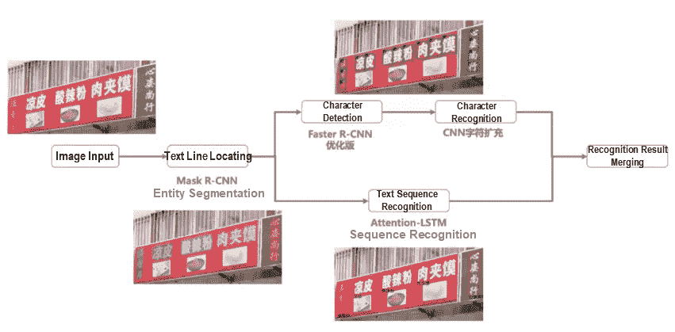
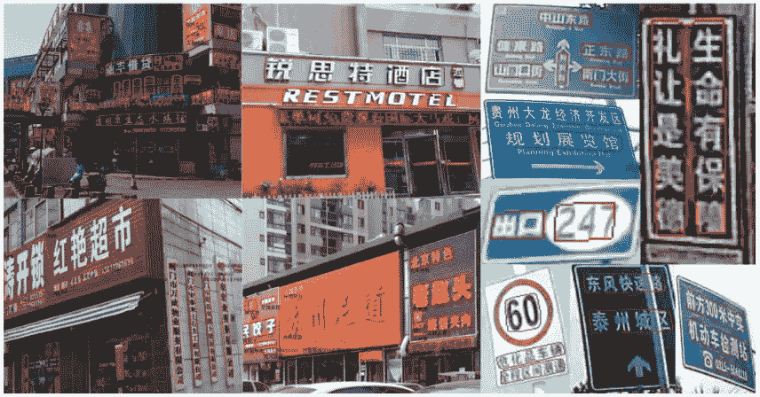
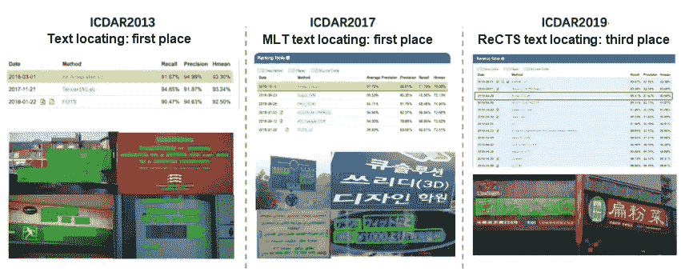
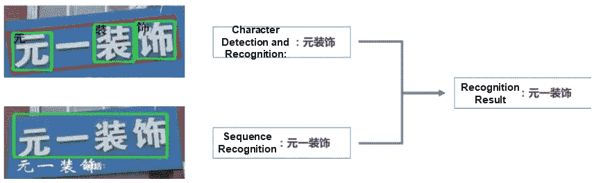
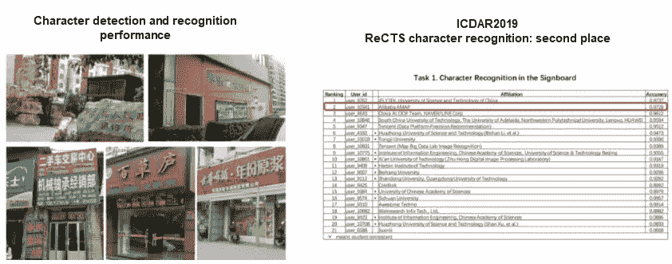
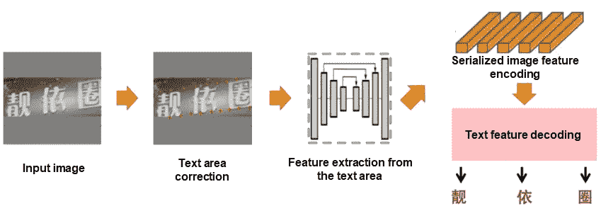
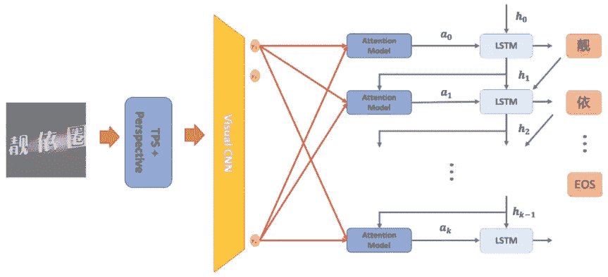
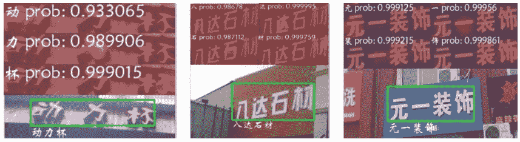
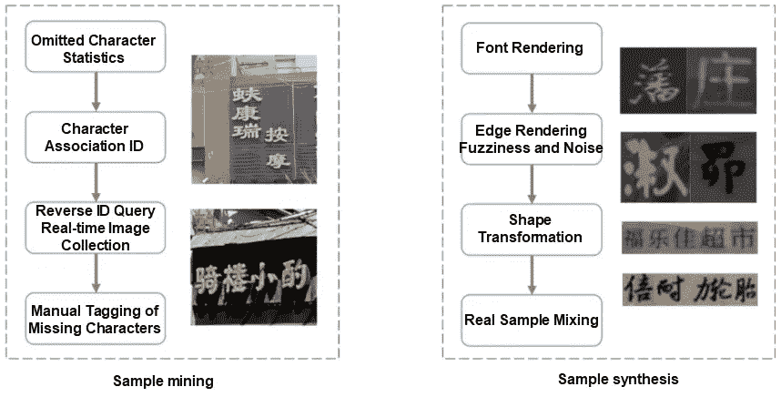

# AMAP 数据生产中文本识别的演变

> 原文：<https://medium.datadriveninvestor.com/evolution-of-text-recognition-in-amap-data-production-b69733253651?source=collection_archive---------32----------------------->

*用* [*阿里云 2020 双 11 大卖*](https://www.alibabacloud.com/campaign/singles-day-double-11-2020) *加紧你的业务数字化！获取新用户优惠券，探索超过 16 种免费试用、30 多种畅销产品和 6 多种解决方案，满足您的所有需求！*

*由隋寿*

AMAP 提供了丰富而准确的地图数据，极大地改善了我们的旅行体验。它利用图像识别技术自动生产数据，以改变传统的地图数据收集和生产过程。场景文本识别是图像识别技术的关键部分。文本识别技术旨在以全面、准确和快速的方式识别各种复杂场景中的文本，例如商业招牌上的风格化文本、各种徽标、复杂或部分遮挡背景下的文本以及低质量图像中的文本。本文分为以下几个部分:

1)文本识别技术在 AMAP 数据生产流程中的发展和实践
2)专有文本识别算法的开发和框架
3)未来发展和挑战

# 1)背景

作为一款拥有超过 1 亿日活跃用户(dau)的热门应用，AMAP 每天都提供各种各样的查询、定位和导航服务。地图数据的丰富性和准确性决定了用户体验的质量。数据通常由数据收集设备收集，并且收集的数据被手动编辑和发布以向用户提供期望的地图数据。数据更新缓慢，数据处理成本高。为了解决这个问题，AMAP 使用图像识别技术直接识别收集数据中的各种地图数据元素。然后，机器自动产生地图数据。AMAP 以高频率从现实世界中收集数据，并使用图像算法功能从收集的大量图像库中自动检测和识别每个地图元素的内容和位置。这产生了可以实时更新的基本地图数据。兴趣点(POI)数据和道路数据是两种重要的基础地图数据，可用于创建 AMAP 的底图，其中包含用户行为和商家的动态数据。

图像识别能力决定了自动化数据生产的效率。STR 在这一过程中起着重要的作用。STR 用于以全面、准确和快速的方式从存储在不同设备集合中的图像信息中检索文本信息。在 POI 场景中，识别算法必须能够从街道上的新商店中识别尽可能多的文本信息，并产生准确率高于 99%的结果，以便能够自动生成 POI 名称。至于道路数据的自动生成，识别算法必须能够检测道路标志的细微变化，并每天处理大量返回的数据，以便及时更新道路信息，如速度限制和方向。AMAP 使用 STR 算法处理来自各种收集来源和环境的更复杂的图像。示例:

*   **多样的文字、字体、版式:**商业招牌上的程式化文字和各种 logos 采用了各种版式。
*   **复杂的文本背景:**文本可能出现在复杂或大部分被遮挡的背景中，有复杂的照明和其他干扰。
*   **多样的图像来源:**图像由低成本的众包设备收集，参数各异。捕获的图像质量很低，容易出现一系列问题，如歪斜、失焦和抖动。

随着 AMAP 业务的快速增长，现有的文本识别技术已经无法应对基于算法的识别的难度和识别需求的复杂性。因此，AMAP 独立开发并迭代了 STR 算法，为多种产品提供识别能力。

# STR 技术的发展和实践

## STR 算法的发展

STR 已经从传统的图像算法发展到深度学习算法，在 2012 年实现了转型。

**传统图像算法**

在 2012 年之前，主流的文本识别算法依赖于成像技术和统计机器学习方法。传统的文本识别方法可以分为三个步骤:图像预处理、文本识别和后处理。

*   **图像预处理:**该步骤定位并校正文本，并将文本分割成字符。关键技术包括连通分量分析(CCA)、最大稳定极值区域(MSER)、仿射变换、图像阈值和投影分析。
*   **文本识别:**该步骤通过提取手动设计的特征，如方向梯度直方图(HOG)，或通过卷积神经网络(CNN)提取特征，来识别分割的文本。然后，提取的特征由机器学习分类器识别，例如支持向量机(SVM)。
*   **后处理**:该步骤使用语言模型根据规则对识别结果进行修正。

传统的文本识别方法在简单的场景中表现良好。然而，独立设计每个模块的参数以适应不同的场景是很麻烦的。此外，很难设计出对不同复杂场景具有高度适应性的模型。

**深度学习算法**

随着深度学习在 2012 年开始广泛应用于计算机视觉，文本识别开始使用深度学习算法。文本识别框架通过深度学习逐渐精简。两种文本识别解决方案被广泛使用:用于文本行检测和文本识别的两阶段解决方案，以及端到端文本识别解决方案。

**1)文本行检测和文本识别的两阶段解决方案**

该解决方案定位文本行，然后识别其内容。文本行检测方法包括文本框回归[1]，分割或实例分割[2]，以及回归和分割的组合[3]。文本行检测已经从检测多方向矩形内的文本发展到多边形[2]。现在，我们正在研究如何检测任意形状的文本行。文本识别已经从字符检测和识别发展到文本序列识别。连接主义时间分类[4]和注意机制[5]是文本序列识别的两种主要方法。

**2)端到端文本识别解决方案**

该方案使用一个模型完成文本行检测和文本识别两项任务，实时性高。这两个任务由同一个模型共同训练，以便它们可以相互提高彼此的表现。

## 文本识别框架

多年来，AMAP 已经多次升级其文本识别技术。基于全卷积网络(FCN)的分割以及字符检测和识别已经发展到基于实例分割的检测以及字符检测和识别与序列识别的组合。在实际的业务场景中，AMAP 没有使用学术界广泛应用的端到端识别框架。端到端框架需要足够的高质量文本行和标记数据来产生识别结果。然而，标记成本很高，并且没有足够的合成虚拟数据来取代真实数据。因此，端到端框架分为文本检测模型和文本识别模型，分别进行优化。

如下图所示，AMAP 使用的算法框架由文本行检测、字符检测和识别以及序列识别模块组成。文本行检测模块检测目标文本区域，并预测文本掩码以校正文本失真，例如垂直文本、变形文本和弯曲文本。序列识别模块识别检测到的文本区域中的文本。当序列识别模块在识别风格化文本和具有异常对齐的文本方面表现不佳时，字符检测和识别模块补充序列识别模块。

Text recognition framework

## 文本行检测

自然场景中的文字区域变化多样，不规则，文字大小不一，成像角度和质量不可控。从不同来源收集的图像上的文本具有不同的大小和不同程度的模糊和障碍。为了解决实际问题，我们进行了一个实验来优化两阶段实例分割模型。

文本行检测模型可以预测文本区域分割的结果和文本行的位置信息。该模型与深度卷积网络(DCN)集成，以在不同方向检索文本的特征，并增加掩码分支的特征大小。该模型还与 atrous 空间金字塔池(ASPP)模块集成，以提高文本区域分割的准确性。基于文本分割结果，该模型生成最小外凸包以供后续识别过程使用。模型的一般性能可以通过在线数据扩充方法来提高，该方法用于在训练过程中旋转、翻转和混合数据。下图显示了文本检测结果的示例。

Examples of text detection results

AMAP 已经广泛使用文本检测功能来生成 POI 和道路数据。该文本检测模型在 icdar 2013(2018 年 3 月)、icdar 2017-MLT(2018 年 10 月)和 ICDAR2019-ReCTS 公共数据集上进行了验证，表现出了优异的性能。

Results of a text line detection contest

## 文本识别

如“背景”部分所述，只有在满足两个要求时，文本识别结果才能用于 POI 和道路数据的自动生成:一个要求是尽可能完整地识别文本行内容。另一个要求是识别算法计算结果的高精度(超过 99%的精度)部分。文本识别的结果通常基于字符进行评估。但是，AMAP 侧重于文本行识别的结果，因此我们根据实际业务情况定义了以下文本识别评估标准:

*   **文本行识别全正确率:**在所有文本行中，正确识别文本且阅读顺序正确的文本行的比例。
*   **文本行识别的高置信度:**在所有文本行中被高置信度(准确率 99%以上)识别的文本行的比例。

完全正确率评估识别 POI 和道路名称的能力。高置信度评估识别通过算法以高准确度识别的文本行的能力。这两种能力与我们的业务密切相关。我们研究了主流文本识别算法，以找到能够满足我们业务需求的算法。

 [## 医生管理工作量增加时的深度学习|数据驱动的投资者

### 行政工作量是我们这个时代大多数医生所经历的众多负担之一。医生，尤其是…

www.datadriveninvestor.com](https://www.datadriveninvestor.com/2020/11/27/deep-learning-amid-increased-physician-administrative-workload/) 

有两种主要的文本识别方法。一个是字符检测识别，一个是序列识别。易于组织用于字符检测和识别的训练样本和训练模型，不受文本布局的影响。然而，这种方法在检测和识别具有上下或左右结构的汉字时可能会产生错误。序列识别方法包括更多的上下文信息，并且不需要字符的精确位置信息。这减少了由于汉字的特殊结构而造成的识别损失。然而，这种方法在复杂的文本布局中表现不佳，比如自顶向下和从左到右的布局。结合这两种方法可以提高文本识别的准确性。

Results of recognition that combines character detection and recognition with sequence recognition

**1)字符检测和识别**

字符检测使用更快的 R-CNN 方法，并产生满足业务需求的结果。字符识别使用 SENet 结构，支持超过 7000 个中英文字符和数字。在字符识别模型中，我们基于身份映射设计和 MobileNetV2 架构优化了跳过连接和激活功能，并在训练过程中添加了随机样本变化，以显著提高文本识别能力。2019 年 4 月，我们的文本识别算法在 ICDAR2019-ReCTS 大赛中排名第二，准确率仅比第一名的完成者低 0.09%。

Character detection and recognition performance

**2)文本序列识别**

近年来发展起来的主流文本序列识别算法，如 Aster 和 DTRT，按照任务可以分为四类:文本区域校正、文本区域特征提取、序列化图像特征编码和文本特征解码。文本区域校正和文本区域特征提取算法将变形的文本行校正成水平文本行并提取特征。这允许识别算法更容易地识别文本。序列化的图像特征编码和文本特征解码算法，它们形成了编码器-解码器结构，基于图像纹理识别文本，并添加强上下文语义信息来补充识别结果。

Universal sequence recognition structure

AMAP 经常需要识别现实世界中的中短文本。这种文本通常具有严重的几何变形、扭曲和模糊。为了通过单一模型识别多方向文本，我们使用 TPS-Inception-BiLSTM-Attention 结构进行序列识别。下图显示了文本序列识别模型的结构。

Structure of the text sequence recognition model

在检测到文本行之后，该模型基于角点执行文本行的透视变换，并使用薄板样条(TPS)来获得水平和垂直方向上的文本。然后，该模型将长边缩放到指定的长度，并将文本填充到灰色背景的正方形图像中。这种预处理方法保持了输入图像的语义完整性，并允许图像在训练和测试过程中在正方形内自由旋转和平移。这有效地提高了弯曲和变形文本的识别性能。将预处理后的图像导入 CNN 提取图像特征。通过 BiLSTM 将图像特征编码成序列化特征，然后通过注意力模型对编码后的特征逐一解码，得到预测结果。如下图所示，文本序列识别模型使用注意机制在不同的解码阶段为图像特征分配不同的权重，以便隐式地表达预测字符和特征之间的对齐关系。这使得能够在多个方向上同时预测文本。该模型支持英文字母、一级汉字库和常用繁体中文字库。它对风格化文本和模糊文本都有很好的识别性能。

Sequence recognition performance

**3)样本挖掘和合成**

在地图数据制作中，我们经常会遇到路标上很少见到的地名或者 POI 标牌上很少使用的字符甚至繁体字。因此，要优化文本识别效果，除了模型优化之外，还必须对遗漏字符的样本进行补偿。为此，我们使用真实样本挖掘和人工样本合成。根据我们的业务特点，我们分析数据库中包含很少使用的字符的名称，以反向挖掘可能包含很少使用的字符的图像，并手动标记这些图像。我们还使用图像渲染技术来人工合成文本样本。真实样本和合成样本结合使用，以显著提高文本识别能力。

Sample mining and synthesis solution

**文本识别技术概述**

通过改进的文本识别算法和许多识别结果的合并，AMAP 的解决方案可以用于各种场景。计算机视觉是文本识别领域的一项关键技术，广泛应用于 AMAP 数据的自动化生产。在某些收集场景中，机器会自动生成所有数据。机器自动产生和发布 70%以上的 POI 数据，90%以上的道路数据自动更新。这减少了数据处理工程师所需的技能，从而降低了培训成本和管理费用。

# 3)未来发展和挑战

AMAP 使用的 STR 方法基于深度学习。与其他语言相比，汉语包含更多结构复杂的字符。这就要求 AMAP 产生更多样的地图数据，以产生令人满意的结果，并使数据不足成为我们的主要困难。此外，模糊图像往往影响自动识别的性能和数据生产的效率。AMAP 必须找到识别和处理模糊图像的方法。以下部分将从数据和模型设计的角度解释如何解决数据不足和模糊图像识别的问题，以及如何提高文本识别能力。

## 基于数据的方法

数据很重要。图像领域的一个普遍研究课题是，当我们没有足够的人力和资源进行标记时，如何自动扩展数据规模。一种方法是通过数据扩充来扩大数据样本规模。谷歌 DeepMind 在 2019 年 CVPR 上提出了自动增强。自动增强是一种用于通过增强学习来搜索最佳数据增强策略的算法。另一种方法是数据集成。例如，由阿里巴巴 DAMO 研究院开发的 SwapText 通过样式转换来产生数据。

## 基于模型的方法

**模糊文本识别**

STR 技术经常遇到由于图像模糊而导致的字符遗漏和识别失败的问题。在学术界，超分辨率是模糊图像识别的主要方法之一。TextSR 使用超分辨率生成对抗网络(SRGAN)将 SR 应用于文本，以从模糊文本图像恢复高分辨率(HR)图像。根据首尔国立大学和麻省大学在论文 Better to Follow 中提供的解释，与 TextSR 不同，GAN 在将 SR 应用于要素时，并不直接创建图像，而是将 SR 网络与检测网络集成在一起。GAN 产生的结果类似于 TextSR 的结果，但由于它使用端到端模式，因此显著提高了计算效率。

**理解文本语义**

当我们试图理解复杂文本时，我们通常会参考先前的语义信息。随着近年来自然语言处理技术的发展，计算机具有了获取语义信息的能力。参考我们理解复杂文本的方式，如何基于先验语义信息和图像之间的关系来提高文本识别能力是一个值得研究的问题。例如，在 CVPR 2020 大会上，SEED 提出将语言模型添加到识别模型中，通过对图像特征和语义特征的综合评估来提高文本识别能力。

**其他发展**

从云到终端的移动是文本识别模型发展的另一个趋势。这有助于减少将数据上传到云所产生的流量开销以及云服务器的工作负载。当我们设计云到终端的模型时，我们应该基于对光学字符识别(OCR)算法的研究和优化工作来探索高度准确、轻量级的检测和识别框架的可能性，以便模型可以被压缩成适合终端部署的大小，而没有任何速度损失。

# 原始来源:

 [## AMAP 数据生产中文本识别的演变

### amap _ tech 年 10 月 29 日 1，309 借助阿里云加快您业务的数字化 2020 双 11 大…

www.alibabacloud.com](https://www.alibabacloud.com/blog/evolution-of-text-recognition-in-amap-data-production_596817) 

## 获得专家观点— [订阅 DDI 英特尔](https://datadriveninvestor.com/ddi-intel)