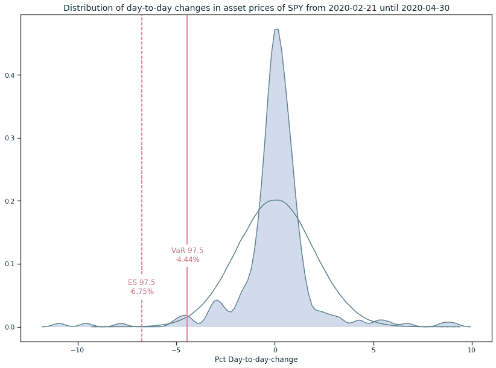
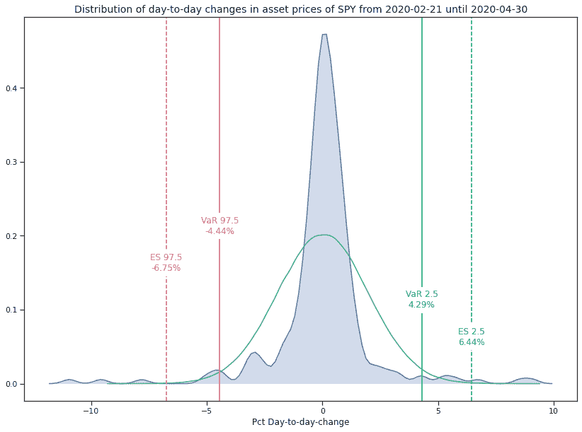
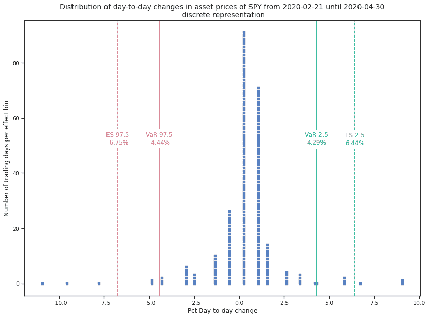
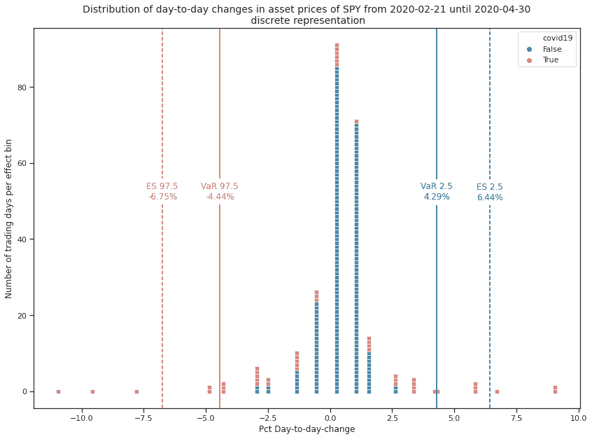
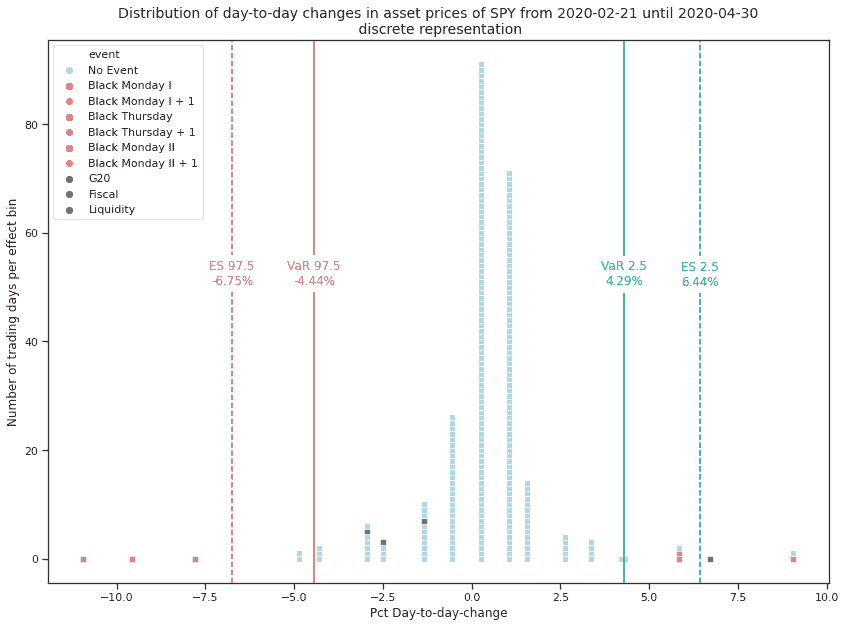

# 发展后 COVID19 金融市场风险管理

> 原文：<https://medium.datadriveninvestor.com/evolving-market-risk-management-e3961dad1df1?source=collection_archive---------10----------------------->

新冠肺炎金融市场的动荡如何显示创新的方式在风险价值和预期短缺。

Photo by [James Pond](https://unsplash.com/@jamesponddotco?utm_source=medium&utm_medium=referral) on [Unsplash](https://unsplash.com?utm_source=medium&utm_medium=referral)

在考虑金融市场风险管理时，最常用的风险度量是**。**

*****什么是风险价值(VaR)？*****

> **风险价值是金融实体或资产组合风险的统计度量。它被定义为在预先定义的置信水平下，在给定的时间范围内预期损失的最大金额。例如，如果 95%的一个月风险值为 100 万美元，则有 95%的把握认为下个月投资组合的损失不会超过 100 万美元。[Risk.net](https://www.risk.net/definition/value-at-risk-var)**

*****什么是预期短缺？*****

> **与更常用的风险价值(VAR)不同，预期短缺是一种对投资组合回报分布尾部形状敏感的风险度量。在给定的置信水平下，通过平均分布中比投资组合的风险值差的所有回报来计算预期短缺。例如，对于 95%的置信水平，通过取最差的 5%情况下的平均回报来计算预期短缺。[Risk.net](https://www.risk.net/definition/expected-shortfall)**

**风险值是由摩根大通在 20 世纪 80 年代末开发的，这个时期受到 1987 年股市崩盘的影响。对银行而言，自 1996 年以来，它成为新巴塞尔协议[中市场风险管理的官方支柱，事件风险管理旨在管理超过阈值的损失。2007 年的全球金融危机表明，有必要考虑 VaR 之外发生的事情，并在其后引入 ES](https://www.bis.org/publ/bcbs119.pdf) [。现在，它在《巴塞尔协议 III》中占据显著地位。](https://www.bis.org/bcbs/publ/d457_inbrief.pdf)**

**定义到此为止，让我们看看它在现实生活中是什么样子的。让我们看看 2019 年 5 月至 2020 年 5 月的标准普尔 500 (SPY)回报分布直方图，从最差(左)到最好(右)。**

****

**Own calculations, data from [Yahoo Finance](http://finance.yahoo.com/)**

**在 97.5%的置信区间，我们得到的 VaR 为-4.44%，ES 为-6.75%。这是总体上的美国金融市场，因此我们会假设一些个股表现更差。**

** [## 使用谷歌搜索趋势预测首次申请失业救济人数|数据驱动的投资者

### 几年来，我的重点一直是使用多种替代数据来预测宏观经济统计数据…

www.datadriveninvestor.com](https://www.datadriveninvestor.com/2020/03/25/using-google-search-trends-to-predict-initial-jobless-claims/) 

现在让我们做一些疯狂的事情，用正 VaR(或奖励价值)标记正胖尾。)的 4.29%和一个 ES(预期成功？)的 6.44%。为什么？请容忍我一会儿。

Own calculations, data from [Yahoo Finance](http://finance.yahoo.com/)

为了更好地理解，我将离散化直方图，所以每个方框是一个交易日。

Own calculations, data from [Yahoo Finance](http://finance.yahoo.com/)

在相关的[维基百科文章](https://en.wikipedia.org/wiki/Value_at_risk)中，指出“正常市场条件”是假设的。在过去的几个月里，人们肯定不会这么说。现在让我们用颜色标注日期，从 2020 年 2 月 20 日开始，[新冠肺炎金融市场动荡开始](https://medium.com/datadriveninvestor/how-covid-19-infected-financial-markets-897f226bb0d0)。

Own calculations, data from [Yahoo Finance](http://finance.yahoo.com/)

令人惊讶的是，我们看到新冠肺炎不仅带来了异常糟糕的交易日，也带来了异常好的交易日！

所以如果我用 VaR 管理我的投资组合，我只看我的肥尾发生了什么。当我看到一个糟糕的结果时，我可能会想尽快卖出。不幸的是，VaR 和 ER 并没有说明全部情况。为此，我们纪念 2020 年 3 月发生的不寻常事件，你可以在这里的[、这里](https://medium.com/datadriveninvestor/how-covid-19-infected-financial-markets-897f226bb0d0)的[和这里](https://medium.com/datadriveninvestor/how-covid-19-infected-financial-markets-turning-point-1128e94d3f7f)[的](https://medium.com/datadriveninvestor/how-covid-19-infected-financial-markets-exchange-rates-3886c003ab77)中找到更多信息。最重要的是:

*   3 月 9 日黑色星期一 I
*   3 月 12 日黑色星期四
*   黑色星期一 II，3 月 16 日。

这是它们在柱状图中的位置:

Own calculations, data from [Yahoo Finance](http://finance.yahoo.com/)

所有*黑色*日都以负胖尾为特征，这是意料之中的。**但是！**接下来的日子都以正胖尾为特征，这里标记为橙色。这讲述了一个非常简单的故事:

在黑色的一天后卖出间谍股票会意识到实际的损失，而忽略反弹。

你的决定会将损失风险转化为实际损失。对特定事件的回报进行聚类可以更好地理解实际情况，但为此我们需要牺牲一个重要方面:对市场价格数据的唯一依赖。

# 我们能从中学到什么？

80 年代末见证了 VaR 的兴起。2000 年代末见证了向 ES 的过渡。新冠肺炎市场的动荡非常清楚地表明，金融市场风险管理需要考虑量化数据中的*背景*，以便在风险下做出审慎的决策。*背景*这里不仅要看定量信息，还要考虑收益或损失实现的环境。如果可以从这种经历中得到什么的话，那么跨时间和上下文的相互依赖就很重要。这种可以通过包含替代数据并使风险模型意识到非量化情况来提供。因此，现在是时候改善金融市场风险管理了，而不是专注于从替代数据中产生阿尔法值。**