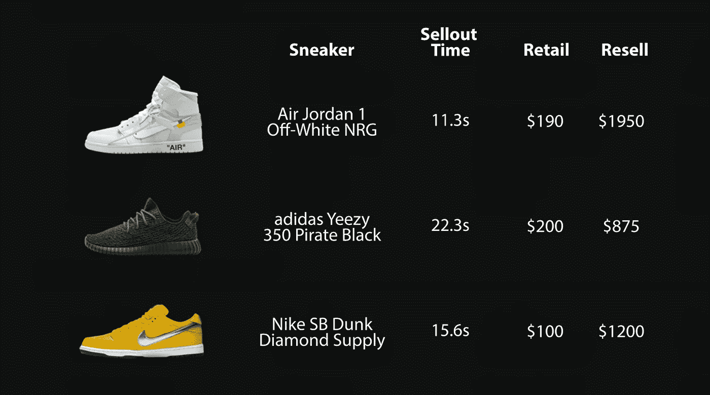
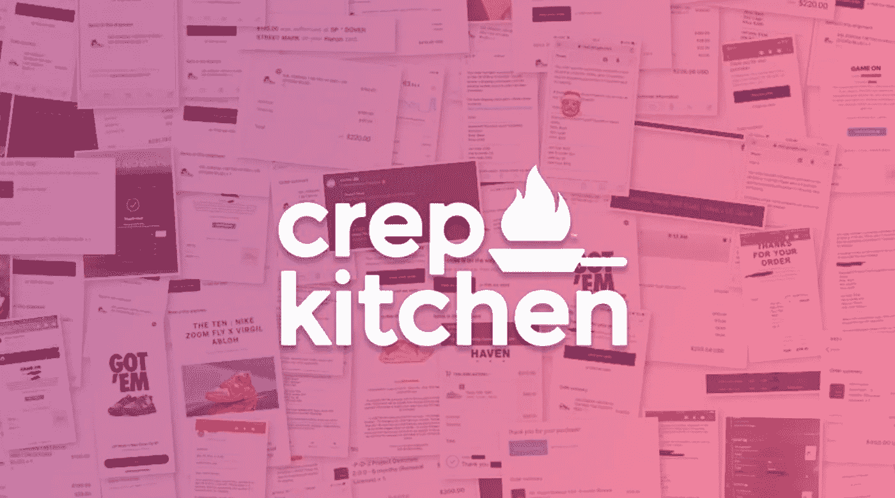
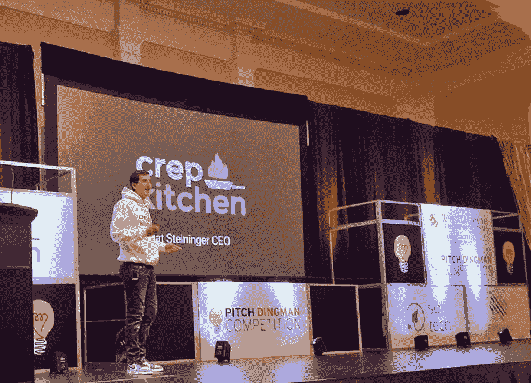

# 检查构建 Web 抓取启动的代码

> 原文：<https://medium.datadriveninvestor.com/examining-the-code-that-built-a-web-scraping-startup-1c7c8f40de13?source=collection_archive---------7----------------------->


## 探索我用来建立一个成功的创业公司的代码和概念，在我们的第一年赚了 9 万多美元

在过去的几十年里，创业公司席卷了整个世界。我们看到公司仅仅通过解决基本的日常问题就在一夜之间扩张到巨大的估值。AirBnb、优步、Robinhood 以及更多的公司都是通过用更简单的解决方案解决简单的问题而起步的。在这篇文章中，我不仅要讨论我的简单解决方案是什么，还要讨论我是如何用我用来创业的代码来创业的。

作为一个精明的青少年，我经常发现自己在任何可能的地方为钱奔波。从在易贝修理坏掉的 Xboxes 到从 GameStop 转售老式游戏，我不断发现自己遵循着古老的格言*低买高卖*。

## 问题是

现在插入限量版运动鞋和服装的世界，在那里**的转售利润是零售利润的 2 到 10 倍。这是因为在线商店经常发布非常受欢迎的产品，而且数量有限。然后，紧接着，那些同样的商品会在第三方平台上以更高的价格转售给那些不能及时购买的人。**



Example of the reselling market with sellout times

毫无疑问，像我这样聪明的孩子会发现自己卷入了这种经典形式的套利交易。但是还有一个迫在眉睫的问题，发布的商品经常会销售一空，然后出人意料地重新进货，尤其是在我们有机会结账之前。古老的解决方案是无意识地刷新页面，但是如果有更好、更省时的解决方案呢？

## 解决方案

进入我的公司 crepkitchen，它通过使用非常基础的**网页抓取和自动化**解决了这个问题。事实上，网络抓取最近已经成为大多数公司用来收集竞争、产品改进数据的宝贵资源，在我们的情况下**通知用户关于电子商务商店库存的信息**。



Promotional image of all our customers’ successful order confirmations in the background

解决办法相当简单。**用户在网上商店查看甚至购买产品的每一个动作****都可以很容易地自动化**。在本文中，我将提供我用来帮助建立我的公司的两个事情的非常简单的代码。

[](https://www.datadriveninvestor.com/2020/12/07/name-matching-techniques-with-python/) [## 使用 Python |数据驱动投资者的名称匹配技术

### 我们确实面临很多情况，我们必须匹配一个有很多变体的单词。这可能是因为错别字…

www.datadriveninvestor.com](https://www.datadriveninvestor.com/2020/12/07/name-matching-techniques-with-python/) 

为了增加这一潜在解决方案的背景和规模，crepkitchen 通过解决这一具体问题，每年创造超过**90，000 美元的利润**。为了更多地了解这种商业模式，[我在马里兰大学的一次比赛中做了一个简短的商业演讲](https://www.youtube.com/watch?v=z3y2wTnsv94&feature=youtu.be&t=924)，其他类似的链接可以在[这里](https://mathewsteininger.com/#crepkitchen)找到。最终，我卖掉了一些更大的技术和资源，所以公司不存在了，但这仍然是一次宝贵的经历。



Me giving a pitch at my university

# 网页抓取代码

首先，我将使用 [Python](https://requests.readthedocs.io/en/master/) ，因为大量的框架和库实现起来非常简单。首先，我们希望**模拟一个用户实际访问网站查看一个特定的产品**并保存 HTML，例如[这个示例产品](https://mathewsteininger.com/sample-product)。

```
import requests
request = requests.get('https://mathewsteininger.com/sample-product')
html = request.content
```

然后我们可以使用 [BeautifulSoup](https://www.crummy.com/software/BeautifulSoup/bs4/doc/) 来获取我们想要的项目的**特定 HTML 标签**。这里将是网站的**确切区域，让用户知道某个商品是否有货**(价格也可以是监控的内容)。

```
soup = BeautifulSoup(html, 'html.parser')
# Monitor this tag to check stock changes
stock = soup.find("button", {"id": "availability"})
# Monitor this tag to check price changes
price = soup.find("div", {"id": "price"})
```

那是大部分的工作！现在我们可以把它打包成一个 while true 语句，添加一些时间延迟和一个通知 API，我们就完成了。

Basic web scraping monitor

## 防止速率限制

如果您现在一直运行代码，您可能会遇到一个叫做**速率限制**的重大问题。See 公司不喜欢他们的大部分网络流量和资源被机器人耗尽，所以他们**开始限制对过于频繁访问网站的 IP 的访问**(他们还检查你的请求头，所以确保设置这些头)。最基本的方法是通过一系列的**旋转代理**来改变你的 IP 地址(同时随机增加你的请求间隔时间)。这里，我们将使用一个名为 [ProxyManager](https://pypi.org/project/proxy-manager/) 的很酷的库，它使我们切换 IP 的能力变得更加容易。

More complex web scraping with proxies and headers

## 实现订单自动化

现在这有点棘手，涉及到使用一个叫做 [Selenium](https://www.selenium.dev) 的酷工具，**允许我们模拟用户**的动作。Selenium 本质上与自动打开 web 浏览器和填写一些预定义的表单是一样的。因此，**一旦我们确定一个商品已经回到库存，我们就触发一个结帐方法**。请记住，这可能违反了商店的*服务条款，*因此，继续操作的风险由您自行承担。在我们的例子中，我将只是模拟导航一个简单的网站。

Using selenium to automate form submissions

# 现在该怎么办？

这就对了，你已经**成功地构建了一系列网页抓取器和自动结账脚本**，它们在处理很快售罄的限量版产品时非常有价值。在你的搜索引擎网络中增加了许多站点后，你很快就会有一个可行的服务，用户愿意为它付费。请记住，虽然我们的网络抓取工具要复杂和健壮得多，但一般来说它们就是这样工作的。

## 最后一点

所有这些工具可能会遇到特定网站的问题，因为这是今天网络抓取的主要问题，为许多网站调整你的脚本。

继续进行，风险自担，并确保查看这里列出的全部代码。此外，查看我的个人网站[了解我创建的更多博客和项目。](https://mathewsteininger.com)

[](https://mathewsteininger.com) [## 马修·斯坦宁格

### 嗨！我是马修，也叫马特，我是一名软件工程师。

mathewsteininger.com](https://mathewsteininger.com) 

## 访问专家视图— [订阅 DDI 英特尔](https://datadriveninvestor.com/ddi-intel)