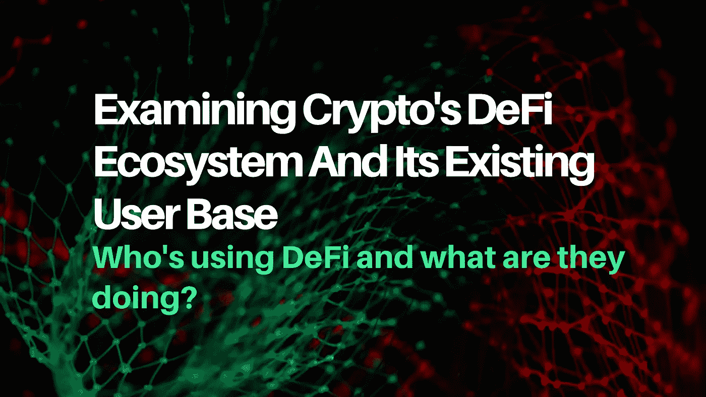
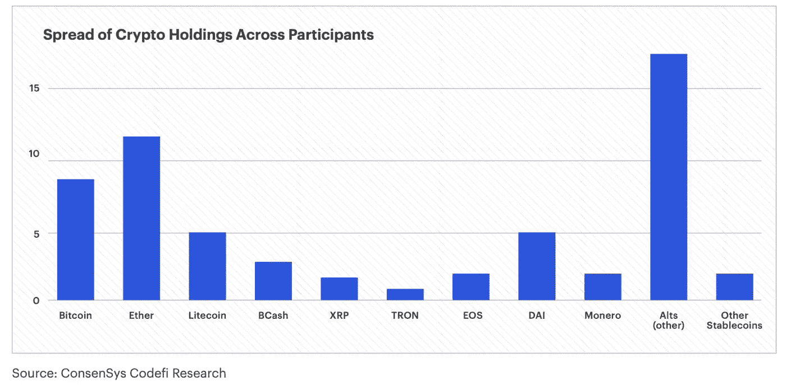
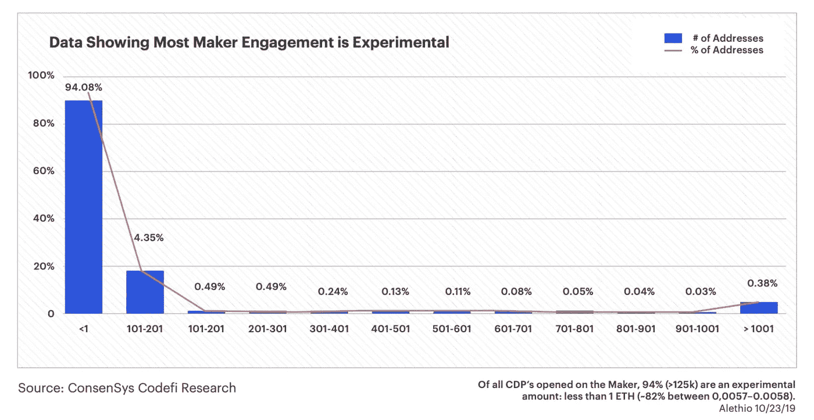
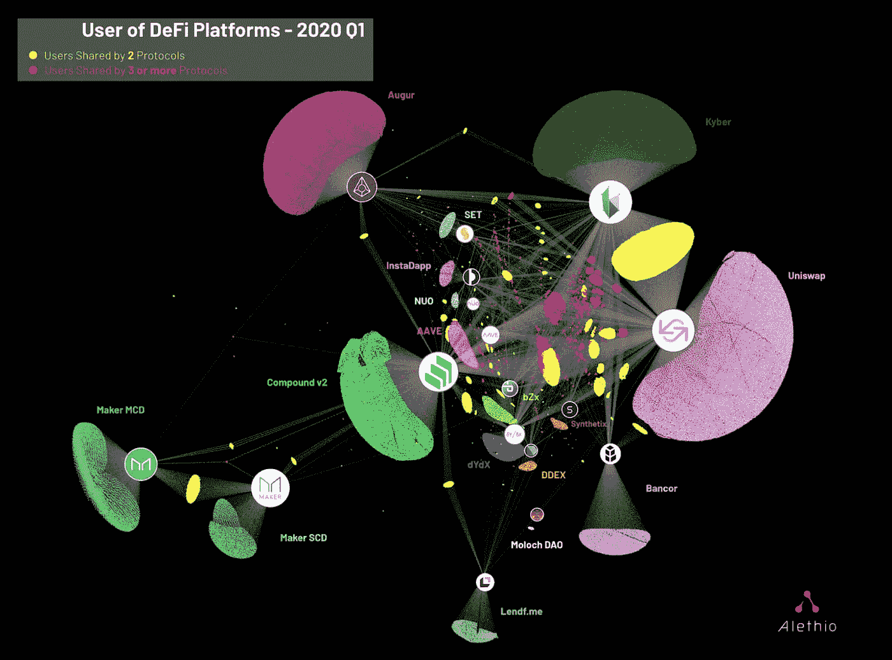
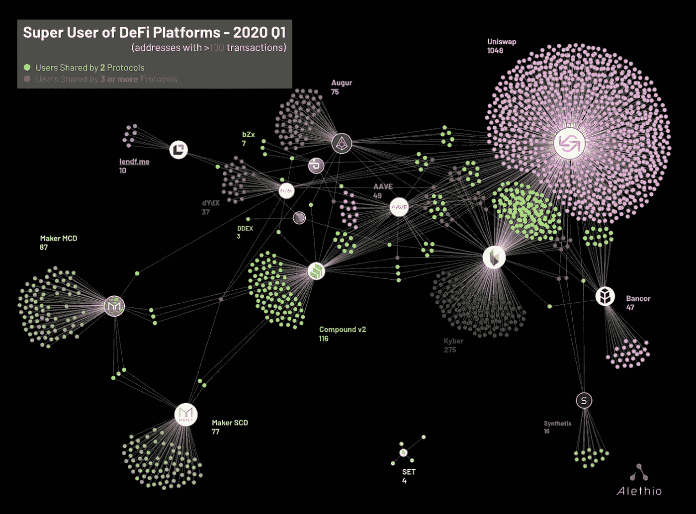
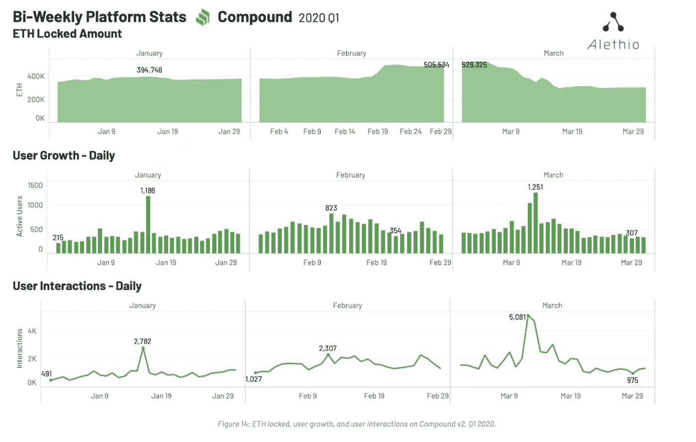
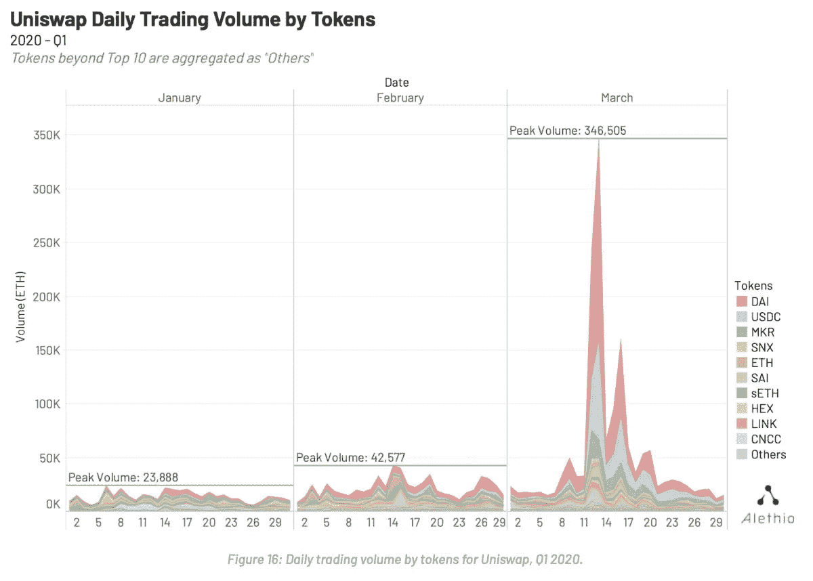

# 检查 DeFi 生态系统及其现有用户群

> 原文：<https://medium.datadriveninvestor.com/examining-the-defi-ecosystem-and-its-existing-user-base-1ab12b923c90?source=collection_archive---------7----------------------->

## 分解 Alethio 的 DeFi 报告和 Consensys DeFi 用户研究报告的要点。

本周以太坊数据分析公司 Alethio 为 DeFi 发布了一份 [Q1 报告。此外，ConsenSys 发布了一份由我和 T4 的 Georgia Rakusen 共同撰写的 T2 DeFi 用户研究报告。而不是让你看冗长的报告。因此，作为对写了这么长报告的忏悔，我决定给你分解一下要点。](https://cdn2.hubspot.net/hubfs/4795067/Alethio%20Defi%20Report%20-%202020.pdf)

 [## 推进 Web 3.0

### 关于 Web 3.0 和加密货币的最佳每周时事通讯，重点关注初创公司、风险投资和开放…

advancingweb3.substack.com](https://advancingweb3.substack.com/) 

# 报告 1: ConsenSys DeFi 用户研究报告

ConsenSys 的用户研究团队对 DeFi 用户进行了随机采访，以评估主要目标:

1.  了解当前零售 defi 用户的世界(他们的行为、需求、烦恼和目标，他们如何选择产品，以及什么可以改善他们的体验)
2.  为建立 DeFi 产品和服务的公司和个人提供建议

这项研究根据一些标准筛选和选择个人，然后进行长时间的访谈，试图确定对所述目标的回答。

为了回答你们所有人心中的第一个问题，这里是这些人报告的他们拥有的加密资产。

老实说**，**从这张图表中最大的收获是，许多人大多被赚钱的潜力所诱惑(喘息！).此外，很明显，普通加密用户不知道如何评估这些资产。如果他们有，他们可能不会投资莱特币、比特币现金、XRP 或各种替代币。这些资产都有广为人知的问题，从缺乏开发者社区(LTC)到操纵供应的集中实体(XRP)。

**注意**:在投资任何加密资产之前，请做好自己的研究。

## 要点 1:定义用户痛点

该报告还指出了当前 DeFi 用户的主要痛点。确定的一些棘手问题包括:

*   不断有新的协议签出
*   控制价格波动
*   保持最高的收益率/借款利率
*   移动硬币的相关费用
*   Onramp 我不得不几次移动我的硬币来赚取利息

作为一名 DeFi 用户，我完全同意，跟上价格波动可能是一个主要的挫折/压力点。确保你的制造商金库保持超额抵押可能是一个压力点。一方面，你可以将你的金库抵押超过 300%，但另一方面，你的抵押率越低，你就可以在复利等贷款协议中投入越多的 dai。

 [## 加密货币行业是死是活？数据驱动的投资者

### 九月初，我们在 X-Order 内部就代币市场的未来进行了一场辩论。有趣的是，我们的观点是…

www.datadriveninvestor.com](https://www.datadriveninvestor.com/2019/12/12/will-the-cryptocurrency-industry-be-dead-or-alive/) 

此外，加密技术的创新速度确实令人震惊。对于那些一周不花几个小时思考加密或阅读加密 Twitter 的人来说，了解戴的最新合成资产或衍生品具有难以置信的挑战性——如果我停不下来，这只会成为一个问题…

## 推回痛点

虽然许多用户报告了费用，并发现最佳收入/借款利率是一个痛点，但我想反驳这一说法。有趣的是，我在加密生态系统中看到的 DeFi 用户往往更懂金融，或者拥有金融背景或之前的个人投资经验。我敢打赌，大多数人不会去寻找回报率最高或费用最低的协议。消费者会牺牲几个基点来换取信任和便利。比特币基地就是一个很好的例子，传统上收取的费用高于北海巨妖或币安等其他交易所。但是，比特币基地仍然是最容易购买加密的地方，并且在加密领域拥有最好的声誉。

早期密码采用者的偏好可能无法反映主流消费者的需求。为了进一步强调这一点，研究中的一些参与者表示，去中心化和隐私不是最重要的特征。

> 虽然所有的参与者都有投资和实现投机收益的愿望，但并不是所有的参与者都表现出对分散化或隐私的强烈偏好。一些用户认为这很重要，但没有说明分散化或隐私的程度改变了他们在 DeFi 应用中的决策过程或选择。”

虽然早期的加密采用者非常关心隐私和去中心化，但普通的 DeFi 用户可能更喜欢注重易用性的中间解决方案。

## 外卖 2: DeFi 仍然是一个实验

用户研究报告的最后一点是，DeFi 的使用在很大程度上是实验性的。报告指出**2019 年开放的所有创客金库中有 94%的人拥有不到 1 乙醚**，这表明大多数人正在试验这些协议，而不是实际上使用这些 DeFi 应用程序作为储蓄账户。因此，虽然 DeFi 协议中锁定的乙醚量超过了数亿美元，但重要的是要看到实际的用户需求仍然非常低。

# 报告 2:阿莱蒂奥·迪菲报告 Q1

Alethio 的 DeFi 报告充斥着关于 DeFi 生态系统的图表和统计数据。在 Q1 2020 期间，有超过 80，000 个独特的地址与以太坊 DeFi 协议进行了交互。

## 要点 1:可视化 DeFi 生态系统

下面是我最喜欢的一个来自 Alethio 的可视化例子，它真实地展示了 DeFi 协议的可组合性。每个单独的点代表一个以太坊地址，与一个特定的协议交互。更有趣的是，黄色和红色的点显示了与多个协议交互的以太坊地址之间的关系。

Kyber 和 Uniswap (10，955 个用户)显然是两个协议的用户之间关系最强的。还值得注意的是，化合物和 Uniswap 与 DeFi 用户的双重关系。

红点之间关系最密切的似乎是凯博、AAVE 和 Uniswap。这很有趣，有几个原因。首先，AAVE 是一种相对较新的协议，它之所以获得关注，是因为它推出了闪贷产品，让个人能够借钱，并在同一笔交易中偿还。

上图中最后一个有趣的地方是，似乎有一小部分人在使用 Maker Vaults 和 Compound，这意味着 Compound 吸引了更多的用户，他们只是购买(通过 Uniswap 或 Kyber)和存放 Dai，而不是创建(通过 Maker)和存放 Dai。

## 要点 2:调查 DeFi 超级用户

Alethio 进一步细分了 DeFi 用户生态系统，以显示“超级用户”，即在过去三个月内完成超过 100 笔交易的个人。Alethio 的报告确定了 1，585 名超级用户，其中大多数都在使用 Uniswap (1048 名用户)和 Kyber(276 名用户)等交易协议。

剩下 261 个超级用户，这些用户似乎主要使用像 Augur、Maker 和 Compound 这样的协议。对于围绕交易、合成资产、衍生品和赌博等持续投机的协议来说，超级用户是一个不错的指标。这些事件经常发生，因此需要更频繁的交易。在更长的时间范围内(6 个月或 12 个月)，这个指标可能会更有用。

对于为不太频繁的交易设计的协议来说，超级用户度量显然不太有用。例如，普通的创造者或复合用户可能不应该每天都进行交易。

对于那些想学习如何使用这些 DeFi 协议的人，请查看 [DeFiDad 的](https://twitter.com/DeFi_Dad)教程！

## 外卖 3:黑色星期四的影响

Alethio 的大部分报道集中在[黑色星期四](https://medium.com/@whiterabbit_hq/black-thursday-for-makerdao-8-32-million-was-liquidated-for-0-dai-36b83cac56b6)的余波上。基本上每个协议都失去了大量的流动性，用户费率下降到去年的水平。自 3 月 12 日以来，复合体验用户和用户增长显著下降。

令人欣慰的是，Uniswap 能够应对 3 月 12 日和 13 日交易量的大幅上升(超过 345，000 ETH)。

## Alethio Q1 DeFi 报告的最终见解

Alethio 的报告以 2020 年 DeFi 感兴趣的 3 个主题/领域结束。我已经提供了他们的 3 点以及我的意见。

1.  锁定在 DeFi 的 ETH 将重新获得牵引力。

由于 3 月 12 日的事件，DeFi 方案中锁定的乙醚量显著减少。Alethio 团队认为，锁定在 crypto 中的 ETH 将会相对较快地恢复。如果我们的社会不是仍然与全球疫情隔绝，我会完全同意这一点。我认为很大一部分原始量可能会恢复，但目前还不清楚经济衰退是否会增加 DeFi 方案中锁定的 ETH 量。

2.闪贷会扩大。

我完全同意。快速贷款是迄今为止最有趣的加密机制之一。要求零抵押的大额贷款是新鲜且令人兴奋的。会有很多积极和消极的结果。

3.关注 DeFi 保险平台

我相信协议资金的更大保证将有助于吸引更多的用户。如果人们不能 100%确定如果发生不好的事情他们会保留他们的钱，他们就不会把他们一生的积蓄投入以太坊协议。保险可能是达到这种确定程度的最快方式。如果我的密码在化合物，制造商，或另一个协议是美国联邦存款保险公司(FDIC)保险(或密码等效)，我明天会转移出法定现金。

[**Advancing Web 3.0**](https://advancingweb3.substack.com/) 是一份关于加密货币、分散金融( [DeFi](https://consensys.net/blog/news/2019-was-the-year-of-defi-and-why-2020-will-be-too/) )和塑造下一个互联网时代的技术的每周时事通讯。欢迎来到流血边缘。欢迎来到 Web 3。

**关于作者:**我是[梅森·奈斯特伦](https://twitter.com/masonnystrom)，一名作家和有抱负的天使投资人。之前，我在 ConsenSys 公司担任营销人员，主要负责 ConsenSys 公司及其投资组合公司的营销策略。在加入 ConsenSys 之前，我在 Gatecoin 担任业务分析师，这是第一家上市以太币的加密货币交易所，以太坊的本地加密货币。

*所表达的观点、信息和意见仅由作者个人所有，仅供参考，不作为买卖任何证券、加密资产或其他金融产品的建议或投资建议。*