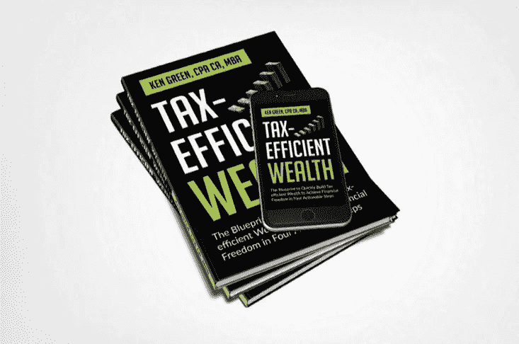

# 用这 5 个步骤像超级明星一样执行

> 原文：<https://medium.datadriveninvestor.com/execute-like-a-superstar-with-these-5-steps-35dbe9f1011f?source=collection_archive---------24----------------------->

## 关键在于你如何执行

> “对我来说，想法除非付诸实施，否则一文不值。他们只是一个乘数。行刑价值百万。”—史蒂夫·乔布斯

Photo by [Massimo Sartirana](https://unsplash.com/@sarti46?utm_source=unsplash&utm_medium=referral&utm_content=creditCopyText) on [Unsplash](https://unsplash.com/s/photos/execution?utm_source=unsplash&utm_medium=referral&utm_content=creditCopyText)

如果你想改变你的生活，你必须执行。

你必须从头脑中的知识转移到你所学的新思想的实施上来。如果你不执行，什么都不会发生。你的生活不会改变。你不会比昨天更好。

为了执行，你必须开发能让执行变得轻松的系统。

你需要一个系统来每天执行你的优先事项。

一个能让你将十年目标分解成年度目标，并最终分解成日常任务的系统。

通过陈述你的实施意图，你实现目标的可能性增加了三倍。你可以使用 3x3 成就系统，通过分解你的:

*   季度三大目标
*   每周三大成果
*   每日三大任务

通过这样做，你可以确保每天至少做一件事来实现你的长期目标。每天向你的大目标迈进一步，你很快就会实现你的人生目标。

注意力分散是大多数人执行力不好的主要原因。

 [## 领导力。赢得|数据驱动型投资者需要更广阔的视角

### 不管他们愿不愿意，领导者都是快速运转的机器中的齿轮，这就要求他们夹住自己的爪子…

www.datadriveninvestor.com](https://www.datadriveninvestor.com/2020/02/07/leadership-it-takes-a-wider-perspective-to-win/) 

分心会偷走你的时间，扰乱你的注意力。因此，要成功实现你的人生目标，你必须非常专注。你必须每天最小化那些不会推进你长远愿景的事情。

保持专注是很有挑战性的，特别是考虑到我们经常有比时间更多的事情要做。

所以，你应该问的是，“什么工作能最好地利用我的时间”，而不是找出如何完成更多工作的方法

> “你可以做任何你想做的事，但不是所有你想做的事。”—大卫·艾伦

那么，如何让执行力变得毫不费力呢？

这里有 5 种方法可以做到这一点:

# 1.找到一个适合你的系统

你必须从开发一个适合你的系统开始。这必须包括写下你的目标，清楚地记录你想要完成的目标。

我使用上面讨论的 3x3 成就系统，发现它极大地提高了我完成对我来说最重要的事情的结果。

# 2.定期评估你是如何花费时间和精力的

通过回顾你的日历，写下事情，记日记来做到这一点。

我使用一页的日程表，每天写下我的前 3 个 90 天目标、前 3 个 30 天目标、前 3 个周目标和前 3 个日常任务。

我发现通过每天写下我的目标，它会一直在我脑海中占据重要位置。它让我保持动力。

每天结束时，我会评估自己是如何度过时间的，并记下哪些地方做得好，哪些地方可以改进。

# 3.让你的日常任务与你的目标相一致

总是问你自己，“有没有一种方法可以帮助我实现长期目标？”如果答案是“是”，那么一切都好。如果答案不是“是”，那就委托、推迟或删除。

使用一页的日程表对我有帮助。当我每天写下我的目标时，它让我保持专注，它帮助我将我的日常任务与我的 30 天和 90 天目标相匹配。

# 4.无情地完成你每天的三大任务

这样做会给你实现长期目标的巨大动力。如果你想好了每天的三大任务，从最难的任务开始，在完成之前什么也不做。然后继续下一个任务。

我发现这很有帮助。它给了我完成重要事情的巨大动力。即使有一天我偏离了轨道，失去了对前三项任务的关注，我仍然设法完成了前三项任务中的至少一两项。

在这里，它有助于非常具体的任务要完成。例如，“完成我的电子书第一章的初稿”。

# 5.投资自我意识

不管对你来说是什么？精神、冥想、书籍——这些东西会帮助你弄清楚你是谁，你要去哪里，为什么它很重要，什么重要，什么不重要。

每天都这样做，你会神奇地找到驱动你更快实现目标的动力。

> "一个人可以偷想法，但没有人可以偷执行力或激情."—蒂姆·费里斯

通过定期评估你是如何度过时间的，你可能会发现以下是你可以从生活中剔除的事情的例子:

*   那些让你偏离长远目标的人
*   对你的长期愿景没有启发和增值的活动/会议和社交聚会
*   社交媒体浪费时间和精力，令人上瘾
*   每当你的手机发出哔哔声时，检查你的信息和电子邮件
*   每次电话铃响的时候都要接
*   过度沉迷于新闻媒体
*   当你可以付钱给别人去做的时候，去做你不喜欢的家务
*   过度看电视
*   浪费太多时间去学习和做别人能做的事情，尤其是你不喜欢做的事情
*   还有很多我不能在这里列举的…

> 当有许多事情要做而别人不能或不愿做时，千万不要做别人能或愿意做的事情。—道森·特洛曼

# 最后

掌握如何执行将使你的生活发生重大变化。

如果你想实现你的人生目标，你必须执行你制定的计划。

没有执行，什么都不会改变。

> 战略等于执行。如果不能快速有效地实施，世界上所有伟大的想法和愿景都是毫无价值的。优秀的领导者会自由地授权他人，但他们每天都关注细节。”—科林·鲍威尔

附注:我的任务是用金融教育来武装你。这是我开始在媒体上写作的一个原因，也是我写节税型财富的原因。这本书将帮助你以节税的方式加速你的财富。 [***拿一本我的新书《节税型财富***](https://www.5dayspersonalfinancechallenge.com/book) ***》的免费电子书版本，来学习如何利用能帮你省下一吨税的策略快速积累财富。***

Image Credit: Author

**访问专家视图—** [**订阅 DDI 英特尔**](https://datadriveninvestor.com/ddi-intel)