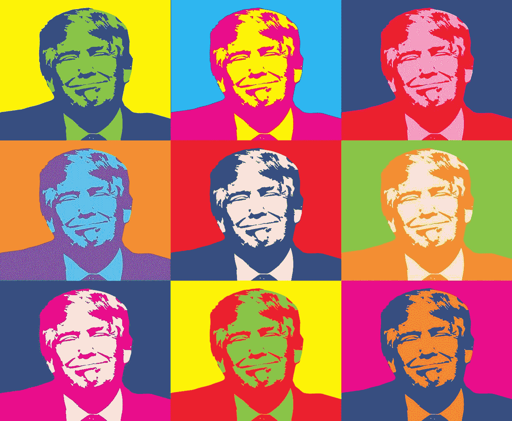
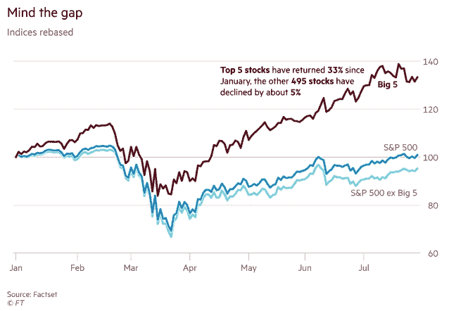
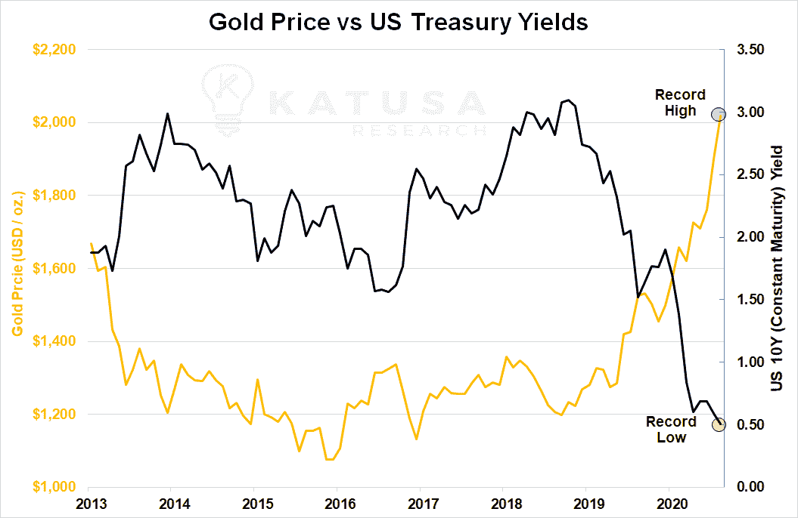
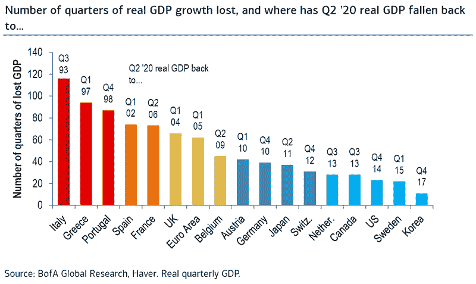
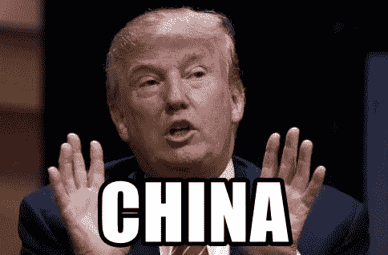
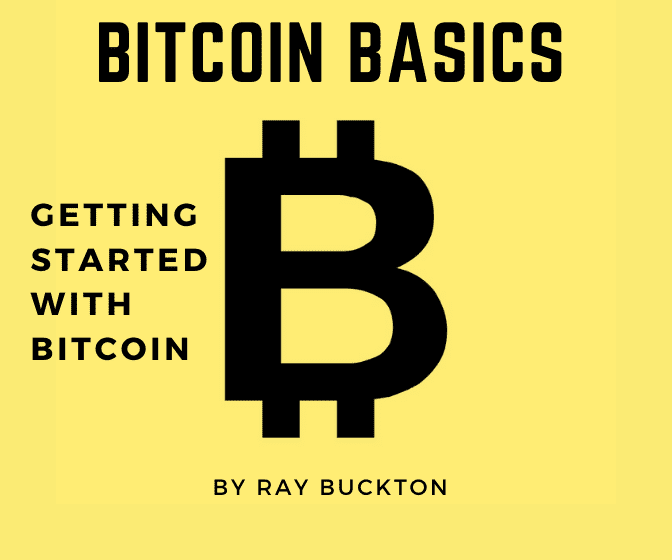
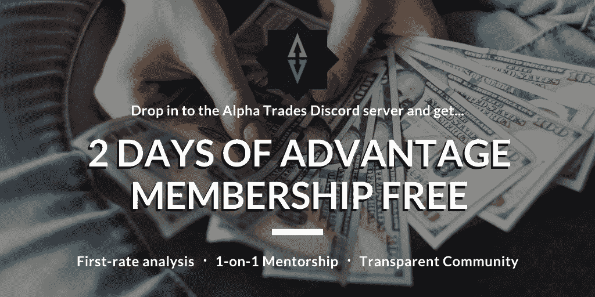

# 行政命令——特朗普的新刺激计划，技术革新

> 原文：<https://medium.datadriveninvestor.com/executive-order-trumps-new-stimulus-tech-shake-up-f846d81d0239?source=collection_archive---------9----------------------->

## **DDI 市场&8 月 10 日的经济简讯周以及 Alpha 交易**

*(注意:如果你喜欢这封邮件，请考虑把它转发给某个会从中获益匪浅的人。如果有朋友给你发了这封邮件，你可以* [*订阅 DDI 简讯*](http://medium.com/datadriveninvestor) *让你不会错过任何一个节拍。)*

特朗普签署行政命令启动刺激计划。COVID 稍微放缓，面对面教学在纽约获得绿灯，微软打算收购抖音。就这样，整个星期总结。

但是故事总有更多的内容。抓住上一期的加密货币 [**【此处】**](https://medium.com/datadriveninvestor/volatile-follows-gold-high-yield-crypto-dd6e55ae9bb1) 以及所有关于市场和经济的 [**【此处】**](https://medium.com/datadriveninvestor/the-last-dance-trump-deletes-tiktok-f436edac2c76) 。

# 推销

Image by Tibor Janosi Mozes from Pixabay

[**恐惧&贪婪指数**](https://money.cnn.com/data/fear-and-greed/)**:【72:贪婪】(截至 2020 年 8 月 10 日)**

**寻找一些数据？这里有[就业报告](https://www.bls.gov/news.release/empsit.nr0.htm)和[四份劳动力市场报告](https://medium.com/datadriveninvestor/4-labor-market-reports-you-cant-ignore-during-this-pandemic-15c90257546c)供大家小食。**

## 巴菲特买进，贝佐斯卖出，零售商 YOLO。

亚马逊首席执行官杰夫·贝索斯[上周出售了 31 亿美元的亚马逊股票](https://markets.businessinsider.com/news/stocks/jeff-bezos-sells-billions-amazon-shares-stock-ceo-earnings-billionaire-2020-8-1029478593#)，两天内的跌幅超过了他 2019 年全年的跌幅。

另一方面，沃伦·巴菲特回购了价值 51 亿美元的伯克希尔·哈撒韦公司股票，以平衡他在 6 月份抛售的航空公司股票。

但是他们知道什么？罗宾汉投资者的表现略好于股市。

我们在之前的几期中分享过这个图表，但它值得再看一看:

## 金色的

过去几周，金价一直在上涨，与 10 年期美国国债几乎成反比。一些分析师预计，黄金只走了牛市的一半。

# 经济

这张图表显示了过去几个月对每个人的伤害:

石油是全球经济的重要晴雨表。看这个:**石油钻探刚刚** [**创下 15 年新低**](https://www.bloomberg.com/news/articles/2020-08-07/oil-drilling-shrinks-to-15-year-low-with-shale-spending-falling?sref=KkPzpZvz&utm_source=morning_brew) ，美国页岩产业是昔日的影子。

**美国**[**7 月**](https://apnews.com/e0aca194f0f4870b01280049ca567a87?utm_source=morning_brew)**恢复了 180 万个工作岗位，少于前两个月，表明招聘正在放缓。在过去的三个月里，就业率已经恢复了 42%,但是有迹象表明人们已经失业或者第二次看到工作时间减少。**

**现在有 3210 万******美国人在领取州或联邦失业**保险，为有记录以来第二高。形势令人沮丧，自 5 月 5 日以来，近 3000 万人声称他们没有足够的食物。这一数字与 3，000 万美国人看到他们最后的 600 美元失业救济金在 7 月蒸发有关。**

**由于新冠肺炎问题导致经济停滞不前，不断上涨的食品价格给已经陷入困境的美国家庭带来了更大的压力。**

**由于政府援助计划，美国家庭债务下降了(年初至今下降了 12%)。尽管如此，刺激正在枯竭，像[信用卡债务](https://www.bloombergquint.com/global-economics/more-bailout-cash-may-just-delay-wave-of-credit-card-defaults)这样迫在眉睫的问题迟早会引发问题。**

## **COVID 救济的行政命令**

**白宫和民主党人尚未就刺激方案达成一致，导致总统推进关于冠状病毒援助的四项行政命令**:****

*   ****推迟年收入低于 10 万美元的美国人的工资税。****
*   ****暂停驱逐，向租户提供财政援助。****
*   ****截至 2020 年底，每周额外发放 400 美元失业救济金，各州覆盖 25%。****
*   ****推迟 2020 年剩余时间的学生贷款利息和付款。****

****特朗普知道这一决定会遭到反对。他说，“也许他们会提起法律诉讼，也许不会，但他们不会赢。”****

****毫无疑问，反对派已经做出了一些严厉的评论。****

# ****冠状病毒病****

******全球病例** [**最高 1900 万**](https://www.marketwatch.com/story/coronavirus-update-global-confirmed-case-tally-climbs-above-19-million-us-death-toll-moves-above-160000-after-11-days-of-more-than-1000-2020-08-07?mod=home-page) ，美国死亡人数突破 16 万([可能更高](https://www.mediaite.com/news/cdc-data-shows-207000-excess-deaths-during-coronavirus-pandemic-far-eclipsing-160000-confirmed-death-count/))。然而， **COVID 病例** [**在全美热点地区**](https://www.axios.com/coronavirus-cases-hotspots-arizona-california-florida-18ef6a94-4065-4859-b6d0-8bcdf0c439f5.html) 正在减少。****

## ****回到学校****

****只要感染率保持在低水平，纽约市的公立学校可以在今年秋天重返课堂。亚特兰大、休斯顿、迈阿密和芝加哥等主要学区将坚持虚拟课堂到 2021 年。****

# ****中国****

********

## ****抖音戏剧继续****

****川普发布[行政命令](https://edition.cnn.com/2020/08/06/politics/trump-executive-order-tiktok/index.html?utm_source=morning_brew)禁止抖音和微信在美国运营 45 天，如果他们的中国母公司不撤资的话。微软的目标是接管抖音在美国的业务，Twitter 进入了[合并的初步谈判](https://techcrunch.com/2020/08/09/new-bidders-reportedly-emerge-for-tiktok-in-the-us-as-powerful-critics-assail-the-process/)，使其成为唯一的另一个重要竞争者。****

****Twitter 的火力远不如微软，要赢得这场官司，它需要外部投资者的大力支持。****

## ****缺乏承诺****

****2020 年上半年，中国仅从美国购买了计划中的 253 亿美元能源产品的 5% 。农产品贸易看起来也不是很热。对于已经恶化的贸易协议来说，这是一个丑陋的开端。****

****两国将在八月中旬审查贸易协议的第一阶段，也许会因为新冠肺炎对国际贸易的影响而互相放松。****

****与此同时，俄罗斯和中国继续去美元化，在 Q1，美元在俄罗斯和中国的贸易中的使用下降到 50%以下，这是历史上的第一次。****

****美中紧张局势持续升温，美国因香港领导人林郑月娥“实施北京压制自由和民主进程的政策”而对其实施制裁****

# ****比特币到底是什么？****

********

****比特币被一些人誉为“数字黄金”，被另一些人誉为“纯粹的货币”，对许多人来说，它意味着许多东西。 [**比特币基础知识:比特币入门**](https://www.amazon.com/dp/B08FBP9W4Y) 帮助你开启比特币之旅。****

****这本书将帮助你对构成比特币的**基本概念**感到舒适，无论你是寻求被告知还是**准备好亲自参与**比特币。**了解比特币网络的关键特征**，解释如何将比特币从一个人转移到另一个人，深入研究**比特币的历史**，等等。****

# ****其他新闻****

****专家预测大西洋将迎来一个“极其活跃”的飓风季节。****

******黎巴嫩灾难**| 2750 吨硝酸铵[在贝鲁特](https://www.axios.com/beirut-ammonium-nitrate-explained-61a00b6e-61e4-4f90-8880-a5f946f81060.html)爆炸，摧毁了港口，损毁了半个城市。据报道，近 160 人死亡，超过 6000 人受伤，超过 25 万人面临无家可归的危险。****

# ****DDI 编写器亮点****

****每周，我们都会为读者带来一些精选的故事，这些故事来自《数据驱动投资者》的朋友。****

****金钱:在冠状病毒疫情期间投资肯·波洛警告读者，“我从来没有像现在这样关心美国和全球经济的基本面。”为什么？一句话:通货膨胀。****

****[推动黄金上涨的巨大恐惧](https://medium.com/datadriveninvestor/the-big-fear-driving-gold-bd028668d6b) |谈到通货膨胀， [Gordon Toy](https://medium.com/@gordontoy) 就我们如何设法让对冲基金膨胀提供了一些想法，在这种时候，对冲基金本应拯救我们的尾巴。****

****[后 COVID 世界中拥有前瞻性思维顾问的虚拟财富管理](https://www.datadriveninvestor.com/2020/07/28/virtual-wealth-management-with-forward-thinking-advisors-in-a-post-covid-world/) | 新发现的电梯恐惧症？不要害怕，[德里克·诺特曼](https://www.linkedin.com/in/dereknotman/)向你展示如何在只有一台电脑的情况下与理财经理共事。****

****失业救济金应该免费领取吗？当谈到一些关于失业支票的最尴尬的问题时，Geraint Clarke 回应了米尔顿·弗里德曼的名言:“天下没有免费的午餐。”****

# ****观看表演****

****我们在 Alpha Trades 的朋友们本周深入研究了市场、密码和经济。通过最近的剧集找到你的优势:****

****[**为什么保险股会是下一个热门板块**](https://youtu.be/W8rfYm33_GE)****

****[**8 月最佳加密交易|为什么比特币会引领下一轮牛市。**](https://youtu.be/Ld4HBVuIn7c)****

********

****订阅阿尔法交易不和谐服务器学习技术分析和如何投资获利。询问 2 天的高级会员试用！****

# ****放弃****

****数据驱动投资者(DDI)提供的信息不用于做出任何金融决策，也不是购买、持有和/或出售特定证券或金融工具的请求或建议。****

****Alpha Trades，LLC 提供的信息不用于制定任何财务决策，也不是购买、持有和/或出售特定证券或金融工具的请求或建议。****

****访问 Alpha Trades 的完整服务条款:[https://bit.ly/3faVeeV](https://bit.ly/3faVeeV)****