# Python 中的熊猫简介—选择数据和处理缺失值

> 原文：<https://medium.datadriveninvestor.com/exhaustive-introduction-to-pandas-in-python-2-2c81b67aa322?source=collection_archive---------6----------------------->

## 使用 Python 中的 Pandas 包进行数据操作的详细指南！

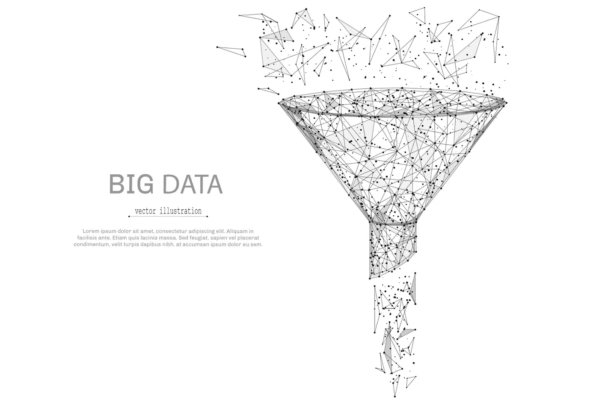

by [anttoniart](https://www.shutterstock.com/g/toniart) via [shutterstock](https://www.shutterstock.com/image-vector/funnel-low-poly-wireframe-isolated-black-749173081)

在我之前的[博客](https://medium.com/swlh/exhaustive-introduction-to-pandas-in-python-cdfd9d3846f2)中，我介绍了检查数据帧的基本函数以及如何在数据帧中选择单个值。

在这篇博客中，我将延续之前的主题，涵盖以下领域:

1.  如何在 DataFrame 中选择一个子集(多个值)？
2.  如何获得 DataFrame 中列的基本统计信息？
3.  如何处理 DataFrame 中的缺失值？

# 如何选择熊猫中的数据子集？

选择数据子集类似于在 DataFrame 中选择单个值，我将在这里主要展示示例代码和相应的结果。详细解释可以参考我上一篇博客。

 [## 2019 年学习的最佳编码语言

### 在我读大学的那几年，我跳过了很多次夜游去学习 Java，希望有一天它能帮助我在…

www.datadriveninvestor.com](https://www.datadriveninvestor.com/2019/02/21/best-coding-languages-to-learn-in-2019/) 

本部分以下所有示例代码都是为了便于理解**而选择**第 2 行到第 4 行**和**第 3 列到第 5 列**的数据。**

像往常一样，你可以在我的 Github 上找到完整的代码。

## 按位置选择数据

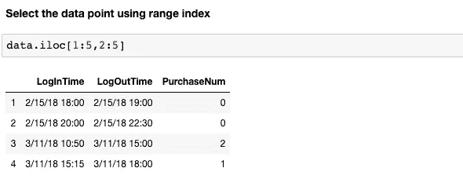

Using range index

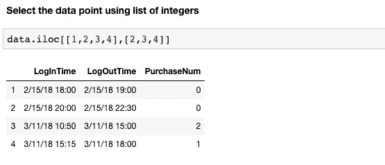

Using list of positions

## 按标签选择数据(列和索引)

Using range of index and columns

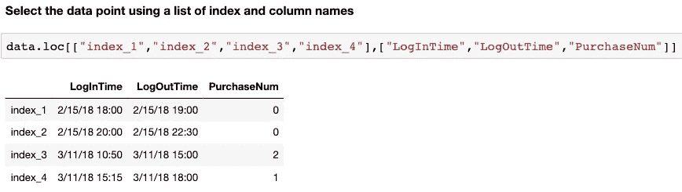

Using list of index and columns

## 通过标签和位置的混合选择数据

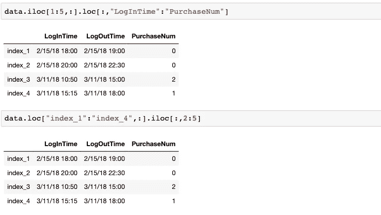

Using mixture of labels and positions

## 通过布尔值选择数据

使用布尔值和其他方法的主要区别在于，布尔值的输入长度必须与数据集(列或行)的长度相同。换句话说，对于数据集中的每个单个值，当使用布尔值时，您必须给它分配一个值作为`True`或`False`。

对于这一部分，我们的目标是选择`LogInTime,LogOutTime,PurchaseNum`列作为`PurchaseNum` > 2 的数据点。

首先，我们需要获得布尔值，我们将使用它作为输入来选择数据。

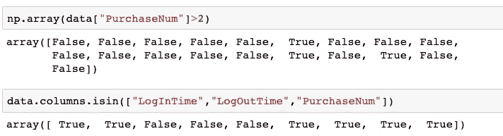

Getting boolean value for rows and columns separately

`isin()`返回一个布尔值数组，判断单个数据点是否在下面的列表中。

得到布尔值后，我们使用`loc[]`来选择我们想要的数据。

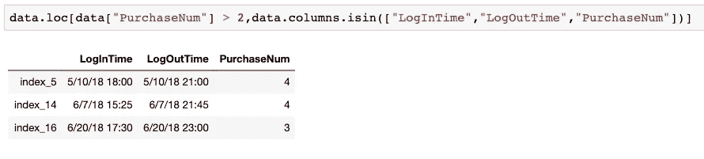

`~`可以反转布尔值(将`True`变成`False`或反之亦然)，这样我们就可以得到除了上面三列之外的列**。**

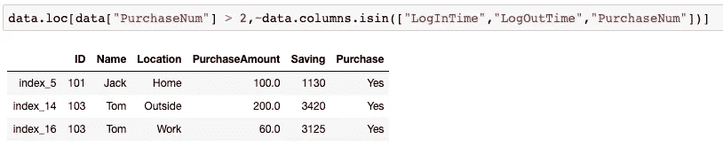

Using “~” to reverse boolean values

请记住，使用布尔值来选择数据，您需要为每个单独的列或行分配一个布尔值，以表明您是否希望选择该列/行。

# 如何获取列的统计信息？

在数据分析领域，我们通常查看给定列的统计信息。

## 对于分类变量列

首先，我们可以用`unique()`来看看这个变量有多少个不同的级别，这些级别是什么。

Examine levels of categorical-variable column

`len()`返回一个对象的长度(如列表或数组)。

而`value_counts()`使我们能够看到每个级别有多少数据点。

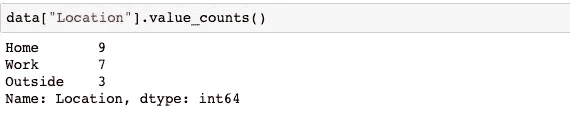

Examine number of observations for each level

注意，`value_counts()`返回一个计数按照降序排列的`Series`对象。因此，您可以对这个返回的结果执行`Series`的任何操作。

## 对于连续变量列

有几个函数可以返回一个列的基本统计信息，比如`min(),max(),mean(),median()`等。

Basic stats information functions

除了上述功能外，`quantile()`允许您检查特定的百分位值。

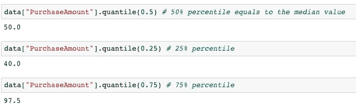

Getting different percentile results

# 如何处理缺失数据？

通常，有两种方法可以处理数据集中的缺失数据。一种方法是删除列或行，另一种方法是填充这些缺失的数据点。

## **检查缺失值**

在删除任何列或行之前，我们肯定想知道数据集中是否有丢失值，这对我们来说是不是一个严重的问题。

首先，我们可以使用`isna()`来查看我们的数据集中是否有缺失的数据点。`True`表示该位置的数据点缺失。

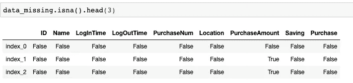

Examine the missing values of a DataFrame

`isna()`返回一个大小相同的数据帧，每个位置有`True`或`False`来表示原始数据点是否丢失。

第二，我们也可以用`value_counts()`来看看有多少个缺失值。

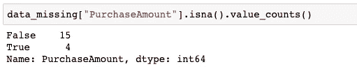

对于`PurchaseAmount`列，总共有 4 个数据点缺失。

## 删除丢失的值

我们可以使用`dropna()`删除包含缺失值的列或行。

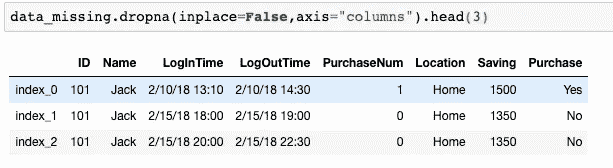

The outcome has dropped the PurchaseAmount column

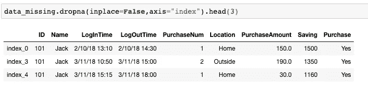

The outcome has dropped 2nd & 3rd rows as you can tell from the index

在`dropna()`中，`axis = "columns"`表示删除包含缺失值的列(也可以使用`axis = ”index”`删除行)。`Inplace = False`表示我们不会用新数据集替换原始数据集。

## 填充缺失值

处理缺失数据点的另一种方法是填充给定值。我们可以自己指定值，也可以使用数据集中的现有值。

`fillna()`可用给定值来填充缺失值。

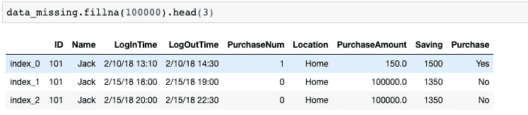

Missing values have been filled with 100000

`method = "ffill"`表示使用前面**行**中数据点的值来填充缺失值。

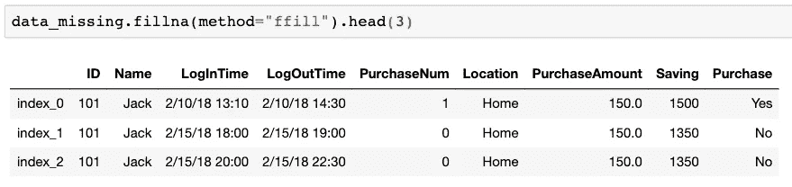

Missing values have been filled with the value of the **previous** row

`method = "bfill"`表示使用下一行**中数据点的值来填充缺失值。**

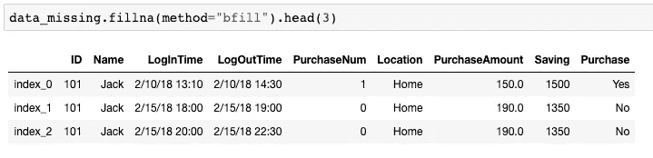

Missing values have been filled with the value of the **next** row

# 摘要

在这篇博客中，我介绍了选择多个数据点、获取给定列的统计信息以及如何处理缺失值的基本方法。在我的下一篇博客中，我将介绍一些更高级的技术(如`apply()`)，它们可以在数据分析和数据操作领域为我们提供帮助。

还要记住，使用`type()`来检查返回对象的类型总是有用的。不同的对象可能需要不同的函数来实现相同的目标，即使这些对象看起来可能是相同的(例如列表和一维数组)

如果你对数据分析或数据操作感兴趣，你可以看看我的其他博客:

1.  [Python 熊猫详解(1)](https://medium.com/swlh/exhaustive-introduction-to-pandas-in-python-cdfd9d3846f2)—`loc[]`和`iloc[]`详细指南。
2.  [用 Python 再现 SQL 查询](http://Reproducing SQL queries in Python) —使用 Python 中的 pandas 包重写 SQL 查询的指南。