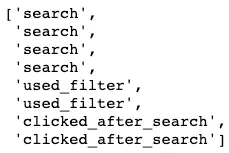
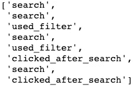
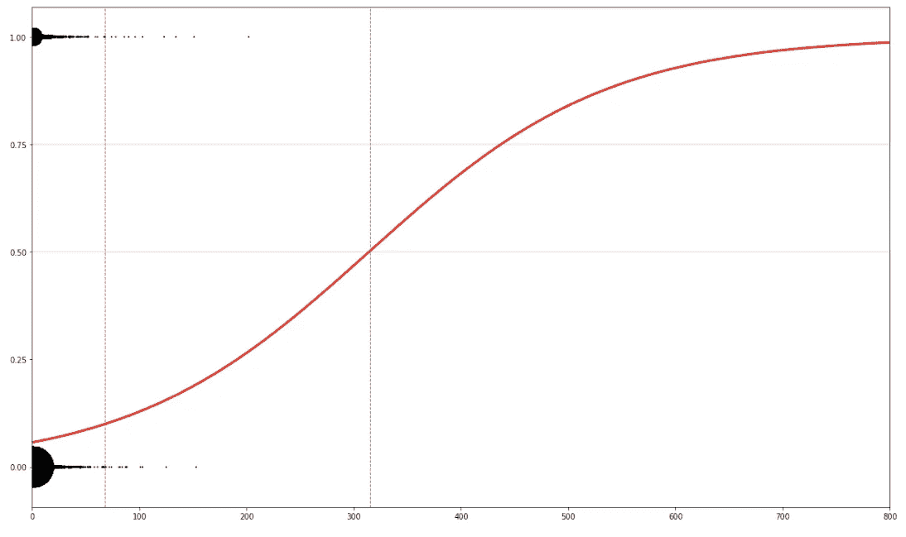

# Python 中有用的列表操作

> 原文：<https://medium.datadriveninvestor.com/exotic-and-useful-list-operations-in-python-baddb79af0db?source=collection_archive---------15----------------------->

## 了解您(可能)不知道的有用的 python 列表操作


Photo by [Jakob Owens](https://unsplash.com/@jakobowens1?utm_source=medium&utm_medium=referral) on [Unsplash](https://unsplash.com?utm_source=medium&utm_medium=referral)

我作为一名数据分析师/数据科学家在 Python 工作了大约 3 年。

在那段时间里，我记录了这些*奇特的* Python 列表操作，因为它们在执行不同的任务时很方便。我想与你分享:

# 内容

*   打乱名单
*   颠倒列表
*   从列表中获取所有不同的组合
*   从列表中随机抽取一个样本
*   获取两个列表中元素的差异
*   创建一个随机数列表
*   对列表排序
*   在列表中查找第一个匹配项的位置

我将把代码写成书面格式(不是截图)，这样你就可以很容易地复制粘贴，并尝试自己的代码。

我们开始吧！

# 打乱名单

```
list_1 = ['start',1,2,3,4,5,6,7,8,9,'end']import randomrandom.shuffle(list_1)
```

(多种可能中的一种)输出:

```
[2, 3, 'start', 1, 4, 9, 8, 6, 'end', 7, 5]
```

## 用例

例如，有一次我正在创建一个关于电子商务网站中的动作的玩具数据集。我不得不为每个用户设置许多事件，如*搜索*、*搜索后点击*、*应用过滤器*等。

在第一步，我为每个用户的每个事件创建了一个随机数，但后来我想打乱它们，使它看起来更真实。这里有一个用户操作的例子。第二个选项(洗牌后)看起来比第一个更真实，对吗？



Before



After

# 颠倒列表

让我们看一个简单的例子:

```
list_2 = ['start',1,2,3,4,5,6,7,8,9,'end']list_2[::-1]
```

输出:

```
['end', 9, 8, 7, 6, 5, 4, 3, 2, 1, 'start']
```

# **从列表中获取所有不同的组合**

只对短名单这样做！对于长列表，处理时间会变得很长。

```
import itertools 
stuff = [1, 2, 3] 
for L in range(0, len(stuff)+1): 
    for subset in itertools.combinations(stuff, L): 
        print(subset)
```

输出:

```
()
(1,)
(2,)
(3,)
(1, 2)
(1, 3)
(2, 3)
(1, 2, 3)
```

# 从列表中随机抽取样本

```
from random import samplelist_1 = [1, 2, 3, 4, 5]print(sample(list_1,3))
```

(多种可能中的一种)输出:

```
[3, 2, 4]
```

# 两个列表中元素的差异

找出两个列表中不相同的元素。

示例:

```
cols = ['start','finish','version','country','device']
test = ['start','finish']list(set(cols).difference(test))
```

输出:

```
['version', 'country', 'device']
```

# 创建一个随机数列表

让我们看一个创建 10 个随机数列表的例子，范围在 0 到 1000 之间。

```
list_1 = list(np.random.rand(10,1).ravel()*1000)list_1 = [ int(x) for x in list_1]print (list_1)
```

输出:

```
[639, 170, 381, 44, 448, 178, 145, 17, 514, 607]
```

# 对列表排序

简单:

```
list_1 = [639, 170, 381, 44, 448, 178, 145, 17, 514, 607]
list_1.sort()
```

输出:

```
[17, 44, 145, 170, 178, 381, 448, 514, 607, 639]
```

如果你想以相反的顺序排序:

```
list_1.sort(reverse **=** True)
```

输出:

```
[639, 607, 514, 448, 381, 178, 170, 145, 44, 17]
```

# 在列表中查找第一个匹配项的位置

```
list_1 = [17, 44, 145, 170, 178, 381, 448, 514, 607, 639]import numpy as np
np.argmax(np.array(list_1)>=400)
```

输出:

```
6
# the element equal or higher than 400, it's in the 6th position (starting from zero of course)
```

## 用例

它有助于在逻辑回归图中绘制垂直线，如下图所示:



我有一个数字数组中的红色曲线，然后我执行

```
# for the first vertical line
np.argmax(np.array(red_curve_points)>=0.1)# for the second vertical line
np.argmax(np.array(red_curve_points)>=0.5)
```

我找到了 X 轴上画垂直线的位置。

希望你喜欢它！您可以关注我的个人资料，在未来几周内找到更多关于数据科学和数据分析的故事。

[](https://www.datadriveninvestor.com/2019/02/21/best-coding-languages-to-learn-in-2019/) [## 2019 年最值得学习的编码语言|数据驱动的投资者

### 在我读大学的那几年，我跳过了很多次夜游去学习 Java，希望有一天它能帮助我在…

www.datadriveninvestor.com](https://www.datadriveninvestor.com/2019/02/21/best-coding-languages-to-learn-in-2019/)