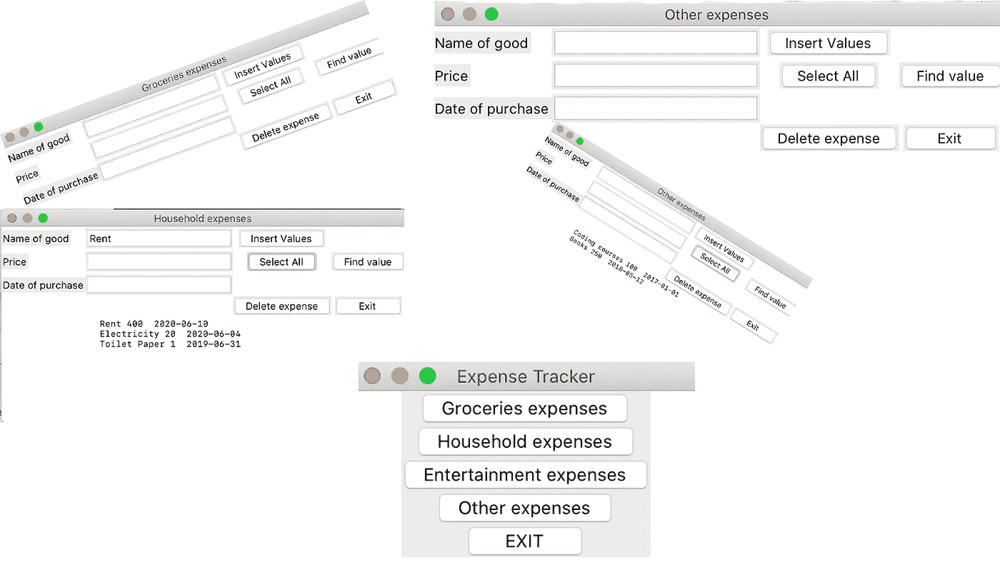
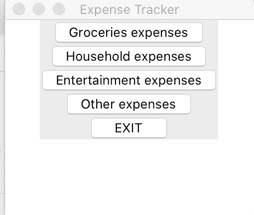
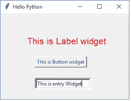
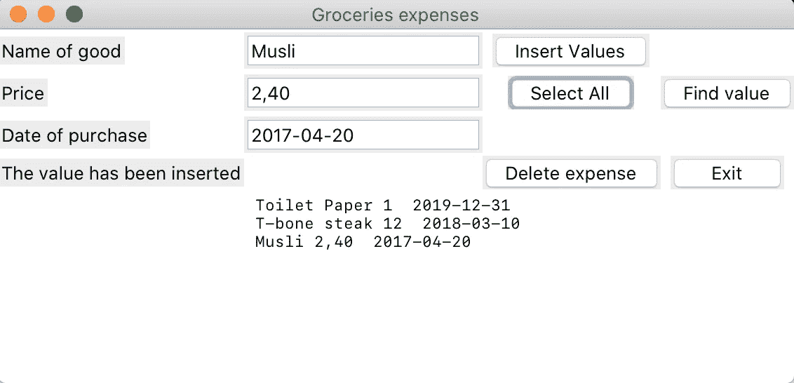

# 使用 Python 的费用跟踪器(Tkinter 和 sqlite3)

> 原文：<https://medium.datadriveninvestor.com/expense-tracker-with-python-tkinter-and-sqlite3-5ef3bf64cdd6?source=collection_archive---------0----------------------->

在我看来，开始学习 GUI(图形用户界面)的最好方法就是使用桌面应用程序来帮助你与计算机进行交互。关于存储，我们将使用 sqlite3 数据库。两者都提供了简单的选项和容易的学习曲线，帮助你进入编程的下一阶段。

点击 [*此处*](https://www.youtube.com/watch?v=7w7ITwOgUAE) 查看 **YouTube** 指南。

让我们从导入和设置 GUI 字体开始。

每个 Tkinter 应用程序都需要以这种方式构建(或者如果它是更简单的应用程序形式，那么可以避免类初始化和运行 main 函数)。我们创建了一个类 ExpenseTracker，用来初始化主应用程序。主要是 Tk 创建一个应用程序窗口

*root = Tk()*

然后在设置它的大小后，用 root 标题和初始化 ExpenseTracker。

然后 root.mainloop 告诉 Python 运行 Tkinter 事件循环。

**def __init__(self，…)**

在这个类中，我们运行 __init__ function(粗略地说，在面向对象的术语中，它被称为构造函数)。当从一个类创建对象时，在这种情况下，它是“跟踪器”,它允许该类初始化该类的属性，并使用“self”关键字访问 python 中该类的属性和方法。

## 制作窗口并打包一些条目

*   标签:它们是文本框。我们将在页眉和输入框旁边使用它。
*   **条目**:它是一个小部件，让用户编写某种输入，比如城市和日期。
*   **按钮**:按钮小工具内部有一个名为 *command* 的参数，告诉按钮按下时运行什么功能。
*   **Pack** :也是一个布局管理器，真的很好理解……每次使用。pack()它会将小部件堆叠在之前打包的小部件下面。
*   **框架**:我们的应用程序将被分成三个相互堆叠的框架。顶部框架将用于放置我们的标题，而底部将显示我们的应用程序按钮。

为显示文本的几个条目创建一个函数(添加，删除)。创建一个函数来显示所有，插入，找到特定的费用，删除。在 main_window 函数中添加将重定向到特定费用的按钮。

这将是一个大概的输出。注意，我并不关注 UI(用户界面),主要关注的是功能。

# Tkinter 小工具

**小部件**类似于 **HTML** 中的元素。在**t inter**中，你会发现不同类型的**小部件**对应不同类型的元素。

现在继续建立具体的费用清单。

当杂货店按钮被按下时，它被重定向到相应的表单。

每个费用表单通过插入、全选、查找、删除和退出具有相同的功能(这几乎是一个 CRUD 操作(创建、读取、更新、删除))。

我不会在这里涵盖所有费用，因为代码非常相似。如果你想检查整个代码，在最后找到它，我会附上 github 链接。

# Tkinter 顶层

顶层小部件用于在所有其他窗口之上创建一个窗口。顶层小部件用于向用户提供一些额外的信息，当我们的程序处理多个应用程序时也是如此。

# Python lambda 函数

Python lambda 函数，也称为匿名函数，是没有名称的内联函数。它们是用关键字`lambda`创建的。

Python lambda 函数仅限于单个表达式。它们可以在任何可以使用正常功能的地方使用。

在这个应用程序中，它用于在按下按钮时运行函数调用。

现在让我们看看如何制作数据库脚本

首先，我们导入 sqlite3，它与 Python 集成在一起，因此不需要安装。

因此，在这里，如果不存在数据库，我们只需运行创建数据库

`INTEGER PRIMARY KEY`栏自动递增。还有一个`AUTOINCREMENT`关键词。在`INTEGER PRIMARY KEY AUTOINCREMENT`中使用时，Id 创建算法略有不同。

其他值可以赋值为文本、整数、日期等。

其余的变量将根据费用名称在数据库中保存某些查询。

要更详细地了解 sql 语法以及如何根据需要进行查询，请查看下面的链接:

 [## SQLite 理解的查询语言

### 小。很快。可靠。任选三个。SQLite 理解大多数标准 SQL 语言。但是它确实省略了一些…

sqlite.org](https://sqlite.org/lang.html) 

在独特的函数中运行不同的 SQL 查询

首先我们创建表，这个例程创建一个将在整个数据库编程中使用的**游标**， **cursor.execute** 在连接之后，它通过调用 cursor 方法创建一个中间游标对象，然后用给定的参数调用 cursor 的 execute 方法。

在 select 函数中，我们将商品和价格作为属性传递给函数，以便能够找到我们想要获取或删除的特定商品。

当对数据库进行更改时，必须**提交**这些更改，以便数据库更新这些更改，否则，如果只是选择数据库中的特定值或选择所有值，则不需要提交，只需 **conn.fetchall()。**

# **注**

在这之前，首先需要连接到数据库，然后创建一个游标对象来获取结果并进行更改。

# 结论

本教程中讨论的概念应该有助于你制作自己独特的 GUI 应用程序。

当您试图创建一个具有适合您个人需求和要求的 GUI 的定制应用程序时，这将非常方便。这是开始创建自己的项目的最简单的方法之一。

Tkinter 也可用于检查您电脑中的文件/文件夹，并选择合适的文件/文件夹。制作简单的计算器或井字游戏。清单是无穷无尽的，一切都取决于你。

我希望你喜欢 Tkinter 教程上的这篇文章。

Github 链接到此代码:

 [## mozes 721/费用 _ 追踪

### 将 Tkinter 用作 GUI，将 sqlite3 用作轻量级数据库选项将 Tkinter 用作 GUI，将 sqlite3 用作轻量级…

github.com](https://github.com/Mozes721/Expense_Tracker) 

# 相关故事

 [## 抓取美国选举结果，并使用 Jupyter 笔记本和 plotly 进行数据可视化

### 这个项目对我来说写起来很有趣，我希望你这个读者会从中受益匪浅。

medium.datadriveninvestor.com](/scraping-us-election-results-and-using-jupyter-notebook-with-plotly-for-data-visualization-8f3d55dda957)  [## Instagram:从 GDrive 或本地存储中选择图像

### 这个项目分为三个部分:谷歌 API，目录搜索，Instabot/Tkinter

medium.com](https://medium.com/codex/instagram-choose-img-from-gdrive-or-local-storage-629fa836dd4f)  [## 从 Excel 文件实现动态电子邮件自动化

### 使用 Python 向整个 Excel 列表发送电子邮件，或者单独发送带有翻译文本选项的电子邮件！

python .平原英语. io](https://python.plainenglish.io/dynamic-e-mail-automation-from-excel-file-103d35bd9225)