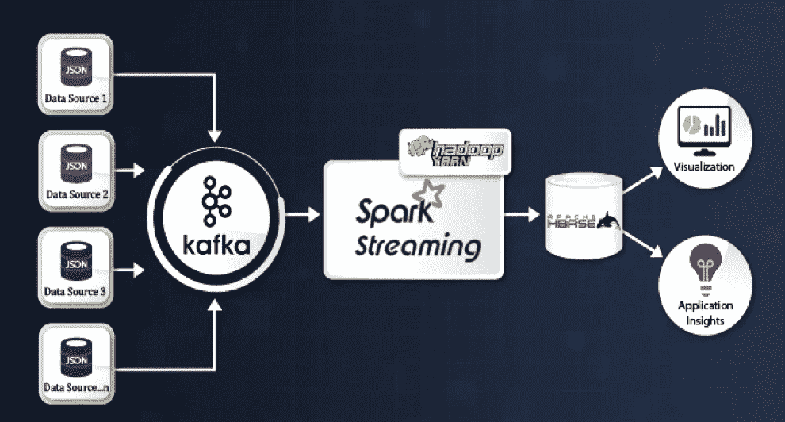
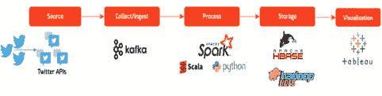
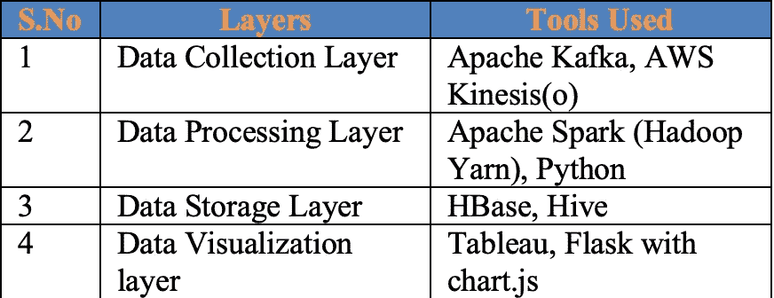
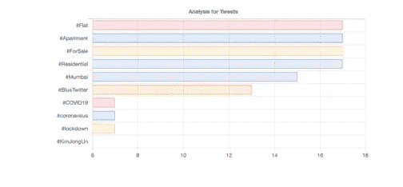

# 派斯帕克、卡夫卡和画面:经验流分析

> 原文：<https://medium.datadriveninvestor.com/experience-stream-analysis-using-pyspark-kafka-and-tableau-24edbb813c08?source=collection_archive---------1----------------------->

## 使用 Python、pyspark、Kafka、zookeeper 和 Tableau 分析和可视化推文

将海量的流数据整合起来，并对所提供的数据进行实时分析，这是一项革命性的技术。Python 与 pyspark 的结合使之成为可能。这里，我们有使用 twitter 提供的 api 获取数据的优势。Twitter API 允许获得实时数据，使用 RDD 处理它，传递它以显示计数，然后，仪表板显示整个数据处理的分析。它很有趣，充满了学问。这很容易实现，因为对于理解给定的问题陈述来说，它看起来很麻烦。

> 使用的技术:Python 与 pyspark，zookeeper，Kafka，Chart.js 和 Tableau

# 我们的目标

1.  可扩展性、准确性和速度
2.  数据分析和决策
3.  仪表板:使用交互式仪表板对推文进行情感分析和更多洞察

# 解决方法

1.  创建一个应用程序帐户 twitter，并提取连接细节以供使用
2.  使用应用程序细节，调用 twitter API 每 2 秒提取数据并存储
3.  使用 **Kafka** 消息传递层处理数据并提取标签
4.  **统计标签被使用的次数**和**可视化**

Solution Pipeline : Data Storage can be replaced with local CSV/JSON

# 数据源和摄取

1.  使用 Twitter 提供的 API 以 json 格式收集数据。
2.  可以根据容量配置帐户配置和数据提取率
3.  收集感兴趣的数据字段并进行转换
4.  数据清理检查数据字段、内部数据，处理缺失值和异常值
5.  数据存储为 HDFS 或 CSV 格式(用于独立和测试目的)

# 关于使用的技术

*Spark :* Spark 是一个开源、灵活的内存框架，可作为 map-reduce 的替代方案，用于处理批处理、实时分析和数据处理工作负载。它为 Java、Scala、Python 和 R 编程语言提供了原生绑定，并支持 SQL、流数据、机器学习和图形处理。它将有助于以良好的性能处理大量数据。

*Kafka :* Kafka 是一个开源分布式流平台，在构建实时数据管道和流处理应用程序方面非常有用。它被用作消息传递层，将数据从一个源传输到另一个源。Kafka 帮助您提供可扩展且持久的解决方案，而不会丢失任何消息。

*Tableau :* Tableau 将是一个显示细节的可视化层和显示情绪的仪表板，使用户能够做出决策。

*Chart.js* :使用 python flask 框架，Chart.js 可用于动态生成条形图，以显示带有各自计数的 hashtags。烧瓶使它变得很轻。

# 解决办法

这个问题可能有多种解决方案。在这里，解决方案包括使用 Hadoop Yarn、Kafka、Spark、HBase 和 Elasticsearch 实现数据管道。然后，转换数据以输入机器学习管道。机器学习模型将提供消息的情感分析。并且，可视化将有助于用户理解结果和数据。

● **具有运行 spark 流作业的 Yarn 架构的多节点 Hadoop:** 使用 Hadoop Yarn 设置节点集群(1 个主节点和 2 个工作节点)以实现高可用性，并在集群上应用 Apache spark over Yarn 的多个作业。

● **将用于流式传输的多节点 Kafka:** Kafka 用于分布式流式传输平台，用于构建数据管道。它用于大规模的消息处理，并为 Kafka 实现 HA，它设置在多个节点上。

● **HBase，用于存储数据:** 帮助稀疏数据集。

● **机器** **学习:**对给定的数据进行机器学习，从数据中获取情感

● **数据可视化:**使用 Tableau 讲述故事和仪表板来可视化数据

# 结果

以下是使用流数据和存储数据的结果示例。

# 结论

这个解决方案是以嵌入式方式使用 python、pyspark、zookeeper、kafka、hadoop 和 chart.js 等最新技术开发的。这为与流数据和分析数据相关的问题提供了解决方案。使用 kafka 进行消息消费，然后在 Kafka 和 spark 之间进行同步，以在数据帧中处理消息。

> 这个解决方案可以扩展到适当的用例，并可以用来从流中提取一些有用的含义。非常有用的用例，并能以深思熟虑的方式实现任何需求，以证明其有用性。

这种解决方案是以模块化的方式实现的，因此很容易扩展。该解决方案可以进一步探索，以实现针对不同客户的多个可视化层。享受这种体验并尝试实现，**快乐编码！**

## 访问专家视图— [订阅 DDI 英特尔](https://datadriveninvestor.com/ddi-intel)