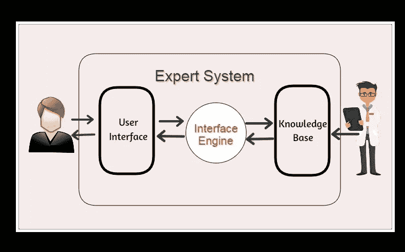

# 专家系统

> 原文：<https://medium.datadriveninvestor.com/expert-systems-c082a596c407?source=collection_archive---------4----------------------->

## 人类专家问题解决模型

Photo by [National Cancer Institute](https://unsplash.com/@nci?utm_source=medium&utm_medium=referral) on [Unsplash](https://unsplash.com?utm_source=medium&utm_medium=referral)

通过我今天的文章，你可以大致了解一下专家系统。它们也被称为基于知识的系统。我希望在这里写下什么是专家系统，专家系统的特征，专家系统的应用以及更多的东西。这个话题的重要性在于**专家系统是人工智能的主要领域之一**。专家系统属于认知系统。如果你不知道，请浏览[这篇文章](https://medium.com/datadriveninvestor/two-broad-areas-of-artificial-intelligence-84037150bae)。

# 什么是专家系统？

在人工智能中，专家系统是模拟人类专家决策能力的计算机系统。人类专家可能是医生、律师、教师、工程师、科学家、木匠、音乐家等等。专家系统的目的是解决特定领域中最复杂的问题。专家系统是当今人工智能、深度学习和机器学习系统的前身。

专家解决问题的技巧基于两个知识领域。分别是**学科特定知识(领域知识)**和**解题知识**。当两个医学博士被认为他们的学科特定知识或领域知识相似时。但是他们解决问题的策略可能不一样。这就是两个医生不一样的原因。

# 专家系统的特点

考虑一个场景，当你遇到一个医生，并了解一个专家系统的特点。

1.  **专家问的问题比客户多**——当你去看医生时，他/她问的问题比你多。
2.  **专家可以研究不完整的信息—** 医生可以在我们说出一切之前预测并决定我们的疾病。
3.  **专家不仅可以给出答案，还可以给出答案的原因—** 如果我们问医生，这种病的原因是什么，医生可以解释。
4.  **专家可以给出不止一种解决方案(替代方案)——**如果患者对医生说我对这种药片过敏，医生可以给出另一种解决方案。
5.  **专家知道自己答案的保证程度——**医生对药品的保证可以说是阿莫西林 80%保证，青霉素 60%保证。
6.  **专家对特定领域进行手术—** 不同领域都有专科医生，比如皮肤科、内分泌科、胃肠病科等等。
7.  **专家给出的建议多于确切的答案—** 没有确切的药物，因为这种药物只针对这种疾病。
8.  专家使用启发法和经验— 医生在给药时使用他们的常识和过去的经验。

# 专家系统如何工作

考虑到医生的咨询过程，你很容易理解专家系统的程序。

*   **对话开始—** 当病人去找医生时，医生开始问问题。
*   **形成冲突集—** 在向病人提问后，医生可以根据病人的主诉和症状建立一个冲突集。

当病人抱怨发烧和呕吐时，医生可以形成如下的冲突集。

*R1 感染——发烧、头痛、呕吐*

*R2 登革热，腹泻，呕吐*

*R3 登革热——红眼，呕吐*

*R4 食物中毒——呕吐、头痛*

*   **冲突解决** —根据上述冲突集合，医生可以选择规则的顺序。

*例如:- R3，R4，R1*

*   **遗漏信息—** 在考虑 R3 时，医生可能会问你是否有红眼，以此推断患者患有登革热(信息不完整)。
*   **备选方案—** 假设患者说没有红眼。那么医生应该去 R4，第二个冲突规则。考虑到 R4，医生再次询问他是否头痛。如果答案是“是”，那么 R4 得出结论，有食物中毒。有时医生可能会在这一点上停止。如果他/她是个聪明的医生，如果可能的话，医生可能会考虑 R1 的替代方案。
*   **不确定性处理**
*   **解释—** 如果患者拒绝首次诊断(食物中毒)，医生应给出呕吐和头痛的解释。但是如果病人说如果没有坏餐，医生将不得不考虑另一个规则。

# 专家系统的体系结构

components of an Expert System

专家系统有三个主要组成部分。

1.  **用户界面—** 该组件帮助非专家用户与专家系统交互并找到问题的解决方案。专家系统的界面比其他系统或软件解决方案的界面更复杂。因为应该有各种可能性，例如为所提问题提供答案、解释、替代解决方案、在专家系统中捕捉缺失的信息。此外，专家系统界面还可以通过自然语言(语音和文本)处理交互。聊天机器人是各种软件自然语言界面的一个很好的例子。今天，许多专家系统都有基于网络的界面。因为 web 界面可以支持许多媒体，如图形、图像、声音等。
2.  **知识库—** 这是一个专家系统的容器。它代表了事实和规则。它由特定领域的知识以及解决问题的规则、程序和与该领域相关的固有数据组成。知识可以存储在数据库、web 服务器、文件服务器或云中。知识库的结构应取决于需求，如动态信息和静态信息。
3.  **推理机—** 这是专家系统的一个显著特征。专家系统的所有问题解决策略或特征都内置在推理机中。诸如搜索算法、正向链接、反向链接等基本人工智能技术被认为是推理技术。推理机使专家系统不同于经典的数据库系统。

> 由于推理机在知识库上工作，它们的结构应该是兼容的。当我们说**专家系统是智能的**时，更大的功劳应该归于推理机。但是如果知识库是空的，推理机就没有用了。

# 专家系统的应用

专家系统在现实世界问题中有许多应用。这里提到了一些最受欢迎的应用程序。

*   信息管理
*   医院和医疗设施
*   服务台管理
*   员工绩效评估
*   贷款分析
*   病毒检测
*   适用于维修和维护项目
*   仓库优化
*   计划和日程安排
*   制造对象的配置
*   金融决策知识出版
*   过程监控和控制
*   监督工厂和控制器的运行
*   股票市场交易
*   航班时刻表和货运时刻表
*   医疗诊断和建议
*   工程设计
*   故障诊断
*   咨询
*   职业指导
*   旅游咨询系统
*   后勤计划系统

# 专家系统的例子

专家系统的例子很多。有些写在这里。

*   **MYCIN:** 最早的基于反向链接的专家系统之一。它可以识别各种可能导致严重感染的细菌，还可以根据人的体重推荐药物。
*   这是一个基于人工智能的专家系统，用于化学分析。它利用物质的光谱数据来预测其分子结构。
*   **R1/XCON:** 可以选择特定的软件生成用户希望的计算机系统。
*   **PXDES:** 根据数据可以很容易地确定患者的肺癌类型和程度。
*   **CaDet:** 这是一个临床支持系统，可以在患者的早期阶段识别癌症。
*   **DXplain:** 它也是一个临床支持系统，可以根据医生的发现提出各种疾病的建议。

# 专家系统的优势

*   低访问成本
*   快速响应
*   低错误率
*   能够解释他们是如何达成解决方案的
*   降低生产成本
*   降低风险
*   稳定响应

# 专家系统的缺点

*   专家系统没有情感
*   常识是专家系统的主要问题
*   它是为特定领域开发的
*   应该手动更新。它不会自己学习
*   无法解释这个决定背后的逻辑

# 专家系统的局限性

*   没有人类般的决策能力/无法在非常情况下做出创造性的反应
*   无法拥有人类的能力
*   知识量少无法产生正确的结果/知识库中的错误会导致错误的决策
*   需要过多的培训/专家系统的维护成本过于昂贵

我想你可以通过上面提到的事实给出一个关于专家系统的简要想法。仅从一篇文章来讨论这一领域并不容易。这篇文章的目的是给你一个简单的想法。读完这篇文章后，寻找和收集更多关于专家系统的信息。现在时间属于你了。如果你从这篇文章中有所收获，请分享给你的朋友。

干杯…！！！

**参考文献**

[1]https://www.geeksforgeeks.org/expert-systems/

[2][https://www . guru 99 . com/expert-systems-with-applications . html # 10](https://www.guru99.com/expert-systems-with-applications.html#10)