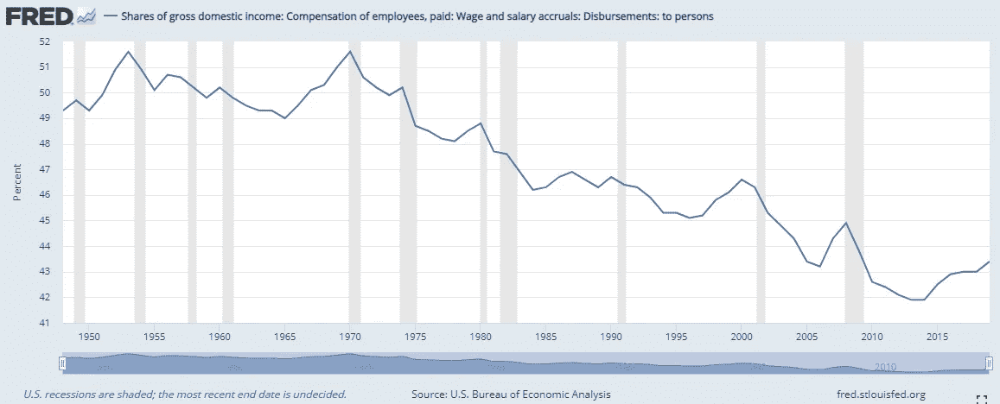
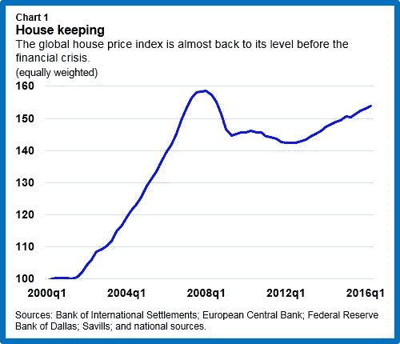

# 解释:杰夫·布斯的通货紧缩论点

> 原文：<https://medium.datadriveninvestor.com/explained-jeff-booths-deflation-thesis-22d8ea0a63?source=collection_archive---------4----------------------->

Jeff Booth 在他的书《明天的价格:为什么通货紧缩是未来繁荣的关键》中称，技术和创新是通货紧缩。

通货紧缩是价格的普遍下降。

“但是等等，我所有的成本都在上涨。我的房租上涨了。我的食物涨价了。我的电费上涨了。我的交通费已经上涨了。我没有看到通货紧缩。我环顾四周，只看到通货膨胀”。

这是因为央行一直在用大量货币供应对抗无处不在的通缩，不幸的是，这些货币供应最终都推高了资产价格、食品成本和运输成本。通货紧缩是主要驱动力，通货膨胀是反动的。通货膨胀是对现实的歪曲。

> 由中央银行故意制造的通货膨胀会在重要的事情上表现出来。通货紧缩，本质上是由技术造成的，表现在那些并不重要的东西的价格上。

**通货紧缩发生在科技产品上**。这些年来，电视机的价格已经下降了。同样的事情也发生在冰箱和手机上。杰夫·布斯在他的书中举了一个例子，他用的第一部手机，当时价值 2000 美元，但现在他可以花 500 美元买一部比第一代手机好 10 倍的手机。那就是通货紧缩。你付出的少，得到的多。一种产品的两种通货紧缩效应。

智能手机已经将许多产品非物质化，并允许我们以接近零的价格获得效用。当你在 2021 年购买一部智能手机时，你实际上同时在为以下产品付费:

1.  一部电话
2.  一台照相机
3.  扫描仪
4.  银行家
5.  一台小电视
6.  一本字典
7.  一张地图
8.  一台收音机
9.  信箱
10.  日历
11.  一块手表
12.  一本日记-
13.  书架——文件存储系统
14.  一套棋类游戏——国际象棋、西洋双陆棋、纸牌等。
15.  一本杂志

通过支付智能手机的价格，你可以从所有这些非物质化的产品中获得效用。少花钱多办事。这是大规模的通货紧缩。它几乎无处不在，除了基本的(食物、住房和交通)。

照片(图片)已经可以自由捕捉和存储。几十年前，这些东西价格不菲。信件(需要我们支付邮资)已经被电子邮件(完全免费使用)所取代。

**相互交流的成本正在下降。远距离通信的价格已经非常接近免费，而几十年前还需要一大笔钱。在通信技术领域，现在正在发生大规模的通货紧缩。技术正在加速使交流变得自由。**

手机语音通话正迅速被网络电话取代，只要你有数据，网络电话是免费的。数据包的价格也在逐年下降。那就是通货紧缩。移动网络运营商的短信和通话收入不断下降，证明了通货紧缩的影响。

Zoom 正在蚕食商务旅行机票。一个企业的年度 zoom 订阅远低于机票。因此，最终目标可以实现，而付出较少。这就是通货紧缩，通过替代产品发生。

工资也在下降。劳动力正迅速被机器取代。这些年来劳动力的价格已经下降了。这种动态解释了为什么富人(生产资料的所有者)越来越富，而穷人(出卖劳动力的人)越来越穷。虽然出售劳动力的回报越来越少，但将资本投入机械和技术的回报却越来越多。

当作为一个整体而不是个人来观察时，工资下降的趋势更容易被注意到。就个人而言，就业人口的增长将接近消费物价指数。然而，总的来说，如果一家公司解雇了一名员工，并且没有用另一名员工替代他/她，那么工资在运营支出中所占的份额就会下降。简而言之，公司支付劳动报酬的总额下降了。这就是通货紧缩。

Wages as a share of GDP has been declining since the 1950s in the USA

如果重要的东西(如住房、食品和能源)也在通缩，那么对工资的通缩效应就不会那么痛苦。

基本必需品的通货膨胀实际上是工资紧缩。你的工资被强制降了。你实际上赚得更少。

> 通货膨胀是人为的。通货紧缩是自然的。这是市场经济和技术进步相互竞争的结果。顺其自然吧。

凯恩斯主义者必须被逮捕，因为他们兜售着一个谎言，即人类社会无法在通缩环境中富足地生活。他们认为通货紧缩是一个问题。当然，当工资下降时，这似乎是一个问题，但现实是，如果其他一切都在下降，这真的不是一个问题。制造非自然通胀的欲望是问题所在。

# 通货膨胀在哪里？

目前，所有由央行强行制造的通胀都集中在少数几个地方。它正流入以下领域:

1.  股票市场
2.  房地产
3.  食物
4.  能源和运输

**美食**

有几项技术突破将降低食品生产成本。食品价格正在上涨，但就食品生产而言，平均而言，世界比 50 年前更好。我们通常吃得越来越少。

如果不是政府制造的人为通胀，我们的处境会更好。机械化的大规模生产使我们处于这样一个位置:大量的城市人口由少数大农场主养活。

精准农业、垂直农业、纳米农业和实验室制造的食品(如人造肉)的使用将极大地改变食品生产成本，使其达到食品不容易吸收的水平——吸收中央银行制造的通货膨胀。简而言之，在这个领域，通货紧缩最终将压倒通货膨胀。

短期趋势是食品价格上涨，但长期趋势是食品价格下降。食品价格的短期上涨有时被归因于人口增长和供应紧缩。尽管这些可能是真的，但最大的因素是货币扩张，而且一直如此。

在接下来的 20-50 年里，食品将继续吸收通货膨胀，因为通货膨胀总得有个去处。尽管通货紧缩是一股强大的暗流，但通货膨胀将继续在这一领域占据主导地位。通货膨胀是政府强加给食品的。

**能源&运输**

能源和交通领域的通货膨胀非常严重。石油价格每十年上涨一次。我们还没有看到石油价格和需求的峰值，可能是在 2030 年左右。石油将被目前更加昂贵的可再生能源所取代。这是通货膨胀。

然而，这一领域的长期趋势也是通货紧缩。随着时间的推移，可再生能源的成本将会下降。电动汽车将会接管。能源生产将是分散的。这些动态是通货紧缩。

**股票市场**

股票市场的通货膨胀非常严重。看看大型科技公司的股票就知道了。特斯拉在 2020 年上涨了 700%，价值投资者抗议这些价格没有任何经济意义。潜在的动力与价值无关，而是与通胀有关。

在股市内部，通胀主要集中在科技公司，它们在市值中占据很大比重。在其他地方，价格稳定或下降。

随着技术改变市场，老牌非科技公司逐渐被摘牌。杰夫·布斯(Jeff Booth)在他的书中强调了科技股作为金融市场工具的重要性，这种工具将在一段时间内保持吸收通胀的能力。

**房地产**

在过去的五十年里，房地产以惊人的速度膨胀，现在被认为是对经济稳定的威胁。房价在 2008 年达到了一个很高的高度，许多市民都无法企及。

贷款人被认为是鲁莽的，因为他们向信用不佳的人发放抵押贷款。这就是故事。没有人想质疑为什么绝大多数人没有信用。这是因为通货膨胀把价格推高了。

随之而来的房地产市场崩溃被认为是问题的原因。它将我们引向了金融危机。这是严重的误诊。崩溃不是问题。这是一种效果，实际上是一种解决方案。将房价推高是个问题。凯恩斯主义央行行长制造的人为通胀流入房地产。

本文，[《全球房价:又到了担忧的时候了？国际货币基金组织很好地框定了这个问题。](https://blogs.imf.org/2016/12/08/global-house-prices-time-to-worry-again/)

Rising house prices

房屋供应受到限制，因此人为的通胀将继续流入这一领域，导致巨大的反弹和突然的崩盘，导致全球陷入一场又一场金融危机。

然而，一些动态开始出现，可能会改变事件的进程。COVID19 加快了在家工作的速度。如果它继续存在，它将缓解商业区的拥堵(导致商业地产的下跌)，以及缓解城市的拥堵，因为工人甚至可以在有互联网连接的农村地区工作(导致城市房价下跌)。技术慢慢将其强大的通缩力量推向房地产。

另一个长期(50-100 年)动态正在供应端上演。建筑技术发展非常快。3D 打印房屋可以大幅降低房屋建造成本。如果真的发生，那将是非常严重的通货紧缩。

如果技术在房地产领域有自己的方式(顺便说一句，它的方式是通货紧缩)，那么央行制造的所有通胀将何去何从？通货膨胀总得有个去处。

我认为房地产市场将是通货紧缩战胜通货膨胀的最后阵地。这是世界末日。善与恶的最后一战。通货紧缩一直在原地打转，侵蚀着无关紧要的生活领域。通胀一直在让步，在一些无关紧要的领域失去地盘，比如野营火炬和除臭剂的价格。这两股巨大的经济力量最终将在生活中最重要的领域——住房——展开较量。

这场决战不太可能在我们的有生之年发生，除非科技飞速发展。但当这种情况发生时，通缩很可能会胜出。

# 当人为通胀无处可去时，各国央行会怎么做？

一旦通货膨胀被击败，它就永远被击败了。在不摧毁货币的情况下，中央银行家们不能再膨胀了。任何货币供应量的肆意增加都会摧毁货币。这可能通过人们选择通缩货币或恶性通胀来实现。

恶性通货膨胀本身的定义将会改变。目前的标准是，任何高于 50%的通胀率都被视为恶性通胀，是不可接受的。在这种情况下，人们会对一种货币失去信心。在未来，当通货膨胀被击败时，2%的通货膨胀率可能会被认为是过高和不可接受的，因为只有通货紧缩才是可以接受的。

现在可能很难理解，但请这样想:如果世界在进步，事情变得更好，你为什么会接受价格上涨？如果情况正在好转，我们应该见证价格下降，我们应该期待它们。

**当通胀无处可去:**

1.  **利率将接近于零**——因为通缩环境有一个内在的利率，明天的一美元比今天的一美元更有价值。
2.  **货币宽松不会流入经济**——人为通胀无处可去。银行不放贷了。例如，美联储可以放松货币政策，但实体经济中的钱是在银行放贷时创造的。如果银行不放贷，那么通胀就无处可去。它作为储备留在银行部门。
3.  **任何通货膨胀都被认为是不可接受的**——人们会拒绝接受通货膨胀。经济领域已经开始抱怨 2 %的通货膨胀率。他们正在将货币余额转移到黄金、白银和加密货币。

我们到了吗？听起来我们正在到达那里。

# 财富差距

基本必需品的通货膨胀实际上是工资紧缩。资产价格的膨胀意味着工薪阶层无法跟上这一步伐。

我们有两套巨大的力量将社会分成两部分。由此产生的通胀让那些拥有资产的人受益，同时剥夺了那些不拥有资产的人的权利。富人拥有资产，穷人没有。

富人越来越富，穷人越来越穷。这一直是事实，但富人变得更富的速度从未如此之快，穷人变得更穷的速度也是如此。它的系统正在走向灭亡。走向毁灭。

在世界各大城市，一个普通的工人再也买不起最便宜的房子了。几十年前，普通工人很容易就能买到最便宜的房子。

房租、食品和交通费用已经上涨到让普通工人没有可支配收入的水平。几十年前，情况并非如此。

随着中央银行印钞以对抗通货紧缩，越来越多的钱集中在少数拥有房地产、股票和富人拥有的其他东西的人手中。与此同时，更多的钱是从穷人那里拿走的，他们不得不支付高昂的租金和食品价格。

这种情况能持续多久？人们知道有问题。人们感到被挤压。他们知道事情并没有按照预期的方式发展。他们可能无法诊断问题的具体根源，但他们可以感受到影响。

**贫富差距有增无减。真是恶性循环**。

1.  技术和创新加速得越多，通缩就越厉害。
2.  强大的通货紧缩必须用大剂量的货币供应(通货膨胀)来对抗。
3.  通货膨胀使穷人陷入更深的贫困，而使富人受益。
4.  富人拿走所有这些可怜的钱，投资于替代劳动力的技术和效率。回到起点。

***举例:***

1.  *亚马逊在非物质化零售方面取得了创新，压低了价格，压低了零售业的工资，并迫使其他零售商关闭，导致许多零售业工人失业。*
2.  现在，财政部和美联储不得不印刷数十亿新钞票来对抗通货紧缩和救助投资者，这些投资者在零售商股票暴跌中失去了投资，向失业者支付福利，等等。
3.  *这些提供给对冲基金和失业者的数十亿新资金实际上降低了当前就业公民的工资。房价上涨，食品价格上涨，最重要的是亚马逊股票上涨，推动市值从 5000 亿美元上升到 1.7 万亿美元。所以富人，杰夫·贝索斯，地主，越来越富。*
4.  *市值 1.7 万亿美元的贝佐斯可以无限制地获得信贷(新资金)。他也坐拥大量的旧货币。他可以将所有这些可悲的新旧资金投资于仓库自动化、先进的人工智能和无人机送货技术。这些新投资产生的效率取代了亚马逊价值链中的劳动力，让我们回到了起点(在这种情况下是第一点)。*

# **结束游戏**

有些东西必须放弃。

技术和创新不会让步。

在全球范围内，要么政府要么货币必须让步。在某种程度上，你不可能同时拥有一个运行稳定的政府和一个通胀的货币体系。

通货紧缩的世界需要通货紧缩的货币政策。

社会本身必须重置。

随着技术无情地追求从价值创造链中消除劳动力的议程，社会必须找到一种基于劳动力价格分配价值的方法。

我肯定会推荐读杰夫·布斯的书。

 [## Jeffrey Booth -企业家、技术领袖、作家和战略顾问

### Jeff Booth 是一位富有远见的领导者，20 年来一直生活在技术变革的前沿。他领导了 BuildDirect…

www.jeffreybooth.com](https://www.jeffreybooth.com/) 

再见。