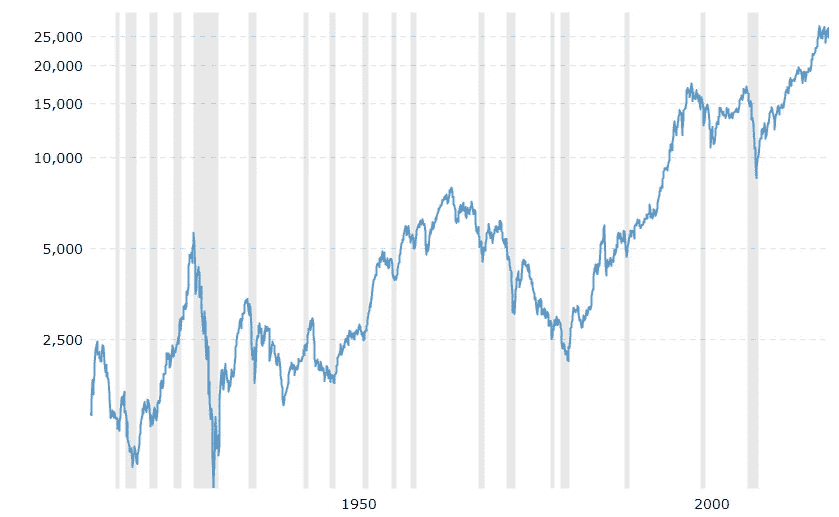
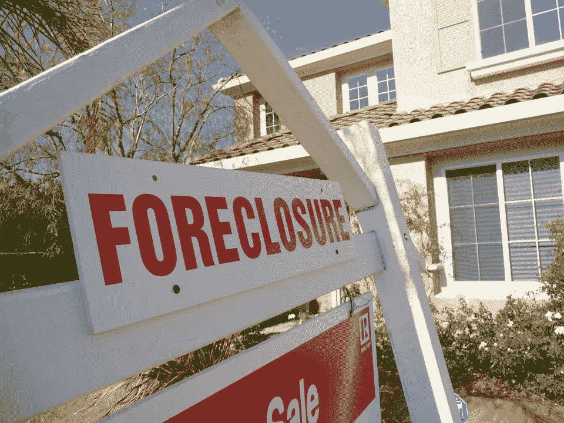
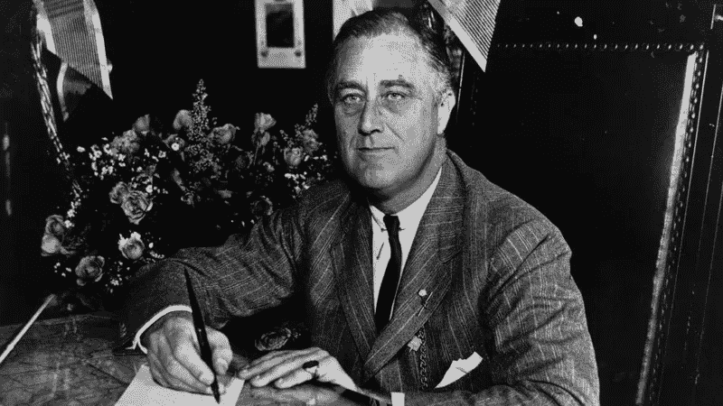
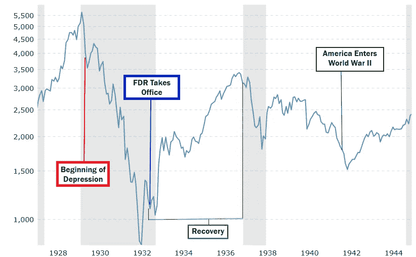
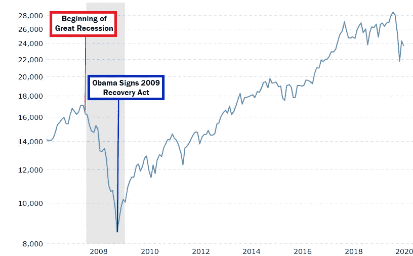
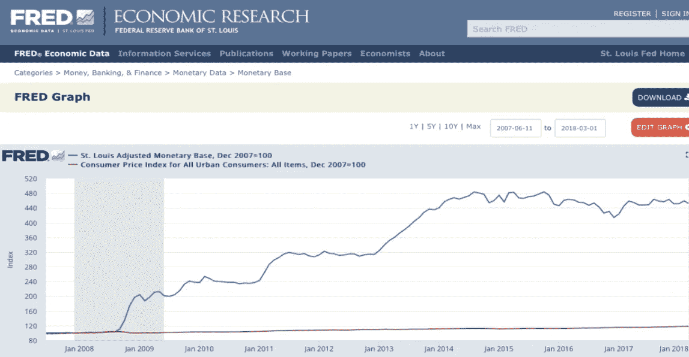
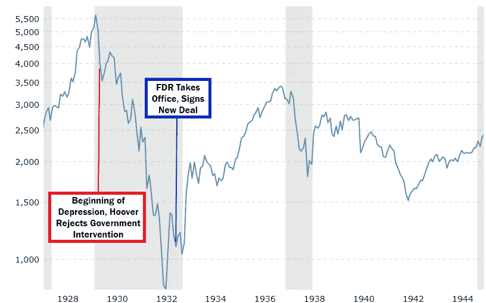
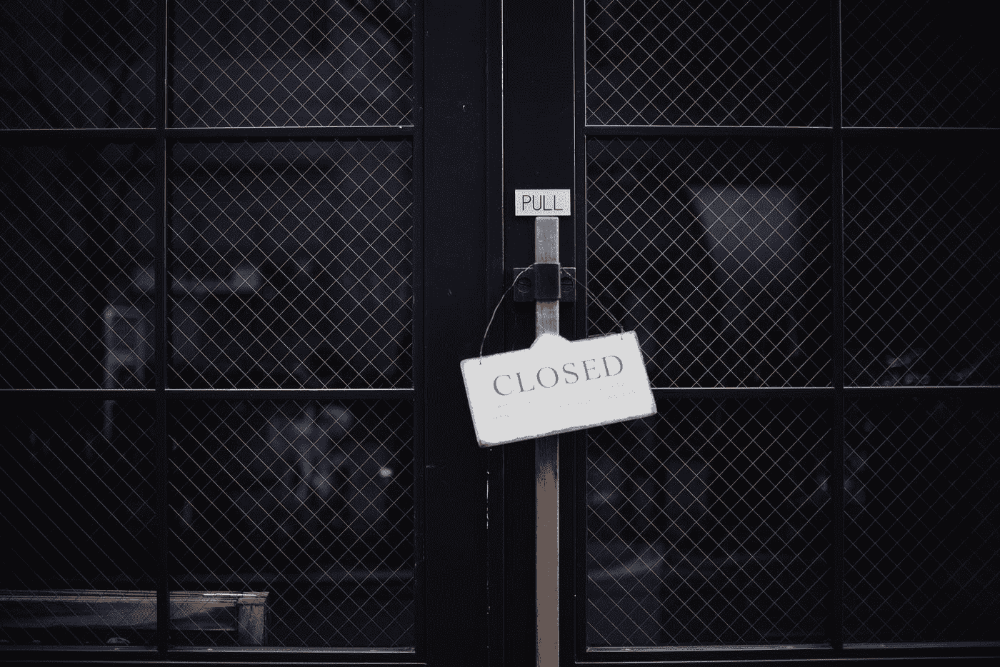
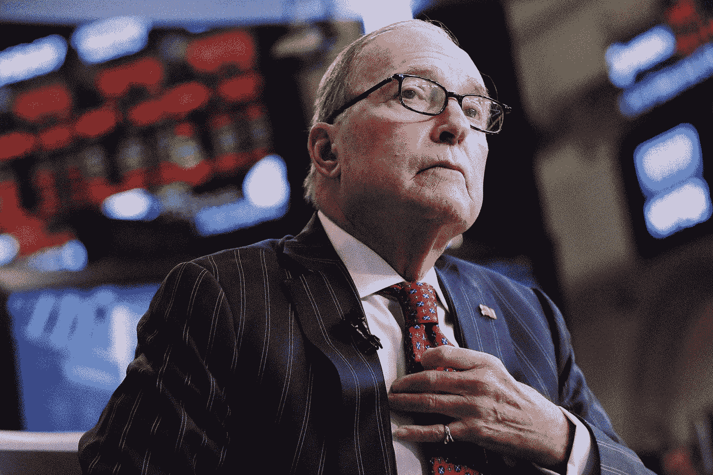

# 解释:什么是衰退，以及如何修复衰退

> 原文：<https://medium.datadriveninvestor.com/explained-what-is-a-recession-and-how-to-fix-it-bd9fd156d7e0?source=collection_archive---------0----------------------->

(Image Credit: [Markus Spiske](https://unsplash.com/@markusspiske?utm_source=medium&utm_medium=referral)/[Unsplash](https://unsplash.com?utm_source=medium&utm_medium=referral))

随着世界仍在新冠肺炎疫情的掌控之中，这种不确定性依然存在。不管你认为这场公共卫生危机有多严重或多琐碎，有一点可以肯定:它几乎肯定会把我们推向经济衰退。充其量，这将是一场衰退。在最坏的情况下，我们可能会面临近 100 年来从未见过的大萧条。那么，理解衰退到底是什么，是什么导致了衰退，以及我们如何才能最好地减轻它可能造成的持久损害，是值得的。

注意:经济学是一门极其复杂和微妙的学科。泡沫中不存在任何东西，在研究衰退这样的事情时，有无限的因素在起作用。这个解释会比较基础。我们的想法是向普通人传达尽可能多的信息，以便他们最好地理解我们当前的情况，并在未来几周和几个月内整理媒体的叙述。

> "用尽可能少的话来说，经济衰退是由消费者需求持续不足引起的。"

虽然我拥有金融学位，并因此对经济政策进行了深入研究，但我会尽最大努力让简单的概念和语言尽可能清晰简洁。

让我们开始吧。

# 什么是衰退？

字典对衰退的定义如下:“一段暂时的经济衰退时期，在此期间，贸易和工业活动减少，通常表现为连续两个季度的国内生产总值下降。”我们都知道这些迹象；失业率上升，消费支出下降，我们看到的不是增长，而是经济收缩。

衰退不仅常见，而且在很多方面都是健康的。在过去一个世纪的现代美国经济学中，我们看到了大约 8 年的增长周期，随后是 1-3 年的衰退，然后再次增长。衰退之间的平均时间大约是 8 到 12 年。

The Dow Jones Industrial Average, 1915 to present. Recessions are indicated with gray vertical bars. (Image Credit: [Macrotrends.net](https://www.macrotrends.net/1319/dow-jones-100-year-historical-chart))

## 它们为什么有益？

我们的经济理论假设持续增长。公司大多与前几年的数字进行比较；超过去年的利润，你做得很好。达不到去年的数字，可能有问题。

但是持续增长是很难做到的，尤其是当经济以异常快的速度增长的时候。因此，衰退有助于在泡沫变得过大之前“戳破泡沫”。泡沫越大，“pop”越大，经济下滑越厉害。健康的衰退循环有助于保护我们免受更严重的衰退——大萧条。如果上个世纪是一个指标的话，他们在这方面做得很好。我们已经经历了几次衰退，有些是小的，有些是大的，但我们已经避开了全面的萧条。他们就擅长这个。

 [## 如果资本主义失败了，那么还有什么选择呢？数据驱动的投资者

### 在当前政治领域的修辞之旅中，我们都可以面对面地接触到流行词汇，如…

www.datadriveninvestor.com](https://www.datadriveninvestor.com/2020/03/16/if-capitalism-is-a-failure-then-what-is-the-alternative/) 

# 什么导致了衰退/萧条？

用尽可能少的话来说，衰退是由消费者需求持续不足引起的。几乎总是由特定的危机引发——20 世纪 80 年代的储蓄和贷款危机，20 世纪 90 年代的互联网泡沫，以及 2008 年的房地产危机。所有这些都造成了整体经济脱离增长，进入收入下降期。这导致许多公司裁员，试图在收入下降时控制成本。

The 2008 housing crisis was caused when demand for homes dropped, and prices plummeted, leaving many upside-down in their mortgages. (Image Credit: [StockPicksSystem](http://www.stockpickssystem.com/housing-market-crash-2007/))

但为了保护利润而裁员造成了某种循环:由于拥有可支配收入的人减少，需求下降，因此公司裁员，这给消费者支出带来了下行压力，从而导致更多的裁员，等等。这就是为什么衰退不仅仅是短暂的“爆发”，仅限于激活事件/危机，迅速找到底部。他们在需求减少、就业减少的方向上创造动力，并需要一些时间来扭转局面，通常是通过行动来打破这种循环。

## 国会山保姆合作社

当你告诉普通人衰退仅仅是缺乏消费需求时，许多人会回避这个想法。当然，这要复杂得多，主要的经济因素和概念助长和推动了长期的低迷。正如我之前所说的，这在一定程度上是对的，但从本质上来说，衰退只是需求不足，这也是事实。

How a child care co-op explains a recession. (Image Credit: [Jordan Rowland](https://unsplash.com/@yakimadesign?utm_source=medium&utm_medium=referral)/[Unsplash](https://unsplash.com?utm_source=medium&utm_medium=referral))

为了证明这一点，我们可以用国会山保姆合作社的比喻来说明。这已经存在了一段时间，因诺贝尔经济学奖得主保罗·克鲁格曼(Paul Krugman)而变得流行起来。(如果你有机会，他关于经济和社会的大师课绝对是一个瑰宝。)大概是这样的:

一群工资不高的国会山职员，聚在一起免费帮助照看彼此的孩子，这样他们就可以轮流外出，而不会产生照看孩子的费用。为了确保平衡，没有人可以利用这个系统，他们创造了半小时保姆服务的代金券，并给每个参与家庭一个固定的金额，比如说 10 小时的托儿服务。

几个星期以来，一切都很顺利；一个家庭会出去，用掉他们的一大块代金券，然后通过给别人看孩子赚回来。然后有趣的事情发生了:他们慢慢不出门了。为了储存一些代金券，许多家庭想‘好吧，让我们这周呆在家里，照看孩子，多积累一些代金券，这样我们就有一些额外的代金券以备不时之需’。一个公平甚至负责任的决定。随着外出的家庭越来越少，对保姆的需求也下降了。随着需求下降，其他家庭继续持有各自的代金券。很快，没有人会出去，紧握着他们的代金券，在他们再次消费之前等待照看孩子的机会。

Waiting for the next babysitting job. (Image Credit: [Ethan Sykes](https://unsplash.com/@e_sykes?utm_source=medium&utm_medium=referral)/[Unsplash](https://unsplash.com?utm_source=medium&utm_medium=referral))

不知不觉中，他们制造了一场自给自足的衰退。他们照看孩子的“经济”陷入停滞。这很好地展示了衰退的机制:消费者持有他们拥有的钱，认为节俭比消费更有价值。

# 如何修复衰退

如果衰退仅仅是需求不足，那么解决办法也同样简单:增加需求。

但是怎么做呢？你不能仅仅要求人们走出去，花掉他们所有的钱来启动经济。谁想成为第一个，在他们的收入抵消不了他们雄心勃勃的支出的情况下，在他们走向经济崩溃的过程中碰运气呢？

How to get the charts going in the right direction again? (Image Credit: [Isaac Smith](https://unsplash.com/@isaacmsmith?utm_source=medium&utm_medium=referral)/[Unsplash](https://unsplash.com?utm_source=medium&utm_medium=referral))

回到国会山保姆合作社的案例，答案很简单:印更多的代金券。如果每个家庭平均有 10 个小时的保姆时间，并且坚持做下去，如果他们都被额外分配 10 个小时，会发生什么？突然之间，最不节俭的家庭更愿意出去，花掉他们 20 个小时中的一部分，而他们以前不愿意花掉 10 个小时中的大部分。这给了即使是最节俭的家庭剩余的代金券，他们也通过外出和放弃他们的一些储蓄代金券重新加入到照看孩子的“经济”中。就这样，这个系统恢复了健康，对所有参与方都有利。

全国性的衰退也是如此:为了创造更多的需求，你必须把钱放进消费者的口袋，让他们有东西可花。当他们花掉这些钱时，他们创造了对工作和服务的需求。这种需求再次创造了就业机会，从而创造了额外的收入、增长和更多可用于经济的可支配收入。当然，这代表了一个与我们之前讨论的衰退循环完全相反的循环。经济开始再次增长。

# 美国复苏史

肯定不会这么简单。我们的衰退肯定有更复杂的解决方案！我理解你的怀疑，但是让我们来看几个案例研究。

How did we get the clouds to part above America? (Image Credit: [Aaron Burden](https://unsplash.com/@aaronburden?utm_source=medium&utm_medium=referral)/[Unsplash](https://unsplash.com?utm_source=medium&utm_medium=referral))

## 大萧条

我国历史上最严重的经济衰退始于 1929 年。股市暴跌，导致一些银行倒闭，引发银行挤兑，导致更多银行倒闭，国家陷入萧条。许多人看到他们一生的积蓄瞬间化为乌有。这成了美国最灰暗的时刻之一。

我们是怎么逃脱的？庞大的政府开支。富兰克林·罗斯福在 1932 年末以压倒性胜利当选，他的政纲是政府引导的经济复苏。(三年前，共和党总统赫伯特·胡佛将复苏留给了私营部门，但毫无成效。稍后会详细介绍。)

Franklin D Roosevelt, American savior. (Image Credit: [NPR](http://npr.org))

罗斯福的“新政”耗资约 420 亿美元(按 2009 年美元计算为 6590 亿美元，稍后会有更多)。它旨在让美国重返工作岗位。其中很大一部分被用于使美国的基础设施成为世界上最先进的。我们修建了州际公路系统、水电大坝、公园、学校，扩建了邮局系统，等等。因为政府工作不允许与私营企业竞争，所以都流向了公共工程。

但它创造了就业机会。工作创造了收入，收入又创造了需求，慢慢的，美国在近 10 年后被从大萧条中拉了出来。

## 不是这样的！是二战救了我们！

这是一个常见的误解。人们只要看看基本的经济数据就知道，虽然第二次世界大战把我们推向了繁荣，但在美国参战之前，这个国家就已经开始复苏了。

FDR’s New Deal recovery and the rally created my WWII manufacturing are objectively different events. (Image Credit: [Macrotends.net](https://www.macrotrends.net/1319/dow-jones-100-year-historical-chart)/Michael Francis)

有趣的是，注意到二战对经济的影响:突然之间，为战争提供的高薪工作在制造业中出现了短缺。好工作意味着更多的收入，更多的收入意味着，你猜对了，更多的需求。

## 大衰退

快进到 80 年后的房地产泡沫和大衰退。以历史为参照，这次复苏并没有花那么长的时间。衰退始于 2007 年末。奥巴马赢得了 2008 年 11 月的选举，并于次年 1 月通过了《2009 年美国复苏和再投资法案》。以 2009 年美元计算，这一成本为 8400 亿美元(略高于罗斯福新政的 6590 亿美元)。它由多种措施组成，包括通过退税的方式直接刺激大多数公民。正如我们在下图中看到的，它基本上结束了经济衰退的循环，将经济转向了需求-增长-需求的循环。

There are few economic charts more impressive than seeing the effectiveness of the Obama administration’s stimulus package. (Image Credit: [Macrotreands.net](https://www.macrotrends.net/1319/dow-jones-100-year-historical-chart)/Michael Francis)

美国历史上两次最严重的经济衰退都是以同样的方式解决的:印更多的钱，然后把钱给那些花钱的人——中产阶级消费者。

## 但是通货膨胀！

对这种方法的一个常见反驳是担心急剧和突然增加货币供应将导致失控的通货膨胀——货币贬值，因此商品和服务价格飙升，抵消任何刺激的价值。通货膨胀本身就是一头野兽，所以我不会在这里深入解释为什么它不是直接真实的，但我会提供两点来充分消除这种恐惧。

首先是观察到增加货币供应不会直接或持续导致失控的通货膨胀。2008 年至 2018 年间，前美联储主席本·伯南克将美国货币供应量增加了五倍。(!！？)如果增加货币供应导致通胀，我们预计通胀会吞噬掉大部分货币价值。发生了什么事？嗯，没什么。在下面的图表中，你可以看到通货膨胀保持平稳，而货币供应量增加了五倍多。

Money supply is the blue line, inflation the nearly unchanged flat red line. (Image Credit: [FRED](https://fred.stlouisfed.org/)/[Masterclass](https://www.masterclass.com/classes/paul-krugman-teaches-economics-and-society/chapters/the-economic-theory-of-crises))

第二点:对抗通胀最简单的方法是提高利率(我不会在这里讨论这个理论，但你可以相信我的话)。由于目前的利率是有史以来最低的，如果我们开始看到通胀飙升，我们有办法防范通胀。

在我们目前的经济状况下，通过增加货币供应来实现的通货膨胀并不令人担忧。不要让任何人告诉你不是这样。

# 经济衰退时不要做什么

我们已经看到了什么是有效的，但值得检查什么是无效的，因为我怀疑我们将在未来几个月听到对糟糕政策的呼吁。

让我们回到 1929 年。就在引发大萧条的股市崩盘前几个月，共和党人赫伯特·胡佛当选总统。崩盘后，胡佛反对政府直接干预来应对大萧条，而是相信私营部门将是摆脱危机的出路。四年后，当这个国家仍然步履蹒跚时，他失败的政策以压倒性的优势输给了罗斯福成为总统后会奏效的政策。

Three years of relying on the free market, with nothing to show for it. (Image Credit: [Macrotrends.net](https://www.macrotrends.net/1319/dow-jones-100-year-historical-chart)/Michael Francis)

刺激私营企业或“就业创造者”似乎是一个同样合理的方法，至少从表面上看是如此，但仔细观察就会发现这种方法并不可行。假设你拥有一家小零售店，经济崩溃了。给企业主注入现金来支付开支，并雇佣新的劳动力，这有什么错？嗯，简而言之，还没有人可以购买你卖的东西。

你接受刺激，你开着灯，但没人会走进你的商店。需求问题没有解决。那么下个月会发生什么呢？你需要更多的帮助。

Without customers, cash only goes so far. (Image Credit: [Masaaki Komori](https://unsplash.com/@gaspanik?utm_source=medium&utm_medium=referral)/[Unsplash](https://unsplash.com?utm_source=medium&utm_medium=referral))

如果你直接把钱给企业，需求就会慢慢跟上。但是通过直接给消费者，他们反过来在这些企业消费，你就开始了复苏。重要的是要记住，通过给消费者现金，你知道他们会把钱花在经济中，给企业。因此，消费者口袋里的一美元比苦苦挣扎的企业口袋里的一美元产生的影响要大得多，这是显而易见的。

我提到这一点的原因是，我们已经听到了帮助企业抗击这场衰退的呼声。共和党人一次又一次地忽视经济复苏的历史，并坚持认为所有的事情最好留给私营部门去做。

就在本周，美国国家经济委员会主任拉里·库德洛(Larry Kudlow)提议将公司税率减半，以吸引公司回到美国。虽然这可能会创造一些就业机会，但这是有代价的:美国政府的公司税收收入减少。我们不应该忽视特朗普的减税政策已经削减了一次公司税，而且不清楚更低的税率会在多大程度上吸引公司回到美国。许多避税天堂提供非常低的公司税，有些甚至没有。以减少税收为代价与这些国家竞争是否明智？在我们的国家赤字已经超过 1 万亿美元的情况下，我们负担得起这样的政策吗？

Krugman says to help consumers. Kudlow says to help corporations. Krugman has 1 Nobel prize in Economics. Kudlow has 0\. (Image Credit: [Vanity Fair](https://www.vanityfair.com/news/2020/04/larry-kudlow-coronavirus-surprise))

更重要的是，既然知道美国人会把钱花在美国商业上，为什么不直接给他们刺激呢？这难道不是自由市场的魅力所在吗？消费者活动将把联邦资金支付给最值得的公司？这不就是保守派宣称的主张吗？既然你知道罗斯福和奥巴马的复苏已经做到了，那么当你可以救助美国消费者的时候，为什么仅仅救助企业，而冒着陷入胡佛式停滞的风险呢？

共和党人总是倾向于帮助大企业，而不是美国个人。如果你试图解决衰退，那就令人费解了:为什么不做我们知道已经奏效的事情呢？当心那些旨在利用危机进一步让最富有的美国人致富的故事。

# 最后

衰退的核心是简单的需求不足，这造成了经济收缩的反馈循环。我们以前见过他们，我们会再见到他们。每次复苏都是通过政府在消费者阶层的支出实现的。当我们知道什么可行的时候，为什么要尝试重新发明轮子呢？我们应该拒绝仅仅是理论的理论，相反，坚持遵循我们已经看到奏效的美国复苏的剧本。我们应该相应地要求出台政策，如果有必要的话，在 11 月的投票中要求出台政策。

*关注* [*迈克尔弗朗西斯*](https://medium.com/u/6656220d293?source=post_page-----bd9fd156d7e0--------------------------------) *上* [*中*](https://medium.com/u/504c7870fdb6?source=post_page-----dfffe06d908c----------------------) *和* [*推特*](https://twitter.com/MFrancisWrites) *获取更多，以及上***和*[*insta gram*](https://www.instagram.com/mfranciswrites/)*获取文章的短视频摘要。**