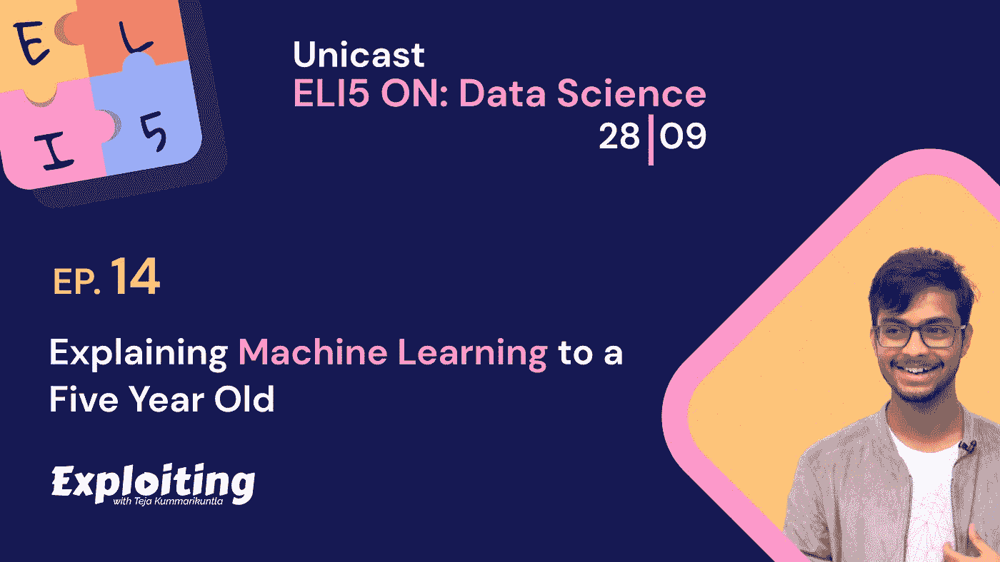

# 向一个五岁的孩子解释机器学习

> 原文：<https://medium.datadriveninvestor.com/explaining-machine-learning-to-a-five-year-old-kid-7abcc9b72a4b?source=collection_archive---------5----------------------->

剥削播客，ELI5:像我 5 岁一样解释。

所以，大多数时候，当我们向前迈出学习机器学习的一步时，我们要么找到一个复杂的数学公式海洋，要么找到一组代码行，

但是，我们真的不需要他们中的任何一个来做出清晰的直觉，

现在，你们中有多少人真正喜欢听音乐，如果你反省一下自己，当我们听音乐的时候，我们从来不会想到乐谱和音阶以及音乐的其他内在术语，而是我们喜欢我们听到的旋律，我们喜欢这些乐句中的感觉和深度，现在想想，机器学习也是一样的吗？真的只是一堆公式和代码，还是背后有什么旋律？

如果你不是公式和代码的爱好者，那你来对地方了。

 [## 什么是数据目录，它如何使机器学习取得成功？数据驱动的投资者

### 数据目录是机器学习和数据分析的燃料。没有它，你将不得不花费很多…

www.datadriveninvestor.com](https://www.datadriveninvestor.com/2020/08/27/what-is-a-data-catalog-and-how-does-it-enable-machine-learning-success/) 

那么，但是到底什么是机器学习呢？

让我先讲一个故事，

作为一个人，我们做出的大多数决定都是基于我们过去的经历，或者是过去几个月或几年的经历，对吗？

让我们假设这是一个雨季，罗宾非常想出去见他的朋友，但多云的天气让他想带一把伞，罗宾完全不知道是否要带？有趣的是，罗宾开始胡乱猜测这场雨，他开始观察鸟儿，看它们飞得高还是低？家里的青蛙有没有大声叫？更有趣的是，罗宾联系他的爸爸查看上周的降雨时间，他做了很多猜测，这些根据他的经验随机做出的猜测被戏称为预测。

Source: The Exploiting Podcast, ELI5

把同样的应用到计算机或者机器上，让它学习、思考、行动、做出这样的猜测所谓的预测，就是机器学习的全部。现在，机器如何像人类一样学习？正如 Robin 从他过去的经验中了解到的，猜猜看，机器可以从过去记录的数据中学习。

作为人类，我们根据直觉做出决定，而直觉是基于以前的经验。在某种程度上，机器学习是教计算机如何像人一样思考。

以下是我们如何以最简洁的方式定义机器学习:

> 机器学习是常识，除了由计算机完成。

**参考:** [探索机器学习](https://bit.ly/2Gk5xA8)作者:[路易斯·塞拉诺](https://serrano.academy/)在曼宁出版公司

**赞助商** : [Sundog 教育](https://sundog-education.com/)

## 访问专家视图— [订阅 DDI 英特尔](https://datadriveninvestor.com/ddi-intel)