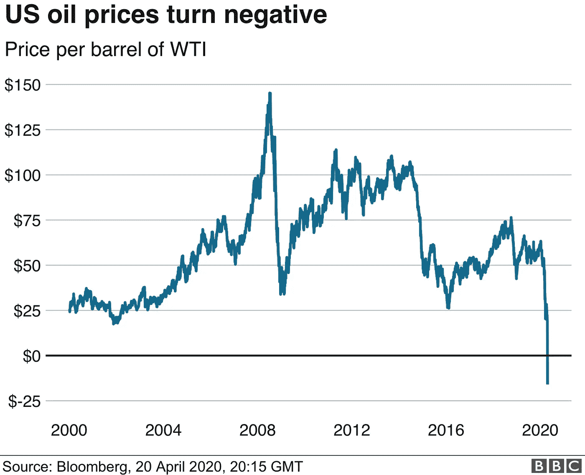
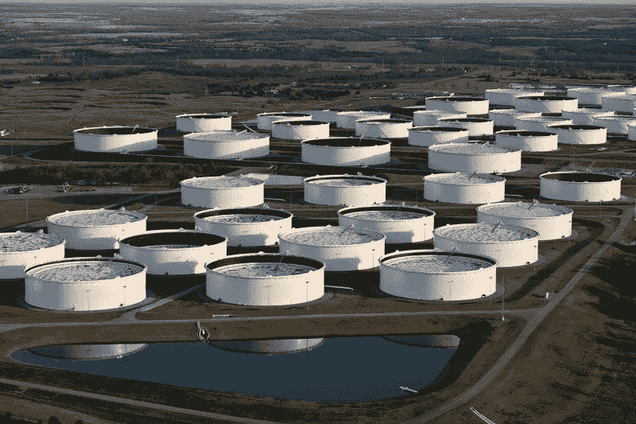

# 解释石油价格

> 原文：<https://medium.datadriveninvestor.com/explaining-the-price-of-oil-44da743f1e7e?source=collection_archive---------7----------------------->

## 每桶价格是怎么变成负数的？

[Spot price of WTI](https://www.bbc.com/news/business-52350082)

历史上第一次，在 2020 年 4 月 20 日，WTI(西德克萨斯中质油)的现货价格为负。价格达到[-](https://ycharts.com/indicators/wti_crude_oil_spot_price)每桶 36.98 美元。然而，就在第二天，现货价格升至 1.41 美元。石油现货价格怎么跌涨得这么快？负油价意味着什么？4 月 20 日价值 36.98 美元的石油，今天(4 月 25 日)价值 16.94 美元，这到底是怎么回事？本文将试图解释这些问题。

**石油贸易如何运作**

石油贸易是一个复杂的供应链，涉及到提炼者、精炼者和衍生品的最终销售者——运输和海运无处不在，都有一套必须遵守的义务(合同)。然而，为了本文的目的，让我们把重点放在 WTI 石油的未来合同上。WTI 是石油的一个等级。期货合约是一种允许人们在未来某个确定的日期购买或出售某种商品(这里指的是石油)的合约。例如，从技术上来说，[可以在 2031 年 2 月](https://www.cmegroup.com/trading/energy/crude-oil/light-sweet-crude.html)买入/卖出一份购买 WTI 石油的期货合约。人们还可以看到正在发生的交易量，只是为了了解未来合约有多大的利益。例如，现在 2024 年 12 月接收/交付石油的合约交易价格为 43.30 美元，交易量为 413 份合约。

 [## 机器学习和 NLP 能预测石油的崩溃吗？答案是肯定的。|数据驱动…

### 2020 年 4 月 20 日，WTI 原油期货(美国原油基准)历史上首次达到负…

www.datadriveninvestor.com](https://www.datadriveninvestor.com/2020/05/04/could-machine-learning-and-nlp-have-predicted-oils-crash-the-answer-is-yes/) 

[Oil Storage in Cushing, Oklahoma](https://www.npr.org/2015/03/30/395776212/with-so-much-oil-flowing-u-s-may-be-reaching-storage-limits)

俄克拉荷马州的库欣是一个大约有 7 500 人的小镇。这座城镇在石油市场上意义重大——通常被称为[“世界石油管道的十字路口”](https://www.investopedia.com/terms/w/wti.asp)。这是因为该镇拥有美国石油总储量的 13%。它也是大多数 WTI 期货合约的结算和交割点。

**投机和合约交易**

石油市场的另一层复杂性是参与期货合约交易的投机者。为了在市场上投机，人们不一定要持有一桶石油或实际上想要购买一桶石油。人们可以简单地购买一份合同(做多),然后如果油价上涨，他们可以在到期日之前卖出合同赚钱。如果价格下跌，他们就会放松银根。如果他们认为油价会下跌，他们也可以“做空”。他们只是借入一种未来控制权，将其出售，当价格下跌时，再将其买回，并归还给借入方。合同的贷方通过溢价收回他们的合同。如果价格下跌，投机者就会赚钱。通过这种方式，许多公司、基金和个人投机者在市场上买卖合同，却从未计划购买实际的石油桶。只要在到期时，持有期货合同的每个人都想要石油，市场就处于均衡状态。

纵观现代历史，石油价格总是保持正值，因为对石油有一定的需求。然而，由于全球石油需求持续下降，以及俄罗斯和沙特阿拉伯之间的价格、产量和市场份额战争，石油供应同时增加，需求同时下降。

这最终导致石油现货价格暴跌，因为 4 月份的期货合约将于 21 日到期。就在这个关键日期之前，发生了一系列事情。首先，石油的过度生产填满了世界上的许多储存空间。其次，全球石油需求大幅下降。第三，由于储存空间的填满，很少有未来合同的持有者真正想要石油——因为一旦合同到期，合同规定一方有义务到达俄克拉荷马州的库欣收集和结算他们的合同。4 月 20 日，油价达到了-36.98 美元，因为期货合同的持有者实际上是在付钱给人们，让他们承担合同义务，从他们手中收集石油。这也是为什么，就在第二天，当油价的下一个参考日期是 5 月 21 日到期的期货合约时。

这种情况还会发生吗？

据市场观察报道，石油的储存空间正在耗尽。美国的石油储存空间将在大约两个月后达到最大容量。因此，到下个月，如果对石油的需求没有增加，油价肯定会再次下跌，而且程度会更高。有增加石油储存空间的举措。[一家石油管道公司](https://oilprice.com/Latest-Energy-News/World-News/Energy-Transfer-Asks-For-Permission-To-Turn-Pipelines-To-Oil-Storage.html)正在寻求德克萨斯铁路委员会的许可，将他们的两条管道改造成仓库。因此，如果全球石油需求继续下降，更多关于石油的坏消息肯定会出现。

**访问专家视图—** [**订阅 DDI 英特尔**](https://datadriveninvestor.com/ddi-intel)