# 法国 YouTube 视频统计趋势的探索性数据分析

> 原文：<https://medium.datadriveninvestor.com/exploratory-data-analysis-of-trending-youtube-video-statistics-in-france-48aaa860f832?source=collection_archive---------1----------------------->

猜猜 2018 最喜欢的视频是哪个 K-pop 组合 BTS DNA！！！


# 什么是探索性数据分析？

探索性数据分析(EDA)是一种分析数据集以总结其主要特征的方法，通常采用可视化方法。这一步非常重要，尤其是当我们为了应用机器学习而对数据进行建模的时候。EDA 中的绘图包括直方图、箱线图、散点图等等。研究这些数据通常要花很多时间。通过 EDA 的过程，我们可以要求在我们的数据集上定义问题陈述或定义，这非常重要。

# 我们正在探索的数据

YouTube 促进了机构和个人之间的接触，例如大学和未来学生之间的接触，以及企业和雇员之间的接触。此外，一些 YouTube 视频提高了对社会问题的认识，扩大了社会接触，克服了对少数群体和少数群体观点的成见。

[](https://www.datadriveninvestor.com/2020/02/12/has-general-ai-exceeded-the-intellectual-capacity-of-humans/) [## AI 将军是否已经超过了人类的智力容量？数据驱动的投资者

### 不仅在游戏中，而且在劳动力市场上，机器都比人类聪明。在今天的许多领域，使用…

www.datadriveninvestor.com](https://www.datadriveninvestor.com/2020/02/12/has-general-ai-exceeded-the-intellectual-capacity-of-humans/) 

该数据集是热门 YouTube 视频的每日记录，来自 Kaggle [趋势 YouTube 视频统计，](https://www.kaggle.com/datasnaek/youtube-new)该数据集包括几个月(还在统计)的每日趋势 YouTube 视频数据。包括美国、英国、德国、加拿大和法国地区(分别为美国、英国、德国、加拿大和法国)的数据，每天最多可列出 200 个趋势视频。

# 我们开始吧！！！

1.  **导入 EDA 所需的库**

以下是本教程中用于执行 EDA(探索性数据分析)的库。**完整代码可以在我的** [**GitHub**](https://github.com/zahrael97/Data-Exploration-of-Trending-YouTube-Video-Statistics-Dataset) 上找到。

```
**# Importing required libraries.**
import numpy as np
import pandas as pd
import matplotlib.pyplot as plt
import seaborn as sns
import json
from datetime import datetime
from matplotlib import cm
```

**2。将数据加载到数据框中。**

将数据加载到 panda 的数据框中无疑是 EDA 中最重要的步骤之一，我选择了在 Kaggle 内核上工作，您可以在法国数据集上在线找到[这里](https://www.kaggle.com/zahraelhamraoui/data-exploration-of-trending-youtube-video-statist/)，所以让我们开始吧！！！

```
youtube = pd.read_csv("../input/youtube-new/FRvideos.csv")
youtube.head()
```

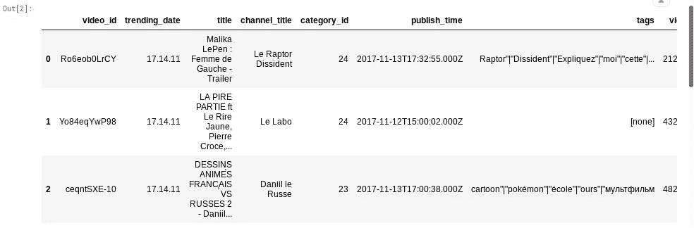

如果我们查看`trending_date`或`publish_time`列，我们会发现它们的日期时间数据格式不正确。

```
youtube['trending_date'] = pd.to_datetime(youtube['trending_date'], format='%y.%d.%m') 
youtube['publish_time'] = pd.to_datetime(youtube['publish_time'], format='%Y-%m-%dT%H:%M:%S.%fZ')
youtube['category_id'] = youtube['category_id'].astype(str)
```

让我们来看看数据的开头:

```
**# To display the top rows**
youtube.head()
```

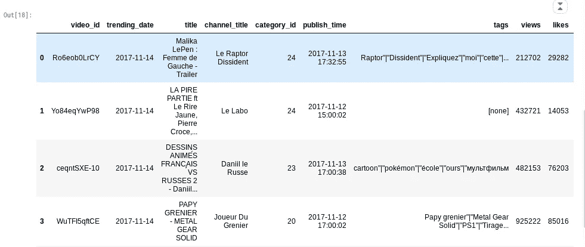

# data.info()

它返回范围、列、每列的非空对象数、数据类型和内存使用情况。

```
youtube.info()
```


**describe()** 方法用于计算一些统计数据，如系列或数据框数值的百分位数、平均值和标准差。它分析数字和对象序列，以及混合数据类型的 DataFrame 列集。

```
youtube.describe()
```

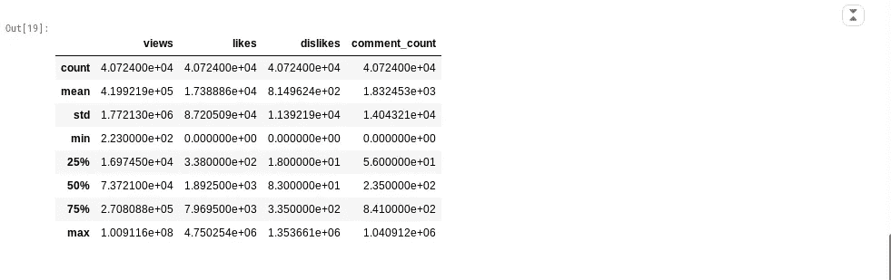

**将类型改为统一格式:**

一些列的数据类型被熊猫不恰当地注册。例如，`views`、`likes`以及类似的列只需要`int`数据类型，而不需要`float`(为了节省内存)，或者`category_id`，一个名义属性，不应该携带`int`数据类型。

重要的是我们自己适当地分配它们的数据类型

```
type_int_list = ['views', 'likes', 'dislikes', 'comment_count']
for column in type_int_list:
    youtube[column] = youtube[column].astype(int)type_str_list = ['category_id']
for column in type_str_list:
    youtube[column] = youtube[column].astype(str)
```

每个地区的数据都在一个单独的文件中。数据包括视频标题、频道标题、发布时间、标签、观看次数、喜欢和不喜欢的内容、描述和评论数。

该数据还包括一个`category_id`字段，该字段因地区而异。要检索特定视频的类别，请在相关的`JSON`中找到它。数据集中五个区域的每一个都包含一个这样的文件。

```
# creates a dictionary that maps `category_id` to `category`
id_to_category = {}with open('../input/youtube-new/FR_category_id.json', 'r') as f:
    data = json.load(f)
    for category in data['items']:
       id_to_category[category['id']] = category['snippet']['title']id_to_category
```

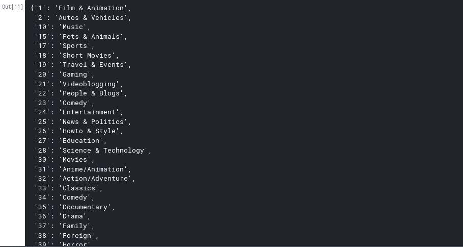

```
youtube.insert(4, 'category', youtube['category_id'].map(id_to_category))
```

# 相关性分析和热图

可视化视图和喜欢之间的关联

```
plt.scatter(youtube['views'], youtube['likes'])
```

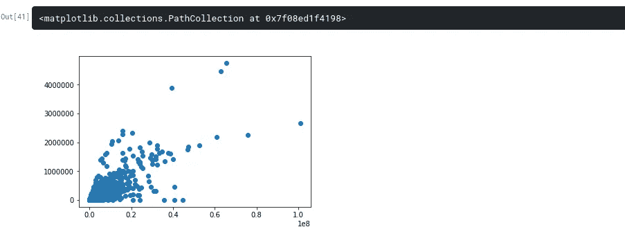

sns.regplot(x=’views’,y=’likes’,data=train)
plt.title(‘Correlation between views and likes’)

观点和喜欢之间的相关性

```
sns.regplot(x='views',y='likes',data=youtube)
plt.title('Correlation between views and likes')
```

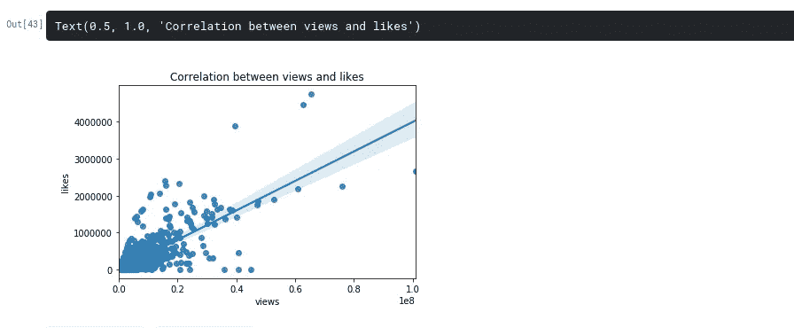

```
keep_columns = ['views', 'likes', 'dislikes', 'comment_count'] 
corr_matrix = youtube[keep_columns].corr()
corr_matrix
```

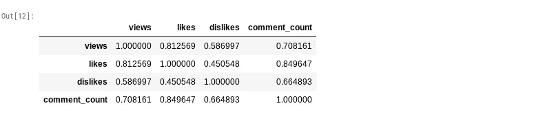

```
sns.heatmap(us_df[['views' , 'likes' , 'dislikes' , 'comment_count']].corr(), annot = True, fmt = ".2f")
plt.show()
```

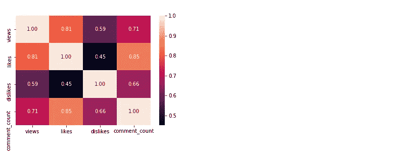

# 趋势日期是什么？

```
youtube['publish_time'] = pd.to_datetime(youtube['publish_time'])
youtube['diff'] = (youtube['trending_date'] - youtube['publish_time']).dt.days
youtube[['trending_date'  ,'views']].set_index('trending_date').plot()
```

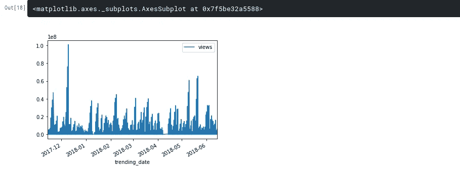

# 2018 年哪个标题的赞数和浏览量最多？

我们必须从日期时间中提取适当的年份。

```
youtube['publish_time'] = pd.to_datetime(youtube['publish_time'] ).dt.strftime('%d-%m-%Y')
youtube['publish_year'] =youtube['publish_time'].str.split('-',expand=True)[2]
youtube['publish_time'] = pd.to_datetime(youtube['publish_time'] )
youtube.info()
```

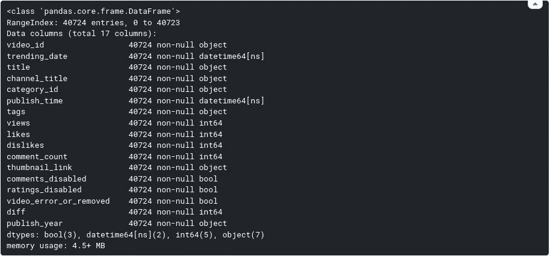

```
most = youtube['publish_year'] == '2018'
temp = youtube[most]Max2018L = temp['likes'].max()
Max2018V = temp['views'].max()
most1 = temp['likes'] == Max2018L
most2 = temp['views'] == Max2018Vtemp[ most1 | most2 ]
```

所以一个 BTS 音乐视频是 2018 yeeey go k-pop 最喜欢的视频

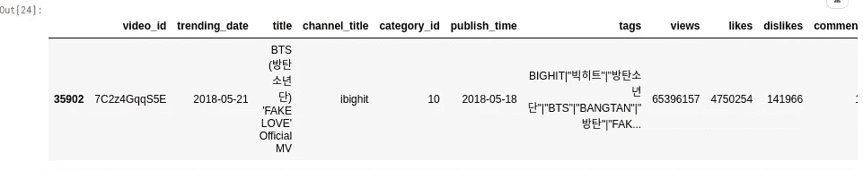

# 结论:

我很高兴与你分享一个非常简单的数据探索，用这么简单的话，即使没有学术背景的人也能理解。

我希望我能向你的机器学习解释清楚一点，我会上传更多算法的解释，因为为什么不:)

[Github](https://github.com/zahrael97)

[领英](https://www.linkedin.com/in/zahraelhamraoui97/)

Zahra Elhamraoui


# 感谢您的阅读和…