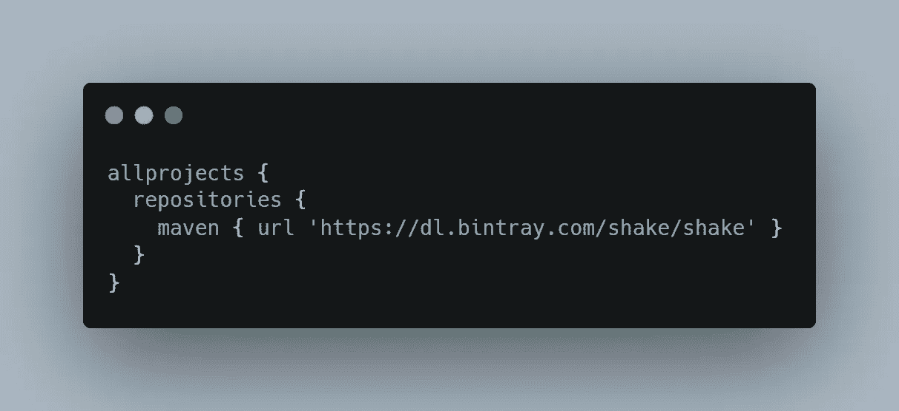
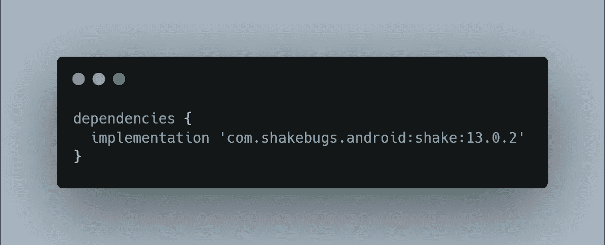
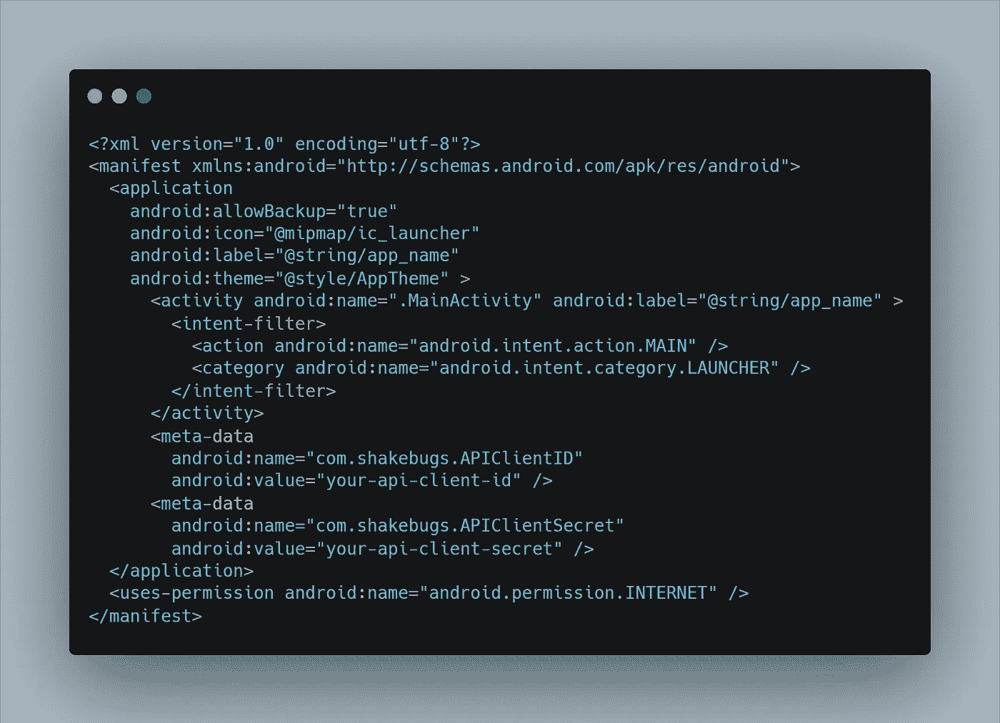

# 探索 Shake SDK — Android

> 原文：<https://medium.datadriveninvestor.com/exploring-shake-sdk-android-13c3769c7921?source=collection_archive---------5----------------------->

## 修复错误的速度提高了 50 倍


[Credits](https://decode.agency/wp-content/uploads/2020/04/shake.png)

# 介绍

Shake 是一款针对 iOS 和 Android 应用的 bug 报告 SDK。这是一个强大的工具，很容易与其他错误报告工具相比，如 **Instabug** 或 **Crashlytics** 。在本文中，我将探索 Shake SDK 的一些主要特性，它的好处，以及如何将它集成到您的 Android 项目中。

随着 Shake SDK 添加到您的应用程序中，您的测试人员可以在 5 秒钟内报告任何错误。它将获取开发人员需要的所有额外信息，并将其发送到 Shake web dashboard:

Shake SDK 自动捕获以下信息:

*   测试仪的设备型号
*   应用和操作系统版本
*   当前视图
*   水龙头的历史
*   互联网连接
*   CPU 和内存使用情况
*   授予的权限列表
*   有用数据列表等等

# 顶级功能

下面列出了以下主要特性。

*   屏幕录制
*   捕获的日志
*   制作自己的用户界面

# 屏幕录制

屏幕记录是最好的功能，你可以很容易地观看一个 30 秒的视频测试人员在报告之前做了什么。

你可以简单地用这个👉[。setAutoVideoRecording(true)](https://www.shakebugs.com/docs/android/screen-recording)

# 捕获的日志

日志捕获是 Shake SDK 的另一个很酷的功能，通过它你可以自动看到所有用户点击的时间线，他们的网络流量，自定义事件，如果你想的话，甚至可以下载一切。

你可以简单地用这个👉[。log()](https://www.shakebugs.com/docs/android/activity)

# 制作自己的用户界面

我最喜欢这个功能，这个功能用于从后台报告错误，不显示任何 SDK UI，称为静默报告。

你可以简单地用这个👉[。silen report()](https://www.shakebugs.com/docs/android/silent-reports)

# 摇动 SDK 与 Android 的集成

要将 SDK 集成到您的 Android 项目中，我们需要遵循以下步骤。

# 步骤 1:添加 Maven 资源库

首先，我们需要向顶层`build.gradle`添加一个 Maven 知识库，如下面的代码片段所示:



build.gradle file

# 步骤 2:添加依赖关系

然后，我们需要在`build.gradle`文件中添加一个 Shake 依赖项，如下面的代码片段所示:



build.gradle file

> 注意:如果你使用 Progaurd，那么不要忘记添加这些规则。👇

```
-keep public class com.shakebugs.shake.internal.data.** {
    public protected private *;
}
```

# 步骤 3:添加客户端 ID 和客户端密码

将客户端 Id 和客户端秘密作为元数据添加到`AndroidManifest.xml` 文件，如下所示:

[](https://www.datadriveninvestor.com/2020/04/29/privacy-guidelines-about-app-development/) [## 隐私指南，关于应用开发|数据驱动投资者

### 挪威隐私机构 DPA 对当地的一个现实处以 20 万欧元的罚款，原因是…

www.datadriveninvestor.com](https://www.datadriveninvestor.com/2020/04/29/privacy-guidelines-about-app-development/) 

你可以在这里找到客户端 Id 和客户端密码👉[工作区设置](https://app.shakebugs.com/settings/workspace#general)。



AndroidManifest.xml file

# 步骤 4:为较低版本的 SDK 添加服务

面向 SDK 版本 28 和更低版本。Shake SDK 的目标是最新的 Android 版本，即 29 (Android 10)。如果您的应用程序`targetSdkVersion`是 28 或更低版本(在您的项目`build.gradle`中定义)，您必须手动将服务定义添加到您的清单文件中，否则构建将不会成功。打开 man feist . XML 文件并添加以下内容👇

```
<service android:name="com.shakebugs.shake.internal.service.ScreenRecordingService"
    tools:node="replace"/>
```

> 注意:如果您的目标是 Android API 28 和更低版本，并且没有将此服务定义添加到您的清单中，您将会得到以下错误:
> 
> AAPT:错误:找不到属性 android:foregroundServiceType。

# 步骤 5:初始化 SDK

完成所有设置后，我们只需在应用程序类中初始化 SDK，如以下代码片段所示:

```
class App : Application() {
    override fun onCreate() {
        super.onCreate()
        Shake.start(this)
    }
}
```

现在，运行您的应用程序并检查结果。

# Shake SDK 定价:

它有两种定价模式，**免费&付费** &当然，你可以在付费版本中利用更多的功能。你可以从下面的截图中查看价格。


Official Shake SDK Pricing ScreenShot

> 注:在撰写本文时，定价为 50 美元，但您可以从[网站定价页面](https://www.shakebugs.com/pricing)查看最新定价。

# 好处:

关于 Shake SDK，我很想和大家分享以下一些好处。

*   快速和轻量级(自 2012 年以来，它在运行操作系统的设备上反应完美)
*   没有不必要的依赖(没有不必要的第三方依赖)
*   安全措施(保护您的数据安全)
*   无限的团队成员(根据需要邀请尽可能多的成员)
*   应用内 bug 检查(就像在浏览器中右键单击开发者工具一样。但是在你的应用里。免费)

# 结论

在这篇文章中，我探索了 Shake SDK(一个错误报告工具)，SDK 提供的一些主要的顶级特性，我还解释了如何轻松地集成到您的 Android 项目中。

与其他 bug 报告工具相比，我发现 Shake 是一个非常令人印象深刻的工具，它让开发人员的生活变得更加轻松。

只需几秒钟，您的应用程序用户就可以轻松报告他们的问题。

希望这篇文章有帮助。如果你认为缺少了什么，有问题，或者想提供任何想法或建议，请在下面留下评论。我会感谢你的反馈。

我写了一些其他与 Android 相关的内容，如果你喜欢这里的内容，你可能也会喜欢:

[](https://android.jlelse.eu/implement-in-app-update-in-android-68892bd11e35) [## 在 Android 中实现应用内更新

### 确保你的应用程序的每个用户都是新版本。

android.jlelse.eu](https://android.jlelse.eu/implement-in-app-update-in-android-68892bd11e35) [](https://android.jlelse.eu/define-resource-layout-id-in-the-constructor-activity-fragment-with-androidx-a9f80674f185) [## 用 AndroidX 在构造函数活动/片段中定义资源布局 Id

### 减少活动/片段中的方法数量

android.jlelse.eu](https://android.jlelse.eu/define-resource-layout-id-in-the-constructor-activity-fragment-with-androidx-a9f80674f185) 

如果您想了解更多，请查看下面的官方链接:

 [## 摇晃

### 编辑描述

www.shakebugs.com](https://www.shakebugs.com/) 

分享(知识)是关怀😊感谢阅读这篇文章。如果你觉得这篇文章有帮助，一定要鼓掌或推荐。这对我意义重大。

如果你需要任何帮助，请加入我的 [**Twitter**](https://twitter.com/DanishAmjad10) ， [**LinkedIn**](https://www.linkedin.com/in/danish-amjad-06a43090/) ， [**GitHub**](https://github.com/DanishAmjad12) **，**并订阅我的 [**Youtube 频道**](https://www.youtube.com/channel/UC06GphxCS1gzZhdT9dn6kQA?view_as=subscriber) 。

## 访问专家视图— [订阅 DDI 英特尔](https://datadriveninvestor.com/ddi-intel)