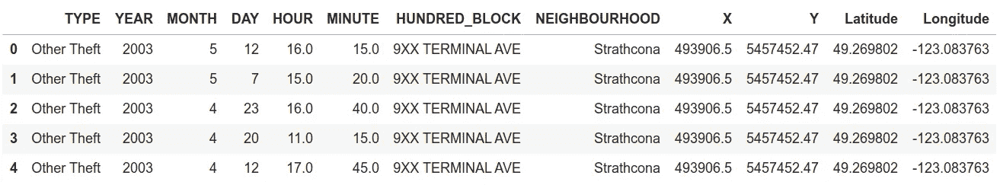
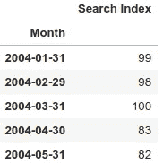
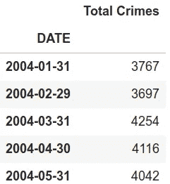
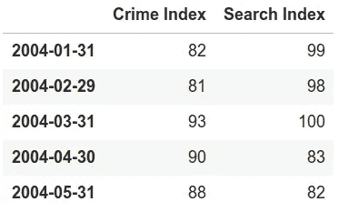
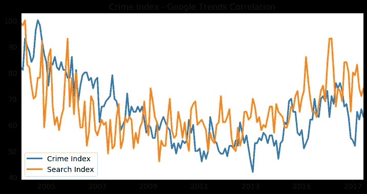
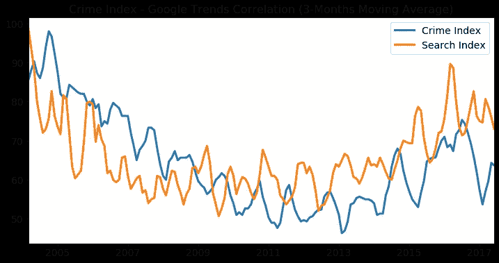
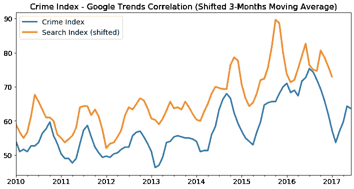
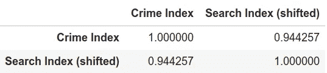

# 使用 Python 探索犯罪和谷歌搜索数据之间不可思议的联系

> 原文：<https://medium.datadriveninvestor.com/exploring-the-inconceivable-link-between-crime-and-google-search-data-using-python-15c0d2b3a161?source=collection_archive---------9----------------------->

## 一项由 python 主导的革命性分析，旨在探索谷歌趋势数据和犯罪之间的关系。


Photo by [Kai Pilger](https://unsplash.com/@kaip?utm_source=medium&utm_medium=referral) on [Unsplash](https://unsplash.com?utm_source=medium&utm_medium=referral)

每秒 63，000 次——每分钟 380 万次——每小时 2.28 亿次——每天 56 亿次……这些过高的数字仅仅反映了使用**谷歌搜索**引擎不断发生的**搜索**的数量。当其他人只是看到数字的时候，**数据科学家看到了机会**。如果一个人能够访问和分析如此大量的数据，他/她将能够形成对整个世界的理解。

“整个”这个词是按字面意思使用的。人们使用谷歌做一切事情，没有任何限制。从医生到经济学家，再到恐怖分子，他们都从谷歌提供给他们的信息中找到了价值。也就是说，断言这些数据可能提供的价值优于人类已知的任何其他形式的信息收集是完全自然的。这背后的主要原因是一个简单但至关重要的事实:

*“谷歌趋势”是人类已知的唯一资源，能够为整个世界提供完整的思维地图。*

有人说**“爱无止境”**。我认为更合适的引语应该是:

> “谷歌搜索数据没有界限”

从政客到罪犯，**每个人的**搜索查询都被**记录**。这条规则绝对没有例外。因此，一个至关重要的问题出现了… **从“谷歌趋势”中导入的与犯罪相关的谷歌搜索是否可以作为实际犯罪数量的指标？**

这就是本文要确定的…

*如果你喜欢这篇文章，并且有兴趣免费接收每月独家内容，可以在本文末尾订阅我的独家邮件列表(也可以从* [*这里*](https://bit.ly/filipposmaillist) *直接访问)。*

# 目录

*   [*简介*](#ab58)
*   [*准备数据集和工作环境*](#2d78)
*   [*执行分析*](#f3a8)
*   [*结果/结论*](#ae98)

# 准备数据集和工作环境

*演示分析不需要任何主题的专业知识，任何相关方都可以轻松理解。


Photo by [Kai Wenzel](https://unsplash.com/@kai_wenzel?utm_source=medium&utm_medium=referral) on [Unsplash](https://unsplash.com?utm_source=medium&utm_medium=referral)

首先，需要安装受支持的 python 版本。为此，请导航到此[链接](https://www.python.org/downloads/)，并按照所选操作系统的说明进行操作。

我将使用 [Python 3.6.9](https://www.python.org/downloads/release/python-369/) 和 [Ubuntu](https://ubuntu.com/) 18.04.4 LTS 作为我的操作系统。然而，所有受支持的 python 版本都是受欢迎的。

在继续安装所需的库之前，还必须安装 pip。(我很确定 pip 在 2.7.9 之后的所有 python 版本中都有，但是如果 pip 还没有安装，请遵循[这个](https://pip.pypa.io/en/stable/installing/)指南。)


## 图书馆

以下库应该与 pip 一起安装:

```
pip3 install numpy
pip3 install pandas
pip3 install matplotlib
pip3 install seaborn
```

## 资料组

拥有正确的数据集无疑是任何数据科学项目最重要的方面之一。在这种情况下，需要两个不同的数据集:

*   包含特定区域犯罪详细信息的数据集。
*   一个包含“谷歌趋势”数据的数据集，涉及同一地区的犯罪相关关键词。

对于这个项目的震动，我将使用由威廉·奥萨库在 Kaggle 上提供的“温哥华犯罪”数据集。它包含了从 2003 年 1 月 1 日到 2017 年 7 月 13 日在不列颠哥伦比亚省温哥华发生的 530，652 起犯罪记录。

我选择使用这个特定的数据集，因为它也提供相同位置的 google 搜索数据。换句话说，可以同时采集两个所需的数据集(可以从[这里的](https://www.kaggle.com/wosaku/crime-in-vancouver)访问)。

# 执行分析

既然已经正确设置了环境，那么是时候研究数据并执行分析了。值得一提的是，任何人都可以遵循这个分析，因为它不是代码密集型的。

首先，我将导入必要的库以及两个数据集。

虽然我知道新创建的数据帧的大致内容，但仍有许多未知。最紧迫的问题围绕着每个数据帧所包含的不同特征。



Crimes Dataframe



Google Trends Dataframe

问题可以立即被发现。“谷歌趋势”数据框架的输入似乎开始于 2004 年 1 月 31 日。另一方面，犯罪数据框架似乎存储该日期之前的数据。经过一些额外的检查，犯罪历史数据似乎从 2003 年开始，一直持续到 2017 年 7 月。

这样的现象显然是不可取的。两个数据帧具有完全相同的形状和大小是至关重要的(将会发生一些额外的数据调整)。



两个数据集现在具有完全相同的形状、大小，并且覆盖相同的时间段。

“犯罪总数”栏表示每个月发生的犯罪数量。不幸的是，在目前的格式下，它无法与“谷歌趋势”的数据相比较。为了解决这个问题，将创建一个名为“犯罪指数”的新功能。这种功能将被用来分析与谷歌搜索相关的数据。

犯罪最多的月份的“犯罪总数”列中的值将被替换为数字“100”。所有其他值将相应地被替换(相对于 100)。

现在两组数据都在相同的范围内(0 - 100)。为了进行理想的比较，这两个帧将被合并成一个。



最初的分析现在差不多完成了。为了直观显示相关性，我将并排绘制两个数据集(通过组合的数据框架)。



通过检查图表可以得出许多结论。有趣的是，这种现象似乎在 2010 年开始出现。

为了让图表变得更加清晰，我将使用 3 个月移动平均线。



为了更好地理解当时发生了什么，我将使用“-5”移位，只关注 2010 年以后的 3 个月移动平均线数据。



数据集之间的相关性非常明显！问题是相关的确切值是多少？



显而易见，谷歌搜索的移动平均值和实际犯罪数量之间有着极高的相关性。

# 结果/结论

在进行了必要的分析后，很明显，在某个地区发生的**谷歌搜索**的数量和**犯罪**的数量之间存在着**极高的相关性**。

换句话说，**谷歌趋势可以成为确定犯罪水平的有效指标**。这对于可用的犯罪相关数据有限或不存在的地区可能非常有用。

如果有人有兴趣进行类似的分析，这里有一些 Kaggle 提供的世界不同地区的数据集:

*   [芝加哥](https://www.kaggle.com/chicago/chicago-crime)
*   [印度](https://www.kaggle.com/rajanand/crime-in-india)
*   伦敦
*   [丹佛](https://www.kaggle.com/paultimothymooney/denver-crime-data)

## 下一步

我始终认为，仅仅完成一个项目是不够的。每一次完成的冒险都为下一次冒险打开了大门。基于这一前提，下一步是创建一个能够预测未来犯罪的 ML/DL 模型。

[](https://www.datadriveninvestor.com/2020/02/26/surviving-in-a-digital-age-of-instability/) [## 在不稳定的数字时代生存|数据驱动的投资者

### 如果你是一名计算机科学家，你可能已经注意到新的框架不断出现。编程…

www.datadriveninvestor.com](https://www.datadriveninvestor.com/2020/02/26/surviving-in-a-digital-age-of-instability/) 

# 你想了解更多吗？

如果你想**提高你的知识**，并且对**用机器学习赚钱感兴趣**，我**强烈鼓励你**阅读下面**列出的文章**:

[](https://medium.com/swlh/did-i-just-succeed-in-detecting-breast-cancer-from-a-single-image-with-python-and-machine-learning-3ed24780e354) [## 我刚刚是不是成功地用 Python 和机器学习从单幅图像中检测出了乳腺癌？

### 如何结合 Python 和 ML 检测一个人是否患有乳腺癌的完整指南 98.24%…

medium.com](https://medium.com/swlh/did-i-just-succeed-in-detecting-breast-cancer-from-a-single-image-with-python-and-machine-learning-3ed24780e354) [](https://medium.com/datadriveninvestor/millennials-this-is-the-unconventional-money-making-technique-you-were-looking-for-3b47c7384c60) [## 千禧一代！这是你一直在寻找的非常规赚钱技巧

### 如何使用 python 和 ML 以 0 美元启动资金制作成千上万的完整蓝图。

medium.com](https://medium.com/datadriveninvestor/millennials-this-is-the-unconventional-money-making-technique-you-were-looking-for-3b47c7384c60) [](https://medium.com/datadriveninvestor/predicting-oil-prices-with-machine-learning-and-python-324153c457ba) [## 用机器学习和 Python 预测油价

### 使用 Python 和机器学习预测“黑金”价格的完整指南，误差小于 0.3%

medium.com](https://medium.com/datadriveninvestor/predicting-oil-prices-with-machine-learning-and-python-324153c457ba)