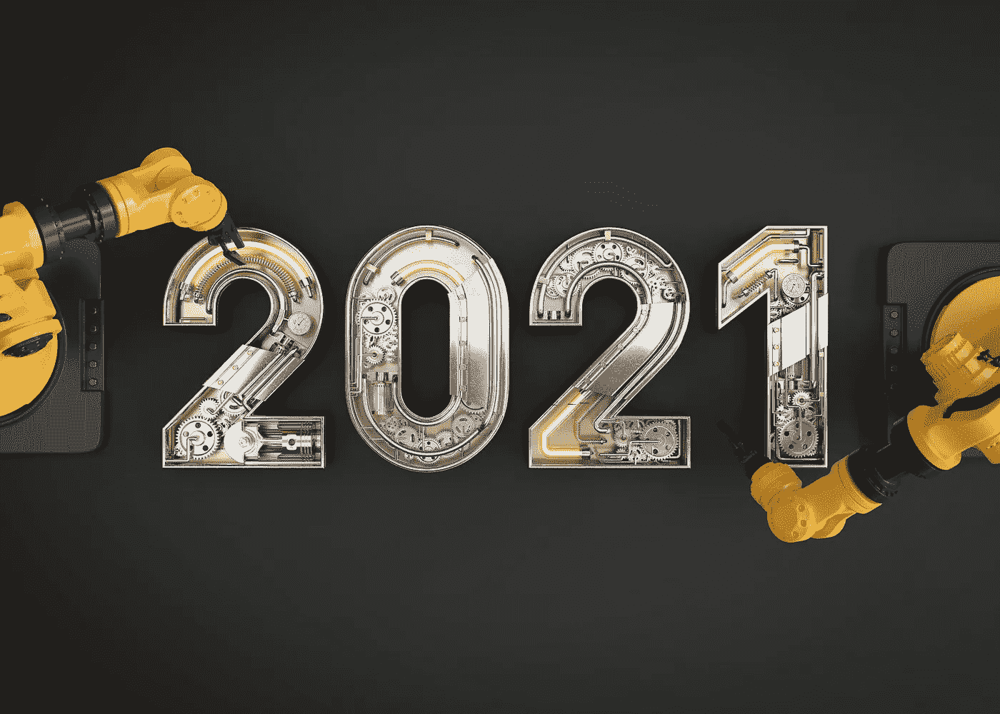
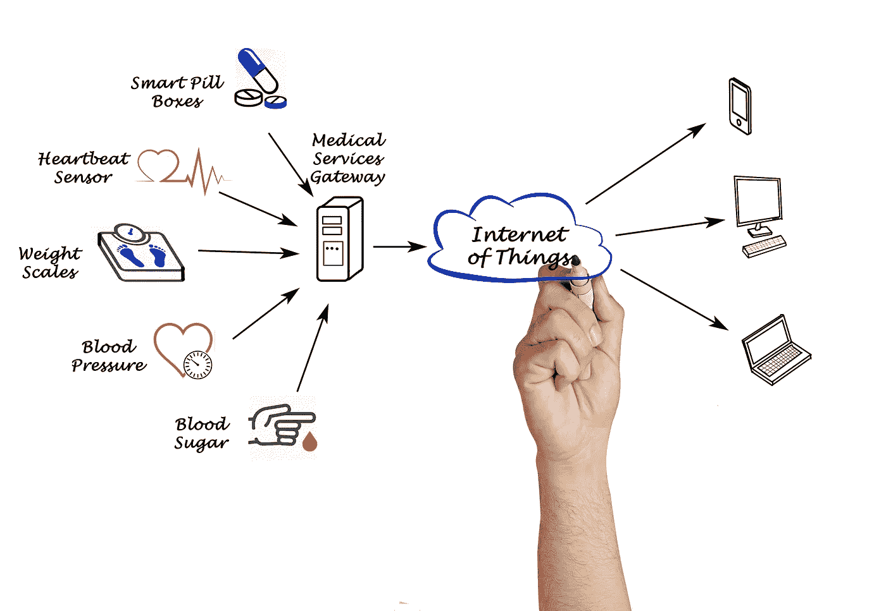
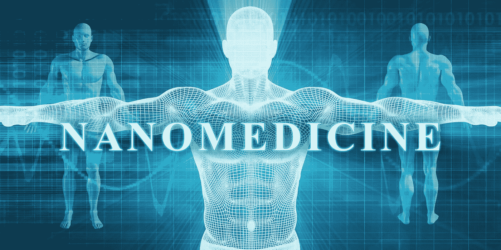

# 曝光:2021 年预期的四大健康科技趋势

> 原文：<https://medium.datadriveninvestor.com/exposed-four-important-health-tech-trends-to-anticipate-in-2021-1cb076fcaeec?source=collection_archive---------22----------------------->

## 2020 年能出什么好东西吗？是的，我们相信是这样。

Source: [sarahwuth702](https://depositphotos.com/portfolio-3557125.html) /[Depositphotos.com](https://depositphotos.com/)

# 2020 年:我们想要忘记的一年。但是我们能从中学到什么呢？

不说别的，2020 教会我们感恩每一天，感激身边的一切；我们所珍视的生命，可能现在还在这里，下一分钟就消失了。2020 年将永远臭名昭著，它带来了许多挑战，让我们大多数人失去了平衡。它始于澳大利亚的野火，然后是世界不同地区的洪水和爆炸，然后是谋杀黄蜂。不甘示弱的新冠肺炎经历了人类自二战以来遭遇的最艰难的战斗之一。事实上，这是联合国秘书长的一句话:

> “新冠肺炎是二战后世界上最大的挑战。”
> 
> 安东尼奥·古特雷斯(联合国秘书长)

疫情全力攻击社会的核心；在夺走生命的同时，它切断了我们彼此之间的联系，也切断了许多快乐和生计的来源。在仅仅 12 个月的时间里，疫情已经感染了 7500 万人，死亡人数超过 161 万，并且还在继续增加。它导致几个国家和企业破产，导致 T2 在 2020 年下半年失去超过 4 亿个工作岗位。尽管平息事态的努力导致了[辉瑞疫苗的发现，但回归正常的旅程仍然是漫长而艰难的。](https://www.google.com/url?q=https://www.google.com/url?q%3Dhttps://www.pfizer.com/news/press-release/press-release-detail/pfizer-and-biontech-announce-vaccine-candidate-against%26sa%3DD%26ust%3D1608183181325000%26usg%3DAOvVaw3bT_yBigIbDF6AGEANwMHP&sa=D&ust=1608183185647000&usg=AOvVaw3sAUTwjzssZ-p8RJLnK_pF)

我们被迫适应日常生活中的一些调整。然而，这些不便激发了可能在不久的将来和未来几年改善我们世界的发明和创新。在这篇文章中，我们将讨论一些最令人兴奋的发现，当我们过渡到 2021 年时，你应该留意这些发现。

# 医疗保健发展的四种方式

## 1.远距离医学

不出所料，随着全球封锁的实施，远程医疗得到了改善。在那段时间里，去医院就诊仅限于重症病例；截至 2020 年 4 月，约 43%的医疗保险初级保健就诊是通过远程医疗进行的。

当社会距离的必要性变得更加明显时，人们别无选择，只能接受下一个选择。远程医疗满足了这一需求，减少了患者和医护人员之间的接触，从而尽了自己的一份力量来“拉平曲线”。

Source: [Verbaska](https://depositphotos.com/portfolio-2429035.html)/[Depositphotos.com](https://depositphotos.com/)

随着远程医疗方法的改进，可穿戴设备的使用越来越多，因为它们使医疗专业人员能够收集患者的实时信息，即使他们呆在家里。如果你愿意，你可以阅读我们的文章“[可穿戴设备如何促进生产力](https://www.aimblog.io/2020/10/19/wearable-devices-the-key-to-unlock-your-productivity/)”

> “远程医疗是利用双向电信技术，通过各种远程方法提供临床医疗保健。”
> 
> 疾控中心，2020 年

尽管远程医疗的使用有了巨大的增长，但是许多病人还没有准备好接受它。嗯，它不会很快消失。从所有迹象来看，它可能会成为卫生部门的下一件大事，因为医生们试图尽可能地减少医院的拥挤。来自研究的信息显示，到 2026 年，远程医疗市场很可能达到[1856 亿美元，这一预测表明它已经停留下来。](https://www.fortunebusinessinsights.com/industry-reports/telemedicine-market-101067)

远程医疗服务通过应用程序和可穿戴设备提供，可以轻松地将患者与护理人员联系起来。这些可穿戴设备装有传感器，可以实时监控患者，并提供有关健康状况的足够信息。此外，越来越好的应用程序通常连接到电子健康记录(EHR ),以改进对高质量患者信息的访问，完全不受距离限制。

## 2.3D 生物打印

使用 3D 生物打印来创建用于再生医学和组织工程的活体人类细胞或组织也一直处于前沿。这项技术可以为移植提供现成的器官和身体部分，并且已经在制造精密和个性化药物方面发挥了关键作用。它还被广泛应用于医疗设备、手术器械、整形外科和牙科植入物、假肢和医学教育模型的开发。

Source: [sdecoret](https://depositphotos.com/portfolio-1008648.html)/[Depositphotos.com](https://depositphotos.com/)

3D 生物打印在新冠肺炎危机期间是不可或缺的，爱好者们相信，当疫情从我们的后视镜中消失时，这种情况将会继续。这肯定会减少等候名单上的人数。

> “超过 100，000 名美国人在等待匹配的器官，超过 2000 名儿童在器官等待名单上。”
> 
> [莫里斯，2018](https://www.researchgate.net/publication/325859206_Future_of_3D_printing_How_3D_bioprinting_technology_can_revolutionize_healthcare)

3D 生物打印市场预计到 2025 年将达到 492 亿美元，CAGR 为 23.3%。它将在研究癌症等晚期疾病方面非常有效，并可能带来一个新的医学时代，在这个时代，患者不必等待太久就可以获得有活力的器官。请参考我们的文章[“人工智能正在改变器官移植的未来”](https://www.aimblog.io/2020/11/19/outstanding-discovery-ai-is-transforming-the-face-of-organ-transplant/)了解更多信息。

## 3.医疗物联网(IoMT)

物联网(IoT，不要与后文提到的 IoMT 混淆)预计将迎来新一代技术，物联网(通常是设备和电器)将通过类似的网络连接起来共享信息。这些设备可以与它们的用户、环境以及相互之间进行交互，以监测患者并跟踪和预防慢性疾病。医疗物联网(IoMT)将物联网与远程医疗技术相结合，通过这种交互，天空是一切可能的极限。

Source: [vaeenma](https://depositphotos.com/portfolio-1004370.html)/[Depositphotos.com](https://depositphotos.com/)

IoMT 设备将积极为智能医院和家庭供电，以收集有关患者健康的信息，如血糖水平、皮肤温度、血压读数、心率等。

据[估计](https://techjury.net/blog/how-many-iot-devices-are-there/#gref)到 2025 年，物联网产业将价值 6.2 万亿美元，2021 年全球将安装约 350 亿台新设备。仅在 2020 年，约 30%的物联网市场份额来自医疗保健行业。预计这一数字在未来几年还会增加。

## 4.纳米医学

未来几年，纳米粒子在生物体内的应用可能会增长很多。在增强全身药物输送的同时，这些健康技术将有助于实验室研究。人们对疾病监测中纳米机器人的需求也越来越感兴趣。这些纳米机器人可以注射到患者的血液中，并能够收集有关重要器官和健康状况的信息。

Source: [Kentoh](https://depositphotos.com/portfolio-2228340.html)/[Depositphotos.com](https://depositphotos.com/)

尽管纳米医学的实施可能会受到阴谋论的阻碍，但市场[预计](https://www.alliedmarketresearch.com/nanomedicine-market)将从 2016 年记录的最初的 1.11912 亿美元增长到 2023 年的约 2.13063 亿美元。

## 结论

虽然 2020 年可能不是最容易的一年，但有一天我们可能会发现自己很感激这一年。它让我们看到了许多可能性。

你怎么想呢?请在评论区告诉我们。我们希望尽快收到您的来信。

*本帖原载于* [*AIM 博客*](https://www.aimblog.io/2020/12/17/exposed-four-important-health-tech-trends-to-anticipate-in-2021/) *。*

## 如果你喜欢这个，看看我最近的帖子:

 [## AI 与糖尿病；有希望的研究需要庆祝

### 技术如何开始帮助我们解决一种主要疾病…

www.aimblog.io](https://www.aimblog.io/2020/12/10/ai-and-diabetes-promising-research-calls-for-jubilation/)  [## 你应该知道的关于糖尿病的重要事实

### 关于糖尿病应该知道什么…

www.aimblog.io](https://www.aimblog.io/2020/11/30/exciting-facts-you-should-know-about-diabetes/)  [## 杰出发现:人工智能正在改变器官移植的面貌

### 移植过程的一个主要挑战一直是器官非常脆弱…

www.aimblog.io](https://www.aimblog.io/2020/11/19/outstanding-discovery-ai-is-transforming-the-face-of-organ-transplant/)