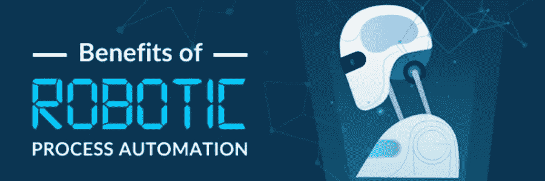

# 将 RPA 扩展到新的业务部门，以提高流程性能

> 原文：<https://medium.datadriveninvestor.com/extend-rpa-to-new-parts-of-business-to-improve-process-performance-9f24ccb0c2cb?source=collection_archive---------6----------------------->

机器人过程自动化(RPA)是一种软件或工具，或者更确切地说，是一种“机器人”,它接管过程中的日常任务，不再需要人类的帮助来获得所需的输出。

但是，机器人能变得多聪明呢？

***不要担心。将人工智能添加到您的 RPA 中，现在您拥有了比简单 RPA 智能得多的认知自动化。***

通过 RPA 自动化的有价值的企业软件允许跨企业工作以解决各种广泛的挑战。

无论是手动检索发票和在 SAP 中插入信息，都可以通过 RPA 完成。

 [## 人工智能预测能力的神话|数据驱动的投资者

### AI(人工智能)最有前途的优势之一似乎是它预测未来的能力…

www.datadriveninvestor.com](https://www.datadriveninvestor.com/2019/03/01/the-myth-of-ais-predictive-power/) 

RPA 通过部署机器人来自动执行重复性任务和繁琐的手动流程，提高员工的工作效率，从而解决了数百个棘手问题。

# RPA 的一些常见应用

像 Capgemini、Accenture、Deloitte 等大品牌都在他们的常规流程中使用 RPA。

这些公司利用 RPA 的优势，例如可靠性、准确性和一致性，从而提高整体生产效率。

# **因此，RPA 的主要应用是:**

## 1)销售

销售在每种商业类型中都是至关重要的，不管是什么样的市场。

RPA 可以处理所有运营和销售活动，包括发票准备、数据复制、库存、客户付款、无差错销售运营或交付管理。

## 2)采购流程

组织已经意识到采购团队将大部分时间花在管理任务上。

RPA 解决方案可以帮助承担管理任务，将采购工作从其他活动中解放出来。

它致力于最大限度地减少人工干预，为未来开发强大的审计跟踪，减少人工工作，使他们能够专注于其他战略计划，并提供在需要时访问人工智能的能力。

## 3)数据提取

数据输入是一个枯燥乏味的过程，但 RPA 公司可以帮助省去很多麻烦，因为他们的 RPA 开发人员有能力识别基本模式，并且可以将每个文本转换为可搜索和可编辑的机器编码文本。

这最大限度地降低了数据输入的要求，也降低了数据出错的可能性。

## 4)数据管理

数据管理涉及 RPA 解决方案，该解决方案允许公司从具有任何特定结构的任何来源收集任何类型的数据。

这使得跨多个供应商和部署的数据变得简单且可访问。

更多的功能包括数据库、数据仓库、数据湖、数据管理自动化、对混合云环境的自动化支持以及开源合作伙伴关系。

RPA 自动化解决方案可以帮助实现信息体系结构的现代化，从而推动整个企业应用程序的成功开发。

## **相关阅读:** [**现实世界中机器人过程自动化的 5 个惊人例子**](https://www.signitysolutions.com/blog/rpa-use-cases/)

## 5)物料需求计划

机器人流程自动化在制造业和该行业提供的每个主要供应链管理流程中非常重要。

大多数开源 RPA 解决方案管理参与整个供应链的特定流程、人员和系统。

其他一些模块管理货物的运输和储存、仓库和配送中心，并处理客户订单的处理。

# 机器人流程自动化(RPA)的优势

**RPA** 有很多好处，可以帮助提高金融、服务、保险、医疗保健或任何其他行业的组织的生产力。

## a)节约成本

RPA 自动化的最大优势之一是它显著节省了大量成本。

当业务流程实现自动化时，不仅运行速度更快，而且性能不会出错，这意味着它的工作成本更低。

因此，组织可以用更少的投入获得更大的产出，从而获得更好的利润。

## b)准确性

即使是最细心的人也会犯错误，而且不是一个，而是多个。

因此，为了完美地执行日常任务，RPA 是一种解决方案，它可以降低甚至消除任何类型的错误，从而提供最佳质量和更高的满意度。

## c)减少执行任务的时间

人类是一台伟大的机器，但机器是机器人，在时间方面表现更好。

即使只有一分钟，机器人也能把一个过程的停机时间缩短到几秒钟。

如果我们用一个 [***机器人流程自动化解决方案***](https://www.signitysolutions.com/robotic-process-automation-rpa/) 将几十个任务相乘，将会节省大量时间。

## d)洞察和分析

从以前的见解中学习可以帮助企业为未来做出更好的决策。

[***机器人流程自动化***](https://en.wikipedia.org/wiki/Robotic_process_automation) 具有收集、组织、分析、跟踪、报告、监控，甚至在数据库中存储有价值数据的能力。

然后，可以利用这些存储的信息来改进当前的操作，甚至纠正流程中的错误。

## 那么，如何在您的业务流程中实施 RPA 呢？

1.  深入了解您想要自动化的业务流程。
2.  了解 RPA 的应用。
3.  回顾您希望自动化的流程，但要确保在自动化任务的同时不会影响您的业务。
4.  获得使用 RPA 工具的经验，如 UiPath 或更确切地说是 UiPath Go、IBM 的 Blue Prism、EdgeVerve 和 Automation Anywhere。

## **相关阅读:**[**15 分钟最佳实践 RPA 实施指南【2020 年更新】**](https://www.signitysolutions.com/blog/rpa-implementation-guide/)

# RPA 2.0 —未来机器人的崛起

随着人工智能的兴起，罗伯茨现在可以对其输入进行推理。

现在，他们不再盲目地遵循算法，而是可以学习模式，并根据环境或输入的变化即兴输出。

> **这就是 RPA 2.0 的出现。**

机器学习、深度学习和强化学习有助于在机器人过程自动化系统中提供鲁棒性。

通过这种方式，您可以明智地对您的自动化解决方案进行编程，以处理您组织中的重复性任务。

机器人可以在后台运行几个小时，分析它可以做什么，并为未来提出潜在的自动化解决方案。

然而，这种解决方案听起来似乎仍然在许多垂直业务领域蓬勃发展。

本世纪将面临一场新的革命，这场革命将根除单调乏味的任务，让人们专注于真正有创造性的工作。

RPA 2.0 的出现和实施将真正等同于移动革命。这只是 RPA 将提供的商业空间的一小部分。

## ***原载于*** [***重大解决方案***](https://www.signitysolutions.com/blog/effect-of-rpa-on-business/)*2020 年 1 月 31 日。*

****申请成为 DDIChat 专家*** [***此处***](https://app.ddichat.com/expertsignup) ***。
使用 DDI 的方法:***[***https://datadriveninvestor.com/collaborate***](https://datadriveninvestor.com/collaborate) ***访问我们的***[***https://www.datadriveninvestor.com/***](https://www.datadriveninvestor.com/)*