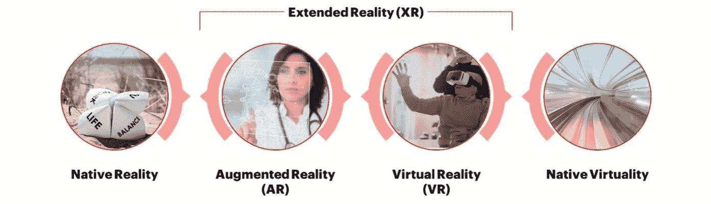
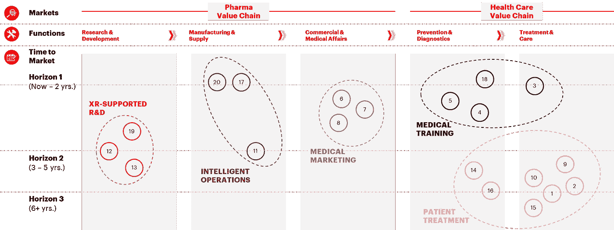

# 生命科学和医疗保健中的扩展现实

> 原文：<https://medium.datadriveninvestor.com/extended-reality-in-life-sciences-and-healthcare-3780d06f8cac?source=collection_archive---------2----------------------->

## **解决方案、市场动向和机遇**

[马克西米利安·布赫](http://linkedin.com/in/maximilianbucher/)，[乔纳森·穆勒](http://linkedin.com/in/jonathan-müller-09436566/)，[谢尔·梅尔舒克](http://linkedin.com/in/kjellmeershoek)，[塞巴斯蒂安·沃斯特](http://linkedin.com/in/sebastian-wurst)

围绕虚拟现实的最初宣传似乎已经结束，在很大程度上，产品令人失望。然而，扩展现实(XR)解决方案正悄然变得越来越成熟，创新的用例已经在探索之中，尤其是在医疗保健领域。手头的这篇文章概述如下。第一部分给出了扩展现实产品的一般市场前景；第二篇深入探讨了 XR 中的生命科学、制药和医疗保健行业用例；第三个基于估计的上市时间和市场影响分析用例；第四部分包含围绕可能的速赢和当前问题进行的讨论；第五部分是总结和展望。

## 介绍

扩展现实(XR)包括虚拟现实(VR)和增强现实(AR)。在虚拟现实中，用户完全沉浸在虚拟环境中，通常是通过佩戴一个将图像投影到人眼的 VR 头戴设备。想到了 PlayStation VR。增强现实将虚拟元素添加到现实世界的图像中。通常情况下，相机会拍摄现场照片，然后进行实时分析，并添加更多信息。增强现实的一个突出例子是智能手机游戏 Pokémon Go。然而，XR 并不局限于 VR 耳机和智能手机。平视显示器、可弯曲显示器或全息投影仪都是可以实现 XR 概念的技术。

一段时间以来，企业面临的一个关键问题是:XR 最终是否足够成熟，能够获得实实在在的价值，证明必要的投资是合理的？许多业内人士认为是这样的。[宝马最近宣布在其汽车上安装大型平视显示器](https://www.bmwblog.com/2020/01/07/bmw-i-interaction-ease-technology-unveiled-at-ces-2020-in-las-vegas/),这可能会改变我们所知的汽车仪表盘的概念。 [DHL 员工正在使用智能眼镜](https://www.logistics.dhl/global-en/home/press/press-archive/2017/dhl-supply-chain-makes-smart-glasses-new-standard-in-logistics.html)来提高他们的仓库运作速度，减少出错几率。[外科医生使用 XR](https://hbr.org/2018/03/how-augmented-reality-will-make-surgery-safer) 为复杂的手术做准备，尽可能模拟真实情况。

随着越来越多成熟的 XR 产品、平台和服务的出现，越来越多的解决方案变得可用。

**产品**

*   VR 头戴设备——例如[脸书的 Oculus](https://www.oculus.com/) 拥有 Quest 和 Rift S VR 头戴设备。
*   智能眼镜——例如[微软](https://www.microsoft.com/de-lu/hololens)的货架上有 HoloLens 2， [magic leap](https://www.magicleap.com/) 提供 Magic Leap 1。
*   平视显示器(hud)——例如 [WayRay](https://wayray.com/) 制造的 AR 显示器通常作为车辆中的一个组件出售。

**平台**

*   XR 平台——例如[苹果](https://www.apple.com/de/ios/augmented-reality/)正在使用他们的应用商店来销售各种 XR 应用
*   XR 应用程序——例如，使用 [Ikea Place](https://apps.apple.com/de/app/ikea-place/id1279244498) ,你可以在家中虚拟放置家具，看看它们是否合适

**服务**

*   精品编码和内容服务—例如 [Visualize](https://visualise.com/) 是一个由电影制作人、制片人、技术人员和开发人员组成的团体，他们专注于为 XR 创建沉浸式内容。
*   咨询服务——例如，埃森哲提供行业特定的端到端 XR 解决方案，例如用于[沉浸式学习](https://www.accenture.com/us-en/insights/technology/immersive-reality)、AR 联网工人、[虚拟商品](https://www.accenture.com/us-en/insights/technology/virtual-reality-merchandising)和 XR 消费者之旅。
*   扩展现实培训——例如[奥索虚拟现实](https://ossovr.com/)为外科医生、销售团队和医院员工提供基于虚拟现实的培训。

未来 5 年，整个 XR 市场预计将从大约 190 亿美元增长到超过 2600 亿美元，CAGR 为 77% 。XR 硬件产品部门的销量[已达到 600 万台，CAGR 为 17%](https://www.statista.com/statistics/671403/global-virtual-reality-device-shipments-by-vendor/) 。虽然这些数字是在没有考虑当前 COVID19 市场形势的情况下估计的，但中长期趋势清楚地表明，该市场前景看好。此外，最近的一些初创企业交易显示，人们越来越愿意押注于这个市场的增长。所以，现在绝对是时候仔细看看 XR 提供了什么！

## 生命科学和医疗保健领域的 XR

在探索人们在生命科学、制药和医疗保健行业的所作所为时，我们发现了许多来自老牌公司(主要是临床研究人员和制药公司)、数字健康初创公司以及涉足医疗保健的大型科技公司的例子。括号中的数字表示在下一节中用于进一步评估的特定用例。

 [## 医疗保健行业的螺旋式项目管理方法|数据驱动的投资者

### 项目管理就是将知识、技能、工具和技术应用到活动中，以…

www.datadriveninvestor.com](https://www.datadriveninvestor.com/2020/08/04/spiral-project-management-methodology-in-healthcare/) 

**成熟的行业参与者**

*   [中风康复](https://www.researchgate.net/publication/334424754_Clinical_Application_of_AR_System_in_Early_Rehabilitation_Program_After_Stroke_2_Case_Study) —中风患者运动障碍，容易跌倒等。XR 康复提供了一个激励的、面向任务的、受控的虚拟环境来支持患者的康复。(1)
*   物理治疗— [斯坦福大学目前正在进行一项临床试验](https://clinicaltrials.gov/ct2/show/NCT03874507),以表明 XR 支持因去条件化和手术导致的急性康复。该试验侧重于测量患者的活动能力，但也希望 [XR 有助于疼痛管理](https://www.nytimes.com/2019/04/29/well/live/virtual-reality-as-therapy-for-pain.html)。(2)
*   外科医生培训——加州大学洛杉矶分校的一项研究发现[接受虚拟现实护目镜培训的外科医生速度快 20 %,正确完成的步骤多 38 %。外科医生使用了奥索虚拟现实服务。最终，这样的改进可以拯救成千上万人的生命。(3)](https://hbr.org/2019/10/research-how-virtual-reality-can-help-train-surgeons)
*   [帕金森病认知](https://www.youtube.com/watch?v=t0a1ggZH4Bk) —艾伯维创建了一个虚拟现实环境来模拟帕金森病的影响。这可以用于疾病意识，例如帕金森患者的家庭成员可以利用这一点来更好地了解和应对疾病。(4)
*   偏头痛意识和营销— [葛兰素史克开发了一种偏头痛模拟器](https://en-gb.facebook.com/GSK/videos/844994938902794/)以提高对偏头痛患者的意识和理解。他们创造了这个作为他们一种药物营销活动的一部分。(5)
*   医学会议——拜耳在他们的一个医学会议摊位上使用了 XR，出席率从平均不到 2 分钟飙升至 10 分钟。类似的方法也适用于产品演示和电子零售领域。(6) (7) (8)
*   [用于疼痛管理的虚拟现实](https://www.cedars-sinai.org/newsroom/new-study-shows-value-of-virtual-reality-for-pain-management/#:~:text=%22Virtual%20reality%20is%20a%20mind,supplement%20to%20traditional%20pain%20management.%22) — Cedars-Sinai 开展了一项研究，旨在调查基于虚拟现实的治疗对缓解疼痛的效果。接受定期放松和冥想虚拟现实体验治疗的患者组在疼痛水平方面显示出统计上的显著改善——一些患者现在在家中定期使用该疗法。(9)
*   [VR 辅助弱视治疗](https://healthtechinsider.com/2018/02/28/virtual-reality-could-help-train-lazy-eye-video/#:~:text=The%20software%20is%20a%20game,both%20eyes%20to%20work%20together.)——jessen ius 医学院(斯洛伐克)的研究人员在一款经过改装的 Oculus Rift 耳机上使用了一款基于 VR 的电脑游戏来治疗弱视，俗称“弱视”。(10)
*   [XR 控制的流程合规性](https://www.outsourcing-pharma.com/Article/2019/01/23/Augmented-reality-to-improve-pharma-manufacturing) —医疗动画工作室 Random42 正在提出如何在制药行业应用 AR 和 VR 的选项，以可视化制造流程并实现对流程合规性的远程监控，例如生物反应器。(11)
*   [虚拟现实支持的蛋白质评估](https://www.pharmavoice.com/article/2019-06-ar-vr/)——诺华公司的研究人员正在使用虚拟现实头戴设备，让自己沉浸在所谓的“分子行走”中的蛋白质结构中。这些视觉评估支持他们获得对分子结构和相互作用的更自然的理解，从而促进新药的设计。(12)
*   [虚拟现实辅助的临床试验](https://www.i-jmr.org/preprint/13698)——在最近发表在《交互式医学研究杂志》( IJMR)上的一项研究中，研究人员调查了虚拟现实在临床试验中的使用。在他们的研究中，他们能够证明补充虚拟现实体验如何对患者遵循其治疗方案的可能性产生显著影响。由于患者依从性仍然是临床试验结果的重要影响因素，这些发现无疑表明了进一步的潜力。(13)

**创业公司**

*   [虚拟现实支持的眼动障碍诊断](https://syncthink.com/product/) — Syncthink 提供 FDA 批准的基于虚拟现实的解决方案，用于评估患者的眼动协调能力并支持相关诊断。(14)
*   虚拟现实控制的手术机器人——[比尔·盖茨投资](https://techcrunch.com/2019/02/13/bill-gates-backed-vicarious-surgical-adds-a-virtual-reality-twist-to-robots-in-the-operating-room/)一家麻省理工学院创办的机器人初创公司，该公司利用虚拟现实为外科医生控制微型手术机器人。这一新颖的想法有可能降低现有手术机器人的成本，从而使其广泛应用。(15)
*   老年痴呆症检测— [Altoida 基本上提供了一个基于 VR 的捉迷藏游戏，可以早期检测老年痴呆症](https://techcrunch.com/2019/05/30/using-augmented-reality-altoida-is-identifying-the-likely-onset-of-neurodegenerative-diseases/)。如果阿尔茨海默病被早期发现，目前可用的药物可以有效地用于阻止疾病的发展。(16)
*   劳动力培训——有多家初创公司专注于使用 XR 进行培训。控制和增强视觉环境的能力提供了强大的训练场景。 [STRIVR](https://www.strivr.com/) 提供已经在沃尔玛广泛使用的培训。(17)
*   对医疗保健专业人员的培训——外科医生、医学生以及其他许多人需要对他们的工作进行广泛的培训。[奥索 VR](https://ossovr.com/) 和 [GIGXR](https://www.gigxr.com/) 是两家专注于医疗保健市场的初创公司。(18)
*   [XR 支持的实验室操作](https://www.apprentice.io/the-apprentice-platform-use-cases/augmented-procedures/) — Apprentice.io 正在为实验室环境提供增强现实解决方案，包括语音指导指令、技术演示或免提数据捕捉。(19)

**大科技**

*   微软 HoloLens 硬件生产不仅是微软 XR 战略的支柱。他们还投资创业公司，并特别关注医疗市场。
*   脸书——继续从硬件和软件的角度开发他们的 Oculus VR 头戴设备。此外，他们还关注医疗保健领域的教育和培训。
*   谷歌——尽管与诺华公司有合作关系，智能镜片项目最近已经停止。他们的下一步会是什么？
*   苹果——显然，他们的增强现实平台是最强的平台之一，而且不仅仅专注于游戏。[蒂姆·库克最近宣布，增强现实可以帮助改变医疗保健](https://9to5mac.com/2020/01/20/tim-cook-ar-health-care/)。
*   SAP — SAP 已经将 AR 集成到其仓库管理系统中，以提供一个 [AR 辅助仓库拣货解决方案](https://www.delawareconsulting.com/en-us/discover/blog/powerful-capabilities-sap-ar-warehouse-picker)。(20)

## 用例评估

这些例子说明了扩展现实应用在生命科学产业中的重要性。考虑到生命科学和医疗保健参与者面临的财务和组织方面的有限资源，我们需要确保对 XR 应用的投资得到正确的引导和优先排序。评估什么是速赢，哪些应用可能与长期战略更相关，需要对机会空间进行全面分析。我们选择通过将上面列出的用例映射到一个矩阵中来解决这一分析，该矩阵一方面包含制药和医疗保健价值链的各个阶段，另一方面包含预期的上市时间。

**Use cases for XR in the Pharma and the Healthcare industry along a typical industry value chain**

当查看一组用例时，出现了 5 个集群:

1.  **智能运营**(围绕制造和供应链运营的 XR 用例):一些用例已经在不同行业广泛采用，如 AR 辅助的仓库运营，如 pick & place，或 XR 辅助的劳动力培训，如特定的制造程序，实验室中的安全措施。进一步的潜力在于 XR 控制的过程符合性和偏差检测，例如，在生物制药生产中监测生产参数和批次质量时补充传统的传感器套件。与其他领域相比，这一领域的用例非常成熟，是由其他行业的成功案例驱动的。
2.  **医疗营销** (XR 展示医疗产品并促进与医疗保健专业人员的沟通):制药公司和 hcp 之间的有效沟通是销售的关键杠杆，尤其是处方药。销售代表和医学科学联络人都可以使用 XR 来促进他们的 HCP 交流，例如，通过产品演示或 XR 增强的电子细节。
3.  **医疗培训**(作为医疗专业人员的产品的基于 XR 的培训):目的是让专业人员更好地了解疾病和状况、他们所依赖的医疗设备，以及在类似真实世界的模拟中练习和增强他们技能的选项。这些应用已经在实践中得到应用，并且越来越多地被使用，取得了非常有希望的结果。
4.  **患者治疗**(用于治疗患者的 XR)。研究和小规模的实际应用表明，使用 XR 辅助治疗某些疾病，如阿尔茨海默氏症或中风康复，刺激患者大脑的特定区域，具有良好的效果。类似的效果也应用在视频游戏疗法中，如 Akili Interactive 的 EndeavorRx，它已经获得了 FDA 的批准，作为多动症儿童的治疗方案。然而，尽管这些发展已经被很好地认识到，XR 支持的患者治疗领域仍然处于其发展的非常早期的阶段。
5.  **XR 支持的 R & D** (药物研究和临床试验中的 XR 技术):在临床前阶段，XR 可用于在计算机研究中可视化目标蛋白质的分子结构，为先导化合物生成过程提供有价值的见解。在临床阶段，AR 设备已经显示出对治疗依从性的积极影响，并可能实现在家患者观察，减少现场测试并降低成本。然而，在这一领域快速采用似乎不现实。虽然像 FDA 这样的监管机构正在慢慢对“复杂创新试验设计”这样的新技术开放，但患者安全需要最大限度的努力。

## 成功案例和挑战

事实一再证明，人们对 XR 的内容理解得很好，所以他们工作和训练的效率更高，或者更有可能完成销售。医疗行业现在可以在这些成功的基础上，为更高级的医疗产品类型用例(即医疗诊断或治疗)奠定基础。

不过 XR 硬件还有提升空间。耳机通常昂贵、笨重、体积大，而且感觉不自然。(技术)发展的当前状态明显限制了 XR 耳机的大规模采用，因此影响了市场增长。尽管，说实话，区分 B2B 和 B2C 用例是有意义的——B2B 用例显然受此影响较小。

同样有趣的是，将当前的 XR 平台与十年前的智能手机市场进行对比。没有开放平台开发，而是由一小群科技巨头提供这些平台，目前还不清楚哪些平台将占上风。现在构建 XR 可能意味着在底层硬件上保持灵活性，并使用敏捷结构来进行战略转移。此外，可以看到“建造或购买”之间的某种中间地带，包括与技术玩家和初创公司合作。

## 总结与展望

有迹象表明，扩展现实(XR)市场正在走向成熟。过去几年，整体市场规模一直在增长，专家对未来的预测充满希望。谷歌、微软和脸书等大型科技公司正在开发 XR 平台的硬件和软件，他们已经将目光投向了医疗行业。在这里，XR 为制药、生命科学和医疗保健行业提供了各种增值用例。最重要的是，已经有研究表明，一些 XR 用例可以改善当前的学校医疗程序，从而挽救生命！

上述用例分析调查了医疗价值链的各个领域，其中 XR 提供了价值，并分析了公司通常需要用 XR 进入市场的时间。智能运营、医疗营销和医疗培训等领域因效率提升而快速见效。(监管)壁垒略高的用例领域是 XR 支持的 R&D 和患者治疗。充满希望的研究结果和初创企业至少表明，幻灭的低谷即将结束。尽管当前的 XR 硬件通常不是用户友好的、笨重的和昂贵的，但所有这一切都在发生。

## 访问专家视图— [订阅 DDI 英特尔](https://datadriveninvestor.com/ddi-intel)