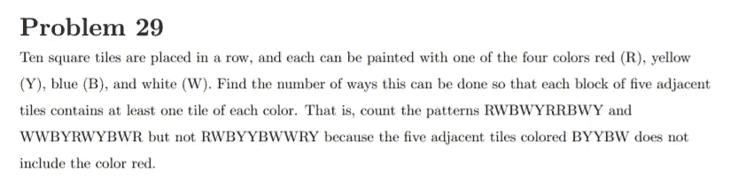

# 将数学竞赛变成编码竞赛

> 原文：<https://medium.datadriveninvestor.com/extending-math-contests-to-computer-code-3d5a837cf8ab?source=collection_archive---------8----------------------->

我如何编写一个计算机程序来解决一个数学竞赛题。


# 故事

在过去的 3 年里，我一直在我的计算机科学项目中使用数学。无论是在 iOS 游戏中使用二次方程，还是在模拟视频游戏《T2》中使用矩阵，数学总是扮演着重要的角色。然而，在我参加的众多数学竞赛中，从地方挑战到像 [AMC 12](https://www.maa.org/math-competitions/amc-1012) 这样的全国性比赛，我从来没有能够发挥我的编程能力。当我发现一个名为[紫色彗星](https://purplecomet.org/)的在线国际竞赛时，这一切都改变了。

在浏览比赛规则时，我发现了以下内容:

另一方面，参与者被允许使用计算器或计算机，例如，编写计算机程序来解决或更好地理解问题

我第一次意识到，我可以专门为一道竞赛题写一个计算机程序。*现在你可能会想，我为什么要这么做？我不应该在数学竞赛中使用数学吗？*好吧，看看 2016 年春季房协会议的第 29 个问题:



虽然手工解决这个问题会花费我很多时间，但是编写一个程序来寻找答案只需要几分钟。以下是 Python 3.6 中的一种编码方法:

```
**def** notValid(current, choices):

    choices = choices.copy()

    **for** c **in** current:
        **if** c **in** choices:
            choices.remove(c)
    **return** len(choices) > 0**def** generate(max, current, choices):
    **if** len(current) == max:
        **return** [current]

    total = []

    **for** c **in** choices:

        new = current + c

        **if** len(new) >= 5 **and** notValid(new[-5:], choices):
            **continue** total += generate(max, current + c, choices)

    **return** total

t = generate(10, **""**, [**"R"**, **"B"**, **"Y"**, **"W"**])

print(**"The answer is: "**, len(t))
```

首先，我们定义一个名为 ***notValid*** 的助手方法。这个方法将告诉我们 ***当前*** *，*一个生成的图案*，*的子序列是否包含每种颜色的至少一个瓷砖，每块 5 个相邻的瓷砖。

接下来，我们创建我们的 main，递归方法称为 ***生成*** *。*注意，这个问题可以通过递归来解决，可以用代码，甚至手工。然而，根据我的经验，编写递归比编写递归要快得多，也容易得多。

[](https://www.datadriveninvestor.com/2020/08/11/being-good-at-google-is-a-skill/) [## 擅长谷歌是一种技能|数据驱动的投资者

### 擅长‘谷歌’是一种技能。是的，你听到了。知道什么和如何谷歌或搜索的东西是一个…

www.datadriveninvestor.com](https://www.datadriveninvestor.com/2020/08/11/being-good-at-google-is-a-skill/) 

在 ***内生成*** ，我们首先检查我们的 ***当前*** 模式是否已经达到其*最大长度 10。如果有，返回模式。否则，遍历我们的字母列表 ***选项。*** 使用 **notValid** 确认 ***新*** 模式结束有效后，再次调用 ***生成*** 并返回其值。*

*在调用 ***generate(10，"，["R "，" B "，" Y "，" W"])，*** 之后，我们将得到一个所有有效的 10 个字母模式的列表，这些模式可以由字母 R，B，Y 和 W 创建。您所要做的就是得到列表的长度，您应该得到答案 **7，296** :*

**

*尽管这是一个练习题，我还是为 2020 年春天的实际比赛写了几个计算机程序。我甚至设法得到了一些分数😁！*

# ***我学到了什么***

**

*通过参与 Purple Comet，我了解到代码和逻辑让我对数学问题有了更深刻的理解。我能够将问题组织成输入(参数)、输出(返回值)和步骤(方法)，应用逻辑和数学原理，如递归、计数和数论，并通过编写代码快速找到答案。从现在开始，对于我面临的每一道数学竞赛题(除非是几何题[🙃](https://emojipedia.org/upside-down-face/))，我要问自己这个问题:*

*我可以编写解决方案吗？*

*感谢你把这篇文章看完！确保**喜欢** / **分享**这篇文章😁并评论你的编程和数学竞赛经验！*

***访问专家视图—** [**订阅 DDI 英特尔**](https://datadriveninvestor.com/ddi-intel)*