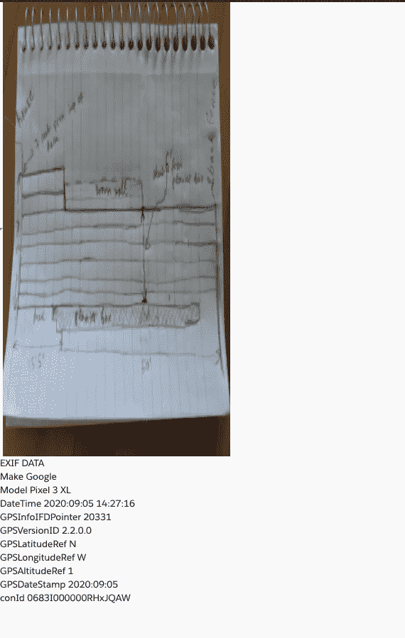

# 利用 LWC 和 VF page 提取 EXIF 数据

> 原文：<https://medium.datadriveninvestor.com/extracting-exif-data-using-lwc-and-vf-page-fb2a3fe8b3f?source=collection_archive---------7----------------------->


**问题陈述:**保险公司需要分析索赔人上传的照片证据，以确定它们是真实的还是经过篡改的。

首先，什么是 EXIF 数据？

**可交换图像文件格式** (EXIF)是一种标准，定义了与数码相机拍摄的图像或其他媒体相关的特定信息。它能够存储重要数据，如相机曝光、图像拍摄的日期/时间、设备的品牌和型号、用于编辑的软件，甚至 GPS 定位。

利用这些信息，我们可以在一定程度上知道照片证据的合法性。

通常在 salesforce 中，“文件”用于存储图像或与记录关联的任何注释或附件。这些“文件”存储在一系列称为内容对象的对象中，如 ContentDocument、ContentVersion 等。嗯，这是改天讨论的话题。ContentVersion 对象是存储实际数据的对象。数据存储在 ContentVersion 对象的名为 VersionData 的字段中。salesforce 将数据编码为 base64 格式，然后存储。

有一些库可以用来提取这些信息。我用过 Exif-js 和 Exif-HEIC.js，它们是基于第一个库 Exif-js 的。我用了两个库，因为 Exif-js 库不支持 HEIC 格式的图像，这是现在最新的智能手机使用的格式。这些库被加载到 VF 页面中，因为 LWC 目前还不完全支持它们。

**VF 页面:**

```
<apex:page controller="ContentVersionUtil" standardStylesheets="false" showHeader="false"><apex:includeScript value="{!$Resource.exifExtractor}" /><apex:includeScript value="{!$Resource.heicExifExtractor}" /><script> /*Get version data using rest query/
function readContentDetails(conId) {
         return new Promise(
             function (resolve, reject) {
                var xhr = new XMLHttpRequest();
                xhr.responseType = "blob";
                xhr.open('GET', '{!$Site.BaseUrl}' + '/services/data/v50.0/sobjects/ContentVersion/' + conId + '/VersionData');
                xhr.setRequestHeader('Authorization', 'Bearer {!$Api.Session_ID}');
                xhr.send();
                xhr.onreadystatechange = function () {
                    if (xhr.readyState == XMLHttpRequest.DONE) {
                        if (xhr.status == 0) {
                            reject('error');
                            }
                        else {
                              resolve(xhr.response);
                            }
                     }
                  }
              }
           );
}readContentDetails("{!$CurrentPage.parameters.conId}")
   .then(function (blob) {
            let obj = {};
            const file = new File([blob], "{!cont.Title}", { type: 'image/jpg' });
//If the image is not of type heic then use exif-js to extract data
             if ("{!cont.FileExtension}" != 'heic') {
                  EXIF.getData(file, function () {
                  obj = EXIF.getAllTags(this);   
                  obj.conId = "{!$CurrentPage.parameters.conId}";
/*Once the data is retrieved send the data to the parent lwc using post messages*/
              let lexOrigin = window.location.ancestorOrigins[0];
               parent.postMessage(obj, lexOrigin);
               });
             } else {
             file.arrayBuffer(file).then(function (arrayBuffer) {
             obj = findEXIFinHEIC(arrayBuffer);
             obj.conId = "{!$CurrentPage.parameters.conId}";
/*Once the data is retrieved send the data to the parent lwc using post messages*/             
             let lexOrigin = window.location.ancestorOrigins[0];
             parent.postMessage(obj, lexOrigin);
             });
         }
   })
</script>
</apex:page></apex:page>Note: I'm using rest query to get VersionData because if it is queried from apex, and if the image size is of greater than 6 MB, then it would hit the heap size limit
```

**控制器:**

```
public without sharing class ContentVersionUtil {
     transient ContentVersion cont;
     public ContentVersion getCont(){
           if(cont == null){
             List<ContentVersion> conVersion = [SELECT Id, FileExtension,description,Title,FileType,CreatedDate from ContentVersion WHERE  Id =:ApexPages.currentPage().getParameters().get('conId') ORDER BY CreatedDate DESC limit 1];
           cont = conVersion[0];}
           return cont;
    }
}
```

**LWC** :该组件接受内容版本 id 作为输入。

**HTML**

```
<template>
<template if:true={vfSrc}>
 <!-- Embed an iframe and invoke the visual force page from here -->
<iframe src={vfSrc} style="height: 0px;width:0px"></iframe>
</template>
  <lightning-spinner size="medium" alternative-text="Fetching Exif data" if:true={isFetchingExifData}></lightning-spinner>
  
  <h1 if:false={isFetchingExifData}>EXIF DATA</h1><template for:each={exifList} for:item='exif'>
  <p key={exif.Id}>{exif}</p>
</template>
</template>
```

**JS**

```
import { LightningElement,track,api } from 'lwc';
export default class ExifExtract extends LightningElement {
@track
isFetchingExifData = true;
@track
vfSrc;
@track
src;
_conId;
@track
exifList = [];
connectedCallback(){
//Attach an event listener to listen to the post messages from the embedded iframe window.addEventListener("message", (event) => {
   if (!event.origin.includes('visualforce.com')) {
       // Not the expected origin: Reject the message!
    return;
}
this.exifObject = event.data;
let list = [];
for(const key in  this.exifObject){
  if(typeof this.exifObject[key] != 'object' && key !== 'undefined'){
  let data =  key+' '+this.exifObject[key];
  list.push(data);
}
}
this.exifList = list;
this.isFetchingExifData = false;// Handle the message
console.log(event.data);}, false);
}//Content version Id input
@api
set conId(value){
  if(value){
     this._conId = value;
     this.vfSrc = null;
     this.vfSrc = '/apex/ExifPage?conId='+this._conId;
     this.src= '/sfc/servlet.shepherd/version/download/'+this._conId;
   }
}get conId(){
  return this._conId;
}}
```

注意:并非所有图像都必须包含 EXIF 数据，因为出于各种原因，如减少内存，或者如果图像被压缩，它可能会丢失，等等。

最终结果:



Voila!!

**资源:**

[](https://github.com/exif-js/exif-js) [## exif-js

### 用于读取 EXIF 图像元数据的 JavaScript 库

github.com](https://github.com/exif-js/exif-js) [](https://github.com/exif-heic-js/exif-heic-js) [## exif-heic-js/exif-heic-js

### 用于从 HEIC 文件中读取 EXIF 图像元数据的 JavaScript 库

github.com](https://github.com/exif-heic-js/exif-heic-js) [](https://photographylife.com/what-is-exif-data) [## 什么是 EXIF 数据，如何将它从照片中移除

### 在互联网上查看图片时，您可能已经注意到一些网站提供了与…相关的有价值的信息

photographylife.com](https://photographylife.com/what-is-exif-data) 

[https://developer . sales force . com/docs/atlas . en-us . API . meta/API/sforce _ API _ objects _ content version . htm](https://developer.salesforce.com/docs/atlas.en-us.api.meta/api/sforce_api_objects_contentversion.htm)