# 从电报组中提取相关信息并使其具有代表性😊

> 原文：<https://medium.datadriveninvestor.com/extracting-relevant-information-from-telegram-groups-and-making-it-representable-1b70d4fe2d6f?source=collection_archive---------11----------------------->

我曾经是一个名为“根除糖尿病”的电报小组的成员，该小组的宗旨是建议人们按照 LCHF 饮食，建议如何自然地降低血糖水平，过健康的生活。

它以问题回答的形式提供了大量信息，这些问题是由名为“Raj”和“Tim”的两位专家提供的。还有很多聊天记录，食物图片和食谱。

**要求**

要求是从该组中提取相关信息，并以问答对的形式获得一个. csv 文件。

这只是一个模糊的要求，在接下来的步骤中，您将看到我们是如何取得进展并朝着解决方案前进的。在前进的道路上，看到要求和挑战，是的，这是一个旅程。

**解决步骤:**

**第一步:**

**提取群组中的聊天记录。json 格式**。因为 json 格式很容易解析，所以我们将其归零。

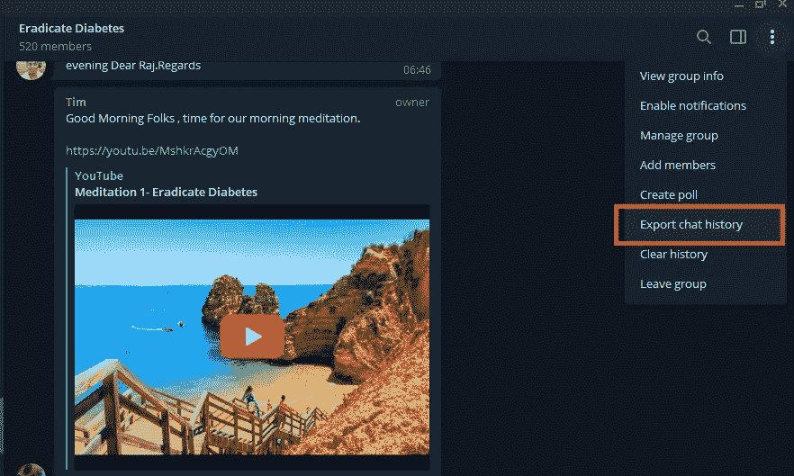

**第二步:**

**用 Python** 读取 json 文件，代码如下:

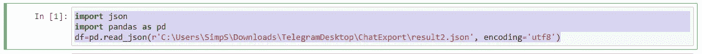

**第三步:**

**识别对我们有用的数据**。为此，我们尝试将数据帧 df 打印如下:

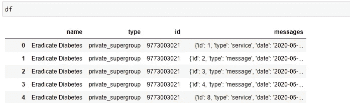

现在我们观察到想要从中获取信息，所以我们写道:

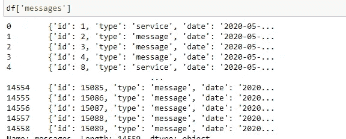

为了获得整个数据帧长度，我们可以说:

Lendf =len(df['messages])。

**第四步:** **识别相关字段建立逻辑。**

现在，如果我们打开 json 文件，它的格式如下:

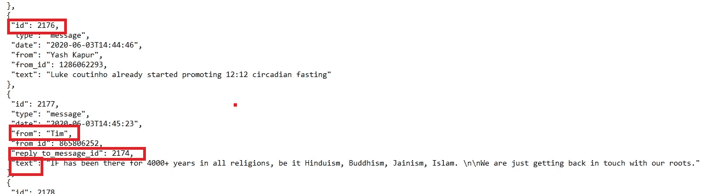

***我们要考虑的领域:***

1)'**reply _ to _ message _ id ":**每当有对某个问题的回复时，都会生成该 id，它将用于提取答案。它具有消息 id 的值，该值包含向答案提问的问题。

2)**‘id’:**这是消息 id，我们将使用它来定位提问的位置。

3)**‘文本’:**与相关 Id 相关的消息。

4)**‘from’:**这个 id 是谁提问或回答的指示器，基本上是谁在聊天。

**第五步:** **制作逻辑提取相关数据。**

现在，使用步骤 4 中的所有字段，我们制作了我们的逻辑。

pf=df['消息']

下面的代码过滤掉所有有“回复消息 id”字段、有一些文本、有 Tim 或 Raj 我们的专家给出答案的消息。这将提取“Tim 和 Raj”给出的所有答案。

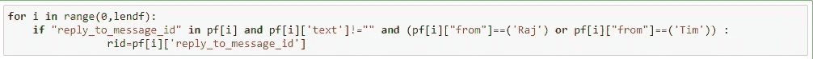

现在我们需要提取所提出的问题，所以我们采用“回复消息 id”字段中给出的 id，并向上滚动到包含问题的消息 id。

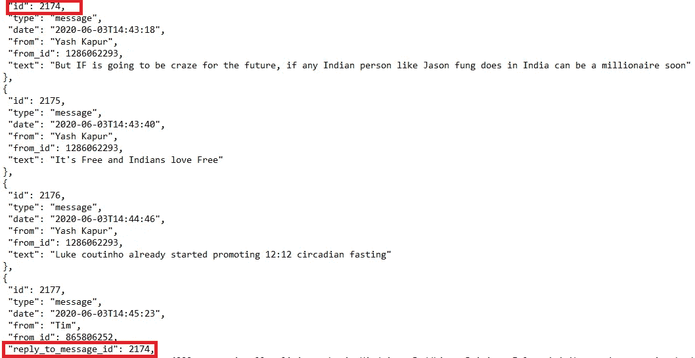

对于上面的逻辑，代码可以编写如下，这里添加的逻辑是，问题不应该来自 Tim 或 Raj，因为我们只想从他们那里提取人们所提问题的答案。：

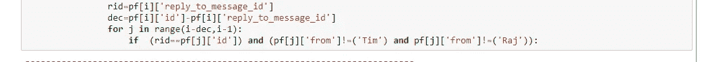

完成后，我们可以用下面的代码打印问题和答案:

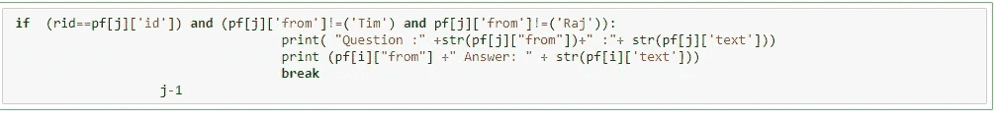

**第六步:** **数据清理——删除不相关的。**

现在我们得到了所需的文件，但它有许多问题，如:

1)多多早上好，回复祝福短信。

2)相关数据较少。

3)大量垃圾字符。

我们必须以有意义的方式过滤掉这些。输出文件如下所示:

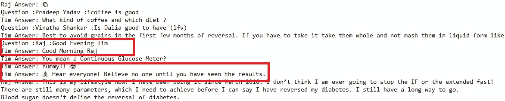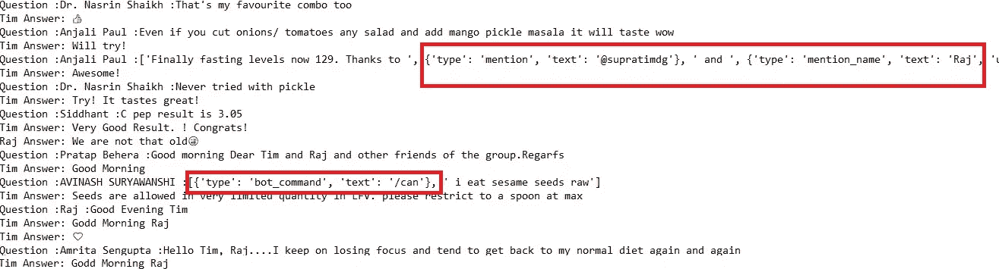

***a)为了得到相关的问题和答案*** 只有我们为问题设置了一个过滤器，那些包含关键字' can '、' what '、' where '、' when '、' how '、' which '、' who '、' why '、' suggest '的字符串才会被包含在问题中，其余的将被删除。

你必须注意列表中每个单词后的空格，以确保我们捕捉到相关的单词，而不是与其他单词连接在一起，如“斜面，无论哪一个，无论是谁”等。)

这段代码如下:

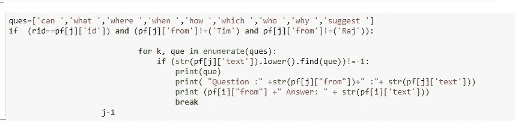

***b)要删除花括号和它之间的文本*** ，我们通过使用下面的代码来删除它:

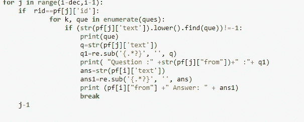

要使用上面的代码，记住我们需要导入 Python 的正则表达式库。

现在我们得到的数据非常干净，只有相关的问题和答案。

我们必须删除“早上好”、“晚上好”消息，但是通过上面步骤 a)中的方法，只有当它有问题时，我们才得到相关的问题答案和祝愿消息。这是一种不同的方法，但很有效😊。

如果需要删除表情符号，也可以通过 python 库使用“表情符号”来完成，并通过使用“表情符号”在文本中找到它。UNICODE_EMOJI。

**第六步:**

**最后但同样重要的是，我们需要将聊天导出到 csv 文件**，这可以通过以下代码轻松完成:

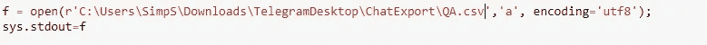

要使用这个，记住我们需要导入操作系统、系统和子进程。

感谢阅读！

*原载于 2020 年 9 月 28 日*[*https://www.numpyninja.com*](https://www.numpyninja.com/post/extracting-relevant-information-from-telegram-groups-and-making-it-representable)T22。