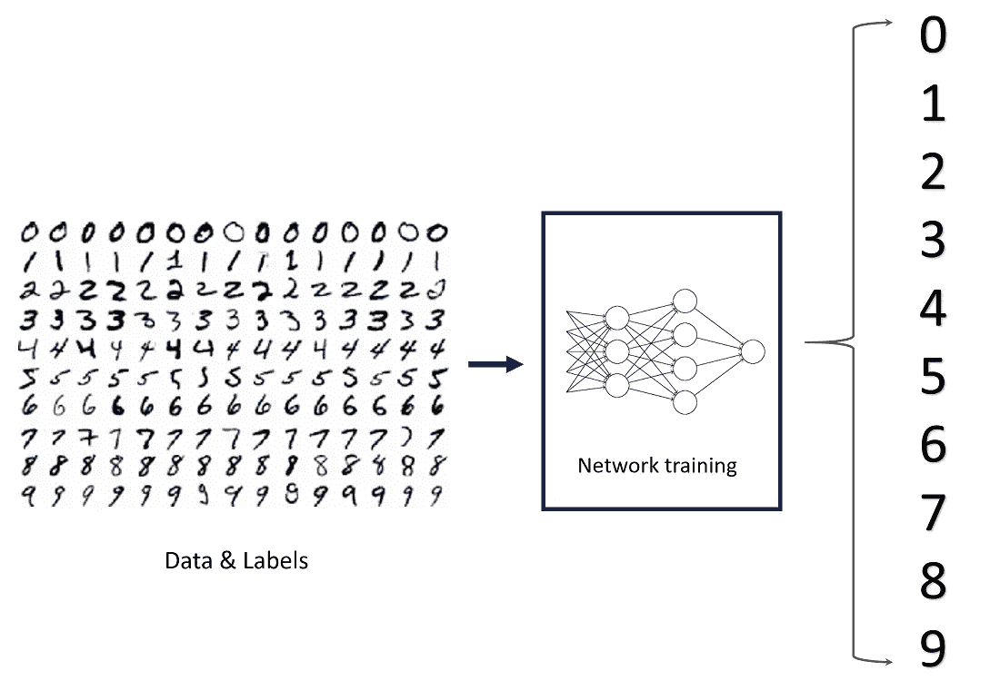

# 极限学习机 I

> 原文：<https://medium.datadriveninvestor.com/extreme-learning-machines-82095ee198ce?source=collection_archive---------5----------------------->

## 第一部分:引言:我们为什么需要榆树？

大约在 2005 年，光和新加坡南洋理工大学的一组研究人员推出了一种新颖的机器学习方法。

这种新提出的学习算法趋向于达到**最小的训练误差**，**获得最小的权值范数**和**最佳的泛化性能**，**运行极快**，为了与其他流行的 SLFN 学习算法相区别，它被称为极限学习机(ELM)。

这种方法主要解决神经网络的训练时间比所需时间慢得多的问题，其主要原因是通过使用这种学习算法来迭代地调整网络的所有参数。这些基于慢梯度的学习算法被广泛用于训练神经网络。

Important features of ELM [Source](https://www.ntu.edu.sg/home/egbhuang/)

在深入研究 ELM 如何工作以及它为什么这么好之前，让我们看看基于梯度的神经网络是如何工作的。

# 基于梯度的神经网络演示

简单地说，下面是单层前馈神经网络中遵循的步骤:

第一步:评估 Wx + B

步骤 2:应用激活函数 g(Wx + B)并计算输出

第三步:计算损失

步骤 4:计算梯度(使用德尔塔规则)

重复

这种向前和向后传播的方法涉及大量的计算。如果输入大小很大，或者如果有更多的层/节点，则训练会花费大量的时间。

fig.1\. 3-layered Neural Network

在上述示例中，我们可以看到，对于 4 节点输入，我们需要 W1 (20 个参数)、W2 (53 个参数)和 W3 (21 个参数)，即总共 94 个参数。并且参数随着输入节点的增加而迅速增加。

让我们举一个使用 MNIST 数据集对数字进行影像分类的真实例子:

**MNIST 的例子**

[Source](https://towardsdatascience.com/image-classification-in-10-minutes-with-mnist-dataset-54c35b77a38d)

这具有 28×28 的输入大小，即 784 个输入节点。对于它的架构，我们先考虑两层 **128 个节点**和 **64 个节点**，再分成 10 类。那么参数将是:

*   第一层(784，128) = 100352 个参数
*   第二层(128，64) = 8192 个参数
*   输出层(64，10) = 640 个参数

这将为我们提供总共 109184 个参数。并且通过反向传播重复调整权重增加了大量训练时间。

这只是一个 28x28 的图像，考虑用 10000 个特征来训练它更大的输入大小。训练时间简直失控。

# 结论:

在前向神经网络的几乎所有实际学习算法中，传统的反向传播方法要求在每个反向传播步骤中调整所有这些权重。

大多数时候，基于梯度下降的策略已经被用于前馈神经网络的各种学习算法中。然而，很明显，基于梯度下降的学习策略平方测量通常非常慢，因为不适当的学习步骤或可能只是收敛到局部最小值。并且这种学习算法需要许多迭代学习步骤以获得更高的学习性能。

这使得训练比要求的慢得多，这已经成为各种应用的主要瓶颈。

本系列下一篇:**第二部分:算法**[https://medium . com/@ Prasad . kumkar/extreme-learning-machines-9 c8 be 01 F6 f 77](https://medium.com/@prasad.kumkar/extreme-learning-machines-9c8be01f6f77)

# 参考资料:

[1]黄，张广斌，朱，秦宇，肖，徐志军.(2004).一种新的前馈神经网络学习方案。IEEE 神经网络国际会议-会议录。2.985–990 第二卷。

[2]https://www.ntu.edu.sg/home/egbhuang/