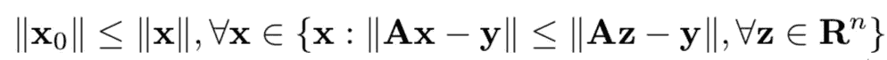
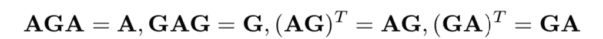
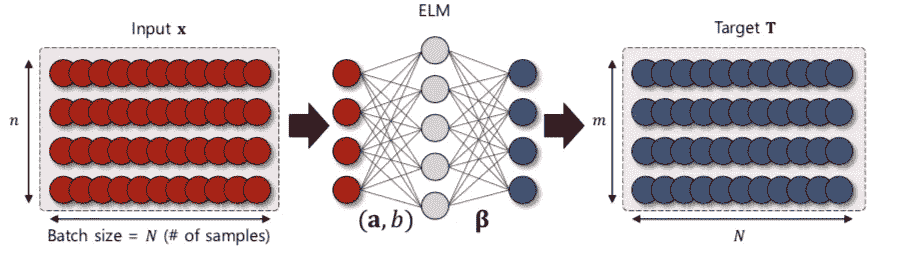

# 极限学习机 II

> 原文：<https://medium.datadriveninvestor.com/extreme-learning-machines-9c8be01f6f77?source=collection_archive---------1----------------------->

## 第二部分:算法:有何不同？

与用于神经网络学习的传统算法(例如反向传播算法)不同，传统算法可能面临手动调整控制参数(学习速率、学习时期和其他超参数)和/或局部最小值的困难，ELM 是完全自动实现的，没有任何迭代调整，也不需要用户干预。此外，ELM 的学习速度与其他传统方法相比非常快。

在 ELM 算法中，隐节点的学习参数(包括输入权值和偏差)可以独立地随机分配，网络的输出权值可以通过简单的广义逆运算解析地计算出来。

此外，ELM 算法可以获得更好的泛化性能。此外，证明了具有附加或 RBF 激活函数的 ELM 算法的全局逼近能力。ELM 算法已经成功地应用于许多现实世界的问题，例如分类和回归问题。

# 最小二乘法:

**计算输出重量**

解线性方程 Ax+b=0，我们有一个不需要是方阵的 A。它可以是一个 **n** x **m** 的矩阵，其中 n < m。这里我们有更多的未知数，而不是我们有方程，所以系统是**欠定的**。

在这些条件下，通常 x 有许多可能的值，使得 Ax = y。我们需要找到这样一个最小(加权)欧几里德范数，即最小∣∣x∣∣.的解 x

## 一般线性系统的最小范数最小二乘解

对于一般线性系统 Ax = y，我们说 xˇ(x-hat)是最小二乘解(l.s.s ),如果

> 定义:x₀ ∈ Rⁿ据说是线性系统 Ax = y 的最小范数最小二乘解，如果对于任何 y ∈ Rᵐ

## 摩尔-彭罗斯广义逆

*又名伪逆*

> ***定义:*** 一个 n × m 阶矩阵 G 是 m × n 阶矩阵 A 的 Moore-Penrose 广义逆，如果

我们一般知道，要计算一个矩阵的逆矩阵，这个矩阵应该是一个方阵。但是无论矩阵是方阵还是非方阵，都应该有一个逆矩阵。

伪逆基本上是任何类型矩阵(方阵或非方阵)的逆。

# 体系结构

Image from reference [1]

基于 ELM 算法的单层前馈神经网络由具有 N 个输入节点的输入批次 x(批次大小为 N)组成。

## 算法:

**隐藏层**:使用输入权重参数(a，b)，用于计算隐藏层中的 ax+b。

应用激活函数 g(y ),给出 g(ax+b)作为隐藏层的输出。让我们称 g(ax+b)为 h。

> **H = g(ax+b)**

**输出层:** β是所用的输出权重，乘以 H 得到我们的最终输出。

> **y = Hβ**

**计算β**

根据标记的目标“T”计算β，如下所示

> β = (H.H **ᵗ** )⁻。H **ᵗ.T**

这里的术语{ **(H.Hᵗ)⁻。Hᵗ是矩阵 h 的伪逆，我们现在用 H₀.来表示**

> H₀ = (H.Hᵗ)⁻。Hᵗ
> 
> β = H₀.T

在哪里，

*   h 从隐藏层输出，
*   Hᵗ是 h 的转位
*   t 是目标

## Python 实现:

我们需要初始化这个类，给它隐藏层的节点数，即 hiddenSize。

然后，我们需要将带有标签(y_train)的输入数据(x_train)输入到训练方法中。

输入权重 W 和偏差‘b’随机选择适当的大小，不添加偏差是可以的。我已经应用了 ReLu 激活功能，尽管其他任何激活都可以。

本系列上一篇:**第一部分:背景**[https://medium . com/@ Prasad . kumkar/extreme-learning-machines-9f 9512002205](https://medium.com/@prasad.kumkar/extreme-learning-machines-9f9512002205)

本系列下一篇:**第三部分:对比**[https://medium . com/@ Prasad . kumkar/extreme-learning-machines-ef3b 229d 63 c 5](https://medium.com/@prasad.kumkar/extreme-learning-machines-ef3b229d63c5)

# 参考资料:

[1] J. Park 和 J. Kim，“在线递归极限学习机及其在时间序列预测中的应用”，2017 年国际神经网络联合会议(IJCNN)，安克雷奇，AK，2017，PP . 1983–1990，doi:10.1109/ij CNN . 2017 . 199900001

[2]黄，g .什么是极限学习机？填补了弗兰克·罗森布拉特的梦想和约翰·冯·诺依曼的困惑之间的空白。*Cogn Comput*7，263–278(2015)。[https://doi.org/10.1007/s12559-015-9333-0](https://doi.org/10.1007/s12559-015-9333-0)

[3]黄、朱光斌、秦宇、萧，徐志军.(2004).一种新的前馈神经网络学习方案。IEEE 神经网络国际会议-会议录。2.985–990 第二卷。