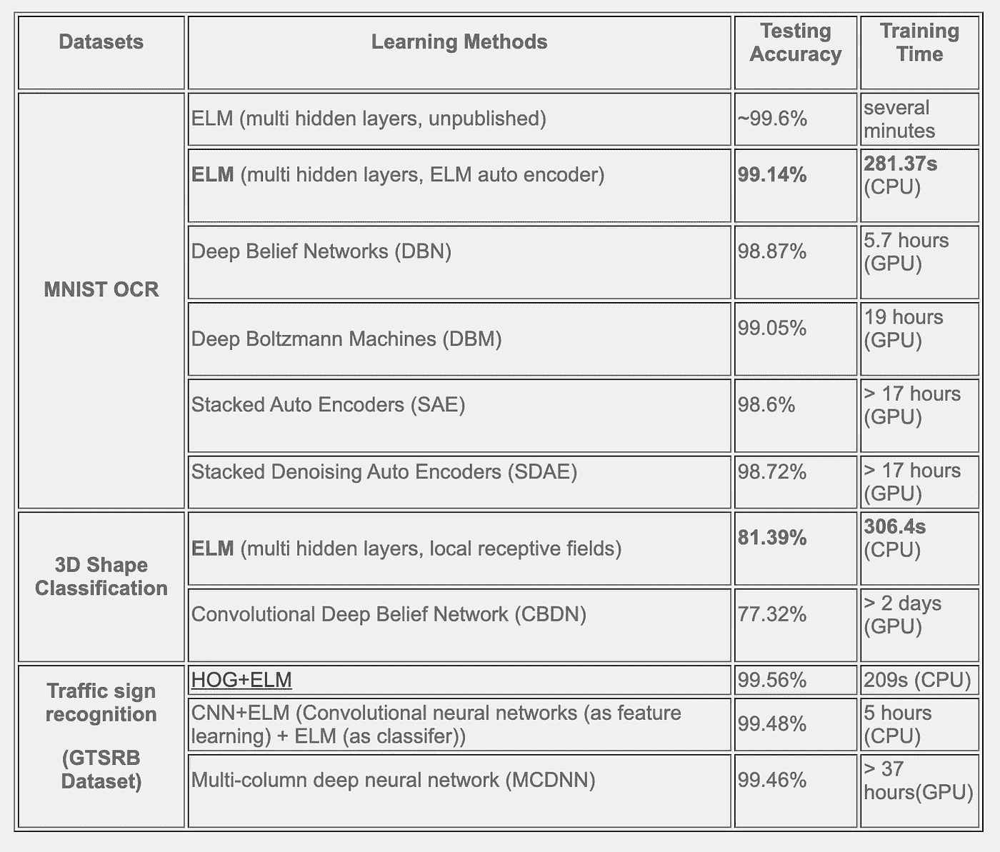
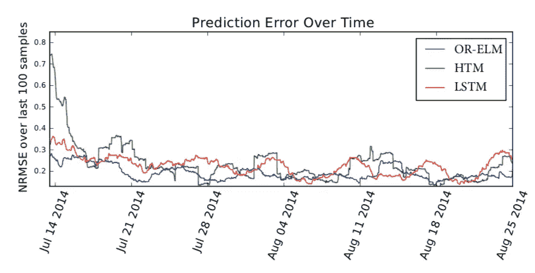
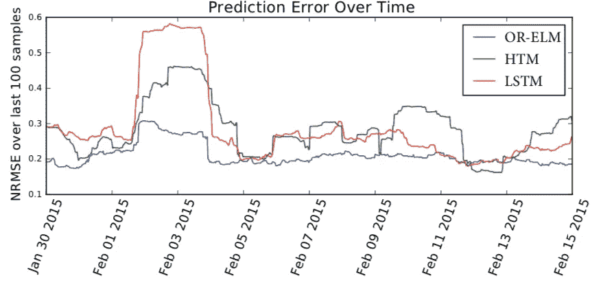
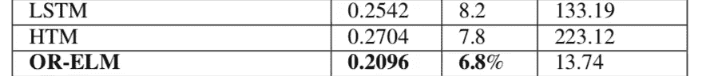
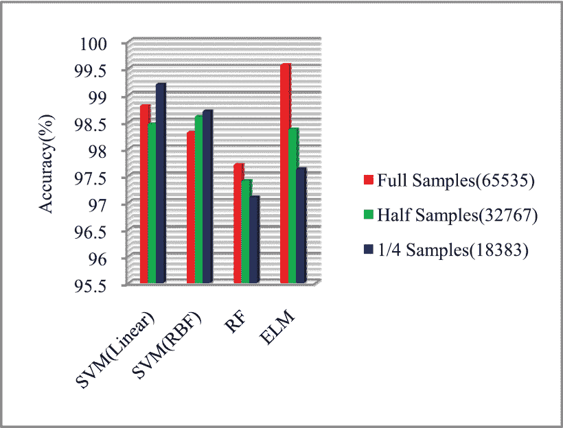
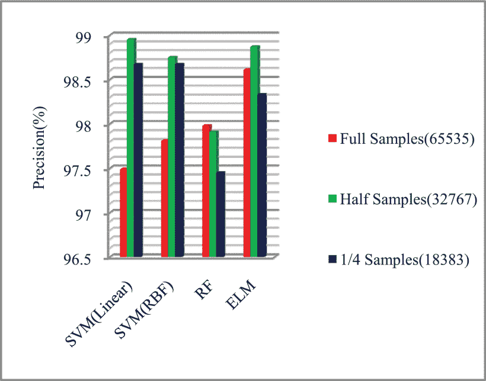
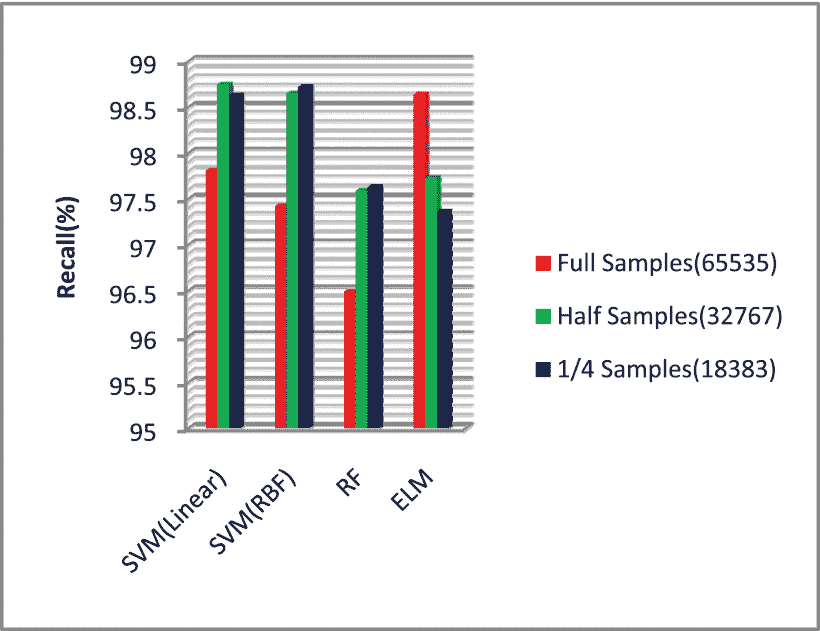

# 极限学习机 III

> 原文：<https://medium.datadriveninvestor.com/extreme-learning-machines-ef3b229d63c5?source=collection_archive---------1----------------------->

## 第三部分:好点了吗？

嗯，看情况。

就像说的那样，它的主要优点是**最小的训练时间和误差**以及**更好的泛化性能。** ELM 具有最简单的算法，因为我们不必决定隐藏层数、学习速率和其他超参数。即使更简单，ELM 在准确度、精确度和召回率方面也优于任何其他算法。

但是 ELM 架构大多以第一层的隐藏节点数量较多而告终，这**会影响测试时间**。如果模型的应用不需要更少的训练时间，但需要更快的结果作为其优先考虑，那么 ELM 不应该是您的首选。例如，ELM 在实时图像分类方面表现不佳。

Comparison from source [3]

## 与 LSTM 和 HTM 的比较

这里使用的 OR-ELM 是一种用于在线递归时间序列数据的 ELM 算法。这个实验是为了预测云环境中的故障而做的。

这里使用的参数是 NRMSE，它是归一化均方根误差。在图 1(a)中，我们可以看到，ELM 算法具有更低的 NRMSE，整体性能更好。

Fig.1 (a) Prediction error for the 40 days from source[1]

Fig.1 (b) Prediction error when rapid changes of inputs occurred from source[1]

**时间比较:**ELM 算法所用的时间大约不到其比较时间的 10%,并且总体误差较小。

Fig.2 Comparison with **(I)NRMSE**, **(II)MAPE**, **(III)Computational Time** (in sec) from source[1]

## 与支持向量机和随机森林的比较

数据集被随机化并分成三部分:全样本、半样本和 1/4 样本。完整数据集包括 65，535 个样本，半数据集包括 32，767 个样本，1/4 数据集包括 18，383 个样本。准确度、精确度和召回率被用作评估指标。

然后，数据集被分成 80%的训练和 20%的测试。

与 SVM(线性)、SVM (RBF)和 RF 相比，ELM 在全数据样本上的性能更好，而 SVM (RBF)在半数据样本上的精度优于 RF 和 ELM。SVM(线性)在 1/4 数据样本上优于其他技术。

Fig. 3 (a) Accuracy of SVM, RF and ELM

在全数据样本上，ELM 的精度优于所有方法。在半数据样本上，SVM(线性)的精度高于 SVM (RBF)、ELM 和 RF。而 SVM 在 1/4 数据集上表现出比 ELM 和 RF 更好的性能。

Fig. 3 (b)

对于全样本，ELM 的召回率优于所有其他算法，并且随着样本大小的减小而降低。这表明 SVM 在小数据集上表现更好，而 EML 在大数据集上优于其他方法。

Fig. 3 (c )

# 结论

我们可以得出结论，在 MNIST OCR 数据集、交通标志识别和 3D 图形应用等方面，ELM 在给定大量数据的情况下具有比其他任何算法更好的性能，并且将训练时间从几天(通过深度学习)缩短到几分钟(通过 ELM)。

除此之外，如图 1 所示，当输入数据快速变化时，ELM 甚至表现得更好

使用 ELM 算法的唯一缺点是在某些情况下测试时间会稍微长一点，而且数据集应该足够大。

本系列上一篇:**第二部分:算法**[https://medium . com/@ Prasad . kumkar/extreme-learning-machines-9 c8 be 01 F6 f 77](https://medium.com/@prasad.kumkar/extreme-learning-machines-9c8be01f6f77)

# 参考

1.  J.Park 和 J. Kim，“在线递归极限学习机及其在时间序列预测中的应用”，2017 年国际神经网络联合会议(IJCNN)，安克雷奇，AK，2017 年，第 1983–1990 页，doi:10.1109/ij CNN . 2017 . 19966650965
2.  I. Ahmad，M. Basheri，M. J. Iqbal 和 A. Rahim，“支持向量机、随机森林和极限学习机在入侵检测中的性能比较”，载于 *IEEE Access* ，第 6 卷，第 33789–33795 页，2018 年，doi:10.1109/Access . 2019106
3.  [https://www.ntu.edu.sg/home/egbhuang/](https://www.ntu.edu.sg/home/egbhuang/)