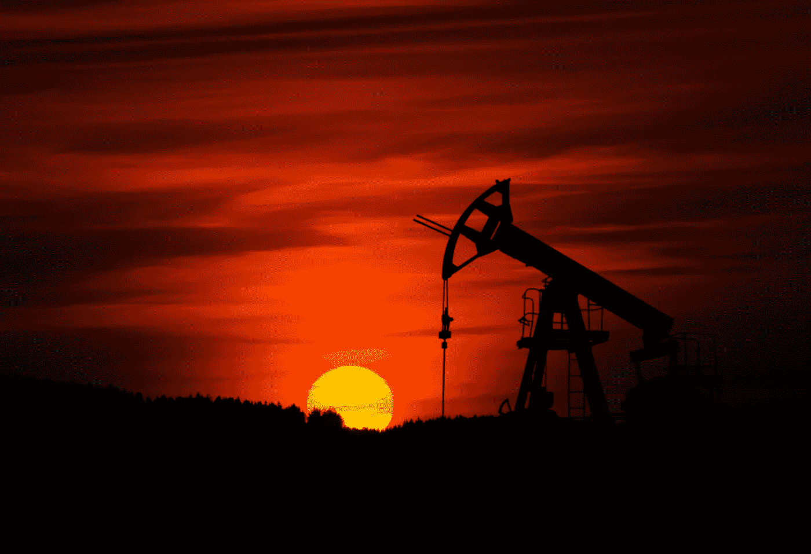
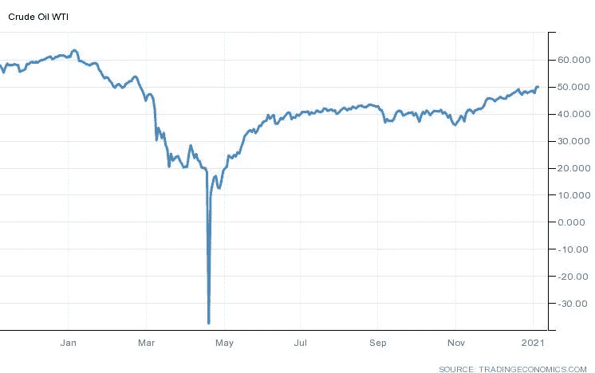

# 强烈买入埃克森美孚

> 原文：<https://medium.datadriveninvestor.com/exxon-mobil-is-a-strong-buy-d159f49bfdc?source=collection_archive---------14----------------------->

Photo by [Zbynek Burival](https://unsplash.com/@zburival?utm_source=unsplash&utm_medium=referral&utm_content=creditCopyText) on [Unsplash](https://unsplash.com/s/photos/oil?utm_source=unsplash&utm_medium=referral&utm_content=creditCopyText)

原油无疑在 2020 年经历了一场疯狂的旅程，许多生产原油的公司因此遭受了疯狂的股价波动。

下图说明了疫情对短期油价的奇怪影响，4 月份油价曾一度为负值。

[Crude oil | 1983–2021 Data | 2022–2023 Forecast | Price | Quote | Chart | Historical (tradingeconomics.com)](https://tradingeconomics.com/commodity/crude-oil)

从某些方面来看，这似乎是很久以前的事了，而从另一些方面来看，这就像是昨天发生的事。疫情肯定是我们将谈论很长时间的东西，遗憾的是它还没有结束，特别是考虑到这些突变。但那是以后的事了。今天我们谈论埃克森美孚(XOM)，以及为什么我认为这是一个强有力的购买。

# 概观

埃克森美孚是世界上最大的石油和天然气公司，2019 年的收入为 2550 亿美元。埃克森的三个部门包括上游、下游和化学品，这意味着该公司在石油生产的每个阶段都是多元化的，并且在世界上几乎每个国家都有业务。

这不仅使公司多元化，对生产的每个阶段都有更多的控制权，而且还保护了公司的利润率不受油价下跌的影响。尽管埃克森公司 50%的收入来自于从地下开采石油，其余的来自于提炼石油并用来制造塑料、发动机油和喷气燃料。因此，当油价下跌时，它的化工和下游部门的利润率不会受到影响，甚至会因此而提高。

当然，埃克森仍然希望更高的油价，事实上，埃克森需要更高的油价，因为它的盈亏平衡点在每桶 20 美元至 25 美元之间，所以从上面的图表中可以看出，疫情的开始对公司的上游部门来说是一个非常具有挑战性的时期。

# 为什么要投资埃克森？

让我们先看看我们在处理什么；这家公司去年损失了超过 40%的价值，部分原因是对其生产的产品缺乏需求，其次是因为该公司不得不进行大量借款来维持其不可持续的股息。截至 2019 年第三季度末，埃克森美孚的债务为 471 亿美元，仅 12 个月后就增至 688 亿美元。

投资者喜欢高股息率(目前超过 8%)，但不喜欢只能通过过度借贷来维持的股息率。再加上对石油需求的空前下降，该股在 12 个月内损失 40%也就不足为奇了。

然而，我们必须向前看，当我们向前看时，很明显可以看到拥有埃克森美孚公司有许多有利的一面。

国际能源署(IEA)预测，2021 年石油需求将恢复到疫情前水平的 99%,如果这一预测是正确的，我们可以假设石油将经常保持在每桶 50 美元以上(撰写本文时为 51.59 美元)。

该公司还预计未来 5 年将快速增长，计划在 2025 年底前每年至少花费 10%的市值用于增长，最终结果是产量比 2019 年增长 100%以上。到 2024 年，仅二叠纪盆地的新项目预计每天就能生产至少 100 万桶石油当量，而这只是不断增加的冰山一角。

有太多的单个项目要列出来(我已经读了足足 20 分钟左右，并决定运行胡佛回合会更有趣)，但相信我，有很多。

# 还有别的吗？

嗯，我们有增长，我们有价格和需求的上升，我们有巨大的股息收益率(管理层已承诺保持)，目前的交易价格为 0.9 倍的账面价值，我们当然有价值的发挥。

然而，忽视该公司在如此短的时间内承担的巨额额外债务是不负责任的，如果油价再次下滑，我们应该会看到大规模的股息削减或更多的借款来融资。为有机增长而借款通常是好事；当然，在这种情况下，投资回报远远大于贷款成本，但借钱支付股息以支撑股价是一种不可持续的灾难。

埃克森的最大阻力将是更多的全国停工，从而导致石油需求的短期大幅下降。然而，随着疫苗的出现，以及现在对病毒的理解比 3 月份时好得多，我认为我们不太可能看到油价像去年那样大幅波动。

就长期价值和/或股息股票组合而言，埃克森美孚是一只很好的股票，也是全球经济从冠状病毒中复苏的一个很好的整体押注。重要的是要记住，油价的短期下跌可能会对股票产生同样的影响，但我会将此作为长期买入的机会，并在此期间享受红利。