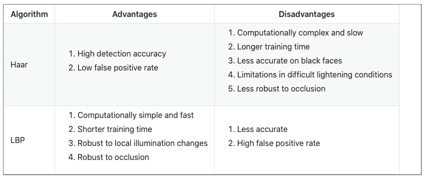
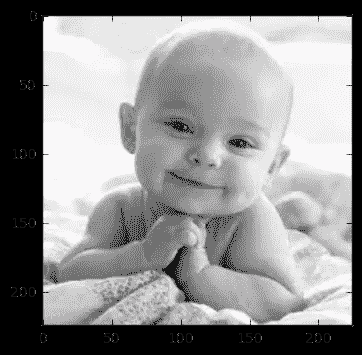
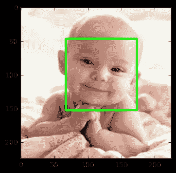
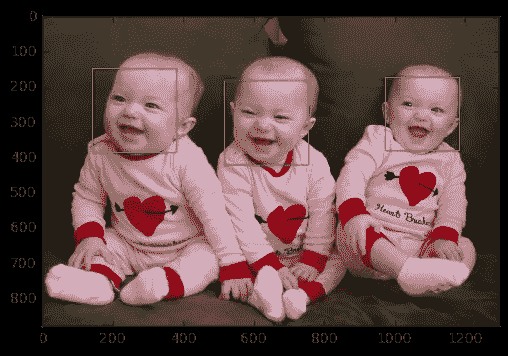
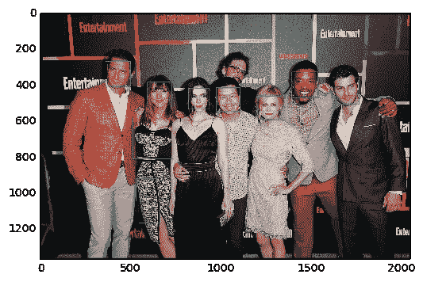
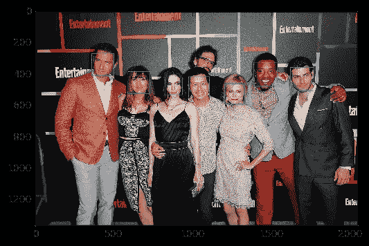
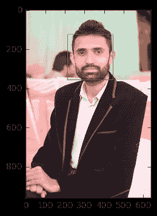
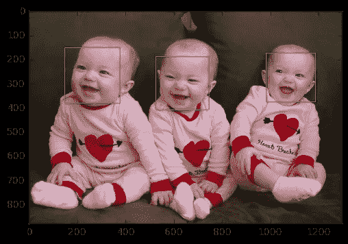
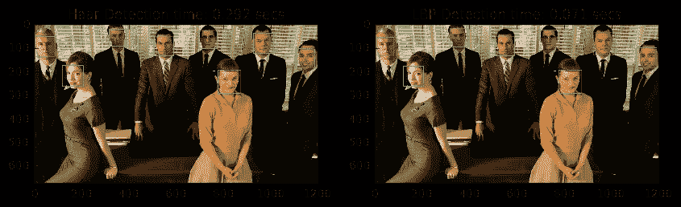
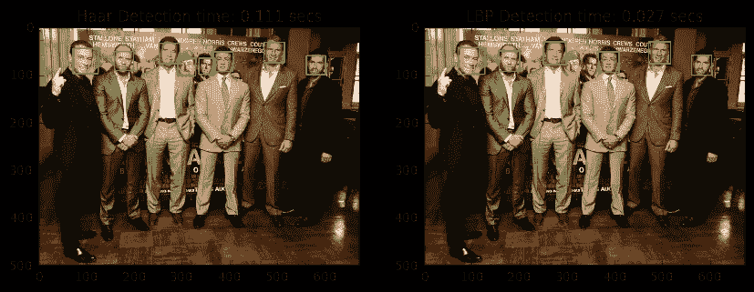

# 基于 OpenCV 和 Python 的人脸检测

> 原文：<https://medium.datadriveninvestor.com/face-detection-using-opencv-and-python-75f58eb325b1?source=collection_archive---------10----------------------->

# OpenCV

OpenCV 是一个开源的计算机视觉和机器学习软件库。这是一个 BSD 许可的产品，因此对于商业和学术目的都是免费的。该库提供了 2500 多种算法，包括用于分类和聚类的机器学习工具、图像处理和视觉算法、基本算法和绘图功能、GUI 以及图像和视频的 I/O 功能。这些算法的一些应用包括人脸检测、物体识别、提取 3D 模型、图像处理、摄像机校准、运动分析等。

OpenCV 是用 C/C++原生编写的。它有 C++、C、Python 和 Java 接口，支持 Windows、Linux、Mac OS、iOS 和 Android。OpenCV 是为计算效率而设计的，目标是实时应用。该库用优化的 C/C++编写，可以利用多核处理。

# 人脸检测

人脸检测因其实时应用而受到广泛关注。为了改进和快速实现人脸检测算法，已经进行了大量的研究，并且这些研究仍在继续。为什么人脸检测对一台机器来说很难？由于图像外观的许多变化，如姿势变化(正面，非正面)，遮挡，图像方向，光照变化和面部表情，人脸检测并不像看起来那么容易。

包含许多预先训练好的人脸、眼睛、微笑等分类器。预训练分类器的 XML 文件存储在`opencv/data/`中。特别是对于人脸检测，有两个预训练的分类器:

1.  哈尔级联分类器
2.  LBP 级联分类器

我们将在本教程中探讨这两种人脸检测器。

## 哈尔级联分类器

这是一种基于机器学习的方法，其中从许多正面(有脸的图像)和负面图像(没有脸的图像)中训练级联函数。该算法由保罗·维奥拉和迈克尔·琼斯提出。

该算法有四个阶段:

1.  **哈尔特征选择:**在输入图像的子部分中计算哈尔特征。计算相邻矩形区域的像素强度之和之间的差，以区分图像的子部分。获得面部特征需要大量的 haar-like 特征。
2.  **创建积分图像:**当对所有像素执行操作时，将进行太多的计算，因此使用积分图像，将计算减少到只有四个像素。这使得算法相当快。
3.  **Adaboost:** 所有计算出的特征都与分类目的无关。`Adaboost`用于对相关特征进行分类。
4.  **级联分类器:**现在我们可以使用相关特征将人脸从非人脸中分类出来，但是算法使用`cascades of classifiers`的概念提供了另一种改进。图像的每个区域不是面部区域，因此在图像的所有区域中应用所有特征是没有用的。不要一次使用所有的特征，而是将特征分组到分类器的不同阶段。逐一应用每个阶段以找到面部区域。如果在任何阶段分类器失败，该区域将从进一步的迭代中被丢弃。只有面部区域将通过分类器的所有阶段。

## LBP 级联分类器

LBP 是一种纹理描述符，人脸由微纹理图案组成。因此，LBP 特征被提取以形成一个特征向量来区分人脸和非人脸。以下是 LBP 级联分类器算法的基本步骤:

1.  **LBP 标签化:**一串二进制数的标签被分配给图像的每个像素。
2.  **特征向量:**图像被分成子区域，并且对于每个子区域，构建标签的直方图。然后，通过将子区域直方图连接成大直方图来形成特征向量。
3.  **AdaBoost 学习:**使用温和 AdaBoost 构建强分类器，从特征向量中去除冗余信息。
4.  **级联分类器:**级联分类器由温和 AdaBoost 算法获得的特征形成。从简单分类器到强分类器开始评估图像的子区域。如果在任何阶段分类器失败，该区域将从进一步的迭代中被丢弃。只有面部区域将通过分类器的所有阶段。

## Haar 和 LBP 级联分类器的比较

下面给出了`haar cascade classifier`和`LBP cascade classifier`的简短对比:



Comparison between LBP and Haar

每个 OpenCV 人脸检测分类器都有自己的优点和缺点，但主要的区别在于准确性和速度。因此，在需要更精确检测的用例中，`Haar`分类器更适合安全系统，而`LBP`分类器比 Haar 分类器更快，由于其速度快，所以更适合速度很重要的应用，如移动应用或嵌入式系统。

# 基于 OpenCV 的编码人脸检测

## 属国

1.  [应该安装 OpenCV](http://opencv.org/releases.html) 。
2.  [应该安装 Python v3](https://www.python.org/downloads/) 。
3.  (可选)[如果你想看到我在本教程中展示的有组织的结果，应该安装 Matplotlib](https://matplotlib.org/) ，但这是完全可选的。

**注意:**如果你不想安装`matplotlib`，那么用 OpenCV 代码替换它的代码。

例如，代替

```
plt.imshow(gray_img, cmap='gray')
```

你可以用

```
cv2.imshow('Test Imag', gray_img) cv2.waitKey(0) cv2.destroyAllWindows()
```

*   `**cv2.waitKey()**`是键盘绑定功能。它的参数是以毫秒为单位的时间。该函数为任何键盘事件等待指定的毫秒数。如果您在这段时间内按下任何键，程序将继续运行。如果传递 0，它将无限期等待击键。它也可以设置为检测特定的击键，如，如果 a 键被按下等。
*   `**cv2.destroyAllWindows()**`简单地摧毁我们创造的所有窗户。

## 导入所需的库

要运行代码，必须首先导入以下库

```
#import required libraries 
import numpy as np
import cv2
import matplotlib.pyplot as plt
import time 
%matplotlib inline
```

默认情况下，当你使用 OpenCV 加载图像时，它会将图像加载到 BGR 色彩空间中。为了使用`matplotlib`显示彩色图像，我们必须将其转换到 RGB 空间。下面是一个帮助器函数来完成这个任务。

```
def convertToRGB(img):
    return cv2.cvtColor(img, cv2.COLOR_BGR2RGB)
```

## 码—哈尔级联分类器

Haar cascade 的 XML 训练文件存储在`opencv/data/haarcascades/`文件夹中。

首先，我们需要加载所需的 XML 分类器。然后在灰度模式下加载我们的输入图像。OpenCV **中的很多操作都是在灰度**中完成的。

```
#load cascade classifier training file for haarcascade
haar_face_cascade = cv2.CascadeClassifier('data/haarcascade_frontalface_alt.xml')

#load test iamge
test1 = cv2.imread('data/test1.jpg')

#convert the test image to gray image as opencv face detector expects gray images
gray_img = cv2.cvtColor(test1, cv2.COLOR_BGR2GRAY)

#display the gray image using OpenCV
# cv2.imshow('Test Imag', gray_img)
# cv2.waitKey(0)
# cv2.destroyAllWindows()

#or if you have matplotlib installed then 
plt.imshow(gray_img, cmap='gray')
```



现在我们用`**detectMultiScale**`找到图像中的人脸。如果找到了面，该函数将检测到的面的位置作为 Rect(x，y，w，h)返回。

```
#let's detect multiscale (some images may be closer to camera than others) images
faces = haar_face_cascade.detectMultiScale(gray_img, scaleFactor=1.1, minNeighbors=5);

#print the number of faces found
print('Faces found: ', len(faces))
```

输出

```
Faces found:  1
```

接下来，让我们遍历它返回的面部(矩形)列表，并使用内置的 OpenCV `**rectangle**`函数在我们的原始彩色图像上绘制这些矩形，看看它是否检测到正确的面部。

```
#go over list of faces and draw them as rectangles on original colored img
for (x, y, w, h) in faces:
    cv2.rectangle(test1, (x, y), (x+w, y+h), (0, 255, 0), 2)
```

显示原始图像以查看绘制的矩形，并验证检测到的人脸确实是人脸，而不是误报。

```
#conver image to RGB and show image
plt.imshow(convertToRGB(test1))
```



## 将代码分组到一个函数中

如果我们将这段代码组合成一个函数，这将是很容易和可重用的，所以让我们用这段代码创建一个函数。

```
def detect_faces(f_cascade, colored_img, scaleFactor = 1.1):
    img_copy = np.copy(colored_img)
    #convert the test image to gray image as opencv face detector expects gray images
    gray = cv2.cvtColor(img_copy, cv2.COLOR_BGR2GRAY)

    #let's detect multiscale (some images may be closer to camera than others) images
    faces = f_cascade.detectMultiScale(gray, scaleFactor=scaleFactor, minNeighbors=5);

    #go over list of faces and draw them as rectangles on original colored img
    for (x, y, w, h) in faces:
        cv2.rectangle(img_copy, (x, y), (x+w, y+h), (0, 255, 0), 2)

    return img_copy
```

现在让我们在另一个测试图像上尝试这个功能。

```
#load another image
test2 = cv2.imread('data/test3.jpg')

#call our function to detect faces
faces_detected_img = detect_faces(haar_face_cascade, test2)

#conver image to RGB and show image
plt.imshow(convertToRGB(faces_detected_img))
```



## `detectMultiScale`参数详细信息

此功能检测给定测试图像中的人脸，以下是其选项的详细信息。

*   `**detectMultiScale**` **:** 检测物体的一般功能。因为我们在 face cascade 上调用它，所以它检测的就是这个。第一个选项是灰度图像。
*   `**scaleFactor**` **:** 因为有些脸可能离镜头更近，所以看起来会比后面的脸大。比例因子对此进行了补偿。
*   `**minNeighbors**` **:** 检测算法使用移动窗口检测物体。此参数定义了在当前对象附近检测到多少个对象，然后才声明找到了面。

还有其他参数，你可以在这里查看这个函数[的全部细节](http://docs.opencv.org/2.4.13.2/modules/objdetect/doc/cascade_classification.html#cv2.CascadeClassifier.detectMultiScale)。这些参数需要根据您的数据进行调整。

例如，让我们在另一个测试图像上尝试我们的`Haar`人脸检测器。

```
#load another image
test2 = cv2.imread('data/test4.jpg')

#call our function to detect faces
faces_detected_img = detect_faces(haar_face_cascade, test2)

#conver image to RGB and show image
plt.imshow(convertToRGB(faces_detected_img))
```



我们有两个误报。那里出了什么问题？记住，有些脸可能离镜头更近，看起来会比后面的脸大。比例因子对此进行补偿，因此可以调整该参数。比如`scaleFactor=1.2`提高了成绩。

```
#load another image
test2 = cv2.imread('data/test4.jpg')

#call our function to detect faces
faces_detected_img = detect_faces(haar_face_cascade, test2, scaleFactor=1.2)

#conver image to RGB and show image
plt.imshow(convertToRGB(faces_detected_img))
```



因此，您必须根据您所掌握的数据信息来调整这些参数。

## 代码 LBP 级联分类器

LBP 级联的 XML 文件存储在`opencv/data/lbpcascades/`文件夹中。

从编码的角度来看，你不需要改变任何东西，除了，不是加载`Haar`分类器训练文件，你必须加载`LBP`训练文件，其余的代码是相同的。

```
#load cascade classifier training file for lbpcascade
lbp_face_cascade = cv2.CascadeClassifier('data/lbpcascade_frontalface.xml')

#load test image
test2 = cv2.imread('data/test2.jpg')
#call our function to detect faces
faces_detected_img = detect_faces(lbp_face_cascade, test2)

#conver image to RGB and show image
plt.imshow(convertToRGB(faces_detected_img))
```



让我们在另一个测试图像上尝试一下。

```
#load test image
test2 = cv2.imread('data/test3.jpg')
#call our function to detect faces
faces_detected_img = detect_faces(lbp_face_cascade, test2)

#conver image to RGB and show image
plt.imshow(convertToRGB(faces_detected_img))
```



# Haar 和 LBP 结果分析

我们将在测试和图像上运行`Haar`和`LBP`,以查看各自的准确性和时间延迟。

```
#load cascade classifier training file for haarcascade
haar_face_cascade = cv2.CascadeClassifier('data/haarcascade_frontalface_alt.xml')
#load cascade classifier training file for lbpcascade
lbp_face_cascade = cv2.CascadeClassifier('data/lbpcascade_frontalface.xml')

#load test image1
test1 = cv2.imread('data/test5.jpg')
#load test image2
test2 = cv2.imread('data/test6.jpg')
```

## 测试 1

```
#------------HAAR-----------
#note time before detection
t1 = time.time()

#call our function to detect faces
haar_detected_img = detect_faces(haar_face_cascade, test1)

#note time after detection
t2 = time.time()
#calculate time difference
dt1 = t2 - t1
#print the time differene

#------------LBP-----------
#note time before detection
t1 = time.time()

lbp_detected_img = detect_faces(lbp_face_cascade, test1)

#note time after detection
t2 = time.time()
#calculate time difference
dt2 = t2 - t1
#print the time differene

#----------Let's do some fancy drawing-------------
#create a figure of 2 plots (one for Haar and one for LBP)
f, (ax1, ax2) = plt.subplots(1, 2, figsize=(10, 5))

#show Haar image
ax1.set_title('Haar Detection time: ' + str(round(dt1, 3)) + ' secs')
ax1.imshow(convertToRGB(haar_detected_img))

#show LBP image
ax2.set_title('LBP Detection time: ' + str(round(dt2, 3)) + ' secs')
ax2.imshow(convertToRGB(lbp_detected_img))

#show images
# plt.imshow(faces_detected_img)
```



*   准确性:`Haar`和`LBP`都成功检测到人脸。
*   速度:`LBP`比`Haar`快。

## 测试 2

```
#------------HAAR-----------
#note time before detection
t1 = time.time()

#call our function to detect faces
haar_detected_img = detect_faces(haar_face_cascade, test2)

#note time after detection
t2 = time.time()
#calculate time difference
dt1 = t2 - t1
#print the time differene

#------------LBP-----------
#note time before detection
t1 = time.time()

lbp_detected_img = detect_faces(lbp_face_cascade, test2)

#note time after detection
t2 = time.time()
#calculate time difference
dt2 = t2 - t1
#print the time differene

#----------Let's do some fancy drawing-------------
#create a figure of 2 plots (one for Haar and one for LBP)
f, (ax1, ax2) = plt.subplots(1, 2, figsize=(10, 5))

#show Haar image
ax1.set_title('Haar Detection time: ' + str(round(dt1, 3)) + ' secs')
ax1.imshow(convertToRGB(haar_detected_img))

#show LBP image
ax2.set_title('LBP Detection time: ' + str(round(dt2, 3)) + ' secs')
ax2.imshow(convertToRGB(lbp_detected_img))

#show images
# plt.imshow(faces_detected_img)
```



*   准确性:`Haar`比`LBP`检测到更多的人脸。
*   速度:`LBP`明显快于`Haar`。

# 结束注释

正如你所看到的,`LBP`比`Haar`快得多，在准确性上也没有落后太多，所以根据你的应用需要，你可以使用任何上述的人脸检测算法。尝试代码，并享受检测不同的脸和分析结果的乐趣。还有别忘了感谢 OpenCV 给出了上述算法的实现。

人脸检测具有丰富的实时应用，包括人脸识别、情感检测(微笑检测)、面部特征检测(如眼睛)、人脸跟踪等。您还可以探索 OpenCV 库中更令人兴奋的机器学习和计算机视觉算法。

你可以从这个 [repo](https://github.com/informramiz/Face-Detection-OpenCV) 下载完整的代码，以及测试图像和 LBP 和 Haar 训练文件。

在我的下一篇文章中，我会讨论如何使用这个人脸检测代码来做[人脸识别](https://medium.com/@informramiz/face-recognition-with-opencv-and-python-f51fb0389254)，如果你有兴趣，可以看看。

我喜欢玩游戏和分享我的想法，所以如果你感兴趣，就来我的 [YouTube 频道](https://www.youtube.com/channel/UCRfBKh1u3nXzkTmKBWqDo5A)关注我吧。还有，在 [Twitter](https://twitter.com/informramiz) 和 [Instagram](https://www.instagram.com/informramiz) 上关注我，看看我是怎么玩 art 和 NFT 的。

如果你有兴趣加入任何自由职业者/远程平台，我会推荐你去。这是我的[总推荐链接](https://topt.al/nVcw5a)！

*原载于*[*https://github.com/informramiz*](https://github.com/informramiz/Face-Detection-OpenCV/blob/master/README.md)*。*