# 口罩会是下一件大事吗？

> 原文：<https://medium.datadriveninvestor.com/face-masks-56ec2879564a?source=collection_archive---------12----------------------->

## 因果关系

## 市场研究和人类心理学预测你是否应该购买本季最热门的个人防护装备

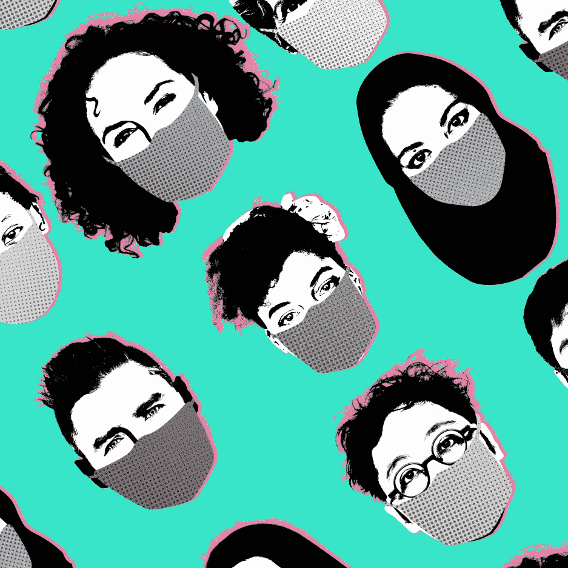

Created by Murto Hilali

我知道你在想什么。

> 我应该投资圣地亚哥最热门的人工智能口罩初创公司吗？

就我个人而言，我投入了我一生的积蓄——37.28 美元和一张蒂姆·霍顿的礼品卡(实际上我不知道余额)。

在对抗新冠肺炎的战斗中，口罩已经变得必不可少，各大品牌正在开发新的性感时尚口罩:

[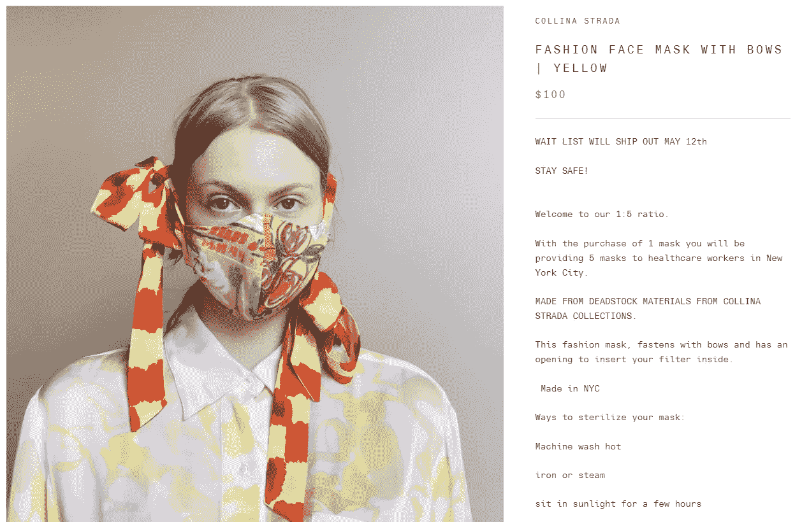](https://collinastrada.com/collections/frontpage/products/fashion-face-mask-with-bows?sscid=51k4_bqgkh&)

Collina Strada

但是这种产品有寿命吗？中国和日本等一些亚洲文化已经将口罩作为日常着装的一部分，但在这场恐慌结束后，这种趋势会转移到西方市场吗？

从 H&M 到路易威登，到处都有出售的时尚口罩会成为下一个流行服饰吗？

## 有几种方法可以解决这些问题:

*   **【信以为真】**——*(市场分析)*
*   **“评论很棒！”** — *(文化神经科学)*
*   **“概率，我亲爱的沃森”** — *(网络和信息级联)*

*(TL；博士在最后！)*

# 从表面上看，它有口罩市场的吸引力。

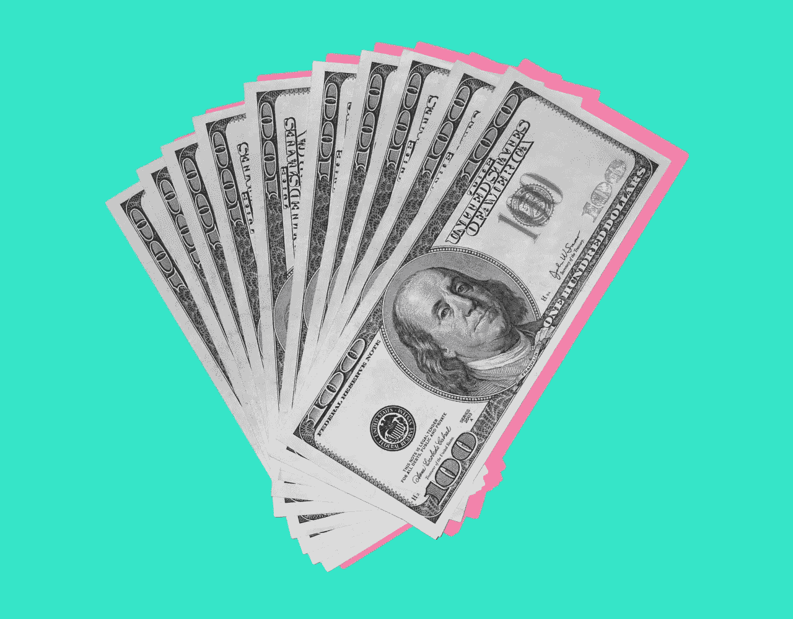

Created by Murto Hilali

## (懂了吗？)

让我们考虑一下**盈利能力**——疫情之后，一个口罩到底能赚多少钱？

斯特灵金的美国制造口罩的散装售价略高于每个口罩 6 美元，所以我们可以假设外包的布质口罩产量将是这个数字的一半，在疫情之后甚至可能更少。

```
**Quarantine Fact:** Normal surgical masks used to cost about [14 cents](https://www.ncbi.nlm.nih.gov/pmc/articles/PMC5496227/).
```

如果批发价在 3-6 美元之间，我们可以运用**基石原则** — 加价 50%。如果我们假设一个 H & M 口罩的批发价是 4.50 美元，我们就把它翻倍到 9 美元。

> 口罩有潜力驾驭后世界末日时代的街头服饰文化浪潮，所以我们可能会在其他快速时尚场所看到 10-15 美元的口罩。

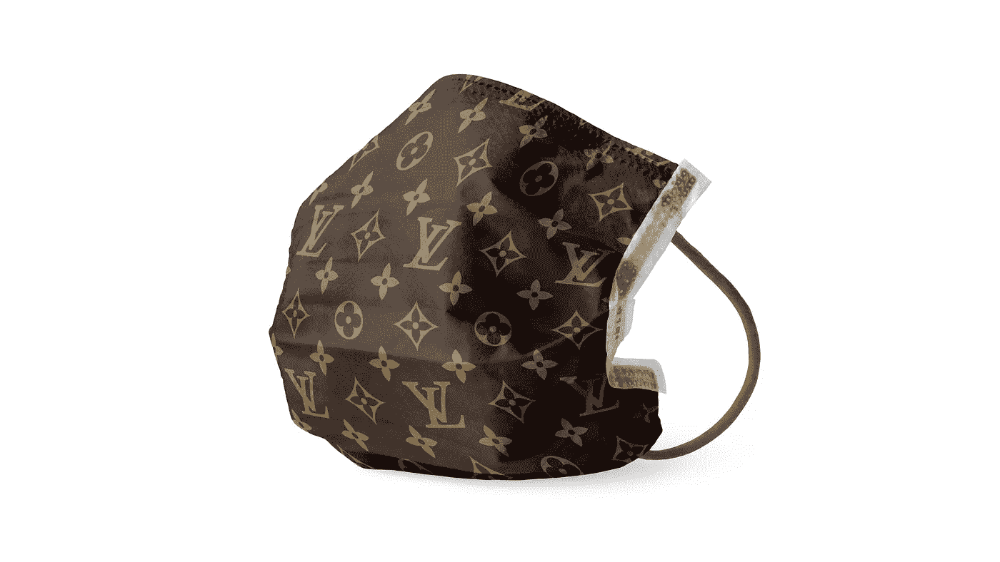

Created by Murto Hilali

奢侈面具:2008 年，LVMH 的毛利率约为 65%，一些人声称他们的手袋加价 90%。让我们估计路易威登口罩的价格上涨了 75%。

假设批发价稍高，为 6 美元，我们应用以下用于确定售价的[公式](https://www.entrepreneur.com/article/193986):

```
Selling price = [(cost of item) ÷ (100 — markup percentage)] × 100
```

插入我们的价值观，我们得到:

```
Selling price = [($6) ÷ (100–75)] × 100**Selling price = $24**
```

实际上，一个路易威登面具应该是由皮革制成的，而不是布料——我想给你一个皮革面具的大概数字，但谷歌搜索让我深感不安。

*   **市场规模:**人们喜欢在脸上花钱——到 2022 年，全球化妆品行业将达到[4300 亿美元](https://www.alliedmarketresearch.com/cosmetics-market)。
*   **竞争:**分散无品牌价值。行动最快的玩家可以填补真空。
*   **经常性收入:**Dollar Shave Club 和 Ipsy 等成功策划的订阅盒服务为[MaskClub.com](https://maskclub.com/)等面膜订阅铺平了道路。

强劲的需求、高加价、不断增长的市场和经常性收入？从数字角度来看，高级时尚口罩似乎拥有一些商业潜力。

除非你被这些彻头彻尾的黑帮分子打败，否则疾病控制中心会教你如何在家制作头巾:

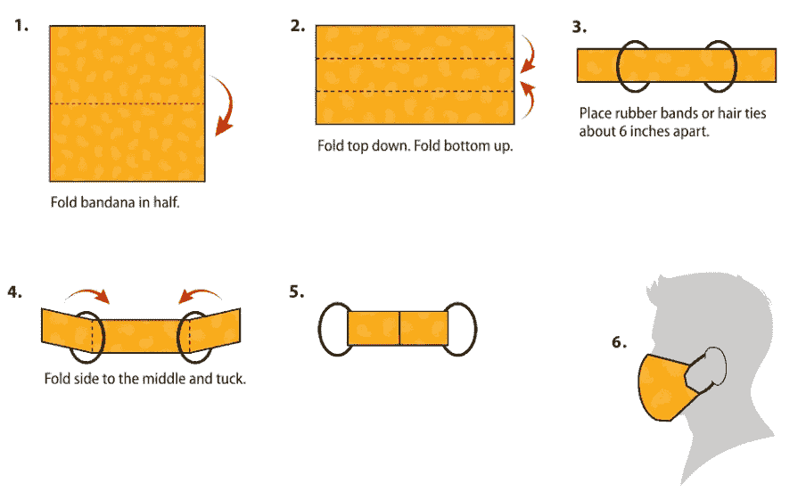

Screenshot by Author | [CDC](https://www.cdc.gov/coronavirus/2019-ncov/prevent-getting-sick/diy-cloth-face-coverings.html)

但是数字永远不会告诉我们事情的全部——它们是如此的诡秘。幸运的是，大脑很有启发性…

# Other_people_42 评价这个面具:⭐⭐⭐⭐

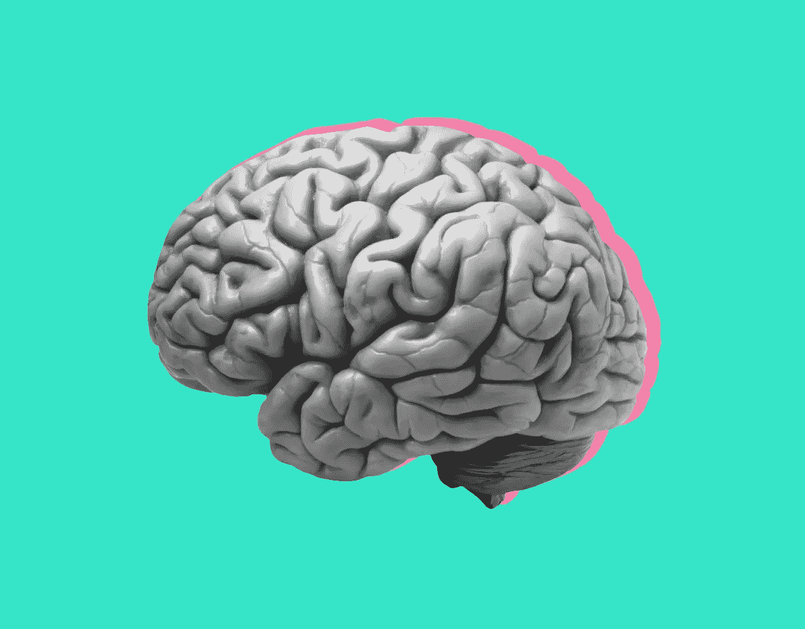

Created by Murto Hilali

## 而你的内侧前额叶皮层+尾状核同意

做和喜欢流行的东西有一个进化优势——这解释了为什么潮人这么快就被淘汰了。我们通过社会影响了解什么是流行的。

**社会影响**是指他人的行为、信仰和偏好影响我们自己。梅森、代尔和诺顿(2009 年)**进行的一项研究旨在找到这种情况如何发生的神经学基础。**

他们在两个阶段的实验中使用了 30 个随机符号:在第一阶段，10 个标记为流行+ 10 个标记为不受欢迎，还有 10 个参与者直到第二阶段才会看到的新符号。

当参与者看到有标签的符号与新的、没有标签的符号(他们不知道其他人对这些符号的看法)时，内侧前额叶皮层(mPFC)会更加活跃。

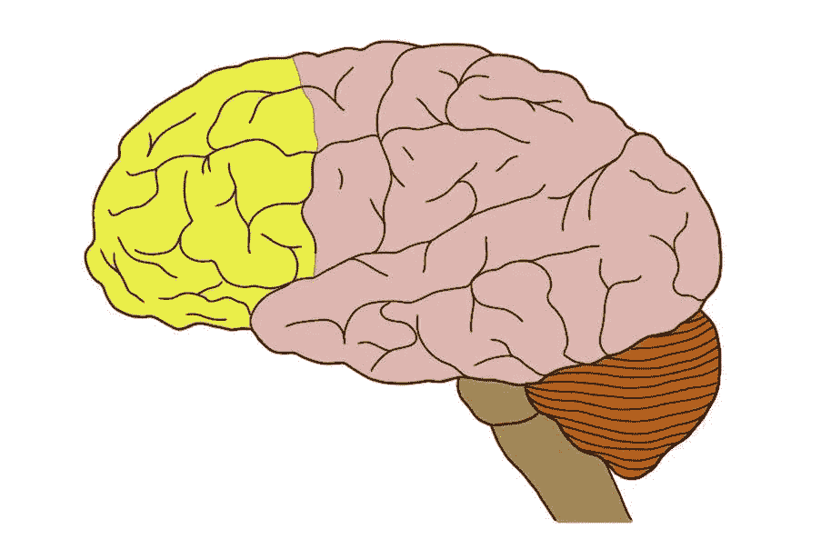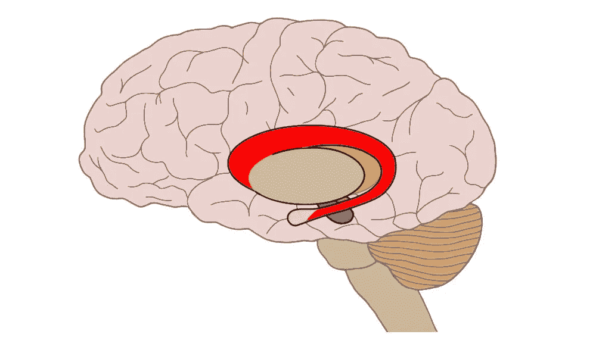

Prefrontal cortex (left, yellow) and caudate nucleus (right, red) | Neuroscientifically Challenged

mPFC 与思考他人的态度和偏好有关；当我们有关于我们正在看/想的东西的社会信息时，不管它是受欢迎还是不受欢迎，它都是活跃的。

当参与者看到受欢迎的符号和不受欢迎的符号时，他们发现尾状核更加活跃。尾状核与你大脑中的**奖赏通路**相关联。

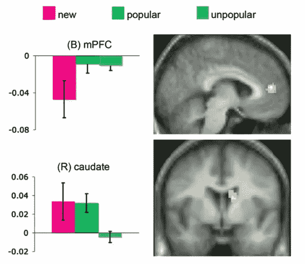

Screenshot by Author | [Mason et al. 2009](https://static1.squarespace.com/static/5d5da68404bf1c00017f9e9a/t/5db11c7880047a6a4f25bc8e/1571888249304/mason+dyer+norton.pdf)

你的大脑奖励你成为流行的一部分，因为它通常具有进化优势。人类是一种社会物种，采取群体行为会与你的群体建立更紧密的联系，这有助于你生存。

更不用说，如果你的部落中的每个人都疯狂地朝一个方向跑，这可能是有充分理由的——人群中有**智慧和安全。**

> 当看到我们知道人们有意见的东西时，mPFC 会激活，当某样东西受欢迎时，尾状核会激活。

这是一个品牌或一件衣服(比如一个流行的口罩)是否会流行的**神经学基础**——但是我们如何确定这种情况发生的**可能性**？

# 嗯，根据我的计算…

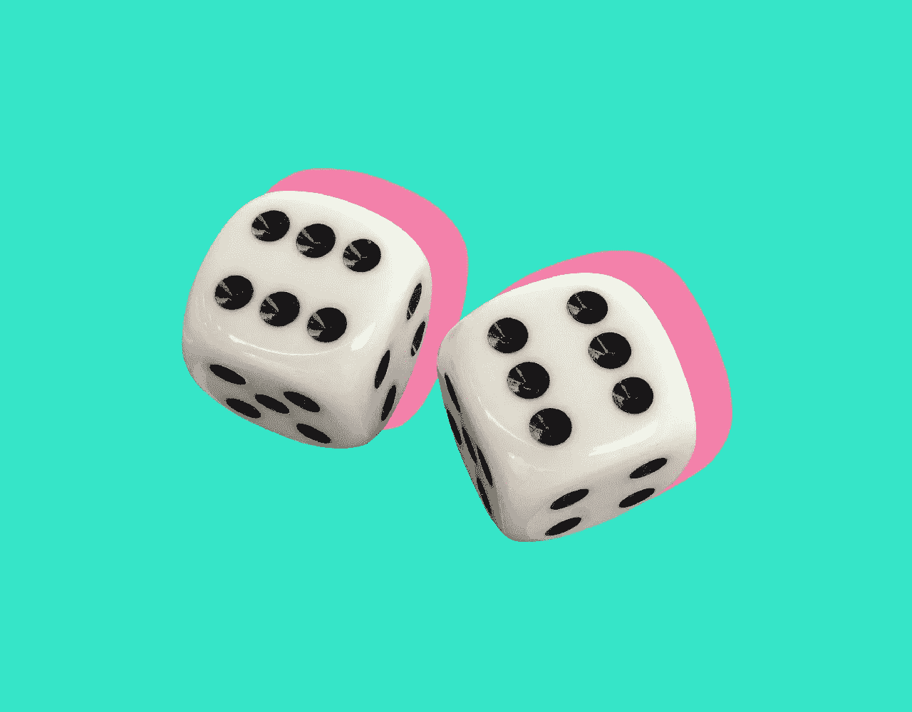

## 这取决于人数。

**信息级联**当人们根据观察到的其他人的决定连续做出决定时，即使这违背了他们自己的私人信息，也会发生。

让我们假设有一群人(N)可以决定**接受还是拒绝**时尚面膜潮流。每个人都可以观察到眼前人的决策，却无法观察到他们的私人信息。

我们可以根据以下因素建立一个数学模型来预测他们会做出什么样的决定:

```
**States of the world:** The world randomly exists in either of two states, one where wearing face masks for fashion is a good idea *(G)* and one where it’s a bad idea *(B)* — individuals will try to figure which one is true.**Signals:** Everyone has private information, or a private signal, that gives them a clue about whether accepting is a good idea or not — maybe in this case, it’s your existing knowledge of fashion.
```

信号可以是高电平(H)，意味着接受是一个好主意，也可以是低电平(L)，意味着接受是一个坏主意。事实上，如果这是一个好主意，那么高信号会比低信号更频繁。

从数学上来说，如果这是一个好主意，获得高信号的概率(用 Pr [ *H* | *G* 或 *q* 表示)将大于 1/2。Pr [ *L* | *G* 因此会是 1 — *q* 。这同样适用于相反的情况:

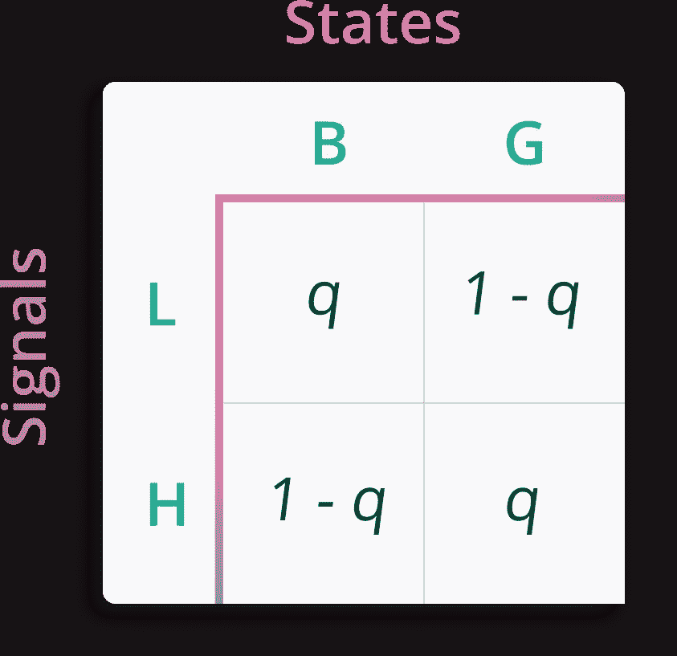

Created by Murto Hilali

通常，第一个人会跟随他们的信号，第二个人也会。(此处可以找到[的证明)。](https://www.cs.cornell.edu/home/kleinber/networks-book/networks-book-ch16.pdf)

*   如果第一个人和第二个人做出不同的决定，第三个人会无动于衷，并遵循自己的信号。
*   如果他们做出同样的决定(接受或拒绝趋势),第三个人会照做，而不管他们的私人信息。

这说明了控制信息级联的**趋势:**

*   如果*接受的数量超过拒绝的数量两个*，则开始接受的级联。
*   如果*拒绝的数量比接受的数量多两个*，它将启动一系列拒绝。

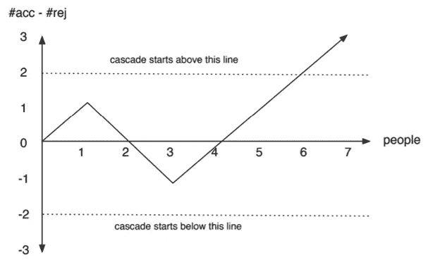

Screenshot by Author | [Cornell](https://www.cs.cornell.edu/home/kleinber/networks-book/networks-book-ch16.pdf)

这意味着**连续三个匹配信号**将**总是**导致级联。让我们把 N 分成 3 个连续的人:他们得到相同信号的概率是:

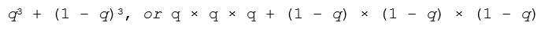

根据同样的推理，它们中没有一个得到相同信号(即没有级联发生)的概率是

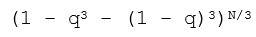

当 N 接近无穷大时，这个值开始= 0。

这意味着**序列中的**人越多，**就越有可能形成一个级联**。这可能是接受或拒绝的级联——如果你想得到前者，鼓励最初的几个人都接受，其余的人会跟着接受。

# TL；DR——口罩会成为时尚界的下一件大事吗？

*   从市场分析的角度来看，他们可能有一些潜在的标准零售利润，但不是疯狂的。
*   如果一群人戴着面具，这种社会影响会激活大脑中的**内侧前额叶皮层**和**尾状核**，以奖励你的融入。
*   从数学上来说，**如果你能让 3 个人在一个足够大的人群中连续采用口罩**作为一种时尚潮流，它会像病毒一样传播开来(原谅这个有点不恰当的双关语)。

## 为什么这对我很重要？

*   不要谷歌皮革口罩试图找到一个生产价格——我是认真的。如果你在给一个产品定价，翻倍或者不要。
*   如果你试图建立一支军队来执行你的命令，激活他们的 mPFC，让他们认为为你服务是社会可以接受的行为。
*   如果你想开创一种趋势，只要找另外两个朋友加入，你就万事俱备了。(善用此力)。

```
This article is part of ***Causality***, a column where I use different sciences + disciplines to answer questions I have about the world.
```