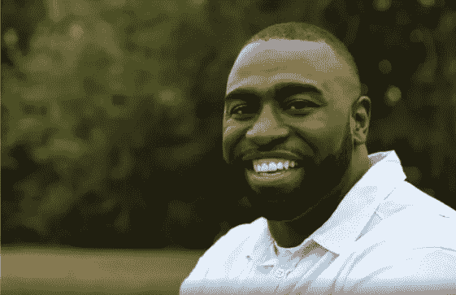
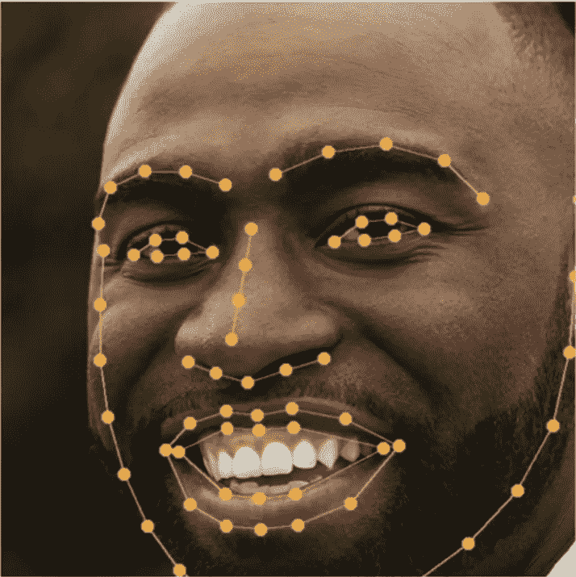
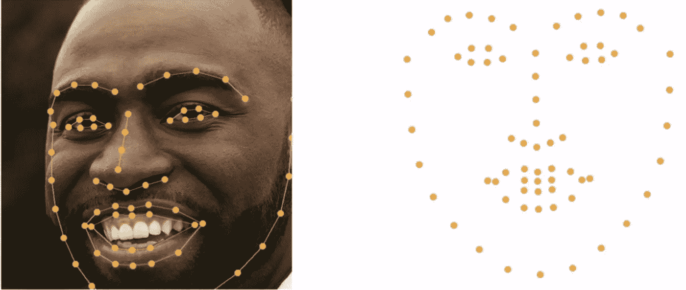
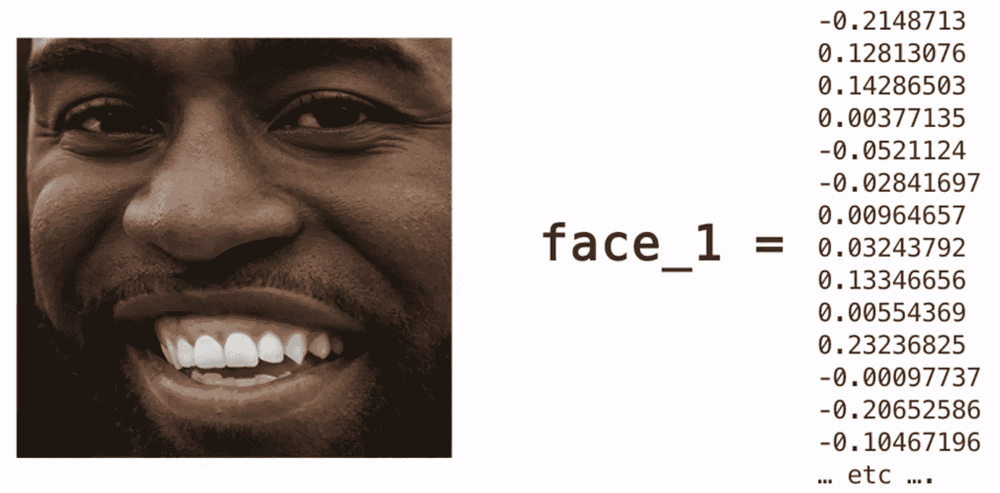
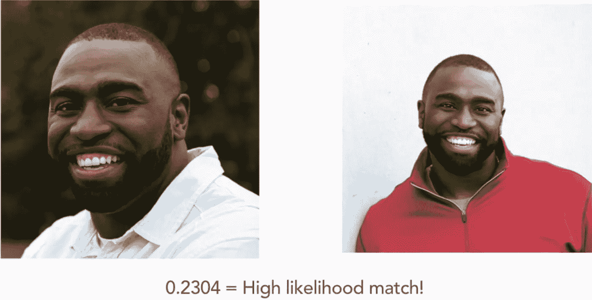

# 利用深度学习进行人脸识别(上)

> 原文：<https://medium.datadriveninvestor.com/face-recognition-using-deep-learning-part-i-a40c237f58ed?source=collection_archive---------17----------------------->

Face Detection Label

如果你曾经想知道脸书是如何识别你照片中的人的，而你甚至没有提到，那么这篇文章将会给你带来很多信息和乐趣。脸书用来识别人脸的技术是人脸检测。现代人脸检测算法具有很高的准确性，这些系统的准确性超过 98%，与人类一样准确。那么，我们先来了解一下什么是人脸识别？。

**什么是人脸识别？**

人脸识别是一种查看人的数字图像并识别图像中的人的能力。作为人类，我们从几个月大的时候就有识别熟悉面孔的先天能力。但是，教机器像人一样识别人脸是一个困难的问题，需要几十年的研究才能解决。

**面部识别管道**

对于机器来说，查看数字图像和识别人脸是一个复杂的过程，因此告诉机器遵循一系列步骤来实现目标是很重要的。

 [## 深度学习用 7 个步骤解释-更新|数据驱动的投资者

### 在深度学习的帮助下，自动驾驶汽车、Alexa、医学成像-小工具正在我们周围变得超级智能…

www.datadriveninvestor.com](https://www.datadriveninvestor.com/2019/01/23/deep-learning-explained-in-7-steps/) 

换句话说，我们必须建立一个管道，让机器理解人脸识别的过程。我们将仔细检查这个过程中的每一步，以便清楚地理解每一步背后的意图。

**第一步:从图像中定位和提取人脸。**

Ingestion of an image into a machine learning algorithm

这里的图像由一个人组成。我们需要一种算法，它可以遍历图像，找到检测人脸的部分。这是我们管道的第一步。一旦算法找到了人脸的位置，我们将这个区域保存为一个新的图像，并继续我们的过程。

**第二步:识别面部特征**

Detecting Face and Facial Features

我们现在有了一张人脸图像来处理。我们需要将这张脸与另一个人的脸进行比较，以便认出照片中的人。为此，我们需要对这个现有图像执行某些操作。我们需要一个机器学习算法来识别面部特征，并识别眼睛，鼻子和嘴巴的位置。一个人的脸从不同的角度看是不一样的。为了克服这个问题，我们需要将我们的图像固定在一个定位模板中。

**第三步:将人脸对准定位模板**

Left- Facial Features ; Right- Positioning Template

这个定位模板是通过分析数百万张脸并假设这个人直视前方而构建的。以模板为参考点，我们在右边包装我们的图像，粗略地适应左边的模板，以进一步进入管道。现在，我们已经完成了这个过程，我们移动到使用测量来唯一定义每个面的部分。

**步骤 4:将面部表示为测量值**

face_1 is represented as measurements

为了识别独特的脸，以测量的形式表示图像是重要的。通过测量的不同，我们可以发现图像是否是同一个人。为了用测量值来表示一张脸，我们借助于神经网络，这些神经网络经过数百万张脸的训练，产生一组测量值来表示每张脸。这 128 次测量是由神经网络根据面部特征计算出来的。下一步是找出另一个图像的尺寸，并与我们的图像进行比较，找出它们是否是同一个人的图像。

**第五步:与其他人脸比较**

The Euclidean distance measure is less than 0.6

现在我们有两个测量值，一个来自我们的图像，另一个来自第二个图像，这里是同一个人的不同图像。我们需要使用一个众所周知的公式来计算距离，欧几里得距离。这个公式给出了基于两个面部测量值的测量值。如果距离超过 0.6 个单位，我们说它们不匹配，否则，我们断定它们匹配。

我希望这篇文章能让大家了解人脸识别是如何完成的，以及人脸识别流程中涉及的基本步骤。我的下一篇文章将详细介绍所解释的管道的实际操作。

> 如果你喜欢这篇文章，请说👋，关注我上 [**LinkedIn**](https://www.linkedin.com/in/raghava-prasad-sridar-0a58bb93/) 或 [**这里**](https://medium.com/@rsitprasad001) 了解更多有趣的内容更新。

*注:本文中使用的图片来自我最近从 LinkedIn Learning 完成的课程，并在此处***放置了该课程的链接。**