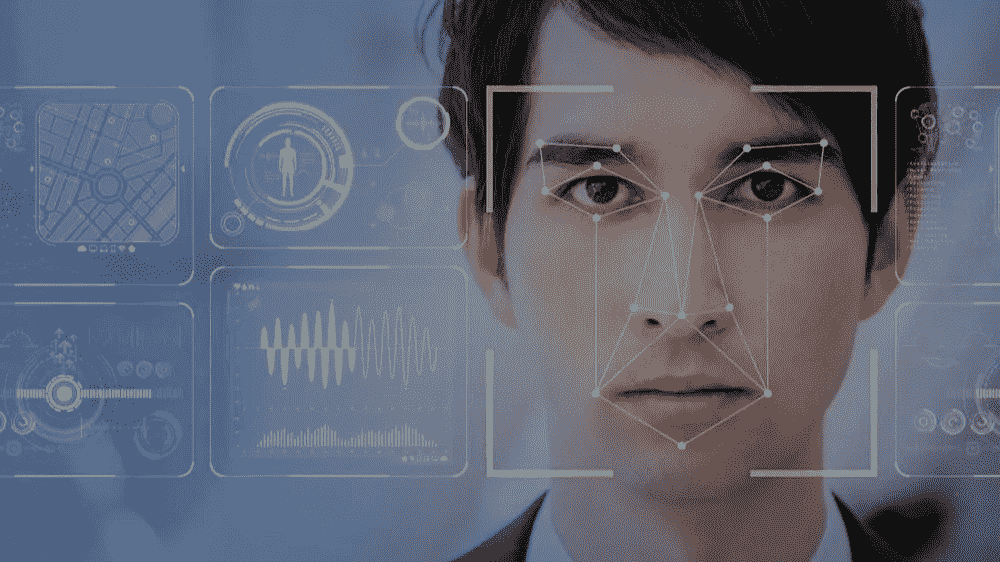
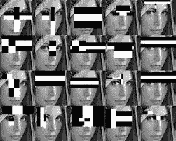
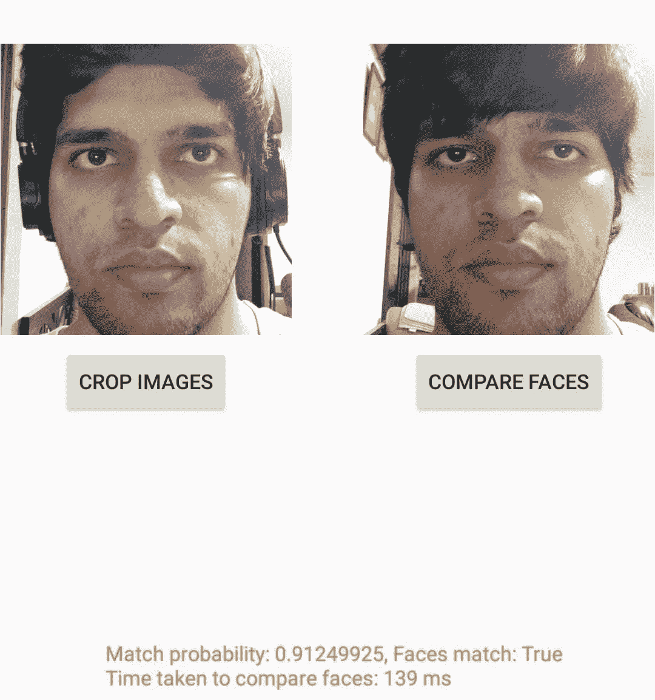
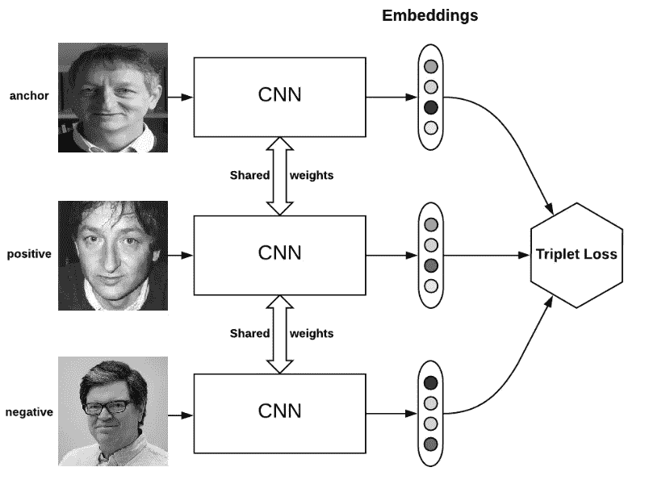
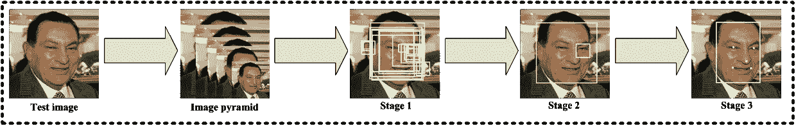

# 人脸验证—第 1 部分

> 原文：<https://medium.datadriveninvestor.com/face-verify-part-1-6e4a50afc430?source=collection_archive---------4----------------------->

在技术主导的时代，面部识别是一个我们每天听到大约 10 次的术语，但你知道它实际上分为三个子任务吗？

面部检测、识别和验证实际上是有助于同一目标的三项独立任务，使用您的面部签名作为虚拟钥匙来访问任何您不想使用术语“密码”来保护的内容。

面部检测包括检测图像中是否存在人脸，它不能做任何其他事情，尽管这是一个相当便宜的计算过程，只需要界标过滤器，如 haarCascade 面部界标过滤器。详细解释请看这里:[http://www.willberger.org/cascade-haar-explained/](http://www.willberger.org/cascade-haar-explained/)。

面部识别和验证听起来可能很相似，但与面部识别不同，面部识别会对已知面部数据库执行 1:n 匹配，面部认证是 1:1。用户使用他们的面部作为凭证进行身份验证，以确保对其在线帐户的访问。为了进行身份验证，用户只需自拍一张照片(照片被转换成 3D 人脸图)，然后与存储的生物模板进行一对一的比较。基于准确度分数的适当匹配在后台完成安全认证过程。

在本教程中，我将解释我的朋友 [SphericalKat](https://medium.com/u/23aeacd38998?source=post_page-----bd1ff4a9f45e----------------------) 在他的应用[https://github.com/ATechnoHazard/faceverify-lib/](https://github.com/ATechnoHazard/faceverify-lib/)中使用的算法，该应用旨在提供一个简单的 API，用于从位图中裁剪人脸，并比较两张人脸以验证它们是否来自同一个人。他使用 MTCNN 和 MobileFaceNet 的 TFLite 模型做到了这一点，我们将进一步深入研究。

FaceNet 是 2015 年由谷歌研究人员开发的人脸识别系统，在一系列人脸识别基准数据集上取得了当时最先进的结果。由于模型的多个第三方开源实现和预训练模型的可用性，FaceNet 系统可以被广泛使用。

FaceNet 系统可以用来从人脸中提取高质量的特征，称为人脸嵌入，然后可以用来训练人脸识别系统。

来自应用程序的演示，测试主题是 [SphericalKat](https://medium.com/u/23aeacd38998?source=post_page-----bd1ff4a9f45e----------------------)

FaceNet 是一种人脸识别系统，由谷歌的 Florian Schroff 等人在他们 2015 年题为“ [FaceNet:人脸识别和聚类的统一嵌入](https://arxiv.org/abs/1503.03832)”的论文中描述

这是一个系统，给定一张人脸图片，它将从人脸中提取高质量的特征，并预测这些特征的 128 个元素的向量表示，称为人脸嵌入。

该模型是通过三重损失函数训练的深度卷积神经网络，该函数鼓励相同身份的向量变得更相似(更小的距离)，而不同身份的向量预期变得不太相似(更大的距离)。专注于训练模型直接创建嵌入(而不是从模型的中间层提取它们)是这项工作中的一个重要创新。

> *我们的方法使用一个深度卷积网络来直接优化嵌入本身，而不是像以前的深度学习方法那样使用一个中间瓶颈层。*

- [FaceNet:人脸识别和聚类的统一嵌入](https://arxiv.org/abs/1503.03832)，2015。

然后，这些人脸嵌入被用作在标准人脸识别基准数据集上训练分类器系统的基础，实现了当时最先进的结果。

本文还探讨了嵌入的其他用途，如基于提取的特征对相似人脸进行聚类。

这是一个鲁棒和有效的人脸识别系统，并且提取的人脸嵌入的一般性质使得该方法具有广泛的应用。

在进行人脸识别之前，我们需要检测人脸。

我们将使用多任务级联卷积神经网络(MTCNN)进行人脸检测，例如从照片中找到并提取人脸。这是一种最先进的人脸检测深度学习模型，在 2016 年题为“[使用多任务级联卷积网络的联合人脸检测和对齐](https://arxiv.org/abs/1604.02878)的论文中有所描述

由于各种姿态、光照和遮挡，在不受约束的环境中进行人脸检测和对准是一个挑战。最近的研究表明，深度学习方法可以在这两项任务上取得令人印象深刻的表现。在本文中，作者提出了一个深度级联多任务框架，该框架利用检测和对准之间的内在相关性来提高它们的性能。具体而言，该框架利用具有三级精心设计的深度卷积网络的级联架构，以由粗到细的方式预测人脸和地标位置。此外，还提出了一种在线硬样本挖掘策略，在实践中进一步提高了性能。该方法在具有挑战性的 FDDB 和更宽的人脸检测基准以及 AFLW 人脸对齐基准上实现了优于最新技术的准确性，同时保持了实时性能。

我们可以使用 mtcnn 库来创建一个人脸检测器，并提取人脸以供我们在后续部分中与 FaceNet 人脸检测器模型一起使用。

第一步是加载图像。我们还会将图像转换为 RGB，以防图像有 alpha 通道或者是黑白的。

接下来，我们可以创建一个 MTCNN 人脸检测器类，并使用它来检测加载的照片中的所有人脸。

结果是一个边界框列表，其中每个边界框定义了边界框的左下角，以及宽度和高度。

如果我们在实验中假设照片中只有一张脸，我们可以确定边界框的像素坐标。有时候库会返回负的像素索引，我觉得这是 bug。我们可以通过取坐标的绝对值来解决这个问题。

然后，我们可以使用预处理函数将这张小的人脸图像调整到所需的大小；具体来说，该模型需要正方形输入面。

在下一节中，我们可以根据需要使用该函数提取人脸，并将其作为输入提供给 FaceNet 模型。

我们这里使用的是 Facenet 的移动版本 MobileFaceNets，它使用的参数不到 100 万个，是专门为移动和嵌入式设备上的高精度实时人脸验证量身定制的。首先分析了普通移动网络在人脸验证方面的弱点。上述移动电话很好地克服了这一弱点。在相同的实验条件下，MobileFaceNets 实现了显著更高的精度，实际加速比是 MobileNetV2 的 2 倍以上。经过 ArcFace loss 在精确的 MS-Celeb-1M 数据集上的训练，4.0MB 大小的单个 MobileFaceNet 在 LFW 上达到 99.55%的准确率，在 MegaFace 上达到 92.59%的 TAR@FAR1e-6，这甚至可以与数百 MB 大小的最先进的大 CNN 模型相媲美。MobileFaceNets 中最快的一个在手机上的实际推断时间为 18 毫秒。对于人脸验证，MobileFaceNets 比以前最先进的移动 CNN 显著提高了效率。

我们现在将创建一个面部嵌入。

人脸嵌入是表示从人脸提取的特征的向量。然后，这可以与为其他面生成的矢量进行比较。例如，另一个接近的向量(以某种方式)可能是同一个人，而另一个远离的向量(以某种方式)可能是不同的人。FaceNet 模型将为给定的人脸图像生成这种嵌入。

FaceNet 模型将预处理人脸以创建人脸嵌入，该人脸嵌入可以被存储并用作认证的映射，尽管在我们的实现中，我们通过不存储嵌入而只是在每个图像上生成它们并进行比较来节省内存。

至此，我们完成了理论阶段，我在 smoke trees([https://smoketrees.dev/](https://smoketrees.dev/))、 [SphericalKat](https://medium.com/u/23aeacd38998?source=post_page-----bd1ff4a9f45e----------------------) 的朋友和同事将接管第 2 部分，在那里您将学习如何在 android 应用程序中使用这些模型的 TFLite 版本，在那里您将使用它们进行人脸验证。