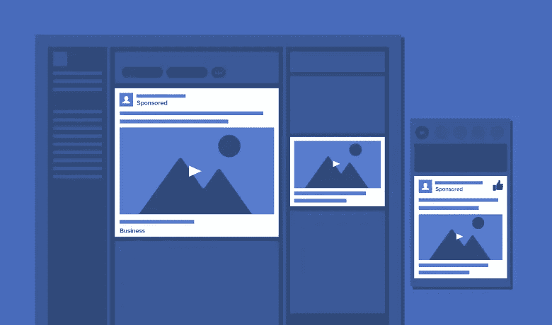

# 有效的脸书广告。

> 原文：<https://medium.datadriveninvestor.com/facebook-ads-that-work-9e209fb743ac?source=collection_archive---------20----------------------->

这篇文章统计了脸书广告类型工作的原因。解释了基于目的点的广告类型和用户范围的工作原理。

拥有超过 100 万活跃用户的脸书无疑是使用最多的社交网络平台之一。除了联系人们，它还是营销人员宣传其产品、服务或品牌的绝佳平台。

仅仅在脸书网页上发布是不够的，营销人员需要花钱来吸引他们的潜在客户，并获得更好的品牌认知度。

但是，你的脸书广告奏效了吗？得到了你想要的结果吗？你知道一个成功的广告的主要成分是什么吗？

如果不是，那你来对地方了。在这里，你会得到广告效果的细节以及广告效果背后的原因。

# 完美脸书广告的重要组成部分

## 画面

脸书算法偏爱视觉内容而不是文本内容。当你为你的产品制作脸书广告时，你需要确保广告有视觉上吸引人的图像。你创作什么类型的广告并不重要。

## 关联

如果你想取得成功，你在脸书上投放的广告必须与你的目标受众相关。无关的广告纯粹是浪费宝贵的资源和时间。

## 行动号召

没有清晰的 CTA，你广告的浏览者可能不知道他们需要做什么。当您添加 CTA 时，如“季末促销”、“买 2 送 1”等。这将鼓励用户点击广告并访问你的在线商店。

## 吸引人的价值主张

像“使用此优惠券，获得 X %的折扣”这样的价值主张对于观众点击你的广告并购买是非常重要的。虽然价值主张需要有吸引力，但也需要可信。

# 脸书广告的形式

以下是脸书广告的几种形式。

## 右栏广告

这种类型的脸书广告出现在用户新闻提要的右侧，被认为是最传统的一种。为了使这种类型的广告成功，视觉需要简单、清晰，并与独特的价值主张和 CTA 相关。

## 桌面新闻源广告

当脸书在桌面上打开时，这种广告形式直接出现在用户的新闻提要上。这种类型的广告比右栏广告更贵，参与度也更高。

## 移动新闻源广告

当脸书在手机上浏览时，这种广告类型会出现在用户的新闻提要上。下面是脸书广告的几个好例子:

## 照片广告

自从脸书诞生以来，图片广告就占据了特殊的位置，并被证明是一个丰富的广告来源。确保照片广告是高质量的，最大分辨率为 1200 x 628 像素。

## 视频广告

随着每天数十亿的视频在脸书被观看，视频广告往往会吸引更多的潜在观众。与静态帖子相比，视频广告提供了更吸引人的内容。确保广告较短，可以使用脸书广告管理器直接上传。

## 多种产品广告

在这种类型的广告中，广告商可以在一个广告中展示多种产品。这样的广告可以创建使用脸书电源编辑器选项。

## 本地广告

当你的企业有一个实体位置时，你可以在脸书上使用本地广告。使用这种类型的广告，你可以让商店附近的人在活动前几天知道任何优惠或活动。

# 感谢您阅读这篇文章。随时欢迎反馈。如果你喜欢它，请点击拍手按钮，并分享这篇文章。

你可以在[Github](https://github.com/tejamaddimsetty)&[LinkedIn](http://www.linkedin.com/in/tejmaddimsetty)上联系我

[Tej Maddimsetty](https://medium.com/@tejmaddimsetty)