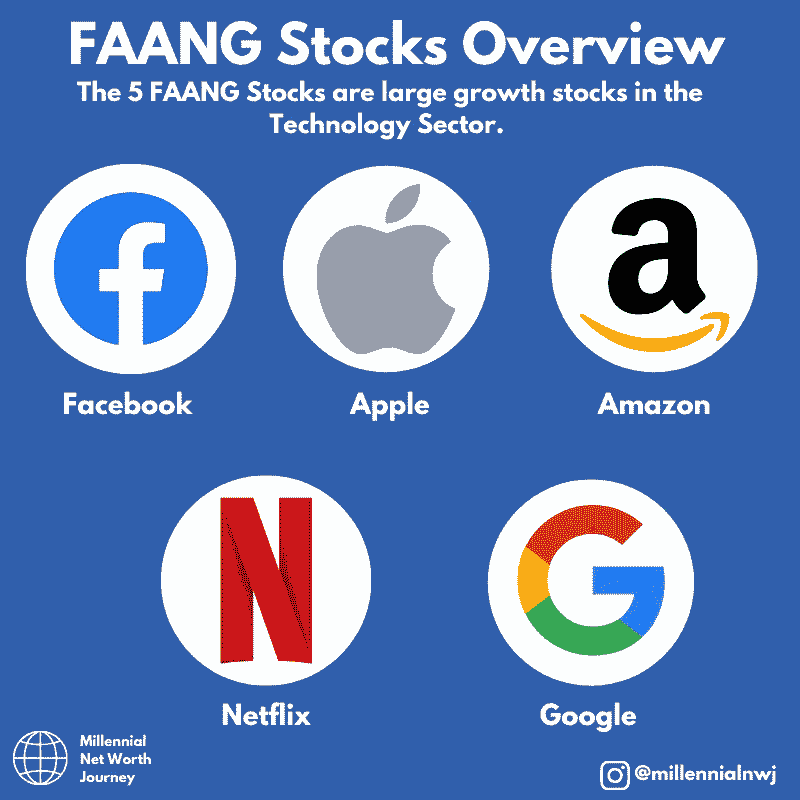
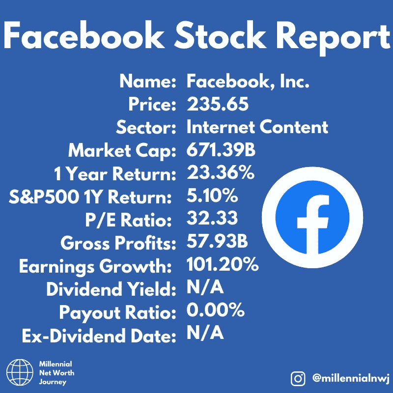
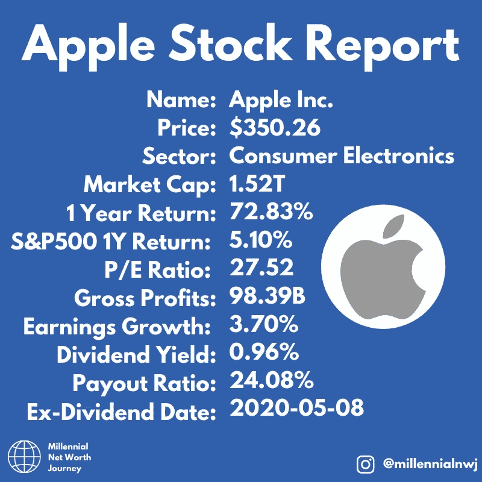
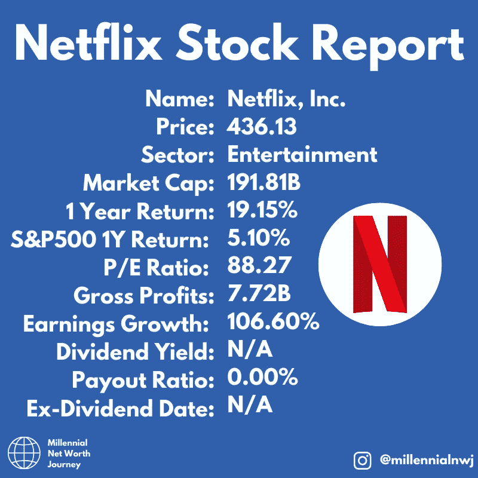
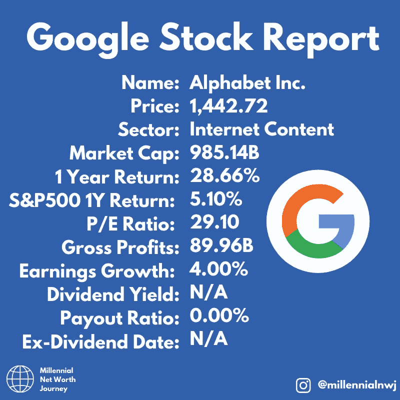
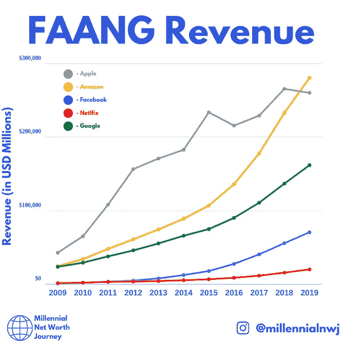
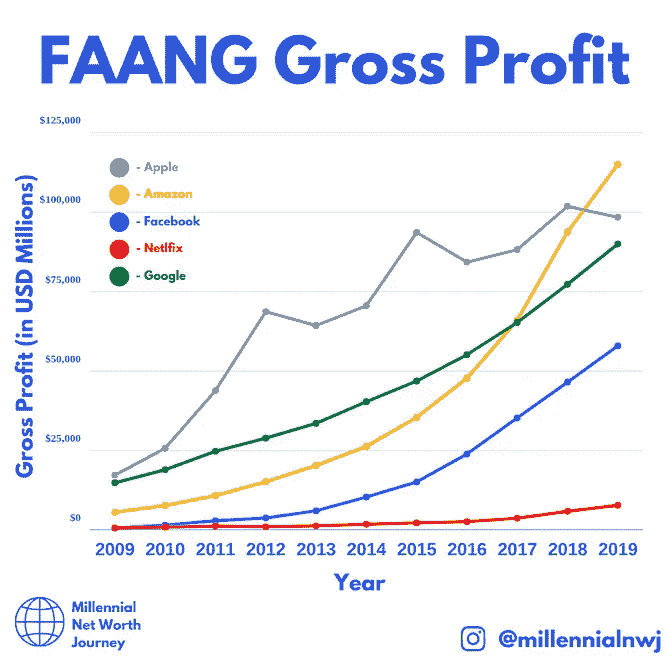
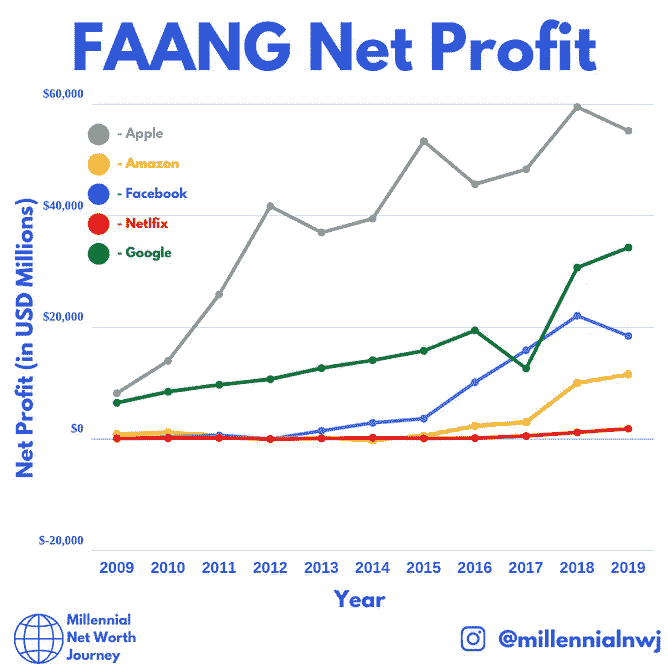

# 脸书，苹果，亚马逊，网飞，谷歌投资报告

> 原文：<https://medium.datadriveninvestor.com/facebook-apple-amazon-netflix-google-investment-report-84de72661f6a?source=collection_archive---------6----------------------->

Post on [@millennialnwj Instagram account.](https://www.instagram.com/millennialnwj/)

# FAANG 解释道。

FAANG 股票是一组技术领域的股票，具有令人难以置信的高增长。他们都是你以前听说过的公司，你可能会直接或间接地给他们一些钱。

他们是脸书、苹果、亚马逊、网飞和谷歌。(构成 FAANG 的首字母缩写。)

有趣的是，这些股票几乎都没有受到冠状病毒疫情的影响，过去几个月，冠状病毒已经摧毁了整个行业。

从某种意义上说，这些公司受益于人们被封锁，因为他们的服务是数字化的，可以无限扩展。

苹果和亚马逊是世界上市值最大的三家公司，并且仍然保持着疯狂的增长速度。

 [## 利用股市相关性的最佳方式|数据驱动的投资者

### 当阿尔弗雷德·温斯洛·琼斯开创了世界上第一个“对冲”基金(后来“d”被去掉了)时，他让其他投资者大吃一惊…

www.datadriveninvestor.com](https://www.datadriveninvestor.com/2020/02/02/the-best-way-to-use-stock-market-correlations/) 

就投资者愿意为这些股票支付的价格而言，亚马逊是投资者认为未来最赚钱的公司。是否如此只有时间会证明。

让我们更深入地了解一下 FAANG 股票:

## 脸谱网

Post on [@millennialnwj Instagram account.](https://www.instagram.com/millennialnwj/)

我们的第一个 FAANG 股票是脸书。这家社交媒体巨头已经成功地从一家勇敢的初创公司发展成为一家不可忽视的成熟科技巨头。该公司的广告能力和数据收集和管理是业内最好的。这支股票的基本面是健康的，在所有正确的领域都有增长。

这只股票需要注意的一点是，政府监管可能是影响该公司未来成功的一个因素。在欧盟和美国，疑虑的抱怨已经变成了合唱。因为该纲领未能阻止敌对势力对民主进程的干涉。再加上该公司几乎不可能完成的任务——监管令人震惊的直播内容。

## 苹果

Post on [@millennialnwj Instagram account.](https://www.instagram.com/millennialnwj/)

接下来是苹果——全世界消费者和投资者的最爱。一个很好的理由是，该公司是一台赚钱机器，最近一年的利润为 980 亿美元。

股票的股息收益率很低，但当你考虑苹果支付给投资者的金额时，支付的金额异常高。股价回报也很强劲，分析师预测股价可能很快达到 425 美元。

这只股票的一个特点是它是否被高估了。市盈率比较高。冠状病毒之前的市场处于历史高点之上，而这只股票最近打破了新高，大盘显示出明显的疲软迹象。

## 亚马孙

Post on [@millennialnwj Instagram account.](https://www.instagram.com/millennialnwj/)

亚马逊是 FAANG 股票中最令人印象深刻的股票之一。它的收入是所有公司中最高的，但利润却不是最高的。不过，随着亚马逊收入的增长，这种情况可能会在未来发生变化。他们实际上是在与所有挑战网飞、Spotify、谷歌、微软和许多其他公司的人作战，以求脱颖而出。

政府监管可能是亚马逊未来的眼中钉。公关部门加班加点努力保持公司的正面形象，欧盟等政府也表达了对亚马逊主导地位的担忧。在整个疫情冠状病毒事件中，亚马逊越来越像“政府”一样创造和保护就业机会，提供基本服务。

此外，不要指望该股会很快支付股息，杰夫·贝索斯把公司的增长看得比什么都重要。

## 网飞

Post on [@millennialnwj Instagram account.](https://www.instagram.com/millennialnwj/)

该集团中最小和最年轻的公司是网飞。该公司已经成为商业和文化意义上的巨人。“网飞和寒意”是一个众所周知的短语。尽管一开始对一个根深蒂固的行业感到厌倦，但网飞的节目还是广受好评。网飞在内容创作方面承担了很多其他人不敢承担的风险。它已经得到了回报。

网飞有 1.82 亿用户，冠状病毒支撑了这个数字，他们可能会继续保留大量的用户。

随着越来越多的人消费在线内容的趋势，网飞将利用这一点。它们具有“率先上市”的优势，并且是最知名且目前订阅最多的流媒体服务。

然而，它也面临着一些激烈的竞争——迪斯尼、美国电话电报公司和 HBO 都紧随其后。投资者仍然愿意支付溢价，因为他们预期未来会有高回报。

## 谷歌

Post on [@millennialnwj Instagram account.](https://www.instagram.com/millennialnwj/)

FAANG 集团的最后一只股票是谷歌，或者是谷歌的母公司 Alphabet。

不管你知不知道，这家公司比任何人都更了解你。

这个广告巨头使用它的搜索引擎来收集关于在它的搜索引擎上进行的搜索的数据，以及如何最好地使用它们来向你提供由企业付费的广告。业务很好，利润很高，正在进入几个不同的高增长领域，如人工智能、自动驾驶汽车和云计算。

Alphabet 拥有媒体巨头 Youtube，该公司号称每月有超过 10 亿用户观看 40 亿个视频。

谷歌在冠状病毒疫情期间的表现不如它的核心业务领域——它的 AdWords 搜索收入受到轻微影响，因为需要做广告的企业减少了。然而，该公司应该会受益于疫情冠状病毒迫使企业将广告转移到网上。

# FAANG 指标比较

Post on [@millennialnwj Instagram account.](https://www.instagram.com/millennialnwj/)

我用三个重要指标比较了这五只股票:收入、毛利和净利润。

从图表来看，亚马逊在收入和毛利方面似乎正在取代苹果，然而，当谈到将收入转化为净利润时，苹果仍然遥遥领先。亚马逊可能会通过增加其亚马逊网络服务业务来挑战未来几年的头把交椅，该业务目前占其利润的一半左右。

所有这些公司都显示出巨大的增长，但他们的利润仍然有很大的差异，苹果是明显的领导者。苹果可能正在失去动力。利润曲线似乎略微变平，谷歌和脸书仍在向苹果逼近。只有时间会告诉我们结果是什么。

## 结论

所有这些公司仍有增长空间——有些公司比其他公司有更大的增长空间。苹果、谷歌和脸书可能会从新兴经济体的增长中受益匪浅。中国、印度和巴西都显示出发展成为高收入经济体的巨大潜力，这些经济体推动了这些公司的增长。

任何人都无法猜测这些公司最终的估值是多少，以这些公司的增长速度来看，2 万亿和 3 万亿似乎并非不可能。

如果你想每周收到更多这样的分析，考虑在这里注册我们的邮件列表[。](http://millennialnetworthjourney.com/newsletter-sign-up/)

**访问专家视图—** [**订阅 DDI 英特尔**](https://datadriveninvestor.com/ddi-intel)