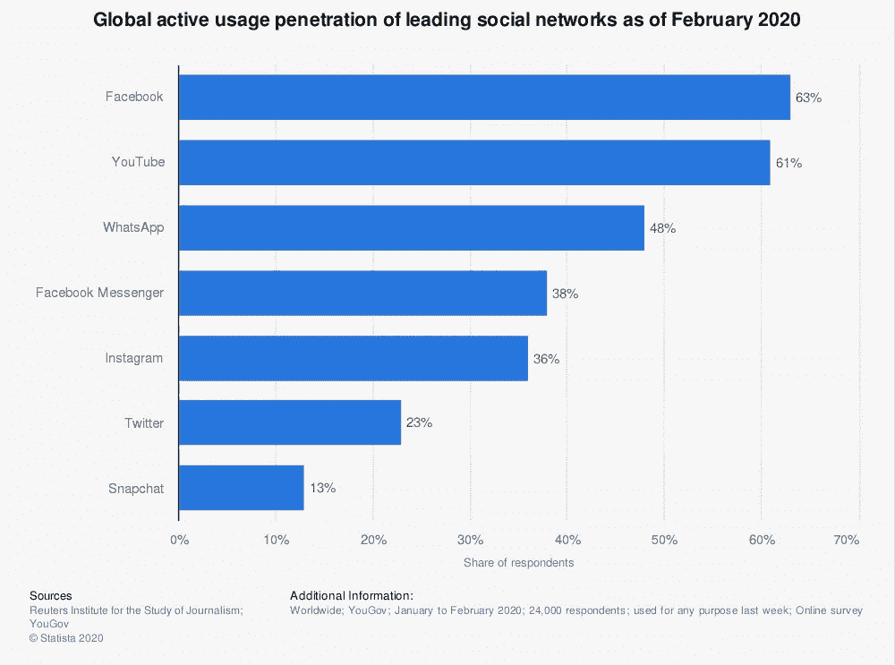
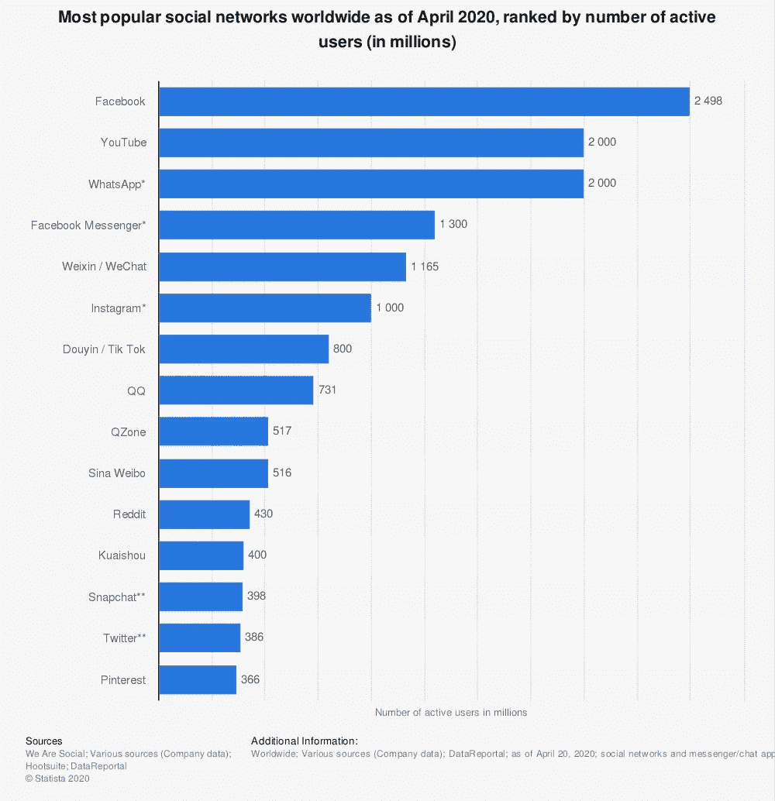

# 脸书监狱效应

> 原文：<https://medium.datadriveninvestor.com/facebook-jail-not-a-love-story-8dfa7fdb9783?source=collection_archive---------14----------------------->

## 脸书监狱是否导致该平台失去人气？

Photo by [Alex Haney](https://unsplash.com/@alexhaney?utm_source=medium&utm_medium=referral) on [Unsplash](https://unsplash.com?utm_source=medium&utm_medium=referral) | Facebook Jail

acebook 监狱是一个城市术语，目前正在互联网上流传。你可能已经看到了这些迷因(Pinterest 上的 25 个最佳 FB 监狱迷因)，或者听到朋友和家人讨论这个想法，但是脸书监狱意味着什么？

对于这一重要信息，我们将查阅城市词典——互联网上俚语定义最可靠的来源。

> **“由于你发布的内容、你使用的词语或对其他用户的骚扰，脸书自己屏蔽了你。**
> 
> **这是你通常被关进脸书监狱的顺序:
> -24 小时
> -48 小时
> -72 小时
> -7 天
> -14 天
> -30 天**

另一种描述脸书监狱的方式是对违反脸书使用条款的惩罚。因为你的罪行，脸书判你一个未知的刑期:

脸书监狱！

不管你是否同意脸书监狱的存在，或者是否同意私营公司对内容的监管，这都带来了一个有趣的话题:

 [## 天秤座可能是脸书的末日

### 2019 年，脸书越过了一条红线。公司宣布了 Libra 项目。在深入了解天秤座之前，我们先来了解一下…

www.datadriveninvestor.com](https://www.datadriveninvestor.com/2020/03/14/libra-may-be-the-end-for-facebook-part-i/) 

**自开始实施监管以来，脸书的用户数量是否大幅减少？**

你可能不时会听到有人威胁要取消他们的脸书账户，因为他们不同意使用条款。不仅如此，这些人会声称脸书的规定是一种审查形式。

那么，结论是什么，这些用户是成群结队地离开吗？为了找到答案，我们将研究以下数据图表:

*   社交媒体使用调查
*   社交媒体的全球活跃用户数量

# 调查:社交媒体的使用

Reuters Institute for the Study of Journalism, YouGov | Statista 2020 | Facebook Jail

根据 2020 年 2 月进行的一项调查，受访者指定了他们对社交媒体平台的使用。

**换句话说，个人对他们喜欢的平台进行排名。**

尽管社交媒体名称多种多样，但受访者称脸书是他们最常用的平台。

有趣的是，YouTube 仅次于脸书，成为第二大社交媒体选择。这一统计数据或许可以解释为什么脸书近年来试图推动其视频平台，但我们将把这一点留给另一个故事。

尽管结果令人印象深刻，但有一点需要注意

调查范围有限。调查人员只记录了 24000 名受访者的回答。这些回复的数量不足以得出任何具体的结论，但它确实提供了一些方向。

为了获得脸书用户统计的更具体答案，我们将查看每个社交媒体平台上的活跃用户。

# 全球活跃用户

We are Social, Various sources (Company data), Hootsuite, Data Reportal | Statista 2020 | Facebook Jail

看这张图表，我们看到了与第一张图表相似的趋势。脸书以近 25 亿活跃全球用户领先，YouTube 和 WhatsApp 分别以 20 亿用户位居第二。

然而，脸书用户的数量可能遗漏了一些东西。

对于那些不知道的人，WhatsApp 于 2014 年 2 月被脸书收购。这意味着 20 亿 WhatsApp 用户应该包括在脸书的总数中，因为,*毕竟是——一家公司。*WhatsApp 用户群的加入使脸书的用户总数达到 45 亿。

【Facebook Messenger 怎么样？我们是否应该将 13 亿用户计入脸书的 45 亿用户总数？

你明白了。脸书在社交媒体竞争中遥遥领先。他们的用户群在不断增长，脸书也在不断提供相关产品。

至于脸书监狱，这个社交媒体平台似乎没有因为监管不良内容或言论而失去任何业务。如果有什么不同的话，那就是脸书似乎正在赢得用户。

# 脸书监狱大逃亡=城市神话

脸书没有萎缩。它仍然是一个全球性的庞然大物，拥有不断增长的用户群。通过监管内容(如仇恨言论)，该平台变得对全球人民更加友好。

作为一个盈利组织，脸书明白财富是由中产阶级而不是边缘群体创造的。你希望你的产品吸引每个人。

全球平台通过其不断增长的全球用户数量证明了这一概念。脸书的产品拥有超过 50 亿用户，遥遥领先于竞争对手。

阅读更多 KR 富兰克林的故事

 [## 网飞股票+迪士尼股票=疫情订户

### 在新冠肺炎期间，有多少新用户加入了网飞和迪士尼+等流媒体公司？拥有他们的…

medium.com](https://medium.com/datadriveninvestor/netflixs-pandemic-subscribers-38fcda0205ba)  [## 股票市场对总统选举的反应(1932-1960)

### 如果你遵循这个简单的投资策略，你的投资将在 28 年内增长超过 13 倍。

medium.com](https://medium.com/datadriveninvestor/historical-stock-market-reactions-to-presidential-elections-1932-1960-d699dff10419)  [## 经济如何在 33 分钟内运转

### 建立对经济运行和你周围世界的基本理解。

medium.com](https://medium.com/datadriveninvestor/learn-the-economy-in-33-minutes-67510b3abecf) 

## 访问专家视图— [订阅 DDI 英特尔](https://datadriveninvestor.com/ddi-intel)