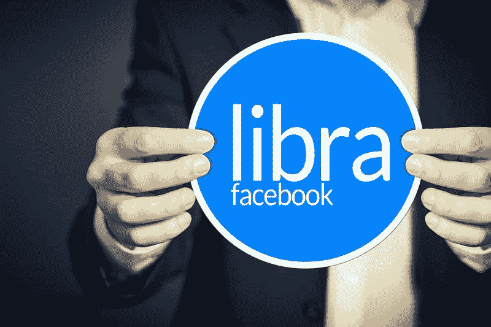
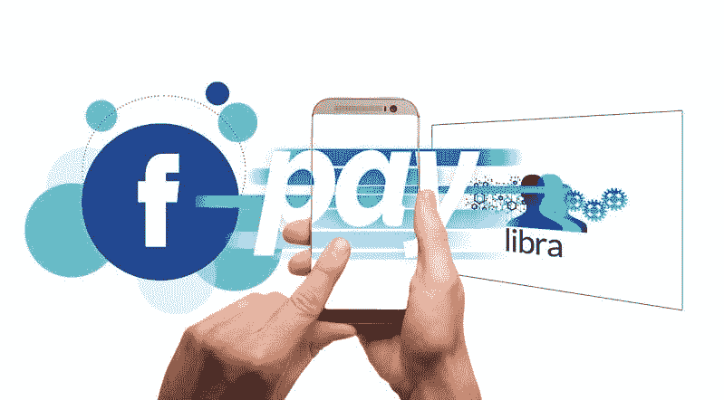

# 脸书赚了令人难以置信的钱——市场疯人院

> 原文：<https://medium.datadriveninvestor.com/facebook-makes-incredible-amounts-of-money-market-mad-house-db59b03a59ea?source=collection_archive---------20----------------------->

尽管存在争议，脸书还是赚了很多钱。

例如，脸书在 2019 年 12 月 31 日有 548.55 亿美元的现金和短期投资。因此，脸书比**亚马逊**拥有更多的现金。亚马逊在 2019 年新年前夕有 434.01 亿美元的现金和短期投资。

 [## 算法交易的机器学习|数据驱动的投资者

### 当你的一个朋友在脸书上传你的新海滩照，平台建议给你的脸加上标签，这是…

www.datadriveninvestor.com](https://www.datadriveninvestor.com/2019/01/30/machine-learning-for-stock-market-investing/) 

此外，脸书是最赚钱的公司之一。脸书于 2019 年 12 月 31 日报告了 175.90 亿美元的季度毛利。相比之下，亚马逊当天公布的季度毛利为 286.79 亿美元。

# 脸书利润惊人

有趣的是，脸书在 2019 年 12 月 31 日的季度收入为 210.82 亿美元，季度毛利为 175.90 亿美元。相比之下，亚马逊在同一天公布的季度收入为 874.37 亿美元，季度毛利为 334.6 亿美元。

因此，脸书的大部分收入都是毛利。与此同时，费用消耗了亚马逊的大部分收入。例如，亚马逊报告 2019 年 12 月 31 日的收入成本为 539.77 亿美元。脸书在 2019 年 12 月 31 日报告了 34.92 亿美元的收入成本。

有趣的是，脸书在 2019 年新年前夕报告了 88.58 亿美元的季度营业收入和 73.49 亿美元的共同净收入。然而，亚马逊在同一天公布的营业收入为 38.79 亿美元，税后收入为 32.67 亿美元。

# 脸书比亚马逊赚钱更多

因此，马克·扎克伯格的社交媒体帝国比亚马逊赚钱更多。

然而，亚马逊比脸书产生更多的现金。脸书报告截至 2019 年 12 月 31 日的季度期末现金流为 31.99 亿美元，运营现金流为 90.83 亿美元。

亚马逊报告称，截至 2019 年 12 月 31 日的季度末现金流为 128.56 亿美元。此外，亚马逊同期的运营现金流为 196.59 亿美元。

在这种情况下，我认为从 2020 年 2 月 4 日起，脸书的股价为 209.77 美元，是一项价值投资。我认为脸书是价值投资，因为它有能力产生大量现金。

# 脸书能发展到什么程度？

**脸书(NASDAQ: FB)** 是成长型股票。Stockrow [估计](https://stockrow.com/FB/financials/income/quarterly)脸书的收入在 2019 年最后一个季度增长了 24.64%。相反，在截至 2019 年 9 月 30 日的季度，亚马逊的收入增长率为 23.69%。

然而，脸书的收入增长正在放缓。例如，脸书的收入增长率从 2018 年第四季度的 30.39%降至 2019 年第四季度的 24.64%。

因此，脸书的收入增长可能会在某个时候终止。另一方面，我认为脸书未来几年的收入将会持续增长。

# 脸书是价值投资吗？

如果你在寻找一只被低估、前景光明的成长股，脸书是一个不错的选择。

除了增长和现金，我认为脸书是安全的，因为其庞大的社交媒体网络。Statista [估计](https://www.statista.com/statistics/264810/number-of-monthly-active-facebook-users-worldwide/)脸书的旗舰应用在 2019 年第四季度拥有 24.98 亿活跃用户。

此外，脸书拥有四个用户超过 10 亿的社交网络。详细来说，Statista [估计](https://www.statista.com/statistics/272014/global-social-networks-ranked-by-number-of-users/) Instagram 在 2019 年 10 月有 10 亿用户，Facebook Messenger 有 13 亿用户，WhatsApp 有 16 亿用户，脸书有 21.4 亿用户。

因此，脸书的社交媒体在 2019 年 10 月拥有 60.4 亿用户。因此，脸书是历史上最大的媒体帝国。扎克伯格比历史上任何一位伟大的媒体大亨都更有影响力。

# 马克·扎克伯格是历史上最伟大的媒体大亨

**脸书(纳斯达克股票代码:FB)** 是美国最有影响力的媒体，马克·扎克伯格是美国最有影响力的人。

例如，皮尤研究中心[估计](https://www.pewresearch.org/fact-tank/2019/05/16/facts-about-americans-and-facebook/) 69%的美国成年人在 2019 年 5 月使用脸书。此外，皮尤估计，2019 年 5 月，74%的脸书用户每天都会访问脸书一次。

此外，皮尤估计，2019 年 5 月，79%的 18 至 29 岁美国人使用脸书，46%的 65 岁以上美国人表示他们使用脸书。然而，在同一时期，只有 51%的 13 至 17 岁的美国人说他们使用脸书。这一数字从 2014 年的 71%下降到 2015 年的 71%。

有趣的是，很少有脸书用户了解这个平台。例如，皮尤估计 74%的美国脸书用户不知道脸书维护着他们的兴趣和性格列表。

# 沃伦·巴菲特无法与脸书竞争

皮尤报告称，重要的是，43%的美国成年人承认他们在 2019 年 5 月从脸书获得新闻。

很能说明问题的是，沃伦·巴菲特宣布他将于 2020 年 1 月 29 日离开报纸行业，《华盛顿邮报》[报道](https://www.washingtonpost.com/business/2020/01/29/warren-buffett-said-newspapers-were-going-disappear-now-hes-disappearing-industry/)。**解释一下，伯克希尔哈撒韦公司(纽约证券交易所代码:BRK。B)** 以 1.4 亿美元将旗下所有报纸出售给 [**李氏企业**](https://marketmadhouse.com/are-newspapers-dead-at-lee-enterprises/) **(纽约证券交易所代码:LEE)** 。值得注意的是，2020 年 1 月 31 日，市场先生以 2.11 美元的价格购买了李的股票。

因此，巴菲特认为，报纸再也不能赚钱了，你无法在新闻行业与脸书竞争。此外，巴菲特承认，你无法在社交媒体之外的新闻上赚钱。

# 脸书能幸存吗？

由于其影响力、平台和产生的所有现金，脸书现在拥有巨大的权力。

脸书；比如，可以用现金收购维亚康姆哥伦比亚广播公司(ViacomCBS)**Inc .(纳斯达克股票代码:VIAC)** ，还剩下 341.27 亿美元。为了解释，Market 先生在 2 月 4 日给了 ViacomCBS 207.18 亿美元的市值。与此同时，脸书在 2019 年 12 月 31 日拥有 548.8 亿美元的现金和短期投资。

[维亚康姆](https://marketmadhouse.com/can-viacom-save-cbs-from-oblivion/)拥有美国最受欢迎的广播电视网:哥伦比亚广播公司，主要出版商西蒙&舒斯特，大型流媒体服务 CBS All Access，历史悠久的好莱坞电影制片厂；派拉蒙电影公司和几家有线电视网。因此，马克·扎克伯格是所有媒体的皇帝，对不起霍华德·斯特恩。

# 我们会拆散脸书吗？

鉴于脸书的规模、金钱和影响力，我预计将会有政治压力来分裂脸书。

我不知道这种压力会有多成功，因为脸书对政客们很有用。解释一下，有影响力的政治家，如唐纳德·川普总统(佛罗里达州共和党)和美国参议员伯尼·桑德斯(佛蒙特州共和党)利用脸书吸引选票。

特朗普和桑德斯都使用社交媒体来接触选民。例如，美国总统候选人在 2019 年花费了超过 6700 万美元的脸书广告，*公开秘密* [估计](https://www.opensecrets.org/news/2019/11/digital-ad-spending-2020-presidential-candidates-top-100m/)。

此外，脸书的收入和利润给了政客们保护它的强大动力。解释一下，政客们会想通过税收染指脸书的钱。因此，我认为美国将很快征收公司所得税或数字广告税。

鉴于现实情况，我认为脸书将在未来许多年与我们同在。因此，所有投资者都需要研究脸书，并考虑购买其股票。

*原载于 2020 年 2 月 4 日*[*【https://marketmadhouse.com】*](https://marketmadhouse.com/facebook-makes-incredible-amounts-of-money/)*。*